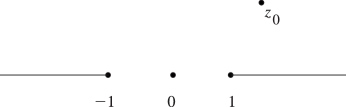

# §1.10 Functions of a Complex Variable

:::{note}
**Keywords:**

[functions](http://dlmf.nist.gov/search/search?q=functions) , [of a complex variable](http://dlmf.nist.gov/search/search?q=of%20a%20complex%20variable)

**Referenced by:**

Erratum (V1.2.0) §1.10

**See also:**

Annotations for Ch.1
:::

## §1.10(i) Taylor’s Theorem for Complex Variables

:::{note}
**Keywords:**

[Taylor series](http://dlmf.nist.gov/search/search?q=Taylor%20series) , [Taylor’s theorem](http://dlmf.nist.gov/search/search?q=Taylor%20theorem) , [one variable](http://dlmf.nist.gov/search/search?q=one%20variable)

**Notes:**

See Copson ([1935](./bib/C.html#bib580 "An Introduction to the Theory of Functions of a Complex Variable"), pp. 72–75) and Levinson and Redheffer ([1970](./bib/L.html#bib1426 "Complex Variables"), pp. 140–143).

**Referenced by:**

§1.9(vi) , §12.13(i) , §3.7(ii) , §3.8(i) , Erratum (V1.0.11) for Clarifications

**Addition (effective with 1.0.11):**

A sentence was added to explain that ( 1.10.4 ) is a generalization of ( 1.2.2 ) using ( 1.2.6 ).

**See also:**

Annotations for §1.10 and Ch.1
:::

Let $f(z)$ be analytic on the disk $\left|z-z_{0}\right|<R$ . Then

$$
f(z)=\sum^{\infty}_{n=0}\frac{f^{(n)}(z_{0})}{n!}(z-z_{0})^{n}. \tag{1.10.1}
$$

The right-hand side is the *Taylor series for* $f(z)$ *at* $z=z_{0}$ , and its radius of convergence is at least $R$ .

### Examples

:::{note}
**See also:**

Annotations for §1.10(i) , §1.10 and Ch.1
:::

$$
{\mathrm{e}}^{z}=1+\frac{z}{1!}+\frac{z^{2}}{2!}+\cdots, \tag{1.10.2}
$$

$$
\ln\left(1+z\right)=z-\frac{z^{2}}{2}+\frac{z^{3}}{3}-\cdots, \tag{1.10.3}
$$

$$
(1-z)^{-\alpha}=1+\alpha z+\frac{\alpha(\alpha+1)}{2!}z^{2}+\frac{\alpha(\alpha+1)(\alpha+2)}{3!}z^{3}+\cdots, \tag{1.10.4}
$$

Note that ( 1.10.4 ) is a generalization of the binomial expansion ( 1.2.2 ) with the binomial coefficients defined in ( 1.2.6 ). Again, in these examples $\ln\left(1+z\right)$ and $(1-z)^{-\alpha}$ have their principal values; see §§ 4.2(i) and 4.2(iv) .

### Zeros

:::{note}
**Keywords:**

[analytic function](http://dlmf.nist.gov/search/search?q=analytic%20function) , [multiplicity](http://dlmf.nist.gov/search/search?q=multiplicity) , [simple zero](http://dlmf.nist.gov/search/search?q=simple%20zero) , [zeros](http://dlmf.nist.gov/search/search?q=zeros) , [zeros of analytic functions](http://dlmf.nist.gov/search/search?q=zeros%20of%20analytic%20functions)

**See also:**

Annotations for §1.10(i) , §1.10 and Ch.1
:::

An analytic function $f(z)$ has a *zero of order* (or *multiplicity* ) $m$ ( $\geq\!1$ ) at $z_{0}$ if the first nonzero coefficient in its Taylor series at $z_{0}$ is that of $(z-z_{0})^{m}$ . When $m=1$ the zero is *simple* .

## §1.10(ii) Analytic Continuation

:::{note}
**Keywords:**

[analytic continuation](http://dlmf.nist.gov/search/search?q=analytic%20continuation) , [analytically continued](http://dlmf.nist.gov/search/search?q=analytically%20continued) , [functions](http://dlmf.nist.gov/search/search?q=functions)

**Notes:**

See Levinson and Redheffer ([1970](./bib/L.html#bib1426 "Complex Variables"), pp. 398–402) and Copson ([1935](./bib/C.html#bib580 "An Introduction to the Theory of Functions of a Complex Variable"), pp. 192–193).

**Referenced by:**

§10.11 , §4.23(iv)

**See also:**

Annotations for §1.10 and Ch.1
:::

Let $f_{1}(z)$ be analytic in a domain $D_{1}$ . If $f_{2}(z)$ , analytic in $D_{2}$ , equals $f_{1}(z)$ on an arc in $D=D_{1}\cap D_{2}$ , or on just an infinite number of points with a limit point in $D$ , then they are equal throughout $D$ and $f_{2}(z)$ is called an *analytic continuation* of $f_{1}(z)$ . We write $(f_{1},D_{1})$ , $(f_{2},D_{2})$ to signify this continuation.

Suppose $z(t)=x(t)+\mathrm{i}y(t)$ , $a\leq t\leq b$ , is an arc and $a=t_{0}<t_{1}<\cdots<t_{n}=b$ . Suppose the subarc $z(t)$ , $t\in[t_{j-1},t_{j}]$ is contained in a domain $D_{j}$ , $j=1,\dots,n$ . The function $f_{1}(z)$ on $D_{1}$ is said to be *analytically continued along the path* $z(t)$ , $a\leq t\leq b$ , if there is a chain $(f_{1},D_{1})$ , $(f_{2},D_{2}),\dots,(f_{n},D_{n})$ .

Analytic continuation is a powerful aid in establishing transformations or functional equations for complex variables, because it enables the problem to be reduced to: (a) deriving the transformation (or functional equation) with real variables; followed by (b) finding the domain on which the transformed function is analytic.

### Schwarz Reflection Principle

:::{note}
**Keywords:**

[Schwarz reflection principle](http://dlmf.nist.gov/search/search?q=Schwarz%20reflection%20principle) , [analytic continuation](http://dlmf.nist.gov/search/search?q=analytic%20continuation) , [by reflection](http://dlmf.nist.gov/search/search?q=by%20reflection)

**See also:**

Annotations for §1.10(ii) , §1.10 and Ch.1
:::

Let $C$ be a simple closed contour consisting of a segment $\mathit{AB}$ of the real axis and a contour in the upper half-plane joining the ends of $\mathit{AB}$ . Also, let $f(z)$ be analytic within $C$ , continuous within and on $C$ , and real on $\mathit{AB}$ . Then $f(z)$ can be continued analytically across $\mathit{AB}$ by *reflection* , that is,

$$
f(\overline{z})=\overline{f(z)}. \tag{1.10.5}
$$

## §1.10(iii) Laurent Series

:::{note}
**Defines:**

$\Residue$ : residue

**Keywords:**

[Laurent series](http://dlmf.nist.gov/search/search?q=Laurent%20series) , [analytic function](http://dlmf.nist.gov/search/search?q=analytic%20function) , [annulus](http://dlmf.nist.gov/search/search?q=annulus) , [essential](http://dlmf.nist.gov/search/search?q=essential) , [essential singularity](http://dlmf.nist.gov/search/search?q=essential%20singularity) , [functions](http://dlmf.nist.gov/search/search?q=functions) , [isolated](http://dlmf.nist.gov/search/search?q=isolated) , [isolated essential](http://dlmf.nist.gov/search/search?q=isolated%20essential) , [isolated essential singularity](http://dlmf.nist.gov/search/search?q=isolated%20essential%20singularity) , [isolated singularity](http://dlmf.nist.gov/search/search?q=isolated%20singularity) , [meromorphic](http://dlmf.nist.gov/search/search?q=meromorphic) , [meromorphic function](http://dlmf.nist.gov/search/search?q=meromorphic%20function) , [multiplicity](http://dlmf.nist.gov/search/search?q=multiplicity) , [neighborhood](http://dlmf.nist.gov/search/search?q=neighborhood) , [order](http://dlmf.nist.gov/search/search?q=order) , [pole](http://dlmf.nist.gov/search/search?q=pole) , [punctured](http://dlmf.nist.gov/search/search?q=punctured) , [punctured neighborhood](http://dlmf.nist.gov/search/search?q=punctured%20neighborhood) , [removable](http://dlmf.nist.gov/search/search?q=removable) , [removable singularity](http://dlmf.nist.gov/search/search?q=removable%20singularity) , [residue](http://dlmf.nist.gov/search/search?q=residue) , [singularities](http://dlmf.nist.gov/search/search?q=singularities) , [singularity](http://dlmf.nist.gov/search/search?q=singularity)

**Notes:**

See Levinson and Redheffer ([1970](./bib/L.html#bib1426 "Complex Variables"), pp. 162–170), Copson ([1935](./bib/C.html#bib580 "An Introduction to the Theory of Functions of a Complex Variable"), pp. 75–81, 438–440), and Markushevich ([1983](./bib/M.html#bib1550 "The Theory of Analytic Functions: A Brief Course"), pp. 234–245).

**Referenced by:**

§1.10(vii) , §32.2(i)

**See also:**

Annotations for §1.10 and Ch.1
:::

Suppose $f(z)$ is analytic in the *annulus* $r_{1}<\left|z-z_{0}\right|<r_{2}$ , $0\leq r_{1}<r_{2}\leq\infty$ , and $r\in(r_{1},r_{2})$ . Then

$$
f(z)=\sum^{\infty}_{n=-\infty}a_{n}(z-z_{0})^{n}, \tag{1.10.6}
$$

where

$$
a_{n}=\frac{1}{2\pi\mathrm{i}}\int_{\left|z-z_{0}\right|=r}\frac{f(z)}{(z-z_{0})^{n+1}}\,\mathrm{d}z, \tag{1.10.7}
$$

and the integration contour is described once in the positive sense. The series ( 1.10.6 ) converges uniformly and absolutely on compact sets in the annulus.

Let $r_{1}=0$ , so that the annulus becomes the *punctured neighborhood* $N$ : $0<\left|z-z_{0}\right|<r_{2}$ , and assume that $f(z)$ is analytic in $N$ , but not at $z_{0}$ . Then $z=z_{0}$ is an *isolated singularity* of $f(z)$ . This singularity is *removable* if $a_{n}=0$ for all $n<0$ , and in this case the Laurent series becomes the Taylor series. Next, $z_{0}$ is a *pole* if $a_{n}\not=0$ for at least one, but only finitely many, negative $n$ . If $-n$ is the first negative integer (counting from $-\infty$ ) with $a_{-n}\not=0$ , then $z_{0}$ is a *pole of order* (or *multiplicity* ) $n$ . Lastly, if $a_{n}\not=0$ for infinitely many negative $n$ , then $z_{0}$ is an *isolated essential singularity* .

The singularities of $f(z)$ at infinity are classified in the same way as the singularities of $f(1/z)$ at $z=0$ .

An isolated singularity $z_{0}$ is always removable when $\lim_{z\to z_{0}}f(z)$ exists, for example $(\sin z)/z$ at $z=0$ .

The coefficient $a_{-1}$ of $(z-z_{0})^{-1}$ in the Laurent series for $f(z)$ is called the *residue* of $f(z)$ at $z_{0}$ , and denoted by $\Residue_{z=z_{0}}[f(z)]$ , $\Residue\limits_{z=z_{0}}[f(z)]$ , or (when there is no ambiguity) $\Residue[f(z)]$ .

A function whose only singularities, other than the point at infinity, are poles is called a *meromorphic function* . If the poles are infinite in number, then the point at infinity is called an *essential singularity* : it is the limit point of the poles.

### Picard’s Theorem

:::{note}
**Keywords:**

[Picard’s theorem](http://dlmf.nist.gov/search/search?q=Picard%20theorem)

**See also:**

Annotations for §1.10(iii) , §1.10 and Ch.1
:::

In any neighborhood of an isolated essential singularity, however small, an analytic function assumes every value in $\mathbb{C}$ with at most one exception.

## §1.10(iv) Residue Theorem

:::{note}
**Keywords:**

[residue](http://dlmf.nist.gov/search/search?q=residue) , [theorem](http://dlmf.nist.gov/search/search?q=theorem)

**Notes:**

See Copson ([1935](./bib/C.html#bib580 "An Introduction to the Theory of Functions of a Complex Variable"), pp. 117–120).

**Referenced by:**

§10.74(vi) , §16.5 , §3.8(v) , (8.15.2)

**See also:**

Annotations for §1.10 and Ch.1
:::

If $f(z)$ is analytic within a simple closed contour $C$ , and continuous within and on $C$ —except in both instances for a finite number of singularities within $C$ —then

$$
\frac{1}{2\pi\mathrm{i}}\int_{C}f(z)\,\mathrm{d}z=\mbox{sum of the residues of $f(z)$ within $C$}. \tag{1.10.8}
$$

Here and elsewhere in this subsection the path $C$ is described in the positive sense.

### Phase (or Argument) Principle

:::{note}
**Keywords:**

[argument principle](http://dlmf.nist.gov/search/search?q=argument%20principle) , [phase principle](http://dlmf.nist.gov/search/search?q=phase%20principle) , [principle of the argument](http://dlmf.nist.gov/search/search?q=principle%20of%20the%20argument)

**See also:**

Annotations for §1.10(iv) , §1.10 and Ch.1
:::

If the singularities within $C$ are poles and $f(z)$ is analytic and nonvanishing on $C$ , then

$$
N-P=\frac{1}{2\pi\mathrm{i}}\int_{C}\frac{f^{\prime}(z)}{f(z)}\,\mathrm{d}z=\frac{1}{2\pi}\Delta_{C}(\operatorname{ph}f(z)), \tag{1.10.9}
$$

where $N$ and $P$ are respectively the numbers of zeros and poles, counting multiplicity, of $f$ within $C$ , and $\Delta_{C}(\operatorname{ph}f(z))$ is the change in any continuous branch of $\operatorname{ph}\left(f(z)\right)$ as $z$ passes once around $C$ in the positive sense. For examples of applications see Olver ([1997b](./bib/O.html#bib1809 "Asymptotics and Special Functions"), pp. 252–254).

In addition,

$$
\frac{1}{2\pi\mathrm{i}}\int_{C}\frac{zf^{\prime}(z)}{f(z)}\,\mathrm{d}z=\mbox{(sum of locations of zeros)}-\mbox{(sum of locations of poles)}, \tag{1.10.10}
$$

each location again being counted with multiplicity equal to that of the corresponding zero or pole.

### Rouché’s Theorem

:::{note}
**Keywords:**

[Rouché’s theorem](http://dlmf.nist.gov/search/search?q=Rouch%C3%A9%20theorem)

**See also:**

Annotations for §1.10(iv) , §1.10 and Ch.1
:::

If $f(z)$ and $g(z)$ are analytic on and inside a simple closed contour $C$ , and $\left|g(z)\right|<\left|f(z)\right|$ on $C$ , then $f(z)$ and $f(z)+g(z)$ have the same number of zeros inside $C$ .

## §1.10(v) Maximum-Modulus Principle

:::{note}
**Notes:**

See Titchmarsh ([1962b](./bib/T.html#bib2253 "The Theory of Functions"), pp. 165–169).

**See also:**

Annotations for §1.10 and Ch.1
:::

### Analytic Functions

:::{note}
**Keywords:**

[analytic functions](http://dlmf.nist.gov/search/search?q=analytic%20functions) , [maximum-modulus principle](http://dlmf.nist.gov/search/search?q=maximum-modulus%20principle)

**See also:**

Annotations for §1.10(v) , §1.10 and Ch.1
:::

If $f(z)$ is analytic in a domain $D$ , $z_{0}\in D$ and $\left|f(z)\right|\leq\left|f(z_{0})\right|$ for all $z\in D$ , then $f(z)$ is a constant in $D$ .

Let $D$ be a bounded domain with boundary $\partial D$ and let $\overline{D}=D\cup\partial D$ . If $f(z)$ is continuous on $\overline{D}$ and analytic in $D$ , then $\left|f(z)\right|$ attains its maximum on $\partial D$ .

### Harmonic Functions

:::{note}
**Keywords:**

[harmonic functions](http://dlmf.nist.gov/search/search?q=harmonic%20functions) , [maximum modulus](http://dlmf.nist.gov/search/search?q=maximum%20modulus) , [maximum-modulus principle](http://dlmf.nist.gov/search/search?q=maximum-modulus%20principle)

**See also:**

Annotations for §1.10(v) , §1.10 and Ch.1
:::

If $u(z)$ is harmonic in $D$ , $z_{0}\in D$ , and $u(z)\leq u(z_{0})$ for all $z\in D$ , then $u(z)$ is constant in $D$ . Moreover, if $D$ is bounded and $u(z)$ is continuous on $\overline{D}$ and harmonic in $D$ , then $u(z)$ is maximum at some point on $\partial D$ .

### Schwarz’s Lemma

:::{note}
**Keywords:**

[Schwarz’s lemma](http://dlmf.nist.gov/search/search?q=Schwarz%20lemma) , [maximum-modulus principle](http://dlmf.nist.gov/search/search?q=maximum-modulus%20principle)

**See also:**

Annotations for §1.10(v) , §1.10 and Ch.1
:::

In $\left|z\right|<R$ , if $f(z)$ is analytic, $\left|f(z)\right|\leq M$ , and $f(0)=0$ , then

$$
\left|f(z)\right|\leq\frac{M\left|z\right|}{R}\;\mbox{ and }\;\left|f^{\prime}(0)\right|\leq\frac{M}{R}. \tag{1.10.11}
$$

Equalities hold iff $f(z)=Az$ , where $A$ is a constant such that $\left|A\right|=M/R$ .

## §1.10(vi) Multivalued Functions

:::{note}
**Keywords:**

[branch](http://dlmf.nist.gov/search/search?q=branch) , [functions](http://dlmf.nist.gov/search/search?q=functions) , [many-valued](http://dlmf.nist.gov/search/search?q=many-valued) , [many-valued function](http://dlmf.nist.gov/search/search?q=many-valued%20function) , [multivalued](http://dlmf.nist.gov/search/search?q=multivalued) , [multivalued function](http://dlmf.nist.gov/search/search?q=multivalued%20function) , [of multivalued function](http://dlmf.nist.gov/search/search?q=of%20multivalued%20function)

**Notes:**

See Levinson and Redheffer ([1970](./bib/L.html#bib1426 "Complex Variables"), pp. 64–77), or Markushevich ([1983](./bib/M.html#bib1550 "The Theory of Analytic Functions: A Brief Course"), pp. 106–121).

**Referenced by:**

§10.72(i) , Common Notations and Definitions , Methodology

**See also:**

Annotations for §1.10 and Ch.1
:::

Functions which have more than one value at a given point $z$ are called *multivalued* (or *many-valued* ) functions. Let $F(z)$ be a multivalued function and $D$ be a domain. If we can assign a unique value $f(z)$ to $F(z)$ at each point of $D$ , and $f(z)$ is analytic on $D$ , then $f(z)$ is a *branch* of $F(z)$ .

### Example

:::{note}
**Keywords:**

[branch](http://dlmf.nist.gov/search/search?q=branch) , [branch point](http://dlmf.nist.gov/search/search?q=branch%20point) , [construction](http://dlmf.nist.gov/search/search?q=construction) , [cut](http://dlmf.nist.gov/search/search?q=cut) , [domain](http://dlmf.nist.gov/search/search?q=domain) , [neighborhood](http://dlmf.nist.gov/search/search?q=neighborhood) , [of multivalued function](http://dlmf.nist.gov/search/search?q=of%20multivalued%20function) , [singularity](http://dlmf.nist.gov/search/search?q=singularity)

**See also:**

Annotations for §1.10(vi) , §1.10 and Ch.1
:::

$F(z)=\sqrt{z}$ is two-valued for $z\not=0$ . If $D=\mathbb{C}\setminus(-\infty,0]$ and $z=r{\mathrm{e}}^{\mathrm{i}\theta}$ , then one branch is $\sqrt{r}{\mathrm{e}}^{\mathrm{i}\theta/2}$ , the other branch is $-\sqrt{r}{\mathrm{e}}^{\mathrm{i}\theta/2}$ , with $-\pi<\theta<\pi$ in both cases. Similarly if $D=\mathbb{C}\setminus[0,\infty)$ , then one branch is $\sqrt{r}{\mathrm{e}}^{\mathrm{i}\theta/2}$ , the other branch is $-\sqrt{r}{\mathrm{e}}^{\mathrm{i}\theta/2}$ , with $0<\theta<2\pi$ in both cases.

A *cut domain* is one from which the points on finitely many nonintersecting simple contours (§ 1.9(iii) ) have been removed. Each contour is called a *cut* . A *cut neighborhood* is formed by deleting a ray emanating from the center. (Or more generally, a simple contour that starts at the center and terminates on the boundary.)

Suppose $F(z)$ is multivalued and $a$ is a point such that there exists a branch of $F(z)$ in a cut neighborhood of $a$ , but there does not exist a branch of $F(z)$ in any punctured neighborhood of $a$ . Then $a$ is a *branch point* of $F(z)$ . For example, $z=0$ is a branch point of $\sqrt{z}$ .

Branches can be constructed in two ways:

(a) By introducing appropriate cuts from the branch points and restricting $F(z)$ to be single-valued in the cut plane (or domain).

(b) By specifying the value of $F(z)$ at a point $z_{0}$ (not a branch point), and requiring $F(z)$ to be continuous on any path that begins at $z_{0}$ and does not pass through any branch points or other singularities of $F(z)$ .

If the path circles a branch point at $z=a$ , $k$ times in the positive sense, and returns to $z_{0}$ without encircling any other branch point, then its value is denoted conventionally as $F((z_{0}-a){\mathrm{e}}^{2k\pi\mathrm{i}}+a)$ .

### Example

:::{note}
**Keywords:**

[branch](http://dlmf.nist.gov/search/search?q=branch) , [example](http://dlmf.nist.gov/search/search?q=example) , [of multivalued function](http://dlmf.nist.gov/search/search?q=of%20multivalued%20function)

**See also:**

Annotations for §1.10(vi) , §1.10 and Ch.1
:::

Let $\alpha$ and $\beta$ be real or complex numbers that are not integers. The function $F(z)=(1-z)^{\alpha}(1+z)^{\beta}$ is many-valued with branch points at $\pm 1$ . Branches of $F(z)$ can be defined, for example, in the cut plane $D$ obtained from $\mathbb{C}$ by removing the real axis from $1$ to $\infty$ and from $-1$ to $-\infty$ ; see Figure 1.10.1 . One such branch is obtained by assigning $(1-z)^{\alpha}$ and $(1+z)^{\beta}$ their principal values (§ 4.2(iv) ).

:::{note}
**Symbols:**

$D$: domain

**Referenced by:**

§1.10(vi)

**See also:**

Annotations for §1.10(vi) , §1.10(vi) , §1.10 and Ch.1
:::

Alternatively, take $z_{0}$ to be any point in $D$ and set $F(z_{0})={\mathrm{e}}^{\alpha\ln\left(1-z_{0}\right)}{\mathrm{e}}^{\beta\ln\left(1+z_{0}\right)}$ where the logarithms assume their principal values. (Thus if $z_{0}$ is in the interval $(-1,1)$ , then the logarithms are real.) Then the value of $F(z)$ at any other point is obtained by analytic continuation.

Thus if $F(z)$ is continued along a path that circles $z=1$ $m$ times in the positive sense and returns to $z_{0}$ without circling $z=-1$ , then $F((z_{0}-1){\mathrm{e}}^{2m\pi\mathrm{i}}+1)={\mathrm{e}}^{\alpha\ln\left(1-z_{0}\right)}{\mathrm{e}}^{\beta\ln\left(1+z_{0}\right)}{\mathrm{e}}^{2\pi\mathrm{i}m\alpha}$ . If the path also circles $z=-1$ $n$ times in the clockwise or negative sense before returning to $z_{0}$ , then the value of $F(z_{0})$ becomes ${\mathrm{e}}^{\alpha\ln\left(1-z_{0}\right)}{\mathrm{e}}^{\beta\ln\left(1+z_{0}\right)}{\mathrm{e}}^{2\pi\mathrm{i}m\alpha}{\mathrm{e}}^{-2\pi\mathrm{i}n\beta}$ .

## §1.10(vii) Inverse Functions

:::{note}
**Keywords:**

[functions](http://dlmf.nist.gov/search/search?q=functions) , [inverse](http://dlmf.nist.gov/search/search?q=inverse) , [inverse function](http://dlmf.nist.gov/search/search?q=inverse%20function)

**Notes:**

For ( 1.10.13 ) and ( 1.10.14 ) see Copson ([1935](./bib/C.html#bib580 "An Introduction to the Theory of Functions of a Complex Variable"), §6.23). See also Andrews et al. ([1999](./bib/index.html#bib103 "Special Functions"), pp. 629–631) and Henrici ([1974](./bib/H.html#bib1066 "Applied and Computational Complex Analysis. Vol. 1: Power Series—Integration—Conformal Mapping—Location of Zeros"), pp. 57–59). The Extended Inversion Theorem is proved in a similar way.

**See also:**

Annotations for §1.10 and Ch.1
:::

### Lagrange Inversion Theorem

:::{note}
**Keywords:**

[Lagrange inversion theorem](http://dlmf.nist.gov/search/search?q=Lagrange%20inversion%20theorem) , [inverse function](http://dlmf.nist.gov/search/search?q=inverse%20function)

**See also:**

Annotations for §1.10(vii) , §1.10 and Ch.1
:::

Suppose $f(z)$ is analytic at $z=z_{0}$ , $f^{\prime}(z_{0})\not=0$ , and $f(z_{0})=w_{0}$ . Then the equation

$$
f(z)=w \tag{1.10.12}
$$

has a unique solution $z=F(w)$ analytic at $w=w_{0}$ , and

$$
F(w)=z_{0}+\sum^{\infty}_{n=1}F_{n}(w-w_{0})^{n} \tag{1.10.13}
$$

in a neighborhood of $w_{0}$ , where $nF_{n}$ is the residue of $1/(f(z)-f(z_{0}))^{n}$ at $z=z_{0}$ . (In other words $nF_{n}$ is the coefficient of $(z-z_{0})^{-1}$ in the Laurent expansion of $1/(f(z)-f(z_{0}))^{n}$ in powers of $(z-z_{0})$ ; compare § 1.10(iii) .)

Furthermore, if $g(z)$ is analytic at $z_{0}$ , then

$$
g(F(w))=g(z_{0})+\sum^{\infty}_{n=1}G_{n}(w-w_{0})^{n}, \tag{1.10.14}
$$

where $nG_{n}$ is the residue of $g^{\prime}(z)/(f(z)-f(z_{0}))^{n}$ at $z=z_{0}$ .

### Extended Inversion Theorem

:::{note}
**Keywords:**

[Lagrange inversion theorem](http://dlmf.nist.gov/search/search?q=Lagrange%20inversion%20theorem) , [extended](http://dlmf.nist.gov/search/search?q=extended) , [inverse function](http://dlmf.nist.gov/search/search?q=inverse%20function)

**See also:**

Annotations for §1.10(vii) , §1.10 and Ch.1
:::

Suppose that

$$
f(z)=f(z_{0})+\sum^{\infty}_{n=0}f_{n}(z-z_{0})^{\mu+n}, \tag{1.10.15}
$$

where $\mu>0$ , $f_{0}\not=0$ , and the series converges in a neighborhood of $z_{0}$ . (For example, when $\mu$ is an integer $f(z)-f(z_{0})$ has a zero of order $\mu$ at $z_{0}$ .) Let $w_{0}=f(z_{0})$ . Then ( 1.10.12 ) has a solution $z=F(w)$ , where

$$
F(w)=z_{0}+\sum^{\infty}_{n=1}F_{n}(w-w_{0})^{n/\mu} \tag{1.10.16}
$$

in a neighborhood of $w_{0}$ , $nF_{n}$ being the residue of $1/(f(z)-f(z_{0}))^{n/\mu}$ at $z=z_{0}$ .

It should be noted that different branches of $(w-w_{0})^{1/\mu}$ used in forming $(w-w_{0})^{n/\mu}$ in ( 1.10.16 ) give rise to different solutions of ( 1.10.12 ). Also, if in addition $g(z)$ is analytic at $z_{0}$ , then

$$
g(F(w))=g(z_{0})+\sum^{\infty}_{n=1}G_{n}(w-w_{0})^{n/\mu}, \tag{1.10.17}
$$

where $nG_{n}$ is the residue of $g^{\prime}(z)/(f(z)-f(z_{0}))^{n/\mu}$ at $z=z_{0}$ .

## §1.10(viii) Functions Defined by Contour Integrals

:::{note}
**Keywords:**

[convergence](http://dlmf.nist.gov/search/search?q=convergence) , [defined by contour integrals](http://dlmf.nist.gov/search/search?q=defined%20by%20contour%20integrals) , [differentiation](http://dlmf.nist.gov/search/search?q=differentiation) , [functions](http://dlmf.nist.gov/search/search?q=functions) , [integrals](http://dlmf.nist.gov/search/search?q=integrals) , [of integrals](http://dlmf.nist.gov/search/search?q=of%20integrals) , [uniform](http://dlmf.nist.gov/search/search?q=uniform)

**Notes:**

See Copson ([1935](./bib/C.html#bib580 "An Introduction to the Theory of Functions of a Complex Variable"), pp. 106–113).

**See also:**

Annotations for §1.10 and Ch.1
:::

Let $D$ be a domain and $[a,b]$ be a closed finite segment of the real axis. Assume that for each $t\in[a,b]$ , $f(z,t)$ is an analytic function of $z$ in $D$ , and also that $f(z,t)$ is a continuous function of both variables. Then

$$
F(z)=\int^{b}_{a}f(z,t)\,\mathrm{d}t \tag{1.10.18}
$$

is analytic in $D$ and its derivatives of all orders can be found by differentiating under the sign of integration.

This result is also true when $b=\infty$ , or when $f(z,t)$ has a singularity at $t=b$ , with the following conditions. For each $t\in[a,b)$ , $f(z,t)$ is analytic in $D$ ; $f(z,t)$ is a continuous function of both variables when $z\in D$ and $t\in[a,b)$ ; the integral ( 1.10.18 ) converges at $b$ , and this convergence is uniform with respect to $z$ in every compact subset $S$ of $D$ .

The last condition means that given $\epsilon$ ( $>0$ ) there exists a number $a_{0}\in[a,b)$ that is independent of $z$ and is such that

$$
\left|\int_{a_{1}}^{b}f(z,t)\,\mathrm{d}t\right|<\epsilon, \tag{1.10.19}
$$

for all $a_{1}\in[a_{0},b)$ and all $z\in S$ ; compare § 1.5(iv) .

### M-test

:::{note}
**See also:**

Annotations for §1.10(viii) , §1.10 and Ch.1
:::

If $\left|f(z,t)\right|\leq M(t)$ for $z\in S$ and $\int^{b}_{a}M(t)\,\mathrm{d}t$ converges, then the integral ( 1.10.18 ) converges uniformly and absolutely in $S$ .

## §1.10(ix) Infinite Products

:::{note}
**Keywords:**

[absolute](http://dlmf.nist.gov/search/search?q=absolute) , [convergence](http://dlmf.nist.gov/search/search?q=convergence) , [infinite products](http://dlmf.nist.gov/search/search?q=infinite%20products) , [uniform](http://dlmf.nist.gov/search/search?q=uniform)

**Notes:**

See Titchmarsh ([1962b](./bib/T.html#bib2253 "The Theory of Functions"), pp. 13–19, 246–250).

**See also:**

Annotations for §1.10 and Ch.1
:::

Let $p_{k,m}=\prod_{n=k}^{m}(1+a_{n})$ . If for some $k\geq 1$ , $p_{k,m}\to p_{k}\not=0$ as $m\to\infty$ , then we say that the infinite product $\prod^{\infty}_{n=1}(1+a_{n})$ *converges* . (The integer $k$ may be greater than one to allow for a finite number of zero factors.) The convergence of the product is *absolute* if $\prod^{\infty}_{n=1}(1+\left|a_{n}\right|)$ converges. The product $\prod^{\infty}_{n=1}(1+a_{n})$ , with $a_{n}\not=-1$ for all $n$ , converges iff $\sum^{\infty}_{n=1}\ln\left(1+a_{n}\right)$ converges; and it converges absolutely iff $\sum^{\infty}_{n=1}\left|a_{n}\right|$ converges.

Suppose $a_{n}=a_{n}(z)$ , $z\in D$ , a domain. The convergence of the infinite product is *uniform* if the sequence of partial products converges uniformly.

### M-test

:::{note}
**Keywords:**

[$M$-test for uniform convergence](http://dlmf.nist.gov/search/search?q=M-test%20for%20uniform%20convergence) , [Weierstrass $M$-test](http://dlmf.nist.gov/search/search?q=Weierstrass%20M-test) , [infinite products](http://dlmf.nist.gov/search/search?q=infinite%20products)

**See also:**

Annotations for §1.10(ix) , §1.10 and Ch.1
:::

Suppose that $a_{n}(z)$ are analytic functions in $D$ . If there is an $N$ , independent of $z\in D$ , such that

$$
\left|\ln\left(1+a_{n}(z)\right)\right|\leq M_{n}, \tag{1.10.20}
$$

and

$$
\sum^{\infty}_{n=1}M_{n}<\infty, \tag{1.10.21}
$$

then the product $\prod^{\infty}_{n=1}(1+a_{n}(z))$ converges uniformly to an analytic function $p(z)$ in $D$ , and $p(z)=0$ only when at least one of the factors $1+a_{n}(z)$ is zero in $D$ . This conclusion remains true if, in place of ( 1.10.20 ), $\left|a_{n}(z)\right|\leq M_{n}$ for all $n$ , and again $\sum^{\infty}_{n=1}M_{n}<\infty$ .

### Weierstrass Product

:::{note}
**Keywords:**

[Weierstrass product](http://dlmf.nist.gov/search/search?q=Weierstrass%20product) , [infinite products](http://dlmf.nist.gov/search/search?q=infinite%20products)

**See also:**

Annotations for §1.10(ix) , §1.10 and Ch.1
:::

If $\{z_{n}\}$ is a sequence such that $\sum^{\infty}_{n=1}\left|z_{n}^{-2}\right|$ is convergent, then

$$
P(z)=\prod^{\infty}_{n=1}\left(1-\frac{z}{z_{n}}\right){\mathrm{e}}^{z/z_{n}} \tag{1.10.22}
$$

is an entire function with zeros at $z_{n}$ .

## §1.10(x) Infinite Partial Fractions

:::{note}
**Keywords:**

[infinite partial fractions](http://dlmf.nist.gov/search/search?q=infinite%20partial%20fractions) , [infinite products](http://dlmf.nist.gov/search/search?q=infinite%20products) , [relation to infinite partial fractions](http://dlmf.nist.gov/search/search?q=relation%20to%20infinite%20partial%20fractions)

**Notes:**

See Levinson and Redheffer ([1970](./bib/L.html#bib1426 "Complex Variables"), pp. 392–395).

**See also:**

Annotations for §1.10 and Ch.1
:::

Suppose $D$ is a domain, and

$$
F(z)=\prod^{\infty}_{n=1}a_{n}(z), \tag{1.10.23}
$$

where $a_{n}(z)$ is analytic for all $n\geq 1$ , and the convergence of the product is uniform in any compact subset of $D$ . Then $F(z)$ is analytic in $D$ .

If, also, $a_{n}(z)\neq 0$ when $n\geq 1$ and $z\in D$ , then $F(z)\neq 0$ on $D$ and

$$
\frac{F^{\prime}(z)}{F(z)}=\sum^{\infty}_{n=1}\frac{a_{n}^{\prime}(z)}{a_{n}(z)}. \tag{1.10.24}
$$

### Mittag-Leffler’s Expansion

:::{note}
**Keywords:**

[Mittag-Leffler’s expansion](http://dlmf.nist.gov/search/search?q=Mittag-Leffler%20expansion) , [functions](http://dlmf.nist.gov/search/search?q=functions) , [infinite partial fractions](http://dlmf.nist.gov/search/search?q=infinite%20partial%20fractions) , [of a complex variable](http://dlmf.nist.gov/search/search?q=of%20a%20complex%20variable)

**See also:**

Annotations for §1.10(x) , §1.10 and Ch.1
:::

If $\{a_{n}\}$ and $\{z_{n}\}$ are sequences such that $z_{m}\neq z_{n}$ ( $m\neq n$ ) and $\sum^{\infty}_{n=1}\left|a_{n}z_{n}^{-2}\right|$ is convergent, then

$$
f(z)=\sum^{\infty}_{n=1}a_{n}\left(\frac{1}{z-z_{n}}+\frac{1}{z_{n}}\right) \tag{1.10.25}
$$

is analytic in $\mathbb{C}$ , except for simple poles at $z=z_{n}$ of residue $a_{n}$ .

## §1.10(xi) Generating Functions

:::{note}
**Keywords:**

[definition](http://dlmf.nist.gov/search/search?q=definition) , [generating function](http://dlmf.nist.gov/search/search?q=generating%20function)

**Referenced by:**

Erratum (V1.2.0) §1.10 , Version 1.2.0 (March 27, 2024)

**Addition (effective with 1.2.0):**

This subsection was added.

**See also:**

Annotations for §1.10 and Ch.1
:::

Let $F(x,z)$ have a converging power series expansion of the form

$$
F(x;z)=\sum^{\infty}_{n=0}p_{n}(x)z^{n}, \tag{1.10.26}
$$

The radius of convergence $R$ might depend on $x$ . Then $F(x;z)$ is the *generating function* for the functions $p_{n}(x)$ , which will automatically have an integral representation

$$
p_{n}(x)=\frac{1}{2\pi\mathrm{i}}\int_{\left|z\right|=r}\frac{F(x;z)}{z^{n+1}}\,\mathrm{d}z, \tag{1.10.27}
$$

compare ( 1.10.7 ). Often Darboux’s method can be used to study the behavior of $p_{n}(x)$ as $n\to\infty$ . Compare § 2.10(iv) .

### Example

:::{note}
**See also:**

Annotations for §1.10(xi) , §1.10 and Ch.1
:::

Ultraspherical polynomials have generating function

$$
F(x,\lambda;z)=\left(1-2xz+z^{2}\right)^{-\lambda}=\sum_{n=0}^{\infty}C^{(\lambda)}_{n}\left(x\right)z^{n}, \tag{1.10.28}
$$

Many properties are a direct consequence of this representation: Taking the $x$ -derivative gives us

$$
\sum_{n=0}^{\infty}\frac{\mathrm{d}}{\mathrm{d}x}C^{(\lambda)}_{n}\left(x\right)z^{n}=2\lambda z\left(1-2xz+z^{2}\right)^{-\lambda-1}=\sum_{n=0}^{\infty}2\lambda C^{(\lambda+1)}_{n}\left(x\right)z^{n+1}, \tag{1.10.29}
$$

and hence $\frac{\mathrm{d}}{\mathrm{d}x}C^{(\lambda)}_{n}\left(x\right)=2\lambda C^{(\lambda+1)}_{n-1}\left(x\right)$ , that is ( 18.9.19 ). The recurrence relation for $C^{(\lambda)}_{n}\left(x\right)$ in § 18.9(i) follows from $(1-2xz+z^{2})\frac{\partial}{\partial z}F(x,\lambda;z)=2\lambda(x-z)F(x,\lambda;z)$ , and the contour integral representation for $C^{(\lambda)}_{n}\left(x\right)$ in § 18.10(iii) is just ( 1.10.27 ).
