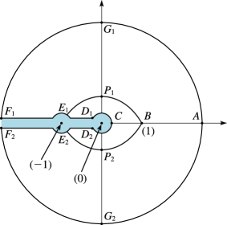
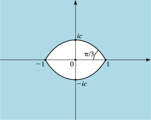

# §10.20 Uniform Asymptotic Expansions for Large Order

:::{note}
**Keywords:**

[Bessel functions](http://dlmf.nist.gov/search/search?q=Bessel%20functions) , [Hankel functions](http://dlmf.nist.gov/search/search?q=Hankel%20functions) , [asymptotic expansions for large order](http://dlmf.nist.gov/search/search?q=asymptotic%20expansions%20for%20large%20order) , [uniform](http://dlmf.nist.gov/search/search?q=uniform)

**Referenced by:**

§10.41(v) , §10.57 , §2.8(iii)

**See also:**

Annotations for Ch.10
:::

## §10.20(i) Real Variables

:::{note}
**Keywords:**

[Bessel functions](http://dlmf.nist.gov/search/search?q=Bessel%20functions) , [Hankel functions](http://dlmf.nist.gov/search/search?q=Hankel%20functions) , [derivatives](http://dlmf.nist.gov/search/search?q=derivatives) , [uniform asymptotic expansions for large order](http://dlmf.nist.gov/search/search?q=uniform%20asymptotic%20expansions%20for%20large%20order)

**Notes:**

See Olver ([1997b](./bib/O.html#bib1809 "Asymptotics and Special Functions"), pp. 419–425).

**Referenced by:**

§10.19(iii) , §10.19(iii) , §10.20(ii) , §10.74(i) , §10.74(ii) , 3rd item

**See also:**

Annotations for §10.20 and Ch.10
:::

Define $\zeta=\zeta(z)$ to be the solution of the differential equation

$$
\left(\frac{\mathrm{d}\zeta}{\mathrm{d}z}\right)^{2}=\frac{1-z^{2}}{\zeta z^{2}} \tag{10.20.1}
$$

that is infinitely differentiable on the interval $0<z<\infty$ , including $z=1$ . Then

$$
\frac{2}{3}\zeta^{\frac{3}{2}}=\int_{z}^{1}\frac{\sqrt{1-t^{2}}}{t}\,\mathrm{d}t=\ln\left(\frac{1+\sqrt{1-z^{2}}}{z}\right)-\sqrt{1-z^{2}}, \tag{10.20.2}
$$

$$
\frac{2}{3}(-\zeta)^{\frac{3}{2}}=\int_{1}^{z}\frac{\sqrt{t^{2}-1}}{t}\,\mathrm{d}t=\sqrt{z^{2}-1}-\operatorname{arcsec}z, \tag{10.20.3}
$$

all functions taking their principal values, with $\zeta=\infty,0,-\infty$ , corresponding to $z=0,1,\infty$ , respectively.

As $\nu\to\infty$ through positive real values

$$
\displaystyle J_{\nu}\left(\nu z\right) \displaystyle\sim\left(\frac{4\zeta}{1-z^{2}}\right)^{\frac{1}{4}}\*\left(\frac{\operatorname{Ai}\left(\nu^{\frac{2}{3}}\zeta\right)}{\nu^{\frac{1}{3}}}\sum_{k=0}^{\infty}\frac{A_{k}(\zeta)}{\nu^{2k}}+\frac{\operatorname{Ai}'\left(\nu^{\frac{2}{3}}\zeta\right)}{\nu^{\frac{5}{3}}}\sum_{k=0}^{\infty}\frac{B_{k}(\zeta)}{\nu^{2k}}\right), \tag{10.20.4}
$$

:::{note}
**Symbols:**

$\operatorname{Ai}\left(\NVar{z}\right)$: Airy function , $J_{\NVar{\nu}}\left(\NVar{z}\right)$: Bessel function of the first kind , $\sim$: Poincaré asymptotic expansion , $k$: nonnegative integer , $z$: complex variable , $\nu$: complex parameter , $\zeta(z)$: solution , $A_{k}(\zeta)$: coefficients and $B_{k}(\zeta)$: coefficients

**A&S Ref:**

9.3.35

**Referenced by:**

§10.20(ii) , §10.20(iii)

**See also:**

Annotations for §10.20(i) , §10.20 and Ch.10
:::

$$
\displaystyle Y_{\nu}\left(\nu z\right) \displaystyle\sim-\left(\frac{4\zeta}{1-z^{2}}\right)^{\frac{1}{4}}\left(\frac{\operatorname{Bi}\left(\nu^{\frac{2}{3}}\zeta\right)}{\nu^{\frac{1}{3}}}\sum_{k=0}^{\infty}\frac{A_{k}(\zeta)}{\nu^{2k}}+\frac{\operatorname{Bi}'\left(\nu^{\frac{2}{3}}\zeta\right)}{\nu^{\frac{5}{3}}}\sum_{k=0}^{\infty}\frac{B_{k}(\zeta)}{\nu^{2k}}\right), \tag{10.20.5}
$$

:::{note}
**Symbols:**

$\operatorname{Bi}\left(\NVar{z}\right)$: Airy function , $Y_{\NVar{\nu}}\left(\NVar{z}\right)$: Bessel function of the second kind , $\sim$: Poincaré asymptotic expansion , $k$: nonnegative integer , $z$: complex variable , $\nu$: complex parameter , $\zeta(z)$: solution , $A_{k}(\zeta)$: coefficients and $B_{k}(\zeta)$: coefficients

**A&S Ref:**

9.3.36

**See also:**

Annotations for §10.20(i) , §10.20 and Ch.10
:::

$$
\rselection{{H^{(1)}_{\nu}}\left(\nu z\right)\\
{H^{(2)}_{\nu}}\left(\nu z\right)}\sim 2e^{\mp\pi i/3}\left(\frac{4\zeta}{1-z^{2}}\right)^{\frac{1}{4}}\left(\frac{\operatorname{Ai}\left(e^{\pm 2\pi i/3}\nu^{\frac{2}{3}}\zeta\right)}{\nu^{\frac{1}{3}}}\sum_{k=0}^{\infty}\frac{A_{k}(\zeta)}{\nu^{2k}}+\frac{e^{\pm 2\pi i/3}\operatorname{Ai}'\left(e^{\pm 2\pi i/3}\nu^{\frac{2}{3}}\zeta\right)}{\nu^{\frac{5}{3}}}\sum_{k=0}^{\infty}\frac{B_{k}(\zeta)}{\nu^{2k}}\right), \tag{10.20.6}
$$

$$
\displaystyle J_{\nu}'\left(\nu z\right) \displaystyle\sim-\frac{2}{z}\left(\frac{1-z^{2}}{4\zeta}\right)^{\frac{1}{4}}\*\left(\frac{\operatorname{Ai}\left(\nu^{\frac{2}{3}}\zeta\right)}{\nu^{\frac{4}{3}}}\sum_{k=0}^{\infty}\frac{C_{k}(\zeta)}{\nu^{2k}}+\frac{\operatorname{Ai}'\left(\nu^{\frac{2}{3}}\zeta\right)}{\nu^{\frac{2}{3}}}\sum_{k=0}^{\infty}\frac{D_{k}(\zeta)}{\nu^{2k}}\right), \tag{10.20.7}
$$

:::{note}
**Symbols:**

$\operatorname{Ai}\left(\NVar{z}\right)$: Airy function , $J_{\NVar{\nu}}\left(\NVar{z}\right)$: Bessel function of the first kind , $\sim$: Poincaré asymptotic expansion , $k$: nonnegative integer , $z$: complex variable , $\nu$: complex parameter , $\zeta(z)$: solution , $C_{k}(\zeta)$: coefficients and $D_{k}(\zeta)$: coefficients

**A&S Ref:**

9.3.43

**See also:**

Annotations for §10.20(i) , §10.20 and Ch.10
:::

$$
\displaystyle Y_{\nu}'\left(\nu z\right) \displaystyle\sim\frac{2}{z}\left(\frac{1-z^{2}}{4\zeta}\right)^{\frac{1}{4}}\*\left(\frac{\operatorname{Bi}\left(\nu^{\frac{2}{3}}\zeta\right)}{\nu^{\frac{4}{3}}}\sum_{k=0}^{\infty}\frac{C_{k}(\zeta)}{\nu^{2k}}+\frac{\operatorname{Bi}'\left(\nu^{\frac{2}{3}}\zeta\right)}{\nu^{\frac{2}{3}}}\sum_{k=0}^{\infty}\frac{D_{k}(\zeta)}{\nu^{2k}}\right), \tag{10.20.8}
$$

:::{note}
**Symbols:**

$\operatorname{Bi}\left(\NVar{z}\right)$: Airy function , $Y_{\NVar{\nu}}\left(\NVar{z}\right)$: Bessel function of the second kind , $\sim$: Poincaré asymptotic expansion , $k$: nonnegative integer , $z$: complex variable , $\nu$: complex parameter , $\zeta(z)$: solution , $C_{k}(\zeta)$: coefficients and $D_{k}(\zeta)$: coefficients

**A&S Ref:**

9.3.44

**See also:**

Annotations for §10.20(i) , §10.20 and Ch.10
:::

$$
\rselection{{H^{(1)}_{\nu}}'\left(\nu z\right)\\
{H^{(2)}_{\nu}}'\left(\nu z\right)}\sim\frac{4e^{\mp 2\pi i/3}}{z}\left(\frac{1-z^{2}}{4\zeta}\right)^{\frac{1}{4}}\*\left(\frac{e^{\mp 2\pi i/3}\operatorname{Ai}\left(e^{\pm 2\pi i/3}\nu^{\frac{2}{3}}\zeta\right)}{\nu^{\frac{4}{3}}}\sum_{k=0}^{\infty}\frac{C_{k}(\zeta)}{\nu^{2k}}+\frac{\operatorname{Ai}'\left(e^{\pm 2\pi i/3}\nu^{\frac{2}{3}}\zeta\right)}{\nu^{\frac{2}{3}}}\sum_{k=0}^{\infty}\frac{D_{k}(\zeta)}{\nu^{2k}}\right), \tag{10.20.9}
$$

uniformly for $z$ $\in(0,\infty)$ in all cases, where $\operatorname{Ai}$ and $\operatorname{Bi}$ are the Airy functions (§ [9.2](./9.2.md "§9.2 Differential Equation ‣ Airy Functions ‣ Chapter 9 Airy and Related Functions") ).

In the following formulas for the coefficients $A_{k}(\zeta)$ , $B_{k}(\zeta)$ , $C_{k}(\zeta)$ , and $D_{k}(\zeta)$ , $u_{k}$ , $v_{k}$ are the constants defined in § 9.7(i) , and $U_{k}(p)$ , $V_{k}(p)$ are the polynomials in $p$ of degree $3k$ defined in § 10.41(ii) .

### Interval 0<z<1

:::{note}
**See also:**

Annotations for §10.20(i) , §10.20 and Ch.10
:::

$$
A_{k}(\zeta)=\sum_{j=0}^{2k}(\tfrac{3}{2})^{j}v_{j}\zeta^{-3j/2}U_{2k-j}\left((1-z^{2})^{-\frac{1}{2}}\right), \tag{10.20.10}
$$

$$
B_{k}(\zeta)=-\zeta^{-\frac{1}{2}}\sum_{j=0}^{2k+1}(\tfrac{3}{2})^{j}u_{j}\zeta^{-3j/2}U_{2k-j+1}\left((1-z^{2})^{-\frac{1}{2}}\right), \tag{10.20.11}
$$

$$
C_{k}(\zeta)=-\zeta^{\frac{1}{2}}\sum_{j=0}^{2k+1}(\tfrac{3}{2})^{j}v_{j}\zeta^{-3j/2}V_{2k-j+1}\left((1-z^{2})^{-\frac{1}{2}}\right), \tag{10.20.12}
$$

$$
D_{k}(\zeta)=\sum_{j=0}^{2k}(\tfrac{3}{2})^{j}u_{j}\zeta^{-3j/2}V_{2k-j}\left((1-z^{2})^{-\frac{1}{2}}\right). \tag{10.20.13}
$$

### Interval 1<z<∞

:::{note}
**See also:**

Annotations for §10.20(i) , §10.20 and Ch.10
:::

In formulas ( 10.20.10 )–( 10.20.13 ) replace $\zeta^{\frac{1}{2}}$ , $\zeta^{-\frac{1}{2}}$ , $\zeta^{-3j/2}$ , and $(1-z^{2})^{-\frac{1}{2}}$ by $-i(-\zeta)^{\frac{1}{2}}$ , $i(-\zeta)^{-\frac{1}{2}}$ , $i^{3j}(-\zeta)^{-3j/2}$ , and $i(z^{2}-1)^{-\frac{1}{2}}$ , respectively.

Note: Another way of arranging the above formulas for the coefficients $A_{k}(\zeta),B_{k}(\zeta),C_{k}(\zeta)$ , and $D_{k}(\zeta)$ would be by analogy with ( 12.10.42 ) and ( 12.10.46 ). In this way there is less usage of many-valued functions.

### Values at ζ=0

:::{note}
**See also:**

Annotations for §10.20(i) , §10.20 and Ch.10
:::

$$
\displaystyle A_{0}(0) \displaystyle=1, \tag{10.20.14}
$$

$$
\displaystyle A_{1}(0) \displaystyle=-\tfrac{1}{225},
$$

$$
\displaystyle A_{2}(0) \displaystyle=\tfrac{1\;51439}{2182\;95000},
$$

$$
\displaystyle A_{3}(0) \displaystyle=-\tfrac{8872\;78009}{250\;49351\;25000},\\

$$

$$
\displaystyle B_{0}(0) \displaystyle=\tfrac{1}{70}2^{\frac{1}{3}},
$$

$$
\displaystyle B_{1}(0) \displaystyle=-\tfrac{1213}{10\;23750}2^{\frac{1}{3}},
$$

$$
\displaystyle B_{2}(0) \displaystyle=\tfrac{1\;65425\;37833}{3774\;32055\;00000}2^{\frac{1}{3}},
$$

$$
\displaystyle B_{3}(0) \displaystyle=-\tfrac{959\;71711\;84603}{25\;47666\;37125\;00000}2^{\frac{1}{3}}.
$$

:::{note}
**Symbols:**

$A_{k}(\zeta)$: coefficients and $B_{k}(\zeta)$: coefficients

**Referenced by:**

§10.20(i) , Erratum (V1.0.5) for Equation (10.20.14)

**Errata (effective with 1.0.5):**

Originally the value given for $B_{3}(0)$ was given incorrectly as $B_{3}(0)=-\tfrac{430\;99056\;39368\;59253}{5\;68167\;34399\;42500\;00000}2^{\frac{1}{3}}$ . *Reported 2012-05-11 by Antony Lee*

**See also:**

Annotations for §10.20(i) , §10.20(i) , §10.20 and Ch.10
:::

Each of the coefficients $A_{k}(\zeta)$ , $B_{k}(\zeta)$ , $C_{k}(\zeta)$ , and $D_{k}(\zeta)$ , $k=0,1,2,\dotsc$ , is real and infinitely differentiable on the interval $-\infty<\zeta<\infty$ . For ( 10.20.14 ) and further information on the coefficients see Temme ([1997](./bib/T.html#bib2232 "Numerical algorithms for uniform Airy-type asymptotic expansions")).

For numerical tables of $\zeta=\zeta(z)$ , $(4\zeta/(1-z^{2}))^{\frac{1}{4}}$ and $A_{k}(\zeta)$ , $B_{k}(\zeta)$ , $C_{k}(\zeta)$ , and $D_{k}(\zeta)$ see Olver ([1962](./bib/O.html#bib1784 "Tables for Bessel Functions of Moderate or Large Orders"), pp. 28–42).

## §10.20(ii) Complex Variables

:::{note}
**Keywords:**

[Bessel functions](http://dlmf.nist.gov/search/search?q=Bessel%20functions) , [asymptotic expansions for large order](http://dlmf.nist.gov/search/search?q=asymptotic%20expansions%20for%20large%20order) , [resurgence properties of coefficients](http://dlmf.nist.gov/search/search?q=resurgence%20properties%20of%20coefficients)

**Notes:**

See Olver ([1997b](./bib/O.html#bib1809 "Asymptotics and Special Functions"), pp. 419–425) and Olver ([1954](./bib/O.html#bib1781 "The asymptotic expansion of Bessel functions of large order")).

**Referenced by:**

§10.14 , §10.74(i)

**See also:**

Annotations for §10.20 and Ch.10
:::

The function $\zeta=\zeta(z)$ given by ( 10.20.2 ) and ( 10.20.3 ) can be continued analytically to the $z$ -plane cut along the negative real axis. Corresponding points of the mapping are shown in Figures 10.20.1 and 10.20.2 .

The equations of the curved boundaries $D_{1}E_{1}$ and $D_{2}E_{2}$ in the $\zeta$ -plane are given parametrically by

$$
\zeta=(\tfrac{3}{2})^{\frac{2}{3}}(\tau\mp i\pi)^{\frac{2}{3}}, \tag{10.20.15}
$$

respectively.

The curves $BP_{1}E_{1}$ and $BP_{2}E_{2}$ in the $z$ -plane are the inverse maps of the line segments

$$
\zeta=e^{\mp i\pi/3}\tau, \tag{10.20.16}
$$

respectively. They are given parametrically by

$$
z=\pm(\tau\coth\tau-\tau^{2})^{\frac{1}{2}}\pm\mathrm{i}(\tau^{2}-\tau\tanh\tau)^{\frac{1}{2}}, \tag{10.20.17}
$$

where $\tau_{0}=1.19968\ldots$ is the positive root of the equation $\tau=\coth\tau$ . The points $P_{1},P_{2}$ where these curves intersect the imaginary axis are $\pm ic$ , where

$$
c=(\tau_{0}^{2}-1)^{\frac{1}{2}}=0.66274\dotsc. \tag{10.20.18}
$$

The eye-shaped closed domain in the uncut $z$ -plane that is bounded by $BP_{1}E_{1}$ and $BP_{2}E_{2}$ is denoted by $\mathbf{K}$ ; see Figure 10.20.3 .

:::{note}
**Defines:**

$B$ : point (locally) , $C$ : point (locally) , $E_{k}$ : points (locally) , $F_{k}$ : points (locally) , $G_{k}$ : points (locally) , $P_{k}$ : points (locally) and $A$ : point (locally)

**Symbols:**

$\mathrm{i}$: imaginary unit , $k$: nonnegative integer , $z$: complex variable , $D_{k}(\zeta)$: coefficients and $c$

**Referenced by:**

§10.20(ii)

**See also:**

Annotations for §10.20(ii) , §10.20 and Ch.10
:::

:::{note}
**Defines:**

$\mathbf{K}$ : domain (locally)

**Symbols:**

$z$: complex variable and $c$

**Referenced by:**

§10.20(ii) , §10.21(ix) , §10.41(iii)

**See also:**

Annotations for §10.20(ii) , §10.20 and Ch.10
:::

As $\nu\to\infty$ through positive real values the expansions ( 10.20.4 )–( 10.20.9 ) apply uniformly for $|\operatorname{ph}z|\leq\pi-\delta$ , the coefficients $A_{k}(\zeta)$ , $B_{k}(\zeta)$ , $C_{k}(\zeta)$ , and $D_{k}(\zeta)$ , being the analytic continuations of the functions defined in § 10.20(i) when $\zeta$ is real.

For proofs of the above results and for error bounds and extensions of the regions of validity see Olver ([1997b](./bib/O.html#bib1809 "Asymptotics and Special Functions"), pp. 419–425). For extensions to complex $\nu$ see Olver ([1954](./bib/O.html#bib1781 "The asymptotic expansion of Bessel functions of large order")). For resurgence properties of the coefficients (§ 2.7(ii) ) see Howls and Olde Daalhuis ([1999](./bib/H.html#bib1104 "On the resurgence properties of the uniform asymptotic expansion of Bessel functions of large order")). For further results see Dunster ([2001a](./bib/D.html#bib708 "Convergent expansions for solutions of linear ordinary differential equations having a simple turning point, with an application to Bessel functions")), Wang and Wong ([2002](./bib/W.html#bib2364 "Uniform asymptotic expansion of ⁢ J ν ( ⁢ ν a ) via a difference equation")), and Paris ([2004](./bib/P.html#bib1842 "Exactification of the method of steepest descents: The Bessel functions of large order and argument")).

## §10.20(iii) Double Asymptotic Properties

:::{note}
**Keywords:**

[Bessel functions](http://dlmf.nist.gov/search/search?q=Bessel%20functions) , [Hankel functions](http://dlmf.nist.gov/search/search?q=Hankel%20functions) , [asymptotic expansions for large order](http://dlmf.nist.gov/search/search?q=asymptotic%20expansions%20for%20large%20order) , [double asymptotic properties](http://dlmf.nist.gov/search/search?q=double%20asymptotic%20properties) , [uniform](http://dlmf.nist.gov/search/search?q=uniform)

**See also:**

Annotations for §10.20 and Ch.10
:::

For asymptotic properties of the expansions ( 10.20.4 )–( 10.20.6 ) with respect to large values of $z$ see § 10.41(v) .
