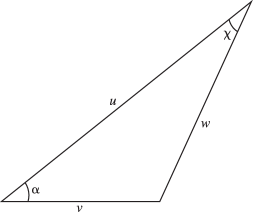

# §10.23 Sums

:::{note}
**See also:**

Annotations for Ch.10
:::

## §10.23(i) Multiplication Theorem

:::{note}
**Keywords:**

[Bessel functions](http://dlmf.nist.gov/search/search?q=Bessel%20functions) , [Hankel functions](http://dlmf.nist.gov/search/search?q=Hankel%20functions) , [cylinder functions](http://dlmf.nist.gov/search/search?q=cylinder%20functions) , [multiplication theorem](http://dlmf.nist.gov/search/search?q=multiplication%20theorem) , [sums](http://dlmf.nist.gov/search/search?q=sums)

**Notes:**

See Watson ([1944](./bib/W.html#bib2380 "A Treatise on the Theory of Bessel Functions"), §5.22).

**See also:**

Annotations for §10.23 and Ch.10
:::

$$
\mathscr{C}_{\nu}\left(\lambda z\right)=\lambda^{\pm\nu}\sum_{k=0}^{\infty}\frac{(\mp 1)^{k}(\lambda^{2}-1)^{k}(\tfrac{1}{2}z)^{k}}{k!}\mathscr{C}_{\nu\pm k}\left(z\right), \tag{10.23.1}
$$

If $\mathscr{C}=J$ and the upper signs are taken, then the restriction on $\lambda$ is unnecessary.

## §10.23(ii) Addition Theorems

:::{note}
**Keywords:**

[Bessel functions](http://dlmf.nist.gov/search/search?q=Bessel%20functions) , [Hankel functions](http://dlmf.nist.gov/search/search?q=Hankel%20functions) , [addition theorems](http://dlmf.nist.gov/search/search?q=addition%20theorems) , [cylinder functions](http://dlmf.nist.gov/search/search?q=cylinder%20functions) , [sums](http://dlmf.nist.gov/search/search?q=sums)

**Notes:**

For ( 10.23.7 ) and ( 10.23.8 ) see Watson ([1944](./bib/W.html#bib2380 "A Treatise on the Theory of Bessel Functions"), §§11.3, 11.4). ( 10.23.2 ) is obtained from ( 10.23.7 ) by taking $\chi=0$ and $\alpha=0,\pi$ .

**Referenced by:**

§10.60(i) , §28.27 , Erratum (V1.0.7) for Usability

**Addition (effective with 1.0.7):**

The cross-reference to § [10.12](./10.12.md "§10.12 Generating Function and Associated Series ‣ Bessel and Hankel Functions ‣ Chapter 10 Bessel Functions") after ( 10.23.9 ) has been added. *Suggested 2012-12-28 by Alexander Barnett*

**See also:**

Annotations for §10.23 and Ch.10
:::

### Neumann’s Addition Theorem

:::{note}
**Keywords:**

[Bessel functions](http://dlmf.nist.gov/search/search?q=Bessel%20functions) , [Neumann’s addition theorem](http://dlmf.nist.gov/search/search?q=Neumann%20addition%20theorem)

**See also:**

Annotations for §10.23(ii) , §10.23 and Ch.10
:::

$$
\mathscr{C}_{\nu}\left(u\pm v\right)=\sum_{k=-\infty}^{\infty}\mathscr{C}_{\nu\mp k}\left(u\right)J_{k}\left(v\right), \tag{10.23.2}
$$

The restriction $|v|<|u|$ is unnecessary when $\mathscr{C}=J$ and $\nu$ is an integer. Special cases are:

$$
{J_{0}}^{2}\left(z\right)+2\sum_{k=1}^{\infty}{J_{k}}^{2}\left(z\right)=1, \tag{10.23.3}
$$

$$
\sum_{k=0}^{2n}(-1)^{k}J_{k}\left(z\right)J_{2n-k}\left(z\right)\\
+2\sum_{k=1}^{\infty}J_{k}\left(z\right)J_{2n+k}\left(z\right)=0, \tag{10.23.4}
$$

$$
\sum_{k=0}^{n}J_{k}\left(z\right)J_{n-k}\left(z\right)+2\sum_{k=1}^{\infty}(-1)^{k}J_{k}\left(z\right)J_{n+k}\left(z\right)=J_{n}\left(2z\right). \tag{10.23.5}
$$

### Graf’s and Gegenbauer’s Addition Theorems

:::{note}
**Keywords:**

[Bessel functions](http://dlmf.nist.gov/search/search?q=Bessel%20functions) , [Gegenbauer’s addition theorem](http://dlmf.nist.gov/search/search?q=Gegenbauer%20addition%20theorem) , [Graf’s addition theorem](http://dlmf.nist.gov/search/search?q=Graf%20addition%20theorem)

**See also:**

Annotations for §10.23(ii) , §10.23 and Ch.10
:::

Define

$$
\displaystyle w \displaystyle=\sqrt{u^{2}+v^{2}-2uv\cos\alpha}, \tag{10.23.6}
$$

$$
\displaystyle u-v\cos\alpha \displaystyle=w\cos\chi,
$$

$$
\displaystyle v\sin\alpha \displaystyle=w\sin\chi,
$$

:::{note}
**Symbols:**

$\cos\NVar{z}$: cosine function and $\sin\NVar{z}$: sine function

**See also:**

Annotations for §10.23(ii) , §10.23(ii) , §10.23 and Ch.10
:::

the branches being continuous and chosen so that $w\to u$ and $\chi\to 0$ as $v\to 0$ . If $u$ , $v$ are real and positive and $0\leq\alpha\leq\pi$ , then $w$ and $\chi$ are real and nonnegative, and the geometrical relationship is shown in Figure 10.23.1 .

:::{note}
**Referenced by:**

§10.23(ii)

**See also:**

Annotations for §10.23(ii) , §10.23(ii) , §10.23 and Ch.10
:::

$$
\mathscr{C}_{\nu}\left(w\right)\selection{\cos\\
\sin}(\nu\chi)=\sum_{k=-\infty}^{\infty}\mathscr{C}_{\nu+k}\left(u\right)J_{k}\left(v\right)\selection{\cos\\
\sin}(k\alpha), \tag{10.23.7}
$$

$$
\frac{\mathscr{C}_{\nu}\left(w\right)}{w^{\nu}}=2^{\nu}\Gamma\left(\nu\right)\*\sum_{k=0}^{\infty}(\nu+k)\frac{\mathscr{C}_{\nu+k}\left(u\right)}{u^{\nu}}\frac{J_{\nu+k}\left(v\right)}{v^{\nu}}C^{(\nu)}_{k}\left(\cos\alpha\right), \tag{10.23.8}
$$

where $C^{(\nu)}_{k}\left(\cos\alpha\right)$ is Gegenbauer’s polynomial (§ [18.3](./18.3.md "§18.3 Definitions ‣ Classical Orthogonal Polynomials ‣ Chapter 18 Orthogonal Polynomials") ). The restriction $|ve^{\pm i\alpha}|<|u|$ is unnecessary in ( 10.23.7 ) when $\mathscr{C}=J$ and $\nu$ is an integer, and in ( 10.23.8 ) when $\mathscr{C}=J$ .

The degenerate form of ( 10.23.8 ) when $u=\infty$ is given by

$$
e^{iv\cos\alpha}=\frac{\Gamma\left(\nu\right)}{(\tfrac{1}{2}v)^{\nu}}\*\sum_{k=0}^{\infty}(\nu+k)i^{k}J_{\nu+k}\left(v\right)C^{(\nu)}_{k}\left(\cos\alpha\right), \tag{10.23.9}
$$

See also § [10.12](./10.12.md "§10.12 Generating Function and Associated Series ‣ Bessel and Hankel Functions ‣ Chapter 10 Bessel Functions") .

### Partial Fractions

:::{note}
**Keywords:**

[Bessel functions](http://dlmf.nist.gov/search/search?q=Bessel%20functions) , [Hankel functions](http://dlmf.nist.gov/search/search?q=Hankel%20functions) , [addition theorems](http://dlmf.nist.gov/search/search?q=addition%20theorems) , [expansions in partial fractions](http://dlmf.nist.gov/search/search?q=expansions%20in%20partial%20fractions) , [sums](http://dlmf.nist.gov/search/search?q=sums)

**See also:**

Annotations for §10.23(ii) , §10.23 and Ch.10
:::

For expansions of products of Bessel functions of the first kind in partial fractions see Rogers ([2005](./bib/R.html#bib2652 "Partial fractions expansions and identities for products of Bessel functions")).

## §10.23(iii) Series Expansions of Arbitrary Functions

:::{note}
**Keywords:**

[Bessel functions](http://dlmf.nist.gov/search/search?q=Bessel%20functions) , [expansions in series of](http://dlmf.nist.gov/search/search?q=expansions%20in%20series%20of) , [expansions in series of Bessel functions](http://dlmf.nist.gov/search/search?q=expansions%20in%20series%20of%20Bessel%20functions) , [sums](http://dlmf.nist.gov/search/search?q=sums)

**Notes:**

For ( 10.23.10 )–( 10.23.13 ) see Watson ([1944](./bib/W.html#bib2380 "A Treatise on the Theory of Bessel Functions"), § 16.11). For ( 10.23.15 )–( 10.23.17 ) see Watson ([1944](./bib/W.html#bib2380 "A Treatise on the Theory of Bessel Functions"), pp. 64, 67, 71, 138). For ( 10.23.21 ) see Temme ([1996b](./bib/T.html#bib2230 "Special Functions: An Introduction to the Classical Functions of Mathematical Physics"), p. 247).

**Referenced by:**

§11.4(iv)

**See also:**

Annotations for §10.23 and Ch.10
:::

### Neumann’s Expansion

:::{note}
**Keywords:**

[Bessel functions](http://dlmf.nist.gov/search/search?q=Bessel%20functions) , [Neumann’s expansion](http://dlmf.nist.gov/search/search?q=Neumann%20expansion) , [Neumann’s polynomial](http://dlmf.nist.gov/search/search?q=Neumann%20polynomial)

**See also:**

Annotations for §10.23(iii) , §10.23 and Ch.10
:::

$$
f(z)=a_{0}J_{0}\left(z\right)+2\sum_{k=1}^{\infty}a_{k}J_{k}\left(z\right), \tag{10.23.10}
$$

where $c$ is the distance of the nearest singularity of the analytic function $f(z)$ from $z=0$ ,

$$
a_{k}=\frac{1}{2\pi i}\int_{|t|=c^{\prime}}f(t)O_{k}\left(t\right)\,\mathrm{d}t, \tag{10.23.11}
$$

and $O_{k}\left(t\right)$ is *Neumann’s polynomial* , defined by the generating function:

$$
\frac{1}{t-z}=J_{0}\left(z\right)O_{0}\left(t\right)+2\sum_{k=1}^{\infty}J_{k}\left(z\right)O_{k}\left(t\right), \tag{10.23.12}
$$

$O_{n}\left(t\right)$ is a polynomial of degree $n+1$ in $\ifrac{1}{t}:O_{0}\left(t\right)=1/t$ and

$$
O_{n}\left(t\right)=\frac{1}{4}\sum_{k=0}^{\left\lfloor n/2\right\rfloor}\frac{(n-k-1)!n}{k!}\left(\frac{2}{t}\right)^{n-2k+1}, \tag{10.23.13}
$$

For the more general form of expansion

$$
z^{\nu}f(z)=a_{0}J_{\nu}\left(z\right)+2\sum_{k=1}^{\infty}a_{k}J_{\nu+k}\left(z\right) \tag{10.23.14}
$$

see Watson ([1944](./bib/W.html#bib2380 "A Treatise on the Theory of Bessel Functions"), §16.13), and for further generalizations see Watson ([1944](./bib/W.html#bib2380 "A Treatise on the Theory of Bessel Functions"), Chapter 16) and Erdélyi et al. ([1953b](./bib/E.html#bib752 "Higher Transcendental Functions. Vol. II"), §7.10.1).

### Examples

:::{note}
**See also:**

Annotations for §10.23(iii) , §10.23 and Ch.10
:::

$$
(\tfrac{1}{2}z)^{\nu}=\sum_{k=0}^{\infty}\frac{(\nu+2k)\Gamma\left(\nu+k\right)}{k!}J_{\nu+2k}\left(z\right), \tag{10.23.15}
$$

$$
Y_{0}\left(z\right)=\frac{2}{\pi}\left(\ln\left(\tfrac{1}{2}z\right)+\gamma\right)J_{0}\left(z\right)-\frac{4}{\pi}\sum_{k=1}^{\infty}(-1)^{k}\frac{J_{2k}\left(z\right)}{k}, \tag{10.23.16}
$$

$$
Y_{n}\left(z\right)=-\frac{n!(\tfrac{1}{2}z)^{-n}}{\pi}\sum_{k=0}^{n-1}\frac{(\tfrac{1}{2}z)^{k}J_{k}\left(z\right)}{k!(n-k)}+\frac{2}{\pi}\left(\ln\left(\tfrac{1}{2}z\right)-\psi\left(n+1\right)\right)J_{n}\left(z\right)-\frac{2}{\pi}\sum_{k=1}^{\infty}(-1)^{k}\frac{(n+2k)J_{n+2k}\left(z\right)}{k(n+k)}, \tag{10.23.17}
$$

where $\gamma$ is Euler’s constant and $\psi\left(n+1\right)=\Gamma'\left(n+1\right)/\Gamma\left(n+1\right)$ (§ [5.2](./5.2.md "§5.2 Definitions ‣ Properties ‣ Chapter 5 Gamma Function") ).

Other examples are provided by ( 10.12.1 )–( 10.12.6 ), ( 10.23.2 ), and ( 10.23.7 ).

### Fourier–Bessel Expansion

:::{note}
**Keywords:**

[Bessel functions](http://dlmf.nist.gov/search/search?q=Bessel%20functions) , [Fourier–Bessel expansion](http://dlmf.nist.gov/search/search?q=Fourier%E2%80%93Bessel%20expansion)

**See also:**

Annotations for §10.23(iii) , §10.23 and Ch.10
:::

Assume $f(t)$ satisfies

$$
\int_{0}^{1}t^{\frac{1}{2}}|f(t)|\,\mathrm{d}t<\infty, \tag{10.23.18}
$$

and define

$$
a_{m}=\frac{2}{(J_{\nu+1}\left(j_{\nu,m}\right))^{2}}\int_{0}^{1}tf(t)J_{\nu}\left(j_{\nu,m}t\right)\,\mathrm{d}t, \tag{10.23.19}
$$

where $j_{\nu,m}$ is as in § 10.21(i) . If $0<x<1$ , then

$$
\tfrac{1}{2}f(x-)+\tfrac{1}{2}f(x+)=\sum_{m=1}^{\infty}a_{m}J_{\nu}\left(j_{\nu,m}x\right), \tag{10.23.20}
$$

provided that $f(t)$ is of bounded variation (§ 1.4(v) ) on an interval $[a,b]$ with $0
$$
x^{\nu}=\sum_{m=1}^{\infty}\frac{2J_{\nu}\left(j_{\nu,m}x\right)}{j_{\nu,m}J_{\nu+1}\left(j_{\nu,m}\right)}, \tag{10.23.21}
$$

(Note that when $x=1$ the left-hand side is 1 and the right-hand side is 0.)

### Other Series Expansions

:::{note}
**Keywords:**

[Bessel functions](http://dlmf.nist.gov/search/search?q=Bessel%20functions) , [expansions in series of Bessel functions](http://dlmf.nist.gov/search/search?q=expansions%20in%20series%20of%20Bessel%20functions) , [sums](http://dlmf.nist.gov/search/search?q=sums)

**See also:**

Annotations for §10.23(iii) , §10.23 and Ch.10
:::

For other types of expansions of arbitrary functions in series of Bessel functions, see Watson ([1944](./bib/W.html#bib2380 "A Treatise on the Theory of Bessel Functions"), Chapters 17–19) and Erdélyi et al. ([1953b](./bib/E.html#bib752 "Higher Transcendental Functions. Vol. II"), §§ 7.10.2–7.10.4). See also Schäfke ([1960](./bib/S.html#bib2001 "Reihenentwicklungen analytischer Funktionen nach Biorthogonalsystemen spezieller Funktionen. I"), [1961b](./bib/S.html#bib2002 "Reihenentwicklungen analytischer Funktionen nach Biorthogonalsystemen spezieller Funktionen. II")).

## §10.23(iv) Compendia

:::{note}
**Keywords:**

[Bessel functions](http://dlmf.nist.gov/search/search?q=Bessel%20functions) , [compendia](http://dlmf.nist.gov/search/search?q=compendia) , [expansions in series of](http://dlmf.nist.gov/search/search?q=expansions%20in%20series%20of) , [sums](http://dlmf.nist.gov/search/search?q=sums)

**See also:**

Annotations for §10.23 and Ch.10
:::

For collections of sums of series involving Bessel or Hankel functions see Erdélyi et al. ([1953b](./bib/E.html#bib752 "Higher Transcendental Functions. Vol. II"), §7.15), Gradshteyn and Ryzhik ([2015](./bib/G.html#bib972 "Table of integrals, series, and products"), §§8.51–8.53), Hansen ([1975](./bib/H.html#bib1035 "A Table of Series and Products")), Luke ([1969b](./bib/L.html#bib1496 "The Special Functions and their Approximations. Vol. 2"), §9.4), Prudnikov et al. ([1986b](./bib/P.html#bib1903 "Integrals and Series: Special Functions, Vol. 2"), pp. 651–691 and 697–700), and Wheelon ([1968](./bib/W.html#bib2398 "Tables of Summable Series and Integrals Involving Bessel Functions"), pp. 48–51).
