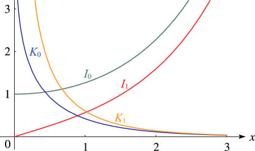
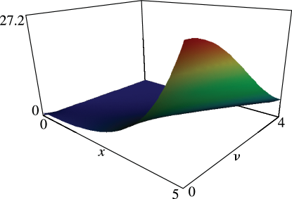
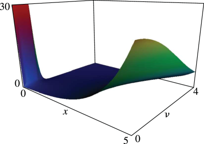
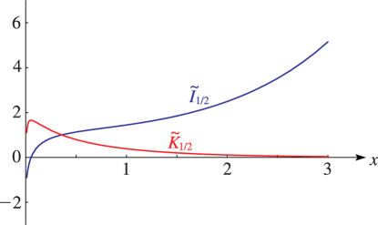
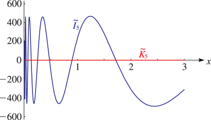

# §10.26 Graphics

:::{note}
**See also:**

Annotations for Ch.10
:::

## §10.26(i) Real Order and Variable

:::{note}
**Keywords:**

[graphics](http://dlmf.nist.gov/search/search?q=graphics) , [modified Bessel functions](http://dlmf.nist.gov/search/search?q=modified%20Bessel%20functions)

**Notes:**

These graphics were produced at NIST.

**See also:**

Annotations for §10.26 and Ch.10
:::

:::{note}
**Symbols:**

$I_{\NVar{\nu}}\left(\NVar{z}\right)$: modified Bessel function of the first kind , $K_{\NVar{\nu}}\left(\NVar{z}\right)$: modified Bessel function of the second kind and $x$: real variable

**See also:**

Annotations for §10.26(i) , §10.26 and Ch.10
:::

:::{note}
**Symbols:**

$I_{\NVar{\nu}}\left(\NVar{z}\right)$: modified Bessel function of the first kind , $x$: real variable and $\nu$: complex parameter

**See also:**

Annotations for §10.26(i) , §10.26 and Ch.10
:::

:::{note}
**Symbols:**

$I_{\NVar{\nu}}\left(\NVar{z}\right)$: modified Bessel function of the first kind , $x$: real variable and $\nu$: complex parameter

**See also:**

Annotations for §10.26(i) , §10.26 and Ch.10
:::

## §10.26(ii) Real Order, Complex Variable

:::{note}
**See also:**

Annotations for §10.26 and Ch.10
:::

Apply ( 10.27.6 ) and ( 10.27.8 ) to § 10.3(ii) .

## §10.26(iii) Imaginary Order, Real Variable

:::{note}
**Notes:**

These graphs were produced at NIST.

**Referenced by:**

§10.45

**See also:**

Annotations for §10.26 and Ch.10
:::

For the notation, see § [10.45](./10.45.md "§10.45 Functions of Imaginary Order ‣ Modified Bessel Functions ‣ Chapter 10 Bessel Functions") .

:::{note}
**Symbols:**

$\widetilde{I}_{\NVar{\nu}}\left(\NVar{x}\right)$: modified Bessel function of the first kind of imaginary order , $\widetilde{K}_{\NVar{\nu}}\left(\NVar{x}\right)$: modified Bessel function fo the second kind of imaginary order and $x$: real variable

**Keywords:**

[graphs](http://dlmf.nist.gov/search/search?q=graphs) , [modified Bessel functions](http://dlmf.nist.gov/search/search?q=modified%20Bessel%20functions) , [of imaginary order](http://dlmf.nist.gov/search/search?q=of%20imaginary%20order)

**See also:**

Annotations for §10.26(iii) , §10.26 and Ch.10
:::

:::{note}
**Symbols:**

$\widetilde{I}_{\NVar{\nu}}\left(\NVar{x}\right)$: modified Bessel function of the first kind of imaginary order , $\widetilde{K}_{\NVar{\nu}}\left(\NVar{x}\right)$: modified Bessel function fo the second kind of imaginary order and $x$: real variable

**Keywords:**

[graphs](http://dlmf.nist.gov/search/search?q=graphs) , [modified Bessel functions](http://dlmf.nist.gov/search/search?q=modified%20Bessel%20functions) , [of imaginary order](http://dlmf.nist.gov/search/search?q=of%20imaginary%20order)

**See also:**

Annotations for §10.26(iii) , §10.26 and Ch.10
:::
