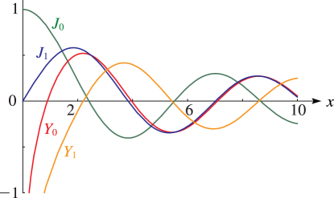

# §10.3 Graphics

:::{note}
**Keywords:**

[Bessel functions](http://dlmf.nist.gov/search/search?q=Bessel%20functions) , [graphics](http://dlmf.nist.gov/search/search?q=graphics)

**See also:**

Annotations for Ch.10
:::

## §10.3(i) Real Order and Variable

:::{note}
**Keywords:**

[Bessel functions](http://dlmf.nist.gov/search/search?q=Bessel%20functions) , [graphics](http://dlmf.nist.gov/search/search?q=graphics) , [modulus and phase functions](http://dlmf.nist.gov/search/search?q=modulus%20and%20phase%20functions)

**Notes:**

These graphics were produced at NIST.

**Referenced by:**

§10.74(vi)

**See also:**

Annotations for §10.3 and Ch.10
:::

For the modulus and phase functions $M_{\nu}\left(x\right)$ , $\theta_{\nu}\left(x\right)$ , $N_{\nu}\left(x\right)$ , and $\phi_{\nu}\left(x\right)$ see § [10.18](./10.18.md "§10.18 Modulus and Phase Functions ‣ Bessel and Hankel Functions ‣ Chapter 10 Bessel Functions") .

:::{note}
**Symbols:**

$J_{\NVar{\nu}}\left(\NVar{z}\right)$: Bessel function of the first kind , $Y_{\NVar{\nu}}\left(\NVar{z}\right)$: Bessel function of the second kind and $x$: real variable

**Referenced by:**

Graphics

**See also:**

Annotations for §10.3(i) , §10.3 and Ch.10
:::

:::{note}
**Symbols:**

$J_{\NVar{\nu}}\left(\NVar{z}\right)$: Bessel function of the first kind , $Y_{\NVar{\nu}}\left(\NVar{z}\right)$: Bessel function of the second kind , $N_{\NVar{\nu}}\left(\NVar{x}\right)$: modulus of derivatives of Bessel functions and $x$: real variable

**See also:**

Annotations for §10.3(i) , §10.3 and Ch.10
:::

:::{note}
**Symbols:**

$J_{\NVar{\nu}}\left(\NVar{z}\right)$: Bessel function of the first kind , $x$: real variable and $\nu$: complex parameter

**Referenced by:**

Graphics

**See also:**

Annotations for §10.3(i) , §10.3 and Ch.10
:::

:::{note}
**Symbols:**

$J_{\NVar{\nu}}\left(\NVar{z}\right)$: Bessel function of the first kind , $x$: real variable and $\nu$: complex parameter

**See also:**

Annotations for §10.3(i) , §10.3 and Ch.10
:::

## §10.3(ii) Real Order, Complex Variable

:::{note}
**Keywords:**

[Hankel functions](http://dlmf.nist.gov/search/search?q=Hankel%20functions) , [graphics](http://dlmf.nist.gov/search/search?q=graphics)

**Notes:**

These graphics were produced at NIST.

**Referenced by:**

§10.26(ii) , §10.74(vi)

**See also:**

Annotations for §10.3 and Ch.10
:::

In the graphics shown in this subsection, height corresponds to the absolute value of the function and color to the phase. See also p. [About Color Map](./help/vrml/aboutcolor.md "In Viewing DLMF Interactive 3D Graphics ‣ Need Help?") .

:::{note}
**Symbols:**

$J_{\NVar{\nu}}\left(\NVar{z}\right)$: Bessel function of the first kind , $\mathrm{i}$: imaginary unit , $x$: real variable and $y$: real variable

**Referenced by:**

Graphics , Graphics

**See also:**

Annotations for §10.3(ii) , §10.3 and Ch.10
:::

:::{note}
**Symbols:**

$J_{\NVar{\nu}}\left(\NVar{z}\right)$: Bessel function of the first kind , $\mathrm{i}$: imaginary unit , $x$: real variable and $y$: real variable

**See also:**

Annotations for §10.3(ii) , §10.3 and Ch.10
:::

:::{note}
**Symbols:**

$J_{\NVar{\nu}}\left(\NVar{z}\right)$: Bessel function of the first kind , $\mathrm{i}$: imaginary unit , $x$: real variable and $y$: real variable

**See also:**

Annotations for §10.3(ii) , §10.3 and Ch.10
:::

:::{note}
**Symbols:**

$J_{\NVar{\nu}}\left(\NVar{z}\right)$: Bessel function of the first kind , $\mathrm{i}$: imaginary unit , $x$: real variable and $y$: real variable

**See also:**

Annotations for §10.3(ii) , §10.3 and Ch.10
:::

## §10.3(iii) Imaginary Order, Real Variable

:::{note}
**Keywords:**

[Bessel functions](http://dlmf.nist.gov/search/search?q=Bessel%20functions) , [graphics](http://dlmf.nist.gov/search/search?q=graphics) , [graphs](http://dlmf.nist.gov/search/search?q=graphs) , [of imaginary order](http://dlmf.nist.gov/search/search?q=of%20imaginary%20order)

**Notes:**

These graphs were produced at NIST.

**Referenced by:**

§10.24

**See also:**

Annotations for §10.3 and Ch.10
:::

For the notation see § [10.24](./10.24.md "§10.24 Functions of Imaginary Order ‣ Bessel and Hankel Functions ‣ Chapter 10 Bessel Functions") .

:::{note}
**Symbols:**

$\widetilde{J}_{\NVar{\nu}}\left(\NVar{x}\right)$: Bessel function of imaginary order , $\widetilde{Y}_{\NVar{\nu}}\left(\NVar{x}\right)$: Bessel function of imaginary order and $x$: real variable

**See also:**

Annotations for §10.3(iii) , §10.3 and Ch.10
:::

:::{note}
**Symbols:**

$\widetilde{J}_{\NVar{\nu}}\left(\NVar{x}\right)$: Bessel function of imaginary order , $\widetilde{Y}_{\NVar{\nu}}\left(\NVar{x}\right)$: Bessel function of imaginary order and $x$: real variable

**See also:**

Annotations for §10.3(iii) , §10.3 and Ch.10
:::
