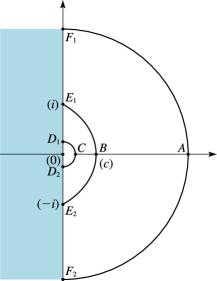

# §10.41 Asymptotic Expansions for Large Order

:::{note}
**Keywords:**

[asymptotic expansions for large order](http://dlmf.nist.gov/search/search?q=asymptotic%20expansions%20for%20large%20order) , [modified Bessel functions](http://dlmf.nist.gov/search/search?q=modified%20Bessel%20functions)

**Referenced by:**

§10.57

**See also:**

Annotations for Ch.10
:::

## §10.41(i) Asymptotic Forms

:::{note}
**Keywords:**

[asymptotic expansions for large order](http://dlmf.nist.gov/search/search?q=asymptotic%20expansions%20for%20large%20order) , [asymptotic forms](http://dlmf.nist.gov/search/search?q=asymptotic%20forms) , [modified Bessel functions](http://dlmf.nist.gov/search/search?q=modified%20Bessel%20functions)

**Notes:**

Combine ( 10.19.1 ), ( 10.19.2 ) with ( 10.27.6 ), ( 10.27.8 ).

**See also:**

Annotations for §10.41 and Ch.10
:::

If $\nu\to\infty$ through positive real values with $z(\neq 0)$ fixed, then

$$
I_{\nu}\left(z\right)\sim\frac{1}{\sqrt{2\pi\nu}}\left(\frac{ez}{2\nu}\right)^{\nu}, \tag{10.41.1}
$$

$$
K_{\nu}\left(z\right)\sim\sqrt{\frac{\pi}{2\nu}}\left(\frac{ez}{2\nu}\right)^{-\nu}. \tag{10.41.2}
$$

## §10.41(ii) Uniform Expansions for Real Variable

:::{note}
**Keywords:**

[asymptotic expansions for large order](http://dlmf.nist.gov/search/search?q=asymptotic%20expansions%20for%20large%20order) , [derivatives](http://dlmf.nist.gov/search/search?q=derivatives) , [modified Bessel functions](http://dlmf.nist.gov/search/search?q=modified%20Bessel%20functions) , [uniform](http://dlmf.nist.gov/search/search?q=uniform) , [uniform asymptotic expansions for large order](http://dlmf.nist.gov/search/search?q=uniform%20asymptotic%20expansions%20for%20large%20order)

**Notes:**

See Olver ([1997b](./bib/O.html#bib1809 "Asymptotics and Special Functions"), pp. 374–378).

**Referenced by:**

§10.19(ii) , §10.20(i) , §10.41(v) , §10.69 , §10.69 , 3rd item , §11.11(iii)

**See also:**

Annotations for §10.41 and Ch.10
:::

As $\nu\to\infty$ through positive real values,

$$
\displaystyle I_{\nu}\left(\nu z\right) \displaystyle\sim\frac{e^{\nu\eta}}{(2\pi\nu)^{\frac{1}{2}}(1+z^{2})^{\frac{1}{4}}}\sum_{k=0}^{\infty}\frac{U_{k}(p)}{\nu^{k}}, \tag{10.41.3}
$$

:::{note}
**Symbols:**

$\sim$: Poincaré asymptotic expansion , $\pi$: the ratio of the circumference of a circle to its diameter , $\mathrm{e}$: base of natural logarithm , $I_{\NVar{\nu}}\left(\NVar{z}\right)$: modified Bessel function of the first kind , $k$: nonnegative integer , $z$: complex variable , $\nu$: complex parameter , $\eta$ and $U_{k}(p)$: polynomial coefficient

**A&S Ref:**

9.7.7

**Referenced by:**

§10.41(iii) , §10.41(iv)

**See also:**

Annotations for §10.41(ii) , §10.41 and Ch.10
:::

$$
\displaystyle K_{\nu}\left(\nu z\right) \displaystyle\sim\left(\frac{\pi}{2\nu}\right)^{\frac{1}{2}}\frac{e^{-\nu\eta}}{(1+z^{2})^{\frac{1}{4}}}\sum_{k=0}^{\infty}(-1)^{k}\frac{U_{k}(p)}{\nu^{k}}, \tag{10.41.4}
$$

:::{note}
**Symbols:**

$\sim$: Poincaré asymptotic expansion , $\pi$: the ratio of the circumference of a circle to its diameter , $\mathrm{e}$: base of natural logarithm , $K_{\NVar{\nu}}\left(\NVar{z}\right)$: modified Bessel function of the second kind , $k$: nonnegative integer , $z$: complex variable , $\nu$: complex parameter , $\eta$ and $U_{k}(p)$: polynomial coefficient

**A&S Ref:**

9.7.8

**See also:**

Annotations for §10.41(ii) , §10.41 and Ch.10
:::

$$
\displaystyle I_{\nu}'\left(\nu z\right) \displaystyle\sim\frac{(1+z^{2})^{\frac{1}{4}}e^{\nu\eta}}{(2\pi\nu)^{\frac{1}{2}}z}\sum_{k=0}^{\infty}\frac{V_{k}(p)}{\nu^{k}}, \tag{10.41.5}
$$

:::{note}
**Symbols:**

$\sim$: Poincaré asymptotic expansion , $\pi$: the ratio of the circumference of a circle to its diameter , $\mathrm{e}$: base of natural logarithm , $I_{\NVar{\nu}}\left(\NVar{z}\right)$: modified Bessel function of the first kind , $k$: nonnegative integer , $z$: complex variable , $\nu$: complex parameter , $\eta$ and $V_{k}(p)$: polynomial coefficient

**A&S Ref:**

9.7.9

**Referenced by:**

§10.41(iv)

**See also:**

Annotations for §10.41(ii) , §10.41 and Ch.10
:::

$$
K_{\nu}'\left(\nu z\right)\sim-\left(\frac{\pi}{2\nu}\right)^{\frac{1}{2}}\frac{(1+z^{2})^{\frac{1}{4}}e^{-\nu\eta}}{z}\sum_{k=0}^{\infty}(-1)^{k}\frac{V_{k}(p)}{\nu^{k}}, \tag{10.41.6}
$$

uniformly for $0<z<\infty$ . Here

$$
\eta=(1+z^{2})^{\frac{1}{2}}+\ln\frac{z}{1+(1+z^{2})^{\frac{1}{2}}}, \tag{10.41.7}
$$

$$
p=(1+z^{2})^{-\frac{1}{2}}, \tag{10.41.8}
$$

where the branches assume their principal values. Also, $U_{k}(p)$ and $V_{k}(p)$ are polynomials in $p$ of degree $3k$ , given by $U_{0}(p)=V_{0}(p)=1$ , and

$$
\displaystyle U_{k+1}(p) \displaystyle=\tfrac{1}{2}p^{2}(1-p^{2})U_{k}^{\prime}(p)+\frac{1}{8}\int_{0}^{p}(1-5t^{2})U_{k}(t)\,\mathrm{d}t, \tag{10.41.9}
$$

$$
\displaystyle V_{k+1}(p) \displaystyle=U_{k+1}(p)-\tfrac{1}{2}p(1-p^{2})U_{k}(p)-p^{2}(1-p^{2})U_{k}^{\prime}(p),
$$

:::{note}
**Defines:**

$U_{k}(p)$ : polynomial coefficient (locally) and $V_{k}(p)$ : polynomial coefficient (locally)

**Symbols:**

$\,\mathrm{d}\NVar{x}$: differential of $x$ , $\int$: integral and $k$: nonnegative integer

**A&S Ref:**

9.3.10, 9.3.14

**See also:**

Annotations for §10.41(ii) , §10.41 and Ch.10
:::

For $k=1,2,3$ ,

$$
\displaystyle U_{1}(p) \displaystyle=\tfrac{1}{24}(3p-5p^{3}), \tag{10.41.10}
$$

$$
\displaystyle U_{2}(p) \displaystyle=\tfrac{1}{1152}(81p^{2}-462p^{4}+385p^{6}),
$$

$$
\displaystyle U_{3}(p) \displaystyle=\tfrac{1}{4\;14720}\*(30375p^{3}-3\;69603p^{5}+7\;65765p^{7}-4\;25425p^{9}),
$$

:::{note}
**Symbols:**

$U_{k}(p)$: polynomial coefficient

**A&S Ref:**

9.3.9

**See also:**

Annotations for §10.41(ii) , §10.41 and Ch.10
:::

$$
\displaystyle V_{1}(p) \displaystyle=\tfrac{1}{24}(-9p+7p^{3}), \tag{10.41.11}
$$

$$
\displaystyle V_{2}(p) \displaystyle=\tfrac{1}{1152}(-135p^{2}+594p^{4}-455p^{6}),
$$

$$
\displaystyle V_{3}(p) \displaystyle=\tfrac{1}{4\;14720}\*(-42525p^{3}+4\;51737p^{5}-8\;83575p^{7}+4\;75475p^{9}).
$$

:::{note}
**Symbols:**

$V_{k}(p)$: polynomial coefficient

**A&S Ref:**

9.3.13

**See also:**

Annotations for §10.41(ii) , §10.41 and Ch.10
:::

For $U_{4}(p)$ , $U_{5}(p)$ , $U_{6}(p)$ , see Bickley et al. ([1952](./bib/B.html#bib278 "Bessel Functions. Part II: Functions of Positive Integer Order"), p. xxxv).

For numerical tables of $\eta=\eta(z)$ and the coefficients $U_{k}(p)$ , $V_{k}(p)$ , see Olver ([1962](./bib/O.html#bib1784 "Tables for Bessel Functions of Moderate or Large Orders"), pp. 43–51).

## §10.41(iii) Uniform Expansions for Complex Variable

:::{note}
**Keywords:**

[asymptotic expansions for large order](http://dlmf.nist.gov/search/search?q=asymptotic%20expansions%20for%20large%20order) , [derivatives](http://dlmf.nist.gov/search/search?q=derivatives) , [in inverse factorial series](http://dlmf.nist.gov/search/search?q=in%20inverse%20factorial%20series) , [modified Bessel functions](http://dlmf.nist.gov/search/search?q=modified%20Bessel%20functions) , [uniform](http://dlmf.nist.gov/search/search?q=uniform) , [uniform asymptotic expansions for large order](http://dlmf.nist.gov/search/search?q=uniform%20asymptotic%20expansions%20for%20large%20order)

**Referenced by:**

§10.69

**See also:**

Annotations for §10.41 and Ch.10
:::

The expansions ( 10.41.3 )–( 10.41.6 ) also hold uniformly in the sector $|\operatorname{ph}z|\leq\tfrac{1}{2}\pi-\delta$ $(<\tfrac{1}{2}\pi)$ , with the branches of the fractional powers in ( 10.41.3 )–( 10.41.8 ) extended by continuity from the positive real $z$ -axis.

Figures 10.41.1 and 10.41.2 show corresponding points of the mapping of the $z$ -plane and the $\eta$ -plane. The curve $E_{1}BE_{2}$ in the $z$ -plane is the upper boundary of the domain $\mathbf{K}$ depicted in Figure 10.20.3 and rotated through an angle $-\tfrac{1}{2}\pi$ . Thus $B$ is the point $z=c$ , where $c$ is given by ( 10.20.18 ).

For derivations of the results in this subsection, and also error bounds, see Olver ([1997b](./bib/O.html#bib1809 "Asymptotics and Special Functions"), pp. 374–378). For extensions of the regions of validity in the $z$ -plane and extensions to complex values of $\nu$ see Olver ([1997b](./bib/O.html#bib1809 "Asymptotics and Special Functions"), pp. 378–382).

:::{note}
**Defines:**

$F_{k}$ : points (locally) , $A$ : point (locally) , $B$ : point (locally) , $C$ : point (locally) , $D_{k}$ : points (locally) and $E_{k}$ : points (locally)

**Symbols:**

$k$: nonnegative integer and $z$: complex variable

**Referenced by:**

§10.41(iii)

**See also:**

Annotations for §10.41(iii) , §10.41 and Ch.10
:::

For expansions in inverse factorial series see Dunster et al. ([1993](./bib/D.html#bib715 "Convergent Liouville-Green expansions for second-order linear differential equations, with an application to Bessel functions")).

## §10.41(iv) Double Asymptotic Properties

:::{note}
**Keywords:**

[asymptotic approximations and expansions](http://dlmf.nist.gov/search/search?q=asymptotic%20approximations%20and%20expansions) , [asymptotic expansions for large order](http://dlmf.nist.gov/search/search?q=asymptotic%20expansions%20for%20large%20order) , [double asymptotic properties](http://dlmf.nist.gov/search/search?q=double%20asymptotic%20properties) , [modified Bessel functions](http://dlmf.nist.gov/search/search?q=modified%20Bessel%20functions)

**Referenced by:**

§10.69 , §12.10(vi) , Methodology

**See also:**

Annotations for §10.41 and Ch.10
:::

The series ( 10.41.3 )–( 10.41.6 ) can also be regarded as generalized asymptotic expansions for large $|z|$ . Thus as $z\to\infty$ with $\ell$ $(\geq 1)$ and $\nu$ $(>0)$ both fixed,

$$
I_{\nu}\left(\nu z\right)=\frac{e^{\nu\eta}}{(2\pi\nu)^{\frac{1}{2}}(1+z^{2})^{\frac{1}{4}}}\left(\sum_{k=0}^{\ell-1}\frac{U_{k}(p)}{\nu^{k}}+O\left(\frac{1}{z^{\ell}}\right)\right), \tag{10.41.12}
$$

$$
K_{\nu}\left(\nu z\right)=\left(\frac{\pi}{2\nu}\right)^{\frac{1}{2}}\frac{e^{-\nu\eta}}{(1+z^{2})^{\frac{1}{4}}}\*\left(\sum_{k=0}^{\ell-1}(-1)^{k}\frac{U_{k}(p)}{\nu^{k}}+O\left(\frac{1}{z^{\ell}}\right)\right), \tag{10.41.13}
$$

Similarly for ( 10.41.5 ) and ( 10.41.6 ).

In the case of ( 10.41.13 ) with positive real values of $z$ the result is a consequence of the error bounds given in Olver ([1997b](./bib/O.html#bib1809 "Asymptotics and Special Functions"), pp. 377–378). Then by expanding the quantities $\eta$ , $(1+z^{2})^{-\frac{1}{4}}$ , and $U_{k}(p)$ , $k=0,1,\dotsc,\ell-1$ , and rearranging, we arrive at an expansion of the right-hand side of ( 10.41.13 ) in powers of $z^{-1}$ . Moreover, because of the uniqueness property of asymptotic expansions (§ 2.1(iii) ) this expansion must agree with ( 10.40.2 ), with $z$ replaced by $\nu z$ , up to and including the term in $z^{-(\ell-1)}$ . It also enjoys the same sector of validity.

To establish ( 10.41.12 ) we substitute into ( 10.34.3 ), with $m=0$ and $z$ replaced by $\nu z$ , by means of ( 10.41.13 ) observing that when $|z|$ is large the effect of replacing $z$ by $ze^{\pm\pi i}$ is to replace $\eta$ , $(1+z^{2})^{\frac{1}{4}}$ , and $p$ by $-\eta$ , $\pm i(1+z^{2})^{\frac{1}{4}}$ , and $-p$ , respectively.

## §10.41(v) Double Asymptotic Properties (Continued)

:::{note}
**Keywords:**

[Bessel functions](http://dlmf.nist.gov/search/search?q=Bessel%20functions) , [Hankel functions](http://dlmf.nist.gov/search/search?q=Hankel%20functions) , [asymptotic approximations and expansions](http://dlmf.nist.gov/search/search?q=asymptotic%20approximations%20and%20expansions) , [asymptotic expansions for large order](http://dlmf.nist.gov/search/search?q=asymptotic%20expansions%20for%20large%20order) , [double asymptotic properties](http://dlmf.nist.gov/search/search?q=double%20asymptotic%20properties) , [modified Bessel functions](http://dlmf.nist.gov/search/search?q=modified%20Bessel%20functions)

**Referenced by:**

§10.20(iii) , §10.74(i) , §12.10(vii) , Methodology

**See also:**

Annotations for §10.41 and Ch.10
:::

Similar analysis can be developed for the uniform asymptotic expansions in terms of Airy functions given in § [10.20](./10.20.md "§10.20 Uniform Asymptotic Expansions for Large Order ‣ Bessel and Hankel Functions ‣ Chapter 10 Bessel Functions") . We first prove that for the expansions ( 10.20.6 ) for the Hankel functions ${H^{(1)}_{\nu}}\left(\nu z\right)$ and ${H^{(2)}_{\nu}}\left(\nu z\right)$ the $z$ -asymptotic property applies when $z\to\pm i\infty$ , respectively. This is a consequence of the error bounds associated with these expansions. We then extend the validity of this property from $z\to\pm i\infty$ to $z\to\infty$ in the sector $-\pi+\delta\leq\operatorname{ph}z\leq 2\pi-\delta$ in the case of ${H^{(1)}_{\nu}}\left(\nu z\right)$ , and to $z\to\infty$ in the sector $-2\pi+\delta\leq\operatorname{ph}z\leq\pi-\delta$ in the case of ${H^{(2)}_{\nu}}\left(\nu z\right)$ . This is done by re-expansion with the aid of ( 10.20.10 ), ( 10.20.11 ), and § 10.41(ii) , followed by comparison with ( 10.17.5 ) and ( 10.17.6 ), with $z$ replaced by $\nu z$ . Lastly, we substitute into ( 10.4.4 ), again with $z$ replaced by $\nu z$ . The final results are:

$$
\displaystyle J_{\nu}\left(\nu z\right) \displaystyle=\left(\frac{4\zeta}{1-z^{2}}\right)^{\frac{1}{4}}\left(\frac{\operatorname{Ai}\left(\nu^{\frac{2}{3}}\zeta\right)}{\nu^{\frac{1}{3}}}\left(\sum_{k=0}^{\ell}\frac{A_{k}(\zeta)}{\nu^{2k}}+O\left(\frac{1}{\zeta^{3\ell+3}}\right)\right)+\frac{\operatorname{Ai}'\left(\nu^{\frac{2}{3}}\zeta\right)}{\nu^{\frac{5}{3}}}\left(\sum_{k=0}^{\ell-1}\frac{B_{k}(\zeta)}{\nu^{2k}}+O\left(\frac{1}{\zeta^{3\ell+1}}\right)\right)\right), \tag{10.41.14}
$$

:::{note}
**Symbols:**

$\operatorname{Ai}\left(\NVar{z}\right)$: Airy function , $J_{\NVar{\nu}}\left(\NVar{z}\right)$: Bessel function of the first kind , $O\left(\NVar{x}\right)$: order not exceeding , $k$: nonnegative integer , $z$: complex variable , $\nu$: complex parameter , $A_{k}(\zeta)$: coefficients and $B_{k}(\zeta)$: coefficients

**Referenced by:**

§10.41(v)

**See also:**

Annotations for §10.41(v) , §10.41 and Ch.10
:::

$$
\displaystyle Y_{\nu}\left(\nu z\right) \displaystyle=-\left(\frac{4\zeta}{1-z^{2}}\right)^{\frac{1}{4}}\left(\frac{\operatorname{Bi}\left(\nu^{\frac{2}{3}}\zeta\right)}{\nu^{\frac{1}{3}}}\left(\sum_{k=0}^{\ell}\frac{A_{k}(\zeta)}{\nu^{2k}}+O\left(\frac{1}{\zeta^{3\ell+3}}\right)\right)+\frac{\operatorname{Bi}'\left(\nu^{\frac{2}{3}}\zeta\right)}{\nu^{\frac{5}{3}}}\left(\sum_{k=0}^{\ell-1}\frac{B_{k}(\zeta)}{\nu^{2k}}+O\left(\frac{1}{\zeta^{3\ell+1}}\right)\right)\right), \tag{10.41.15}
$$

:::{note}
**Symbols:**

$\operatorname{Bi}\left(\NVar{z}\right)$: Airy function , $Y_{\NVar{\nu}}\left(\NVar{z}\right)$: Bessel function of the second kind , $O\left(\NVar{x}\right)$: order not exceeding , $k$: nonnegative integer , $z$: complex variable , $\nu$: complex parameter , $A_{k}(\zeta)$: coefficients and $B_{k}(\zeta)$: coefficients

**Referenced by:**

§10.41(v)

**See also:**

Annotations for §10.41(v) , §10.41 and Ch.10
:::

as $z\to\infty$ in $|\operatorname{ph}z|\leq\pi-\delta$ , or equivalently as $\zeta\to\infty$ in $|\operatorname{ph}\left(-\zeta\right)|\leq\tfrac{2}{3}\pi-\delta$ , for fixed $\ell$ $(\geq 0)$ and fixed $\nu$ $(>0)$ .

It needs to be noted that the results ( 10.41.14 ) and ( 10.41.15 ) do *not* apply when $z\to 0+$ or equivalently $\zeta\to+\infty$ . This is because $A_{k}(\zeta)$ and $\zeta^{-\frac{1}{2}}B_{k}(\zeta),k=0,1,\dotsc$ , do not form an asymptotic scale (§ 2.1(v) ) as $\zeta\to+\infty$ ; see Olver ([1997b](./bib/O.html#bib1809 "Asymptotics and Special Functions"), pp. 422–425).
