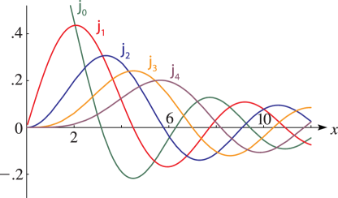
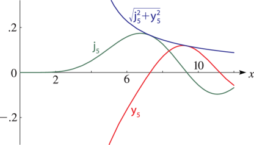
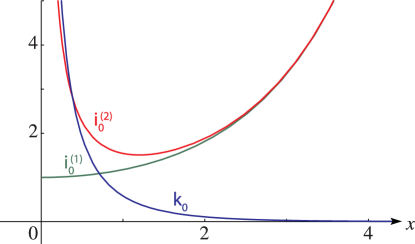
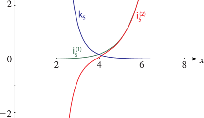

# §10.48 Graphs

:::{note}
**Keywords:**

[graphs](http://dlmf.nist.gov/search/search?q=graphs) , [spherical Bessel functions](http://dlmf.nist.gov/search/search?q=spherical%20Bessel%20functions)

**Notes:**

These graphs were produced at NIST.

**See also:**

Annotations for Ch.10
:::

:::{note}
**Symbols:**

$\mathsf{j}_{\NVar{n}}\left(\NVar{z}\right)$: spherical Bessel function of the first kind , $n$: integer and $x$: real variable

**See also:**

Annotations for §10.48 and Ch.10
:::

:::{note}
**Symbols:**

$\mathsf{j}_{\NVar{n}}\left(\NVar{z}\right)$: spherical Bessel function of the first kind , $\mathsf{y}_{\NVar{n}}\left(\NVar{z}\right)$: spherical Bessel function of the second kind and $x$: real variable

**See also:**

Annotations for §10.48 and Ch.10
:::

:::{note}
**Symbols:**

${\mathsf{i}^{(1)}_{\NVar{n}}}\left(\NVar{z}\right)$: modified spherical Bessel function , ${\mathsf{i}^{(2)}_{\NVar{n}}}\left(\NVar{z}\right)$: modified spherical Bessel function , $\mathsf{k}_{\NVar{n}}\left(\NVar{z}\right)$: modified spherical Bessel function and $x$: real variable

**Referenced by:**

Erratum (V1.0.1) for Figure 10.48.5

**Errata (effective with 1.0.1):**

The ordinate labels 2 and 4 originally were misplaced at ordinates 3 and 5. *Reported 2010-11-08 by Wolfgang Ehrhardt*

**See also:**

Annotations for §10.48 and Ch.10
:::

:::{note}
**Symbols:**

${\mathsf{i}^{(1)}_{\NVar{n}}}\left(\NVar{z}\right)$: modified spherical Bessel function , ${\mathsf{i}^{(2)}_{\NVar{n}}}\left(\NVar{z}\right)$: modified spherical Bessel function , $\mathsf{k}_{\NVar{n}}\left(\NVar{z}\right)$: modified spherical Bessel function and $x$: real variable

**See also:**

Annotations for §10.48 and Ch.10
:::
