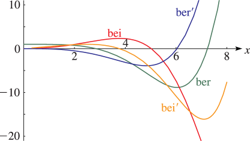
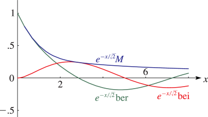

# §10.62 Graphs

:::{note}
**Keywords:**

[Kelvin functions](http://dlmf.nist.gov/search/search?q=Kelvin%20functions) , [graphs](http://dlmf.nist.gov/search/search?q=graphs)

**Notes:**

These graphs were produced at NIST.

**See also:**

Annotations for Ch.10
:::

For the modulus functions $M\left(x\right)$ and $N\left(x\right)$ see § 10.68(i) with $\nu=0$ .

:::{note}
**Symbols:**

$\operatorname{bei}_{\NVar{\nu}}\left(\NVar{x}\right)$: Kelvin function , $\operatorname{ber}_{\NVar{\nu}}\left(\NVar{x}\right)$: Kelvin function and $x$: real variable

**See also:**

Annotations for §10.62 and Ch.10
:::

:::{note}
**Symbols:**

$\operatorname{bei}_{\NVar{\nu}}\left(\NVar{x}\right)$: Kelvin function , $\operatorname{ber}_{\NVar{\nu}}\left(\NVar{x}\right)$: Kelvin function , $\mathrm{e}$: base of natural logarithm , $M_{\NVar{\nu}}\left(\NVar{x}\right)$: modulus of Bessel functions and $x$: real variable

**See also:**

Annotations for §10.62 and Ch.10
:::
