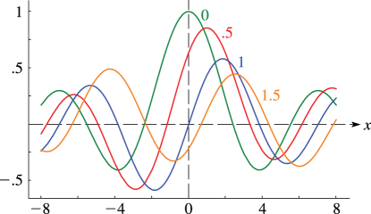
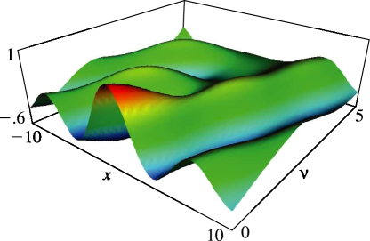

# §11.10 Anger–Weber Functions

:::{note}
**Keywords:**

[Anger–Weber functions](http://dlmf.nist.gov/search/search?q=Anger%E2%80%93Weber%20functions)

**See also:**

Annotations for Ch.11
:::

## §11.10(i) Definitions

:::{note}
**Keywords:**

[Anger–Weber functions](http://dlmf.nist.gov/search/search?q=Anger%E2%80%93Weber%20functions) , [analytic properties](http://dlmf.nist.gov/search/search?q=analytic%20properties) , [definitions](http://dlmf.nist.gov/search/search?q=definitions) , [integral representations](http://dlmf.nist.gov/search/search?q=integral%20representations)

**Notes:**

See Watson ([1944](./bib/W.html#bib2380 "A Treatise on the Theory of Bessel Functions"), pp. 308 and 312). The notation $\mathbf{A}_{\nu}\left(z\right)$ , without the factor $1/\pi$ , was introduced in Olver ([1997b](./bib/O.html#bib1809 "Asymptotics and Special Functions"), p. 84).

**See also:**

Annotations for §11.10 and Ch.11
:::

The Anger function $\mathbf{J}_{\nu}\left(z\right)$ and Weber function $\mathbf{E}_{\nu}\left(z\right)$ are defined by

$$
\mathbf{J}_{\nu}\left(z\right)=\frac{1}{\pi}\int_{0}^{\pi}\cos\left(\nu\theta-z\sin\theta\right)\,\mathrm{d}\theta, \tag{11.10.1}
$$

$$
\mathbf{E}_{\nu}\left(z\right)=\frac{1}{\pi}\int_{0}^{\pi}\sin\left(\nu\theta-z\sin\theta\right)\,\mathrm{d}\theta. \tag{11.10.2}
$$

Each is an entire function of $z$ and $\nu$ . Also,

$$
\frac{1}{\pi}\int_{0}^{2\pi}\cos\left(\nu\theta-z\sin\theta\right)\,\mathrm{d}\theta=(1+\cos\left(2\pi\nu\right))\,\mathbf{J}_{\nu}\left(z\right)+\sin\left(2\pi\nu\right)\mathbf{E}_{\nu}\left(z\right). \tag{11.10.3}
$$

The associated Anger–Weber function $\mathbf{A}_{\nu}\left(z\right)$ is defined by

$$
\mathbf{A}_{\nu}\left(z\right)=\frac{1}{\pi}\int_{0}^{\infty}e^{-\nu t-z\sinh t}\,\mathrm{d}t, \tag{11.10.4}
$$

( 11.10.4 ) also applies when $\Re z=0$ and $\Re\nu>0$ .

## §11.10(ii) Differential Equations

:::{note}
**Keywords:**

[Anger–Weber functions](http://dlmf.nist.gov/search/search?q=Anger%E2%80%93Weber%20functions) , [Bessel’s equation](http://dlmf.nist.gov/search/search?q=Bessel%20equation) , [differential equation](http://dlmf.nist.gov/search/search?q=differential%20equation) , [inhomogeneous forms](http://dlmf.nist.gov/search/search?q=inhomogeneous%20forms)

**Notes:**

See Watson ([1944](./bib/W.html#bib2380 "A Treatise on the Theory of Bessel Functions"), p. 312).

**See also:**

Annotations for §11.10 and Ch.11
:::

The Anger and Weber functions satisfy the inhomogeneous Bessel differential equation

$$
\frac{{\mathrm{d}}^{2}w}{{\mathrm{d}z}^{2}}+\frac{1}{z}\frac{\mathrm{d}w}{\mathrm{d}z}+\left(1-\frac{\nu^{2}}{z^{2}}\right)w=f(\nu,z), \tag{11.10.5}
$$

where

$$
f(\nu,z)=\frac{(z-\nu)}{\pi z^{2}}\sin\left(\pi\nu\right), \tag{11.10.6}
$$

or

$$
f(\nu,z)=-\frac{1}{\pi z^{2}}(z+\nu+(z-\nu)\cos\left(\pi\nu\right)), \tag{11.10.7}
$$

## §11.10(iii) Maclaurin Series

:::{note}
**Keywords:**

[Anger–Weber functions](http://dlmf.nist.gov/search/search?q=Anger%E2%80%93Weber%20functions) , [Maclaurin series](http://dlmf.nist.gov/search/search?q=Maclaurin%20series) , [power series](http://dlmf.nist.gov/search/search?q=power%20series) , [series expansions](http://dlmf.nist.gov/search/search?q=series%20expansions)

**Notes:**

See Watson ([1944](./bib/W.html#bib2380 "A Treatise on the Theory of Bessel Functions"), §10.1).

**Referenced by:**

§3.6(vi)

**See also:**

Annotations for §11.10 and Ch.11
:::

$$
\mathbf{J}_{\nu}\left(z\right)=\cos\left(\tfrac{1}{2}\pi\nu\right)\,S_{1}(\nu,z)+\sin\left(\tfrac{1}{2}\pi\nu\right)\,S_{2}(\nu,z), \tag{11.10.8}
$$

$$
\mathbf{E}_{\nu}\left(z\right)=\sin\left(\tfrac{1}{2}\pi\nu\right)\,S_{1}(\nu,z)-\cos\left(\tfrac{1}{2}\pi\nu\right)\,S_{2}(\nu,z), \tag{11.10.9}
$$

where

$$
S_{1}(\nu,z)=\sum_{k=0}^{\infty}\frac{(-1)^{k}(\tfrac{1}{2}z)^{2k}}{\Gamma\left(k\!+\!\tfrac{1}{2}\nu+1\right)\Gamma\left(k\!-\!\tfrac{1}{2}\nu\!+\!1\right)}, \tag{11.10.10}
$$

$$
S_{2}(\nu,z)=\sum_{k=0}^{\infty}\frac{(-1)^{k}(\tfrac{1}{2}z)^{2k+1}}{\Gamma\left(k\!+\!\tfrac{1}{2}\nu\!+\!\tfrac{3}{2}\right)\Gamma\left(k\!-\!\tfrac{1}{2}\nu\!+\!\tfrac{3}{2}\right)}. \tag{11.10.11}
$$

These expansions converge absolutely for all finite values of $z$ .

## §11.10(iv) Graphics

:::{note}
**Notes:**

These graphics were produced at NIST.

**See also:**

Annotations for §11.10 and Ch.11
:::

:::{note}
**Symbols:**

$\mathbf{J}_{\NVar{\nu}}\left(\NVar{z}\right)$: Anger function , $x$: real variable and $\nu$: real or complex order

**Keywords:**

[Anger–Weber functions](http://dlmf.nist.gov/search/search?q=Anger%E2%80%93Weber%20functions) , [graphics](http://dlmf.nist.gov/search/search?q=graphics)

**See also:**

Annotations for §11.10(iv) , §11.10 and Ch.11
:::

:::{note}
**Symbols:**

$\mathbf{J}_{\NVar{\nu}}\left(\NVar{z}\right)$: Anger function , $x$: real variable and $\nu$: real or complex order

**Keywords:**

[Anger–Weber functions](http://dlmf.nist.gov/search/search?q=Anger%E2%80%93Weber%20functions) , [graphics](http://dlmf.nist.gov/search/search?q=graphics)

**See also:**

Annotations for §11.10(iv) , §11.10 and Ch.11
:::

## §11.10(v) Interrelations

:::{note}
**Keywords:**

[Anger–Weber functions](http://dlmf.nist.gov/search/search?q=Anger%E2%80%93Weber%20functions) , [interrelations](http://dlmf.nist.gov/search/search?q=interrelations)

**Notes:**

For ( 11.10.12 ) use ( 11.10.1 ), ( 11.10.2 ). For ( 11.10.13 )–( 11.10.15 ) see Watson ([1944](./bib/W.html#bib2380 "A Treatise on the Theory of Bessel Functions"), pp. 311–312). For ( 11.10.16 ) combine ( 11.10.14 ), ( 11.10.15 ), and ( 10.2.3 ).

**See also:**

Annotations for §11.10 and Ch.11
:::

$$
\displaystyle\mathbf{J}_{\nu}\left(-z\right) \displaystyle=\mathbf{J}_{-\nu}\left(z\right), \tag{11.10.12}
$$

$$
\displaystyle\mathbf{E}_{\nu}\left(-z\right) \displaystyle=-\mathbf{E}_{-\nu}\left(z\right).
$$

:::{note}
**Symbols:**

$\mathbf{J}_{\NVar{\nu}}\left(\NVar{z}\right)$: Anger function , $\mathbf{E}_{\NVar{\nu}}\left(\NVar{z}\right)$: Weber function , $z$: complex variable and $\nu$: real or complex order

**Referenced by:**

§11.10(v) , §11.10(vi)

**See also:**

Annotations for §11.10(v) , §11.10 and Ch.11
:::

$$
\displaystyle\sin\left(\pi\nu\right)\,\mathbf{J}_{\nu}\left(z\right) \displaystyle=\cos\left(\pi\nu\right)\,\mathbf{E}_{\nu}\left(z\right)-\mathbf{E}_{-\nu}\left(z\right), \tag{11.10.13}
$$

:::{note}
**Symbols:**

$\mathbf{J}_{\NVar{\nu}}\left(\NVar{z}\right)$: Anger function , $\mathbf{E}_{\NVar{\nu}}\left(\NVar{z}\right)$: Weber function , $\pi$: the ratio of the circumference of a circle to its diameter , $\cos\NVar{z}$: cosine function , $\sin\NVar{z}$: sine function , $z$: complex variable and $\nu$: real or complex order

**A&S Ref:**

12.3.4

**Referenced by:**

§11.10(v)

**See also:**

Annotations for §11.10(v) , §11.10 and Ch.11
:::

$$
\displaystyle\sin\left(\pi\nu\right)\,\mathbf{E}_{\nu}\left(z\right) \displaystyle=\mathbf{J}_{-\nu}\left(z\right)-\cos\left(\pi\nu\right)\,\mathbf{J}_{\nu}\left(z\right). \tag{11.10.14}
$$

:::{note}
**Symbols:**

$\mathbf{J}_{\NVar{\nu}}\left(\NVar{z}\right)$: Anger function , $\mathbf{E}_{\NVar{\nu}}\left(\NVar{z}\right)$: Weber function , $\pi$: the ratio of the circumference of a circle to its diameter , $\cos\NVar{z}$: cosine function , $\sin\NVar{z}$: sine function , $z$: complex variable and $\nu$: real or complex order

**A&S Ref:**

12.3.5

**Referenced by:**

§11.10(v)

**See also:**

Annotations for §11.10(v) , §11.10 and Ch.11
:::

$$
\mathbf{J}_{\nu}\left(z\right)=J_{\nu}\left(z\right)+\sin\left(\pi\nu\right)\,\mathbf{A}_{\nu}\left(z\right), \tag{11.10.15}
$$

$$
\mathbf{E}_{\nu}\left(z\right)=-Y_{\nu}\left(z\right)-\cos\left(\pi\nu\right)\,\mathbf{A}_{\nu}\left(z\right)-\mathbf{A}_{-\nu}\left(z\right). \tag{11.10.16}
$$

## §11.10(vi) Relations to Other Functions

:::{note}
**Keywords:**

[Anger–Weber functions](http://dlmf.nist.gov/search/search?q=Anger%E2%80%93Weber%20functions) , [Fresnel integrals](http://dlmf.nist.gov/search/search?q=Fresnel%20integrals) , [Lommel functions](http://dlmf.nist.gov/search/search?q=Lommel%20functions) , [Struve functions](http://dlmf.nist.gov/search/search?q=Struve%20functions) , [Struve functions and modified Struve functions](http://dlmf.nist.gov/search/search?q=Struve%20functions%20and%20modified%20Struve%20functions) , [relation to Anger–Weber functions](http://dlmf.nist.gov/search/search?q=relation%20to%20Anger%E2%80%93Weber%20functions) , [relations to Anger–Weber functions](http://dlmf.nist.gov/search/search?q=relations%20to%20Anger%E2%80%93Weber%20functions) , [relations to other functions](http://dlmf.nist.gov/search/search?q=relations%20to%20other%20functions)

**Notes:**

For ( 11.10.17 ), ( 11.10.18 ) see Watson ([1944](./bib/W.html#bib2380 "A Treatise on the Theory of Bessel Functions"), pp. 308–310). For ( 11.10.19 ), ( 11.10.20 ), use ( 11.10.8 )–( 11.10.11 ) with $\nu=\pm\frac{1}{2}$ and identify the resulting sums with those associated with the right-hand sides via ( 7.6.5 ), ( 7.6.7 ). For ( 11.10.22 ), ( 11.10.23 ) see Watson ([1944](./bib/W.html#bib2380 "A Treatise on the Theory of Bessel Functions"), pp. 336–337) or Erdélyi et al. ([1953b](./bib/E.html#bib752 "Higher Transcendental Functions. Vol. II"), p. 40). The upper summation limit in ( 11.10.23 ) is given incorrectly in Watson ([1944](./bib/W.html#bib2380 "A Treatise on the Theory of Bessel Functions"), p. 337), and this error is reproduced in Erdélyi et al. ([1953b](./bib/E.html#bib752 "Higher Transcendental Functions. Vol. II")), as well as in later printings of Abramowitz and Stegun ([1964](./bib/index.html#bib24 "Handbook of Mathematical Functions with Formulas, Graphs, and Mathematical Tables"), Chapter 12)—earlier printings of the last reference contained a different error. ( 11.10.23 ) can be derived by combining ( 11.2.1 ) with ( 11.10.12 ), ( 11.10.22 ).

**See also:**

Annotations for §11.10 and Ch.11
:::

$$
\displaystyle\mathbf{J}_{\nu}\left(z\right) \displaystyle=\frac{\sin\left(\pi\nu\right)}{\pi}(s_{{0},{\nu}}\left(z\right)-\nu s_{{-1},{\nu}}\left(z\right)), \tag{11.10.17}
$$

:::{note}
**Symbols:**

$\mathbf{J}_{\NVar{\nu}}\left(\NVar{z}\right)$: Anger function , $s_{{\NVar{\mu}},{\NVar{\nu}}}\left(\NVar{z}\right)$: Lommel function , $\pi$: the ratio of the circumference of a circle to its diameter , $\sin\NVar{z}$: sine function , $z$: complex variable and $\nu$: real or complex order

**Referenced by:**

§11.10(vi)

**See also:**

Annotations for §11.10(vi) , §11.10 and Ch.11
:::

$$
\displaystyle\mathbf{E}_{\nu}\left(z\right) \displaystyle=-\frac{1}{\pi}(1+\cos\left(\pi\nu\right))s_{{0},{\nu}}\left(z\right)\\
-\frac{\nu}{\pi}(1-\cos\left(\pi\nu\right))s_{{-1},{\nu}}\left(z\right). \tag{11.10.18}
$$

:::{note}
**Symbols:**

$s_{{\NVar{\mu}},{\NVar{\nu}}}\left(\NVar{z}\right)$: Lommel function , $\mathbf{E}_{\NVar{\nu}}\left(\NVar{z}\right)$: Weber function , $\pi$: the ratio of the circumference of a circle to its diameter , $\cos\NVar{z}$: cosine function , $z$: complex variable and $\nu$: real or complex order

**Referenced by:**

§11.10(vi)

**See also:**

Annotations for §11.10(vi) , §11.10 and Ch.11
:::

$$
\displaystyle\mathbf{J}_{-\frac{1}{2}}\left(z\right) \displaystyle=\mathbf{E}_{\frac{1}{2}}\left(z\right)=(\tfrac{1}{2}\pi z)^{-\frac{1}{2}}(A_{+}(\chi)\cos z-A_{-}(\chi)\sin z), \tag{11.10.19}
$$

:::{note}
**Symbols:**

$\mathbf{J}_{\NVar{\nu}}\left(\NVar{z}\right)$: Anger function , $\mathbf{E}_{\NVar{\nu}}\left(\NVar{z}\right)$: Weber function , $\pi$: the ratio of the circumference of a circle to its diameter , $\cos\NVar{z}$: cosine function , $\sin\NVar{z}$: sine function , $z$: complex variable , $A$: expansion function and $\chi$

**Referenced by:**

§11.10(vi)

**See also:**

Annotations for §11.10(vi) , §11.10 and Ch.11
:::

$$
\displaystyle\mathbf{J}_{\frac{1}{2}}\left(z\right) \displaystyle=-\mathbf{E}_{-\frac{1}{2}}\left(z\right)=(\tfrac{1}{2}\pi z)^{-\frac{1}{2}}(A_{+}(\chi)\sin z+A_{-}(\chi)\cos z), \tag{11.10.20}
$$

:::{note}
**Symbols:**

$\mathbf{J}_{\NVar{\nu}}\left(\NVar{z}\right)$: Anger function , $\mathbf{E}_{\NVar{\nu}}\left(\NVar{z}\right)$: Weber function , $\pi$: the ratio of the circumference of a circle to its diameter , $\cos\NVar{z}$: cosine function , $\sin\NVar{z}$: sine function , $z$: complex variable , $A$: expansion function and $\chi$

**Referenced by:**

§11.10(vi)

**See also:**

Annotations for §11.10(vi) , §11.10 and Ch.11
:::

where

$$
\displaystyle A_{\pm}(\chi) \displaystyle=C\left(\chi\right)\pm S\left(\chi\right), \tag{11.10.21}
$$

$$
\displaystyle\chi \displaystyle=(2z/\pi)^{\frac{1}{2}}.
$$

:::{note}
**Symbols:**

$C\left(\NVar{z}\right)$: Fresnel integral , $S\left(\NVar{z}\right)$: Fresnel integral , $\pi$: the ratio of the circumference of a circle to its diameter , $z$: complex variable , $A$: expansion function and $\chi$

**See also:**

Annotations for §11.10(vi) , §11.10 and Ch.11
:::

For the Fresnel integrals $C$ and $S$ see § 7.2(iii) .

For $n=1,2,3,\dots$ ,

$$
\mathbf{E}_{n}\left(z\right)=-\mathbf{H}_{n}\left(z\right)+\frac{1}{\pi}\sum_{k=0}^{m_{1}}\frac{\Gamma\left(k+\tfrac{1}{2}\right)}{\Gamma\left(n\!+\!\tfrac{1}{2}\!-\!k\right)}(\tfrac{1}{2}z)^{n-2k-1}, \tag{11.10.22}
$$

and

$$
\mathbf{E}_{-n}\left(z\right)=-\mathbf{H}_{-n}\left(z\right)+\frac{(-1)^{n+1}}{\pi}\sum_{k=0}^{m_{2}}\frac{\Gamma\left(n\!-\!k\!-\!\tfrac{1}{2}\right)}{\Gamma\left(k+\tfrac{3}{2}\right)}(\tfrac{1}{2}z)^{-n+2k+1}, \tag{11.10.23}
$$

where

$$
\displaystyle m_{1} \displaystyle=\left\lfloor\tfrac{1}{2}n-\tfrac{1}{2}\right\rfloor, \tag{11.10.24}
$$

$$
\displaystyle m_{2} \displaystyle=\left\lceil\tfrac{1}{2}n-\tfrac{3}{2}\right\rceil.
$$

:::{note}
**Symbols:**

$\left\lceil\NVar{x}\right\rceil$: ceiling of $x$ , $\left\lfloor\NVar{x}\right\rfloor$: floor of $x$ and $n$: integer order

**See also:**

Annotations for §11.10(vi) , §11.10 and Ch.11
:::

## §11.10(vii) Special Values

:::{note}
**Keywords:**

[Anger–Weber functions](http://dlmf.nist.gov/search/search?q=Anger%E2%80%93Weber%20functions) , [special values](http://dlmf.nist.gov/search/search?q=special%20values)

**Notes:**

For ( 11.10.25 ) use ( 11.10.1 ) and ( 11.10.2 ). For ( 11.10.26 ) use ( 11.10.22 ). ( 11.10.27 ) and ( 11.10.28 ) can be obtained by differentiation of ( 11.10.1 ) and ( 11.10.2 ), followed by straightforward manipulation of the integrals and comparison with ( 11.5.1 ) and ( 11.10.1 ). For ( 11.10.29 ) use ( 11.10.1 ) and ( 10.9.2 ).

**See also:**

Annotations for §11.10 and Ch.11
:::

$$
\displaystyle\mathbf{J}_{\nu}\left(0\right) \displaystyle=\frac{\sin\left(\pi\nu\right)}{\pi\nu}, \displaystyle\mathbf{E}_{\nu}\left(0\right) \displaystyle=\frac{1-\cos\left(\pi\nu\right)}{\pi\nu}. \tag{11.10.25}
$$

:::{note}
**Symbols:**

$\mathbf{J}_{\NVar{\nu}}\left(\NVar{z}\right)$: Anger function , $\mathbf{E}_{\NVar{\nu}}\left(\NVar{z}\right)$: Weber function , $\pi$: the ratio of the circumference of a circle to its diameter , $\cos\NVar{z}$: cosine function , $\sin\NVar{z}$: sine function and $\nu$: real or complex order

**Referenced by:**

§11.10(vii)

**See also:**

Annotations for §11.10(vii) , §11.10 and Ch.11
:::

$$
\displaystyle\mathbf{E}_{0}\left(z\right) \displaystyle=-\mathbf{H}_{0}\left(z\right), \displaystyle\mathbf{E}_{1}\left(z\right) \displaystyle=\frac{2}{\pi}-\mathbf{H}_{1}\left(z\right). \tag{11.10.26}
$$

:::{note}
**Symbols:**

$\mathbf{H}_{\NVar{\nu}}\left(\NVar{z}\right)$: Struve function , $\mathbf{E}_{\NVar{\nu}}\left(\NVar{z}\right)$: Weber function , $\pi$: the ratio of the circumference of a circle to its diameter and $z$: complex variable

**Referenced by:**

§11.10(vii)

**See also:**

Annotations for §11.10(vii) , §11.10 and Ch.11
:::

$$
\displaystyle\left.\frac{\partial}{\partial\nu}\mathbf{J}_{\nu}\left(z\right)\right|_{\nu=0} \displaystyle=\tfrac{1}{2}\pi\mathbf{H}_{0}\left(z\right), \tag{11.10.27}
$$

:::{note}
**Symbols:**

$\mathbf{J}_{\NVar{\nu}}\left(\NVar{z}\right)$: Anger function , $\mathbf{H}_{\NVar{\nu}}\left(\NVar{z}\right)$: Struve function , $\pi$: the ratio of the circumference of a circle to its diameter , $\frac{\partial\NVar{f}}{\partial\NVar{x}}$: partial derivative of $f$ with respect to $x$ , $\,\partial\NVar{x}$: partial differential of $x$ , $z$: complex variable and $\nu$: real or complex order

**Referenced by:**

§11.10(vii)

**See also:**

Annotations for §11.10(vii) , §11.10 and Ch.11
:::

$$
\displaystyle\left.\frac{\partial}{\partial\nu}\mathbf{E}_{\nu}\left(z\right)\right|_{\nu=0} \displaystyle=\tfrac{1}{2}\pi J_{0}\left(z\right). \tag{11.10.28}
$$

:::{note}
**Symbols:**

$J_{\NVar{\nu}}\left(\NVar{z}\right)$: Bessel function of the first kind , $\mathbf{E}_{\NVar{\nu}}\left(\NVar{z}\right)$: Weber function , $\pi$: the ratio of the circumference of a circle to its diameter , $\frac{\partial\NVar{f}}{\partial\NVar{x}}$: partial derivative of $f$ with respect to $x$ , $\,\partial\NVar{x}$: partial differential of $x$ , $z$: complex variable and $\nu$: real or complex order

**Referenced by:**

§11.10(vii)

**See also:**

Annotations for §11.10(vii) , §11.10 and Ch.11
:::

$$
\mathbf{J}_{n}\left(z\right)=J_{n}\left(z\right), \tag{11.10.29}
$$

## §11.10(viii) Expansions in Series of Products of Bessel Functions

:::{note}
**Keywords:**

[Anger–Weber functions](http://dlmf.nist.gov/search/search?q=Anger%E2%80%93Weber%20functions) , [products of Bessel functions](http://dlmf.nist.gov/search/search?q=products%20of%20Bessel%20functions) , [series expansions](http://dlmf.nist.gov/search/search?q=series%20expansions)

**Notes:**

See Luke ([1969b](./bib/L.html#bib1496 "The Special Functions and their Approximations. Vol. 2"), p. 55).

**See also:**

Annotations for §11.10 and Ch.11
:::

$$
{\mathbf{J}_{\nu}\left(z\right)=}\\
{2\sin\left(\tfrac{1}{2}\nu\pi\right)\sum_{k=0}^{\infty}(-1)^{k}J_{k-\frac{1}{2}\nu+\frac{1}{2}}\left(\tfrac{1}{2}z\right)J_{k+\frac{1}{2}\nu+\frac{1}{2}}\left(\tfrac{1}{2}z\right)}+{2\cos\left(\tfrac{1}{2}\nu\pi\right)\sideset{}{{}^{\prime}}{\sum}_{k=0}^{\infty}(-1)^{k}J_{k-\frac{1}{2}\nu}\left(\tfrac{1}{2}z\right)J_{k+\frac{1}{2}\nu}\left(\tfrac{1}{2}z\right)}, \tag{11.10.30}
$$

$$
{\mathbf{E}_{\nu}\left(z\right)=}\\
{-2\cos\left(\tfrac{1}{2}\nu\pi\right)\sum_{k=0}^{\infty}(-1)^{k}J_{k-\frac{1}{2}\nu+\frac{1}{2}}\left(\tfrac{1}{2}z\right)J_{k+\frac{1}{2}\nu+\frac{1}{2}}\left(\tfrac{1}{2}z\right)}+{2\sin\left(\tfrac{1}{2}\nu\pi\right)\sideset{}{{}^{\prime}}{\sum}_{k=0}^{\infty}(-1)^{k}J_{k-\frac{1}{2}\nu}\left(\tfrac{1}{2}z\right)J_{k+\frac{1}{2}\nu}\left(\tfrac{1}{2}z\right)}, \tag{11.10.31}
$$

where the prime on the second summation symbols means that the first term is to be halved.

## §11.10(ix) Recurrence Relations and Derivatives

:::{note}
**Keywords:**

[Anger–Weber functions](http://dlmf.nist.gov/search/search?q=Anger%E2%80%93Weber%20functions) , [derivatives](http://dlmf.nist.gov/search/search?q=derivatives) , [recurrence relations](http://dlmf.nist.gov/search/search?q=recurrence%20relations)

**Notes:**

See Watson ([1944](./bib/W.html#bib2380 "A Treatise on the Theory of Bessel Functions"), pp. 311–312).

**See also:**

Annotations for §11.10 and Ch.11
:::

$$
\mathbf{J}_{\nu-1}\left(z\right)+\mathbf{J}_{\nu+1}\left(z\right)=\frac{2\nu}{z}\mathbf{J}_{\nu}\left(z\right)-\frac{2}{\pi z}\sin\left(\pi\nu\right), \tag{11.10.32}
$$

$$
\mathbf{E}_{\nu-1}\left(z\right)+\mathbf{E}_{\nu+1}\left(z\right)=\frac{2\nu}{z}\mathbf{E}_{\nu}\left(z\right)-\frac{2}{\pi z}(1-\cos\left(\pi\nu\right)). \tag{11.10.33}
$$

$$
\displaystyle 2\mathbf{J}_{\nu}'\left(z\right) \displaystyle=\mathbf{J}_{\nu-1}\left(z\right)-\mathbf{J}_{\nu+1}\left(z\right), \tag{11.10.34}
$$

:::{note}
**Symbols:**

$\mathbf{J}_{\NVar{\nu}}\left(\NVar{z}\right)$: Anger function , $z$: complex variable and $\nu$: real or complex order

**See also:**

Annotations for §11.10(ix) , §11.10 and Ch.11
:::

$$
\displaystyle 2\mathbf{E}_{\nu}'\left(z\right) \displaystyle=\mathbf{E}_{\nu-1}\left(z\right)-\mathbf{E}_{\nu+1}\left(z\right), \tag{11.10.35}
$$

:::{note}
**Symbols:**

$\mathbf{E}_{\NVar{\nu}}\left(\NVar{z}\right)$: Weber function , $z$: complex variable and $\nu$: real or complex order

**See also:**

Annotations for §11.10(ix) , §11.10 and Ch.11
:::

$$
z\mathbf{J}_{\nu}'\left(z\right)\pm\nu\mathbf{J}_{\nu}\left(z\right)=\pm z\mathbf{J}_{\nu\mp 1}\left(z\right)\pm\frac{\sin\left(\pi\nu\right)}{\pi}, \tag{11.10.36}
$$

$$
z\mathbf{E}_{\nu}'\left(z\right)\pm\nu\mathbf{E}_{\nu}\left(z\right)=\pm z\mathbf{E}_{\nu\mp 1}\left(z\right)\pm\frac{(1-\cos\left(\pi\nu\right))}{\pi}. \tag{11.10.37}
$$

## §11.10(x) Integrals and Sums

:::{note}
**Keywords:**

[Anger–Weber functions](http://dlmf.nist.gov/search/search?q=Anger%E2%80%93Weber%20functions) , [integrals](http://dlmf.nist.gov/search/search?q=integrals) , [sums](http://dlmf.nist.gov/search/search?q=sums)

**See also:**

Annotations for §11.10 and Ch.11
:::

For collections of integral representations and integrals see Erdélyi et al. ([1954a](./bib/E.html#bib753 "Tables of Integral Transforms. Vol. I"), §§4.19 and 5.17), Marichev ([1983](./bib/M.html#bib1546 "Handbook of Integral Transforms of Higher Transcendental Functions: Theory and Algorithmic Tables"), pp. 194–195 and 214–215), Oberhettinger ([1972](./bib/O.html#bib1742 "Tables of Bessel Transforms"), p. 128), Oberhettinger ([1974](./bib/O.html#bib1744 "Tables of Mellin Transforms"), §§1.12 and 2.7), Oberhettinger ([1990](./bib/O.html#bib1745 "Tables of Fourier Transforms and Fourier Transforms of Distributions"), pp. 105 and 189–190), Prudnikov et al. ([1990](./bib/P.html#bib1905 "Integrals and Series: More Special Functions, Vol. 3"), §§1.5 and 2.8), Prudnikov et al. ([1992a](./bib/P.html#bib1906 "Integrals and Series: Direct Laplace Transforms, Vol. 4"), §3.18), Prudnikov et al. ([1992b](./bib/P.html#bib1907 "Integrals and Series: Inverse Laplace Transforms, Vol. 5"), §3.18), and Zanovello ([1977](./bib/Z.html#bib2481 "Integrali di funzioni di Anger, Weber ed Airy-Hardy")).

For sums see Hansen ([1975](./bib/H.html#bib1035 "A Table of Series and Products"), pp. 456–457) and Prudnikov et al. ([1990](./bib/P.html#bib1905 "Integrals and Series: More Special Functions, Vol. 3"), §§6.4.2–6.4.3).
