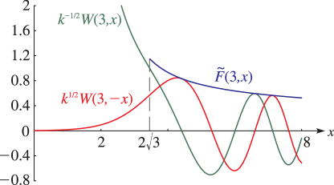
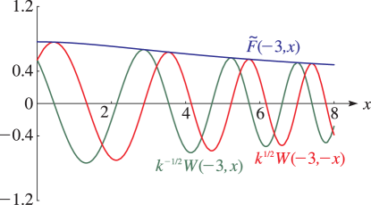

# §12.14 The Function W⁡(a,x)

:::{note}
**Keywords:**

[definitions](http://dlmf.nist.gov/search/search?q=definitions) , [parabolic cylinder functions](http://dlmf.nist.gov/search/search?q=parabolic%20cylinder%20functions)

**Referenced by:**

§12.2(i)

**See also:**

Annotations for Ch.12
:::

## §12.14(i) Introduction

:::{note}
**Defines:**

$W\left(\NVar{a},\NVar{x}\right)$ : parabolic cylinder function

**Keywords:**

[differential equations](http://dlmf.nist.gov/search/search?q=differential%20equations) , [numerically satisfactory solutions](http://dlmf.nist.gov/search/search?q=numerically%20satisfactory%20solutions) , [parabolic cylinder functions](http://dlmf.nist.gov/search/search?q=parabolic%20cylinder%20functions)

**Notes:**

See Miller ([1955](./bib/M.html#bib1622 "Tables of Weber Parabolic Cylinder Functions"), pp. 17–18) and Miller ([1952](./bib/M.html#bib1621 "On the choice of standard solutions to Weber’s equation")).

**Referenced by:**

§10.16

**See also:**

Annotations for §12.14 and Ch.12
:::

In this section solutions of equation ( 12.2.3 ) are considered. This equation is important when $a$ and $z$ $(=x)$ are real, and we shall assume this to be the case. In other cases the general theory of ( 12.2.2 ) is available. $W\left(a,x\right)$ and $W\left(a,-x\right)$ form a numerically satisfactory pair of solutions when $-\infty<x<\infty$ .

## §12.14(ii) Values at z=0 and Wronskian

:::{note}
**Keywords:**

[Wronskians](http://dlmf.nist.gov/search/search?q=Wronskians) , [parabolic cylinder functions](http://dlmf.nist.gov/search/search?q=parabolic%20cylinder%20functions) , [values at $z=0$](http://dlmf.nist.gov/search/search?q=values%20at%20z%3D0)

**Notes:**

See Miller ([1955](./bib/M.html#bib1622 "Tables of Weber Parabolic Cylinder Functions"), p. 81).

**See also:**

Annotations for §12.14 and Ch.12
:::

$$
W\left(a,0\right)=2^{-\frac{3}{4}}\left|\frac{\Gamma\left(\tfrac{1}{4}+\tfrac{1}{2}ia\right)}{\Gamma\left(\tfrac{3}{4}+\tfrac{1}{2}ia\right)}\right|^{\frac{1}{2}}, \tag{12.14.1}
$$

$$
W'\left(a,0\right)=-2^{-\frac{1}{4}}\left|\frac{\Gamma\left(\tfrac{3}{4}+\tfrac{1}{2}ia\right)}{\Gamma\left(\tfrac{1}{4}+\tfrac{1}{2}ia\right)}\right|^{\frac{1}{2}}. \tag{12.14.2}
$$

$$
\mathscr{W}\left\{W\left(a,x\right),W\left(a,-x\right)\right\}=1. \tag{12.14.3}
$$

## §12.14(iii) Graphs

:::{note}
**Keywords:**

[graphics](http://dlmf.nist.gov/search/search?q=graphics) , [parabolic cylinder functions](http://dlmf.nist.gov/search/search?q=parabolic%20cylinder%20functions) , [real variables](http://dlmf.nist.gov/search/search?q=real%20variables)

**Notes:**

These graphs were produced at NIST.

**Referenced by:**

§12.14(x)

**See also:**

Annotations for §12.14 and Ch.12
:::

For the modulus functions $\widetilde{F}(a,x)$ and $\widetilde{G}(a,x)$ see § 12.14(x) .

:::{note}
**Symbols:**

$W\left(\NVar{a},\NVar{x}\right)$: parabolic cylinder function , $x$: real variable , $k$ and $\widetilde{F}(a,x)$: modulus

**See also:**

Annotations for §12.14(iii) , §12.14 and Ch.12
:::

:::{note}
**Symbols:**

$W\left(\NVar{a},\NVar{x}\right)$: parabolic cylinder function , $x$: real variable , $k$ and $\widetilde{F}(a,x)$: modulus

**See also:**

Annotations for §12.14(iii) , §12.14 and Ch.12
:::

## §12.14(iv) Connection Formula

:::{note}
**Keywords:**

[connection formulas](http://dlmf.nist.gov/search/search?q=connection%20formulas) , [parabolic cylinder functions](http://dlmf.nist.gov/search/search?q=parabolic%20cylinder%20functions)

**Notes:**

See Miller ([1955](./bib/M.html#bib1622 "Tables of Weber Parabolic Cylinder Functions"), p. 26).

**Addition (effective with 1.1.3):**

Equation ( 12.14.4_5 ) was added.

**See also:**

Annotations for §12.14 and Ch.12
:::

$$
W\left(a,x\right)=\sqrt{k/2}\,e^{\frac{1}{4}\pi a}\left(e^{i\rho}U\left(ia,xe^{-\pi i/4}\right)+e^{-i\rho}U\left(-ia,xe^{\pi i/4}\right)\right), \tag{12.14.4}
$$

$$
W\left(a,-x\right)=\frac{-i}{\sqrt{2k}}\,e^{\frac{1}{4}\pi a}\left(e^{i\rho}U\left(ia,xe^{-\pi i/4}\right)-e^{-i\rho}U\left(-ia,xe^{\pi i/4}\right)\right), \tag{12.14.4_5}
$$

where

$$
\displaystyle k \displaystyle=\sqrt{1+e^{2\pi a}}-e^{\pi a}, \tag{12.14.5}
$$

$$
\displaystyle 1/k \displaystyle=\sqrt{1+e^{2\pi a}}+e^{\pi a},
$$

:::{note}
**Defines:**

$k$ (locally)

**Symbols:**

$\pi$: the ratio of the circumference of a circle to its diameter , $\mathrm{e}$: base of natural logarithm and $a$: real or complex parameter

**A&S Ref:**

19.17.8

**Referenced by:**

§12.14(x)

**See also:**

Annotations for §12.14(iv) , §12.14 and Ch.12
:::

$$
\rho=\tfrac{1}{8}\pi+\tfrac{1}{2}\phi_{2}, \tag{12.14.6}
$$

$$
\phi_{2}=\operatorname{ph}\Gamma\left(\tfrac{1}{2}+ia\right), \tag{12.14.7}
$$

the branch of $\operatorname{ph}$ being zero when $a=0$ and defined by continuity elsewhere.

## §12.14(v) Power-Series Expansions

:::{note}
**Keywords:**

[parabolic cylinder functions](http://dlmf.nist.gov/search/search?q=parabolic%20cylinder%20functions) , [power-series expansions](http://dlmf.nist.gov/search/search?q=power-series%20expansions)

**Notes:**

See Miller ([1955](./bib/M.html#bib1622 "Tables of Weber Parabolic Cylinder Functions"), p. 80).

**Referenced by:**

§12.14(vii)

**See also:**

Annotations for §12.14 and Ch.12
:::

$$
W\left(a,x\right)=W\left(a,0\right)w_{1}(a,x)+W'\left(a,0\right)w_{2}(a,x). \tag{12.14.8}
$$

Here $w_{1}(a,x)$ and $w_{2}(a,x)$ are the even and odd solutions of ( 12.2.3 ):

$$
w_{1}(a,x)=\sum_{n=0}^{\infty}\alpha_{n}(a)\frac{x^{2n}}{(2n)!}, \tag{12.14.9}
$$

$$
w_{2}(a,x)=\sum_{n=0}^{\infty}\beta_{n}(a)\frac{x^{2n+1}}{(2n+1)!}, \tag{12.14.10}
$$

where $\alpha_{n}(a)$ and $\beta_{n}(a)$ satisfy the recursion relations

$$
\displaystyle\alpha_{n+2} \displaystyle=a\alpha_{n+1}-\tfrac{1}{2}(n+1)(2n+1)\alpha_{n}, \tag{12.14.11}
$$

$$
\displaystyle\beta_{n+2} \displaystyle=a\beta_{n+1}-\tfrac{1}{2}(n+1)(2n+3)\beta_{n},
$$

:::{note}
**Defines:**

$\alpha_{n}(a)$ : recursion (locally) and $\beta_{n}(a)$ : recursion (locally)

**Symbols:**

$n$: nonnegative integer and $a$: real or complex parameter

**See also:**

Annotations for §12.14(v) , §12.14 and Ch.12
:::

with

$$
\displaystyle\alpha_{0}(a) \displaystyle=1, \tag{12.14.12}
$$

$$
\displaystyle\alpha_{1}(a) \displaystyle=a,
$$

$$
\displaystyle\beta_{0}(a) \displaystyle=1,
$$

$$
\displaystyle\beta_{1}(a) \displaystyle=a.
$$

:::{note}
**Symbols:**

$a$: real or complex parameter , $\alpha_{n}(a)$: recursion and $\beta_{n}(a)$: recursion

**A&S Ref:**

19.16.3 (modification of)

**See also:**

Annotations for §12.14(v) , §12.14 and Ch.12
:::

Other expansions, involving $\cos\left(\tfrac{1}{4}x^{2}\right)$ and $\sin\left(\tfrac{1}{4}x^{2}\right)$ , can be obtained from ( 12.4.3 ) to ( 12.4.6 ) by replacing $a$ by $-ia$ and $z$ by $xe^{\ifrac{\pi i}{4}}$ ; see Miller ([1955](./bib/M.html#bib1622 "Tables of Weber Parabolic Cylinder Functions"), p. 80), and also ( 12.14.15 ) and ( 12.14.16 ).

## §12.14(vi) Integral Representations

:::{note}
**Keywords:**

[along the real line](http://dlmf.nist.gov/search/search?q=along%20the%20real%20line) , [integral representations](http://dlmf.nist.gov/search/search?q=integral%20representations) , [parabolic cylinder functions](http://dlmf.nist.gov/search/search?q=parabolic%20cylinder%20functions)

**See also:**

Annotations for §12.14 and Ch.12
:::

These follow from the contour integrals of § 12.5(ii) , which are valid for general complex values of the argument $z$ and parameter $a$ . See Miller ([1955](./bib/M.html#bib1622 "Tables of Weber Parabolic Cylinder Functions"), p. 26).

## §12.14(vii) Relations to Other Functions

:::{note}
**Notes:**

See Miller ([1955](./bib/M.html#bib1622 "Tables of Weber Parabolic Cylinder Functions"), pp. 43, 89).

**See also:**

Annotations for §12.14 and Ch.12
:::

### Bessel Functions

:::{note}
**Keywords:**

[Bessel functions](http://dlmf.nist.gov/search/search?q=Bessel%20functions) , [parabolic cylinder functions](http://dlmf.nist.gov/search/search?q=parabolic%20cylinder%20functions) , [relations to other functions](http://dlmf.nist.gov/search/search?q=relations%20to%20other%20functions)

**See also:**

Annotations for §12.14(vii) , §12.14 and Ch.12
:::

For the notation see § 10.2(ii) . When $x>0$

$$
W\left(0,\pm x\right)=2^{-\frac{5}{4}}\sqrt{\pi x}\left(J_{-\frac{1}{4}}\left(\tfrac{1}{4}x^{2}\right)\mp J_{\frac{1}{4}}\left(\tfrac{1}{4}x^{2}\right)\right), \tag{12.14.13}
$$

$$
\frac{\mathrm{d}}{\mathrm{d}x}W\left(0,\pm x\right)=-2^{-\frac{9}{4}}x\sqrt{\pi x}\left(J_{\frac{3}{4}}\left(\tfrac{1}{4}x^{2}\right)\pm J_{-\frac{3}{4}}\left(\tfrac{1}{4}x^{2}\right)\right). \tag{12.14.14}
$$

### Confluent Hypergeometric Functions

:::{note}
**Keywords:**

[confluent hypergeometric functions](http://dlmf.nist.gov/search/search?q=confluent%20hypergeometric%20functions) , [parabolic cylinder functions](http://dlmf.nist.gov/search/search?q=parabolic%20cylinder%20functions) , [relations to other functions](http://dlmf.nist.gov/search/search?q=relations%20to%20other%20functions)

**See also:**

Annotations for §12.14(vii) , §12.14 and Ch.12
:::

For the notation see § 13.2(i) .

The even and odd solutions of ( 12.2.3 ) (see § 12.14(v) ) are given by

$$
w_{1}(a,x)=e^{-\frac{1}{4}ix^{2}}M\left(\tfrac{1}{4}-\tfrac{1}{2}ia,\tfrac{1}{2},\tfrac{1}{2}ix^{2}\right)=e^{\frac{1}{4}ix^{2}}M\left(\tfrac{1}{4}+\tfrac{1}{2}ia,\tfrac{1}{2},-\tfrac{1}{2}ix^{2}\right), \tag{12.14.15}
$$

$$
w_{2}(a,x)=xe^{-\frac{1}{4}ix^{2}}M\left(\tfrac{3}{4}-\tfrac{1}{2}ia,\tfrac{3}{2},\tfrac{1}{2}ix^{2}\right)=xe^{\frac{1}{4}ix^{2}}M\left(\tfrac{3}{4}+\tfrac{1}{2}ia,\tfrac{3}{2},-\tfrac{1}{2}ix^{2}\right). \tag{12.14.16}
$$

## §12.14(viii) Asymptotic Expansions for LargeVariable

:::{note}
**Keywords:**

[asymptotic expansions for large variable](http://dlmf.nist.gov/search/search?q=asymptotic%20expansions%20for%20large%20variable) , [parabolic cylinder functions](http://dlmf.nist.gov/search/search?q=parabolic%20cylinder%20functions)

**Notes:**

See Miller ([1955](./bib/M.html#bib1622 "Tables of Weber Parabolic Cylinder Functions"), p. 82).

**See also:**

Annotations for §12.14 and Ch.12
:::

Write

$$
W\left(a,x\right)=\sqrt{\frac{2k}{x}}\left(s_{1}(a,x)\cos\omega-s_{2}(a,x)\sin\omega\right), \tag{12.14.17}
$$

$$
W\left(a,-x\right)=\sqrt{\frac{2}{kx}}\left(s_{1}(a,x)\sin\omega+s_{2}(a,x)\cos\omega\right), \tag{12.14.18}
$$

where

$$
\omega=\tfrac{1}{4}x^{2}-a\ln x+\tfrac{1}{4}\pi+\tfrac{1}{2}\phi_{2}, \tag{12.14.19}
$$

with $\phi_{2}$ given by ( 12.14.7 ). Then as $x\to\infty$

$$
s_{1}(a,x)\sim 1+\frac{d_{2}}{1!2x^{2}}-\frac{c_{4}}{2!2^{2}x^{4}}-\frac{d_{6}}{3!2^{3}x^{6}}+\frac{c_{8}}{4!2^{4}x^{8}}+\cdots, \tag{12.14.20}
$$

$$
s_{2}(a,x)\sim-\frac{c_{2}}{1!2x^{2}}-\frac{d_{4}}{2!2^{2}x^{4}}+\frac{c_{6}}{3!2^{3}x^{6}}+\frac{d_{8}}{4!2^{4}x^{8}}-\cdots. \tag{12.14.21}
$$

The coefficients $c_{2r}$ and $d_{2r}$ are obtainable by equating real and imaginary parts in

$$
c_{2r}+id_{2r}=\frac{\Gamma\left(2r+\tfrac{1}{2}+ia\right)}{\Gamma\left(\tfrac{1}{2}+ia\right)}. \tag{12.14.22}
$$

Equivalently,

$$
s_{1}(a,x)+is_{2}(a,x)\sim\sum_{r=0}^{\infty}(-i)^{r}\frac{{\left(\tfrac{1}{2}+ia\right)_{2r}}}{2^{r}r!x^{2r}}. \tag{12.14.23}
$$

## §12.14(ix) Uniform Asymptotic Expansions for LargeParameter

:::{note}
**Keywords:**

[parabolic cylinder functions](http://dlmf.nist.gov/search/search?q=parabolic%20cylinder%20functions) , [uniform asymptotic expansions for large parameter](http://dlmf.nist.gov/search/search?q=uniform%20asymptotic%20expansions%20for%20large%20parameter)

**Notes:**

See Olver ([1959](./bib/O.html#bib1782 "Uniform asymptotic expansions for Weber parabolic cylinder functions of large orders")).

**Referenced by:**

§12.14(x) , §2.8(iii)

**See also:**

Annotations for §12.14 and Ch.12
:::

The differential equation

$$
\frac{{\mathrm{d}}^{2}w}{{\mathrm{d}t}^{2}}=\mu^{4}(1-t^{2})w \tag{12.14.24}
$$

follows from ( 12.2.3 ), and has solutions $W\left(\tfrac{1}{2}\mu^{2},\pm\mu t\sqrt{2}\right)$ . For real $\mu$ and $t$ oscillations occur outside the $t$ -interval $[-1,1]$ . Airy-type uniform asymptotic expansions can be used to include either one of the turning points $\pm 1$ . In the following expansions, obtained from Olver ([1959](./bib/O.html#bib1782 "Uniform asymptotic expansions for Weber parabolic cylinder functions of large orders")), $\mu$ is large and positive, and $\delta$ is again an arbitrary small positive constant.

### Positive a, 2⁢a<x<∞

:::{note}
**Keywords:**

[in terms of elementary functions](http://dlmf.nist.gov/search/search?q=in%20terms%20of%20elementary%20functions) , [parabolic cylinder functions](http://dlmf.nist.gov/search/search?q=parabolic%20cylinder%20functions) , [uniform asymptotic expansions for large parameter](http://dlmf.nist.gov/search/search?q=uniform%20asymptotic%20expansions%20for%20large%20parameter)

**See also:**

Annotations for §12.14(ix) , §12.14 and Ch.12
:::

$$
W\left(\tfrac{1}{2}\mu^{2},\mu t\sqrt{2}\right)\sim\frac{2^{-\frac{1}{2}}e^{-\frac{1}{4}\pi\mu^{2}}l(\mu)}{(t^{2}-1)^{\frac{1}{4}}}\left(\cos\sigma\sum_{s=0}^{\infty}(-1)^{s}\frac{{\cal{A}}_{2s}(t)}{\mu^{4s}}-\sin\sigma\sum_{s=0}^{\infty}(-1)^{s}\frac{{\cal{A}}_{2s+1}(t)}{\mu^{4s+2}}\right), \tag{12.14.25}
$$

$$
W\left(\tfrac{1}{2}\mu^{2},-\mu t\sqrt{2}\right)\sim\frac{2^{\frac{1}{2}}e^{\frac{1}{4}\pi\mu^{2}}l(\mu)}{(t^{2}-1)^{\frac{1}{4}}}\left(\sin\sigma\sum_{s=0}^{\infty}(-1)^{s}\frac{{\cal{A}}_{2s}(t)}{\mu^{4s}}+\cos\sigma\sum_{s=0}^{\infty}(-1)^{s}\frac{{\cal{A}}_{2s+1}(t)}{\mu^{4s+2}}\right), \tag{12.14.26}
$$

uniformly for $t\in[1+\delta,\infty)$ . Here ${\cal{A}}_{s}(t)$ is as in § 12.10(ii) , $\sigma$ is defined by

$$
\sigma=\mu^{2}\xi+\tfrac{1}{4}\pi, \tag{12.14.27}
$$

with $\xi$ given by ( 12.10.7 ), and

$$
l(\mu)=\sqrt{2}e^{\frac{1}{8}\pi\mu^{2}}e^{i(\frac{1}{2}\phi_{2}-\frac{1}{8}\pi)}g(\mu e^{-\frac{1}{4}\pi i}), \tag{12.14.28}
$$

with $g(\mu)$ as in § 12.10(ii) . The function $l(\mu)$ has the asymptotic expansion

$$
l(\mu)\sim\frac{2^{\frac{1}{4}}}{\mu^{\frac{1}{2}}}\sum_{s=0}^{\infty}\frac{l_{s}}{\mu^{4s}}, \tag{12.14.29}
$$

with

$$
\displaystyle l_{0} \displaystyle=1, \tag{12.14.30}
$$

$$
\displaystyle l_{1} \displaystyle=-\tfrac{1}{1152},
$$

$$
\displaystyle l_{2} \displaystyle=-\tfrac{16123}{398\;13120}.
$$

:::{note}
**Defines:**

$l_{s}$ : coefficient (locally)

**Symbols:**

$s$: nonnegative integer

**See also:**

Annotations for §12.14(ix) , §12.14(ix) , §12.14 and Ch.12
:::

### Positive a, −2⁢a<x<2⁢a

:::{note}
**See also:**

Annotations for §12.14(ix) , §12.14 and Ch.12
:::

$$
W\left(\tfrac{1}{2}\mu^{2},\mu t\sqrt{2}\right)\sim\frac{l(\mu)e^{\mu^{2}\eta}}{2^{\frac{1}{2}}e^{\frac{1}{4}\pi\mu^{2}}(1-t^{2})^{\frac{1}{4}}}\*\sum_{s=0}^{\infty}(-1)^{s}\frac{\widetilde{\cal{A}}_{s}(t)}{\mu^{2s}}, \tag{12.14.31}
$$

uniformly for $t\in[-1+\delta,1-\delta]$ , with $\eta$ given by ( 12.10.23 ) and ${\widetilde{\cal A}}_{s}(t)$ given by ( 12.10.24 ).

The expansions for the derivatives corresponding to ( 12.14.25 ), ( 12.14.26 ), and ( 12.14.31 ) may be obtained by formal term-by-term differentiation with respect to $t$ ; compare the analogous results in §§ 12.10(ii) – 12.10(v) .

### Airy-type Uniform Expansions

:::{note}
**Keywords:**

[in terms of Airy functions](http://dlmf.nist.gov/search/search?q=in%20terms%20of%20Airy%20functions) , [parabolic cylinder functions](http://dlmf.nist.gov/search/search?q=parabolic%20cylinder%20functions) , [uniform asymptotic expansions for large parameter](http://dlmf.nist.gov/search/search?q=uniform%20asymptotic%20expansions%20for%20large%20parameter)

**See also:**

Annotations for §12.14(ix) , §12.14 and Ch.12
:::

$$
\displaystyle W\left(\tfrac{1}{2}\mu^{2},\mu t\sqrt{2}\right) \displaystyle\sim\frac{\pi^{\frac{1}{2}}\mu^{\frac{1}{3}}l(\mu)}{2^{\frac{1}{2}}e^{\frac{1}{4}\pi\mu^{2}}}\phi(\zeta)\left(\operatorname{Bi}\left(-\mu^{\frac{4}{3}}\zeta\right)\sum_{s=0}^{\infty}(-1)^{s}\frac{A_{s}(\zeta)}{\mu^{4s}}+\frac{\operatorname{Bi}'\left(-\mu^{\frac{4}{3}}\zeta\right)}{\mu^{\frac{8}{3}}}\sum_{s=0}^{\infty}(-1)^{s}\frac{B_{s}(\zeta)}{\mu^{4s}}\right), \tag{12.14.32}
$$

:::{note}
**Symbols:**

$\operatorname{Bi}\left(\NVar{z}\right)$: Airy function , $\sim$: Poincaré asymptotic expansion , $\pi$: the ratio of the circumference of a circle to its diameter , $\mathrm{e}$: base of natural logarithm , $W\left(\NVar{a},\NVar{x}\right)$: parabolic cylinder function , $s$: nonnegative integer , $\zeta$: change of variable , $\phi(\zeta)$: function , $A_{s}(\zeta)$: coefficients , $B_{s}(\zeta)$: coefficients and $l(\mu)$

**See also:**

Annotations for §12.14(ix) , §12.14(ix) , §12.14 and Ch.12
:::

$$
\displaystyle W\left(\tfrac{1}{2}\mu^{2},-\mu t\sqrt{2}\right) \displaystyle\sim\frac{\pi^{\frac{1}{2}}\mu^{\frac{1}{3}}l(\mu)}{2^{-\frac{1}{2}}e^{-\frac{1}{4}\pi\mu^{2}}}\phi(\zeta)\left(\operatorname{Ai}\left(-\mu^{\frac{4}{3}}\zeta\right)\sum_{s=0}^{\infty}(-1)^{s}\frac{A_{s}(\zeta)}{\mu^{4s}}+\frac{\operatorname{Ai}'\left(-\mu^{\frac{4}{3}}\zeta\right)}{\mu^{\frac{8}{3}}}\sum_{s=0}^{\infty}(-1)^{s}\frac{B_{s}(\zeta)}{\mu^{4s}}\right), \tag{12.14.33}
$$

:::{note}
**Symbols:**

$\operatorname{Ai}\left(\NVar{z}\right)$: Airy function , $\sim$: Poincaré asymptotic expansion , $\pi$: the ratio of the circumference of a circle to its diameter , $\mathrm{e}$: base of natural logarithm , $W\left(\NVar{a},\NVar{x}\right)$: parabolic cylinder function , $s$: nonnegative integer , $\zeta$: change of variable , $\phi(\zeta)$: function , $A_{s}(\zeta)$: coefficients , $B_{s}(\zeta)$: coefficients and $l(\mu)$

**See also:**

Annotations for §12.14(ix) , §12.14(ix) , §12.14 and Ch.12
:::

uniformly for $t\in[-1+\delta,\infty)$ , with $\zeta$ , $\phi(\zeta)$ , $A_{s}(\zeta)$ , and $B_{s}(\zeta)$ as in § 12.10(vii) . For the corresponding expansions for the derivatives see Olver ([1959](./bib/O.html#bib1782 "Uniform asymptotic expansions for Weber parabolic cylinder functions of large orders")).

### Negative a, −∞<x<∞

:::{note}
**Keywords:**

[parabolic cylinder functions](http://dlmf.nist.gov/search/search?q=parabolic%20cylinder%20functions) , [uniform asymptotic expansions for large parameter](http://dlmf.nist.gov/search/search?q=uniform%20asymptotic%20expansions%20for%20large%20parameter)

**See also:**

Annotations for §12.14(ix) , §12.14 and Ch.12
:::

In this case there are no real turning points, and the solutions of ( 12.2.3 ), with $z$ replaced by $x$ , oscillate on the entire real $x$ -axis.

$$
\displaystyle W\left(-\tfrac{1}{2}\mu^{2},\mu t\sqrt{2}\right) \displaystyle\sim\frac{l(\mu)}{(t^{2}+1)^{\frac{1}{4}}}\left(\cos\overline{\sigma}\sum_{s=0}^{\infty}\frac{(-1)^{s}\overline{u}_{2s}(t)}{(t^{2}+1)^{3s}\mu^{4s}}-\sin\overline{\sigma}\sum_{s=0}^{\infty}\frac{(-1)^{s}\overline{u}_{2s+1}(t)}{(t^{2}+1)^{3s+\frac{3}{2}}\mu^{4s+2}}\right), \tag{12.14.34}
$$

:::{note}
**Symbols:**

$\sim$: Poincaré asymptotic expansion , $\cos\NVar{z}$: cosine function , $W\left(\NVar{a},\NVar{x}\right)$: parabolic cylinder function , $\sin\NVar{z}$: sine function , $s$: nonnegative integer , $\overline{u}_{s}(t)$: solution , $l(\mu)$ and $\overline{\sigma}$

**See also:**

Annotations for §12.14(ix) , §12.14(ix) , §12.14 and Ch.12
:::

$$
\displaystyle W'\left(-\tfrac{1}{2}\mu^{2},\mu t\sqrt{2}\right) \displaystyle\sim-\frac{\mu}{\sqrt{2}}l(\mu)(t^{2}+1)^{\frac{1}{4}}\left(\sin\overline{\sigma}\sum_{s=0}^{\infty}\frac{(-1)^{s}\overline{v}_{2s}(t)}{(t^{2}+1)^{3s}\mu^{4s}}+\cos\overline{\sigma}\sum_{s=0}^{\infty}\frac{(-1)^{s}\overline{v}_{2s+1}(t)}{(t^{2}+1)^{3s+\frac{3}{2}}\mu^{4s+2}}\right), \tag{12.14.35}
$$

:::{note}
**Symbols:**

$\sim$: Poincaré asymptotic expansion , $\cos\NVar{z}$: cosine function , $W\left(\NVar{a},\NVar{x}\right)$: parabolic cylinder function , $\sin\NVar{z}$: sine function , $s$: nonnegative integer , $\overline{v}_{s}(t)$: solution , $l(\mu)$ and $\overline{\sigma}$

**See also:**

Annotations for §12.14(ix) , §12.14(ix) , §12.14 and Ch.12
:::

uniformly for $t\in\mathbb{R}$ , where

$$
{\overline{\sigma}}=\mu^{2}{\overline{\xi}}+\tfrac{1}{4}\pi, \tag{12.14.36}
$$

and ${\overline{\xi}}$ and the coefficients $\overline{u}_{s}(t)$ and $\overline{v}_{s}(t)$ as in § 12.10(v) .

## §12.14(x) Modulus and Phase Functions

:::{note}
**Keywords:**

[modulus and phase functions](http://dlmf.nist.gov/search/search?q=modulus%20and%20phase%20functions) , [parabolic cylinder functions](http://dlmf.nist.gov/search/search?q=parabolic%20cylinder%20functions)

**Notes:**

See Miller ([1955](./bib/M.html#bib1622 "Tables of Weber Parabolic Cylinder Functions"), p. 87).

**Referenced by:**

§12.14(iii)

**See also:**

Annotations for §12.14 and Ch.12
:::

As noted in § 12.14(ix) , when $a$ is negative the solutions of ( 12.2.3 ), with $z$ replaced by $x$ , are oscillatory on the whole real line; also, when $a$ is positive there is a central interval $-2\sqrt{a}<x<2\sqrt{a}$ in which the solutions are exponential in character. In the oscillatory intervals we write

$$
k^{-\ifrac{1}{2}}W\left(a,x\right)+ik^{\ifrac{1}{2}}W\left(a,-x\right)=\widetilde{F}(a,x)e^{i\widetilde{\theta}(a,x)}, \tag{12.14.37}
$$

$$
k^{-\ifrac{1}{2}}W'\left(a,x\right)+ik^{\ifrac{1}{2}}W'\left(a,-x\right)=-\widetilde{G}(a,x)e^{i\widetilde{\psi}(a,x)}, \tag{12.14.38}
$$

where $k$ is defined in ( 12.14.5 ), and $\widetilde{F}(a,x)$ ( $>$ 0), $\widetilde{\theta}(a,x)$ , $\widetilde{G}(a,x)$ ( $>$ 0), and $\widetilde{\psi}(a,x)$ are real. $\widetilde{F}$ or $\widetilde{G}$ is the *modulus* and $\widetilde{\theta}$ or $\widetilde{\psi}$ is the corresponding *phase* . Compare § 12.2(vi) .

For properties of the modulus and phase functions, including differential equations and asymptotic expansions for large $x$ , see Miller ([1955](./bib/M.html#bib1622 "Tables of Weber Parabolic Cylinder Functions"), pp. 87–88). For graphs of the modulus functions see § 12.14(iii) .

## §12.14(xi) Zeros of W⁡(a,x), W′⁡(a,x)

:::{note}
**Keywords:**

[asymptotic expansions for large variable](http://dlmf.nist.gov/search/search?q=asymptotic%20expansions%20for%20large%20variable) , [parabolic cylinder functions](http://dlmf.nist.gov/search/search?q=parabolic%20cylinder%20functions) , [zeros](http://dlmf.nist.gov/search/search?q=zeros)

**See also:**

Annotations for §12.14 and Ch.12
:::

For asymptotic expansions of the zeros of $W\left(a,x\right)$ and $W'\left(a,x\right)$ , see Olver ([1959](./bib/O.html#bib1782 "Uniform asymptotic expansions for Weber parabolic cylinder functions of large orders")).
