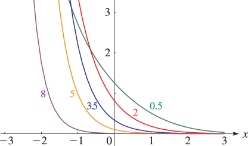
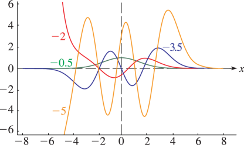
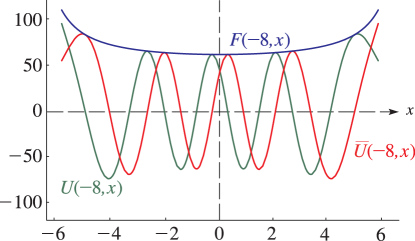
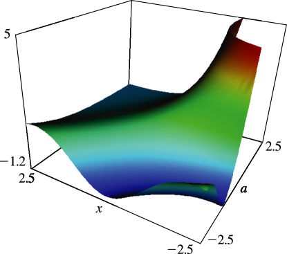
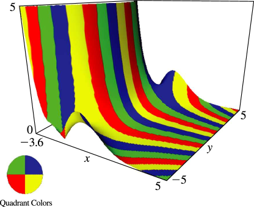

# §12.3 Graphics

:::{note}
**See also:**

Annotations for Ch.12
:::

## §12.3(i) Real Variables

:::{note}
**Keywords:**

[graphics](http://dlmf.nist.gov/search/search?q=graphics) , [parabolic cylinder functions](http://dlmf.nist.gov/search/search?q=parabolic%20cylinder%20functions) , [real variables](http://dlmf.nist.gov/search/search?q=real%20variables)

**Notes:**

These graphics were produced at NIST.

**Referenced by:**

§12.2(vi)

**See also:**

Annotations for §12.3 and Ch.12
:::

:::{note}
**Symbols:**

$U\left(\NVar{a},\NVar{z}\right)$: parabolic cylinder function , $x$: real variable and $a$: real or complex parameter

**See also:**

Annotations for §12.3(i) , §12.3 and Ch.12
:::

:::{note}
**Symbols:**

$U\left(\NVar{a},\NVar{z}\right)$: parabolic cylinder function , $x$: real variable and $a$: real or complex parameter

**See also:**

Annotations for §12.3(i) , §12.3 and Ch.12
:::

:::{note}
**Symbols:**

$U\left(\NVar{a},\NVar{z}\right)$: parabolic cylinder function , $\overline{U}\left(\NVar{a},\NVar{x}\right)$: parabolic cylinder function , $x$: real variable and $F(a,x)$: modulus

**See also:**

Annotations for §12.3(i) , §12.3 and Ch.12
:::

:::{note}
**Symbols:**

$U\left(\NVar{a},\NVar{z}\right)$: parabolic cylinder function , $x$: real variable and $a$: real or complex parameter

**See also:**

Annotations for §12.3(i) , §12.3 and Ch.12
:::

## §12.3(ii) Complex Variables

:::{note}
**Keywords:**

[complex variables](http://dlmf.nist.gov/search/search?q=complex%20variables) , [graphics](http://dlmf.nist.gov/search/search?q=graphics) , [parabolic cylinder functions](http://dlmf.nist.gov/search/search?q=parabolic%20cylinder%20functions)

**Notes:**

These graphics were produced at NIST.

**See also:**

Annotations for §12.3 and Ch.12
:::

In the graphics shown in this subsection, height corresponds to the absolute value of the function and color to the phase. See also [About Color Map](./help/vrml/aboutcolor.md "In Viewing DLMF Interactive 3D Graphics ‣ Need Help?") .

:::{note}
**Symbols:**

$\mathrm{i}$: imaginary unit , $U\left(\NVar{a},\NVar{z}\right)$: parabolic cylinder function , $x$: real variable and $y$: real variable

**See also:**

Annotations for §12.3(ii) , §12.3 and Ch.12
:::
