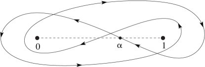

# §13.4 Integral Representations

:::{note}
**See also:**

Annotations for Ch.13
:::

## §13.4(i) Integrals Along the Real Line

:::{note}
**Keywords:**

[Kummer functions](http://dlmf.nist.gov/search/search?q=Kummer%20functions) , [along the real line](http://dlmf.nist.gov/search/search?q=along%20the%20real%20line) , [hypergeometric function](http://dlmf.nist.gov/search/search?q=hypergeometric%20function) , [integral representations](http://dlmf.nist.gov/search/search?q=integral%20representations) , [integrals](http://dlmf.nist.gov/search/search?q=integrals) , [integrals of Bessel and Hankel functions](http://dlmf.nist.gov/search/search?q=integrals%20of%20Bessel%20and%20Hankel%20functions) , [integrals of modified Bessel functions](http://dlmf.nist.gov/search/search?q=integrals%20of%20modified%20Bessel%20functions) , [over infinite intervals](http://dlmf.nist.gov/search/search?q=over%20infinite%20intervals)

**Notes:**

See Buchholz ([1969](./bib/B.html#bib363 "The Confluent Hypergeometric Function with Special Emphasis on Its Applications"), §1.4), Erdélyi et al. ([1953a](./bib/E.html#bib751 "Higher Transcendental Functions. Vol. I"), §6.11), and Slater ([1960](./bib/S.html#bib2098 "Confluent Hypergeometric Functions"), Chapter 3). For ( 13.4.5 ) use ( 13.2.41 ); compare the proof of Lemma 3.1 in Olde Daalhuis and Olver ([1994](./bib/O.html#bib1759 "Exponentially improved asymptotic solutions of ordinary differential equations. II Irregular singularities of rank one")).

**Referenced by:**

§13.16(i)

**See also:**

Annotations for §13.4 and Ch.13
:::

$$
{\mathbf{M}}\left(a,b,z\right)=\frac{1}{\Gamma\left(a\right)\Gamma\left(b-a\right)}\int_{0}^{1}e^{zt}t^{a-1}(1-t)^{b-a-1}\,\mathrm{d}t, \tag{13.4.1}
$$

$$
{\mathbf{M}}\left(a,b,z\right)=\frac{1}{\Gamma\left(b-c\right)}\int_{0}^{1}{\mathbf{M}}\left(a,c,zt\right)t^{c-1}(1-t)^{b-c-1}\,\mathrm{d}t, \tag{13.4.2}
$$

$$
{\mathbf{M}}\left(a,b,-z\right)=\frac{z^{\frac{1}{2}-\frac{1}{2}b}}{\Gamma\left(a\right)}\int_{0}^{\infty}e^{-t}t^{a-\frac{1}{2}b-\frac{1}{2}}J_{b-1}\left(2\sqrt{zt}\right)\,\mathrm{d}t, \tag{13.4.3}
$$

For the function $J_{b-1}$ see § 10.2(ii) .

$$
U\left(a,b,z\right)=\frac{1}{\Gamma\left(a\right)}\int_{0}^{\infty}e^{-zt}t^{a-1}(1+t)^{b-a-1}\,\mathrm{d}t, \tag{13.4.4}
$$

$$
U\left(a,b,z\right)=\frac{z^{1-a}}{\Gamma\left(a\right)\Gamma\left(1+a-b\right)}\int_{0}^{\infty}\frac{U\left(b-a,b,t\right)e^{-t}t^{a-1}}{t+z}\,\mathrm{d}t, \tag{13.4.5}
$$

$$
U\left(a,b,z\right)=\frac{(-1)^{n}z^{1-b-n}}{\Gamma\left(1+a-b\right)}\int_{0}^{\infty}\frac{{\mathbf{M}}\left(b-a,b,t\right)e^{-t}t^{b+n-1}}{t+z}\,\mathrm{d}t, \tag{13.4.6}
$$

$$
U\left(a,b,z\right)=\frac{2z^{\frac{1}{2}-\frac{1}{2}b}}{\Gamma\left(a\right)\Gamma\left(a-b+1\right)}\*\int_{0}^{\infty}e^{-t}t^{a-\frac{1}{2}b-\frac{1}{2}}K_{b-1}\left(2\sqrt{zt}\right)\,\mathrm{d}t, \tag{13.4.7}
$$

$$
U\left(a,b,z\right)=z^{c-a}\*\int_{0}^{\infty}e^{-zt}t^{c-1}{{}_{2}{\mathbf{F}}_{1}}\left(a,a-b+1;c;-t\right)\,\mathrm{d}t, \tag{13.4.8}
$$

where $c$ is arbitrary, $\Re c>0$ . For the functions $K_{b-1}$ and ${{}_{2}{\mathbf{F}}_{1}}$ see § 10.25(ii) and §§ [15.1](./15.1.md "§15.1 Special Notation ‣ Notation ‣ Chapter 15 Hypergeometric Function") , 15.2(i) .

## §13.4(ii) Contour Integrals

:::{note}
**Keywords:**

[Kummer functions](http://dlmf.nist.gov/search/search?q=Kummer%20functions) , [contour integrals](http://dlmf.nist.gov/search/search?q=contour%20integrals) , [hypergeometric function](http://dlmf.nist.gov/search/search?q=hypergeometric%20function) , [integral representations](http://dlmf.nist.gov/search/search?q=integral%20representations) , [integrals](http://dlmf.nist.gov/search/search?q=integrals)

**Notes:**

See Buchholz ([1969](./bib/B.html#bib363 "The Confluent Hypergeometric Function with Special Emphasis on Its Applications"), §1.4), Erdélyi et al. ([1953a](./bib/E.html#bib751 "Higher Transcendental Functions. Vol. I"), §6.11), and Slater ([1960](./bib/S.html#bib2098 "Confluent Hypergeometric Functions"), Chapter 3).

**Referenced by:**

§13.16(ii)

**Clarification (effective with 1.2.1):**

In regard to the contour of integration, just below ( 13.4.15 ), we inserted “(see Figure 5.9.1 )”.

**See also:**

Annotations for §13.4 and Ch.13
:::

$$
{\mathbf{M}}\left(a,b,z\right)=\frac{\Gamma\left(1+a-b\right)}{2\pi\mathrm{i}\Gamma\left(a\right)}\int_{0}^{(1+)}e^{zt}t^{a-1}{(t-1)^{b-a-1}}\,\mathrm{d}t, \tag{13.4.9}
$$

$$
{\mathbf{M}}\left(a,b,z\right)=e^{-a\pi\mathrm{i}}\frac{\Gamma\left(1-a\right)}{2\pi\mathrm{i}\Gamma\left(b-a\right)}\int_{1}^{(0+)}e^{zt}t^{a-1}{(1-t)^{b-a-1}}\,\mathrm{d}t, \tag{13.4.10}
$$

:::{note}
**Keywords:**

[Pochhammer double-loop contour](http://dlmf.nist.gov/search/search?q=Pochhammer%20double-loop%20contour)

**Referenced by:**

§13.4(ii)

**See also:**

Annotations for §13.4(ii) , §13.4 and Ch.13
:::

$$
{\mathbf{M}}\left(a,b,z\right)=e^{-b\pi\mathrm{i}}\Gamma\left(1-a\right)\Gamma\left(1+a-b\right)\*\frac{1}{4\pi^{2}}\int_{\alpha}^{(0+,1+,0-,1-)}e^{zt}t^{a-1}{(1-t)^{b-a-1}}\,\mathrm{d}t, \tag{13.4.11}
$$

The contour of integration starts and terminates at a point $\alpha$ on the real axis between $0$ and $1$ . It encircles $t=0$ and $t=1$ once in the positive sense, and then once in the negative sense. See Figure 13.4.1 . The fractional powers are continuous and assume their principal values at $t=\alpha$ . Similar conventions also apply to the remaining integrals in this subsection.

$$
{\mathbf{M}}\left(a,c,z\right)=\frac{\Gamma\left(b\right)}{2\pi\mathrm{i}}z^{1-b}\int_{-\infty}^{(0+,1+)}e^{zt}t^{-b}{{}_{2}{\mathbf{F}}_{1}}\left(a,b;c;\ifrac{1}{t}\right)\,\mathrm{d}t, \tag{13.4.12}
$$

At the point where the contour crosses the interval $(1,\infty)$ , $t^{-b}$ and the ${{}_{2}{\mathbf{F}}_{1}}$ function assume their principal values; compare §§ [15.1](./15.1.md "§15.1 Special Notation ‣ Notation ‣ Chapter 15 Hypergeometric Function") and 15.2(i) . A special case is

$$
{\mathbf{M}}\left(a,b,z\right)=\frac{z^{1-b}}{2\pi\mathrm{i}}\int_{-\infty}^{(0+,1+)}e^{zt}t^{-b}\!\left(1-\frac{1}{t}\right)^{-a}\,\mathrm{d}t, \tag{13.4.13}
$$

$$
U\left(a,b,z\right)=e^{-a\pi\mathrm{i}}\frac{\Gamma\left(1-a\right)}{2\pi\mathrm{i}}\int_{\infty}^{(0+)}e^{-zt}t^{a-1}{(1+t)^{b-a-1}}\,\mathrm{d}t, \tag{13.4.14}
$$

The contour cuts the real axis between $-1$ and $0$ . At this point the fractional powers are determined by $\operatorname{ph}{t}=\pi$ and $\operatorname{ph}\left(1+t\right)=0$ .

$$
\frac{U\left(a,b,z\right)}{\Gamma\left(c\right)\Gamma\left(c-b+1\right)}=\frac{z^{1-c}}{2\pi\mathrm{i}}\int_{-\infty}^{(0+)}e^{zt}t^{-c}{{}_{2}{\mathbf{F}}_{1}}\left(a,c;a+c-b+1;1-\frac{1}{t}\right)\,\mathrm{d}t, \tag{13.4.15}
$$

Again, $t^{-c}$ and the ${{}_{2}{\mathbf{F}}_{1}}$ function assume their principal values where the contour (see Figure 5.9.1 ) intersects the positive real axis.

## §13.4(iii) Mellin–Barnes Integrals

:::{note}
**Keywords:**

[Kummer functions](http://dlmf.nist.gov/search/search?q=Kummer%20functions) , [Mellin–Barnes type](http://dlmf.nist.gov/search/search?q=Mellin%E2%80%93Barnes%20type) , [contour integrals](http://dlmf.nist.gov/search/search?q=contour%20integrals) , [integral representations](http://dlmf.nist.gov/search/search?q=integral%20representations)

**Notes:**

Combine the results of Buchholz ([1969](./bib/B.html#bib363 "The Confluent Hypergeometric Function with Special Emphasis on Its Applications"), §5.4) with ( 13.14.2 ), ( 13.14.3 ).

**See also:**

Annotations for §13.4 and Ch.13
:::

If $a\neq 0,-1,-2,\dots$ , then

$$
{\mathbf{M}}\left(a,b,-z\right)=\frac{1}{2\pi\mathrm{i}\Gamma\left(a\right)}\int_{-\mathrm{i}\infty}^{\mathrm{i}\infty}\frac{\Gamma\left(a+t\right)\Gamma\left(-t\right)}{\Gamma\left(b+t\right)}z^{t}\,\mathrm{d}t, \tag{13.4.16}
$$

where the contour of integration separates the poles of $\Gamma\left(a+t\right)$ from those of $\Gamma\left(-t\right)$ .

If $a$ and $a-b+1\neq 0,-1,-2,\dots$ , then

$$
U\left(a,b,z\right)=\frac{z^{-a}}{2\pi\mathrm{i}}\int_{-\mathrm{i}\infty}^{\mathrm{i}\infty}\frac{\Gamma\left(a+t\right)\Gamma\left(1+a-b+t\right)\Gamma\left(-t\right)}{\Gamma\left(a\right)\Gamma\left(1+a-b\right)}z^{-t}\,\mathrm{d}t, \tag{13.4.17}
$$

where the contour of integration separates the poles of $\Gamma\left(a+t\right)\Gamma\left(1+a-b+t\right)$ from those of $\Gamma\left(-t\right)$ .

$$
U\left(a,b,z\right)=\frac{z^{1-b}e^{z}}{2\pi\mathrm{i}}\int_{-\mathrm{i}\infty}^{\mathrm{i}\infty}\frac{\Gamma\left(b-1+t\right)\Gamma\left(t\right)}{\Gamma\left(a+t\right)}z^{-t}\,\mathrm{d}t, \tag{13.4.18}
$$

where the contour of integration passes all the poles of $\Gamma\left(b-1+t\right)\Gamma\left(t\right)$ on the right-hand side.
