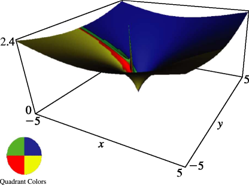
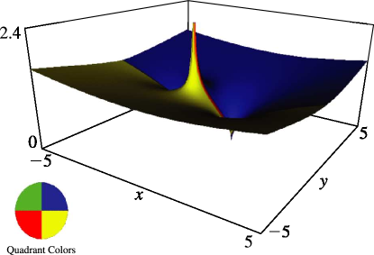

# §14.22 Graphics

:::{note}
**Keywords:**

[associated Legendre functions](http://dlmf.nist.gov/search/search?q=associated%20Legendre%20functions) , [graphics](http://dlmf.nist.gov/search/search?q=graphics)

**Notes:**

These surfaces were produced at NIST.

**See also:**

Annotations for Ch.14
:::

In the graphics shown in this section, height corresponds to the absolute value of the function and color to the phase. See also [About Color Map](./help/vrml/aboutcolor.md "In Viewing DLMF Interactive 3D Graphics ‣ Need Help?") .

:::{note}
**Symbols:**

$P^{\NVar{\mu}}_{\NVar{\nu}}\left(\NVar{z}\right)$: associated Legendre function of the first kind and $\mathrm{i}$: imaginary unit

**See also:**

Annotations for §14.22 and Ch.14
:::

:::{note}
**Symbols:**

$P^{\NVar{\mu}}_{\NVar{\nu}}\left(\NVar{z}\right)$: associated Legendre function of the first kind and $\mathrm{i}$: imaginary unit

**See also:**

Annotations for §14.22 and Ch.14
:::
