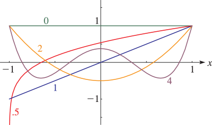

# §14.4 Graphics

:::{note}
**See also:**

Annotations for Ch.14
:::

## §14.4(i) Ferrers Functions: 2D Graphs

:::{note}
**Keywords:**

[Ferrers functions](http://dlmf.nist.gov/search/search?q=Ferrers%20functions) , [graphics](http://dlmf.nist.gov/search/search?q=graphics)

**Notes:**

These graphs were produced at NIST.

**See also:**

Annotations for §14.4 and Ch.14
:::

:::{note}
**Symbols:**

$\mathsf{P}^{\NVar{\mu}}_{\NVar{\nu}}\left(\NVar{x}\right)$: Ferrers function of the first kind , $x$: real variable and $\nu$: general degree

**See also:**

Annotations for §14.4(i) , §14.4 and Ch.14
:::

:::{note}
**Symbols:**

$\mathsf{P}^{\NVar{\mu}}_{\NVar{\nu}}\left(\NVar{x}\right)$: Ferrers function of the first kind , $x$: real variable and $\nu$: general degree

**See also:**

Annotations for §14.4(i) , §14.4 and Ch.14
:::

:::{note}
**Symbols:**

$\mathsf{P}^{\NVar{\mu}}_{\NVar{\nu}}\left(\NVar{x}\right)$: Ferrers function of the first kind , $x$: real variable and $\nu$: general degree

**See also:**

Annotations for §14.4(i) , §14.4 and Ch.14
:::

:::{note}
**Symbols:**

$\mathsf{P}^{\NVar{\mu}}_{\NVar{\nu}}\left(\NVar{x}\right)$: Ferrers function of the first kind , $x$: real variable and $\mu$: general order

**See also:**

Annotations for §14.4(i) , §14.4 and Ch.14
:::

:::{note}
**Symbols:**

$\mathsf{P}^{\NVar{\mu}}_{\NVar{\nu}}\left(\NVar{x}\right)$: Ferrers function of the first kind , $x$: real variable and $\mu$: general order

**See also:**

Annotations for §14.4(i) , §14.4 and Ch.14
:::

:::{note}
**Symbols:**

$\mathsf{P}^{\NVar{\mu}}_{\NVar{\nu}}\left(\NVar{x}\right)$: Ferrers function of the first kind , $x$: real variable and $\mu$: general order

**See also:**

Annotations for §14.4(i) , §14.4 and Ch.14
:::

## §14.4(ii) Ferrers Functions: 3D Surfaces

:::{note}
**Keywords:**

[Ferrers functions](http://dlmf.nist.gov/search/search?q=Ferrers%20functions) , [graphics](http://dlmf.nist.gov/search/search?q=graphics)

**Notes:**

These surfaces were produced at NIST.

**See also:**

Annotations for §14.4 and Ch.14
:::

:::{note}
**Symbols:**

$\mathsf{P}^{\NVar{\mu}}_{\NVar{\nu}}\left(\NVar{x}\right)$: Ferrers function of the first kind , $x$: real variable and $\nu$: general degree

**See also:**

Annotations for §14.4(ii) , §14.4 and Ch.14
:::

:::{note}
**Symbols:**

$\mathsf{P}^{\NVar{\mu}}_{\NVar{\nu}}\left(\NVar{x}\right)$: Ferrers function of the first kind , $x$: real variable and $\mu$: general order

**See also:**

Annotations for §14.4(ii) , §14.4 and Ch.14
:::

## §14.4(iii) Associated Legendre Functions: 2D Graphs

:::{note}
**Keywords:**

[associated Legendre functions](http://dlmf.nist.gov/search/search?q=associated%20Legendre%20functions) , [graphics](http://dlmf.nist.gov/search/search?q=graphics)

**Notes:**

These graphs were produced at NIST.

**See also:**

Annotations for §14.4 and Ch.14
:::

:::{note}
**Symbols:**

$P^{\NVar{\mu}}_{\NVar{\nu}}\left(\NVar{z}\right)$: associated Legendre function of the first kind , $x$: real variable and $\nu$: general degree

**See also:**

Annotations for §14.4(iii) , §14.4 and Ch.14
:::

:::{note}
**Symbols:**

$P^{\NVar{\mu}}_{\NVar{\nu}}\left(\NVar{z}\right)$: associated Legendre function of the first kind , $x$: real variable and $\nu$: general degree

**See also:**

Annotations for §14.4(iii) , §14.4 and Ch.14
:::

:::{note}
**Symbols:**

$P^{\NVar{\mu}}_{\NVar{\nu}}\left(\NVar{z}\right)$: associated Legendre function of the first kind , $x$: real variable and $\nu$: general degree

**See also:**

Annotations for §14.4(iii) , §14.4 and Ch.14
:::

:::{note}
**Symbols:**

$P^{\NVar{\mu}}_{\NVar{\nu}}\left(\NVar{z}\right)$: associated Legendre function of the first kind , $x$: real variable and $\mu$: general order

**See also:**

Annotations for §14.4(iii) , §14.4 and Ch.14
:::

:::{note}
**Symbols:**

$P^{\NVar{\mu}}_{\NVar{\nu}}\left(\NVar{z}\right)$: associated Legendre function of the first kind , $x$: real variable and $\mu$: general order

**See also:**

Annotations for §14.4(iii) , §14.4 and Ch.14
:::

:::{note}
**Symbols:**

$P^{\NVar{\mu}}_{\NVar{\nu}}\left(\NVar{z}\right)$: associated Legendre function of the first kind , $x$: real variable and $\mu$: general order

**See also:**

Annotations for §14.4(iii) , §14.4 and Ch.14
:::

## §14.4(iv) Associated Legendre Functions: 3D Surfaces

:::{note}
**Keywords:**

[associated Legendre functions](http://dlmf.nist.gov/search/search?q=associated%20Legendre%20functions) , [graphics](http://dlmf.nist.gov/search/search?q=graphics)

**Notes:**

These surfaces were produced at NIST.

**See also:**

Annotations for §14.4 and Ch.14
:::

:::{note}
**Symbols:**

$P^{\NVar{\mu}}_{\NVar{\nu}}\left(\NVar{z}\right)$: associated Legendre function of the first kind , $x$: real variable and $\nu$: general degree

**See also:**

Annotations for §14.4(iv) , §14.4 and Ch.14
:::

:::{note}
**Symbols:**

$P^{\NVar{\mu}}_{\NVar{\nu}}\left(\NVar{z}\right)$: associated Legendre function of the first kind , $x$: real variable and $\mu$: general order

**See also:**

Annotations for §14.4(iv) , §14.4 and Ch.14
:::
