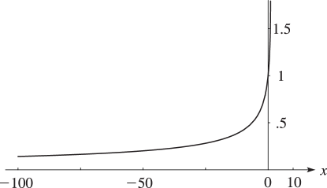
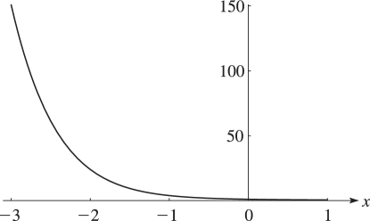
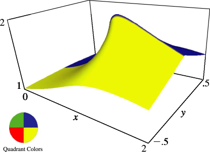
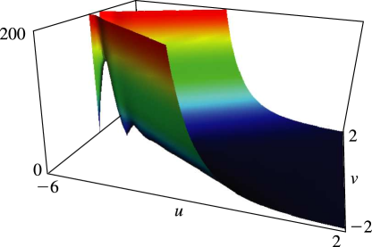

# §15.3 Graphics

:::{note}
**See also:**

Annotations for Ch.15
:::

## §15.3(i) Graphs

:::{note}
**Keywords:**

[graphics](http://dlmf.nist.gov/search/search?q=graphics) , [hypergeometric function](http://dlmf.nist.gov/search/search?q=hypergeometric%20function)

**Notes:**

These graphics were produced at NIST.

**See also:**

Annotations for §15.3 and Ch.15
:::

:::{note}
**Symbols:**

$F\left(\NVar{a},\NVar{b};\NVar{c};\NVar{z}\right)$ or $F\left({\NVar{a},\NVar{b}\atop\NVar{c}};\NVar{z}\right)$: $={{}_{2}F_{1}}\left(\NVar{a},\NVar{b};\NVar{c};\NVar{z}\right)$ Gauss’ hypergeometric function and $x$: real variable

**See also:**

Annotations for §15.3(i) , §15.3 and Ch.15
:::

:::{note}
**Symbols:**

$F\left(\NVar{a},\NVar{b};\NVar{c};\NVar{z}\right)$ or $F\left({\NVar{a},\NVar{b}\atop\NVar{c}};\NVar{z}\right)$: $={{}_{2}F_{1}}\left(\NVar{a},\NVar{b};\NVar{c};\NVar{z}\right)$ Gauss’ hypergeometric function and $x$: real variable

**See also:**

Annotations for §15.3(i) , §15.3 and Ch.15
:::

## §15.3(ii) Surfaces

:::{note}
**Keywords:**

[graphics](http://dlmf.nist.gov/search/search?q=graphics) , [hypergeometric function](http://dlmf.nist.gov/search/search?q=hypergeometric%20function)

**Notes:**

These graphics were produced at NIST.

**See also:**

Annotations for §15.3 and Ch.15
:::

In Figures 15.3.5 and 15.3.6 , height corresponds to the absolute value of the function and color to the phase. See also [About Color Map](./help/vrml/aboutcolor.md "In Viewing DLMF Interactive 3D Graphics ‣ Need Help?") .

:::{note}
**Symbols:**

$F\left(\NVar{a},\NVar{b};\NVar{c};\NVar{z}\right)$ or $F\left({\NVar{a},\NVar{b}\atop\NVar{c}};\NVar{z}\right)$: $={{}_{2}F_{1}}\left(\NVar{a},\NVar{b};\NVar{c};\NVar{z}\right)$ Gauss’ hypergeometric function , $\mathrm{i}$: imaginary unit , $x$: real variable and $y$: real variable

**Referenced by:**

§15.3(ii)

**See also:**

Annotations for §15.3(ii) , §15.3 and Ch.15
:::

:::{note}
**Symbols:**

$\mathrm{i}$: imaginary unit and $\mathbf{F}\left(\NVar{a},\NVar{b};\NVar{c};\NVar{z}\right)$ or $\mathbf{F}\left({\NVar{a},\NVar{b}\atop\NVar{c}};\NVar{z}\right)$: $={{}_{2}{\mathbf{F}}_{1}}\left(\NVar{a},\NVar{b};\NVar{c};\NVar{z}\right)$ Olver’s hypergeometric function

**Referenced by:**

§15.2(ii)

**See also:**

Annotations for §15.3(ii) , §15.3 and Ch.15
:::
