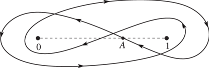

# §15.6 Integral Representations

:::{note}
**Keywords:**

[Mellin–Barnes type](http://dlmf.nist.gov/search/search?q=Mellin%E2%80%93Barnes%20type) , [hypergeometric function](http://dlmf.nist.gov/search/search?q=hypergeometric%20function) , [integral representations](http://dlmf.nist.gov/search/search?q=integral%20representations)

**A&S Ref:**

15.3

**Notes:**

See Andrews et al. ([1999](./bib/index.html#bib103 "Special Functions"), §§2.2, 2.4, 2.9), Erdélyi et al. ([1953a](./bib/E.html#bib751 "Higher Transcendental Functions. Vol. I"), §2.1.3), and Whittaker and Watson ([1927](./bib/W.html#bib2404 "A Course of Modern Analysis"), pp. 290–291). ( 15.6.3 ) follows from ( 15.6.4 ). ( 15.6.8 ) follows from ( 15.6.9 ) with $\lambda=a+b$ .

**Referenced by:**

§8.17(iii) , Erratum (V1.0.14) for Equation (15.6.8) , Erratum (V1.0.23) for Equations (15.6.1)–(15.6.9) , Erratum (V1.0.5) for Clarifications

**Addition (effective with 1.1.5):**

The integral representation ( 15.6.2_5 ) was added.

**Clarification (effective with 1.0.23):**

The sentence immediately following ( 15.6.9 ), “These representations are valid when $|\operatorname{ph}\left(1-z\right)|<\pi$ , except ( 15.6.6 ) which holds for $|\operatorname{ph}\left(-z\right)|<\pi$ .”, has been removed. These formula constraints have been directly inserted into the constraints for Equations ( 15.6.1 )–( 15.6.9 ).

**Clarification (effective with 1.0.14):**

A sentence was added below ( 15.6.9 ) to point out that ( 15.6.8 ) could be rewritten as a fractional integral.

**Clarification (effective with 1.0.5):**

The description of the integration contour for ( 15.6.5 ), depicted in Figure 15.6.1 , has been expanded.

**See also:**

Annotations for Ch.15
:::

The function $\mathbf{F}\left(a,b;c;z\right)$ (not $F\left(a,b;c;z\right)$ ) has the following integral representations:

$$
\mathbf{F}\left(a,b;c;z\right)=\frac{1}{\Gamma\left(b\right)\Gamma\left(c-b\right)}\int_{0}^{1}\frac{t^{b-1}(1-t)^{c-b-1}}{(1-zt)^{a}}\,\mathrm{d}t, \tag{15.6.1}
$$

$$
\mathbf{F}\left(a,b;c;z\right)=\frac{\Gamma\left(1+b-c\right)}{2\pi\mathrm{i}\Gamma\left(b\right)}\int_{0}^{(1+)}\frac{t^{b-1}(t-1)^{c-b-1}}{(1-zt)^{a}}\,\mathrm{d}t, \tag{15.6.2}
$$

$$
\mathbf{F}\left(a,b;c;z\right)=\frac{1}{\Gamma\left(b\right)\Gamma\left(c-b\right)}\int_{0}^{\infty}\frac{t^{b-1}\left(t+1\right)^{a-c}}{\left(t-zt+1\right)^{a}}\,\mathrm{d}t, \tag{15.6.2_5}
$$

$$
\mathbf{F}\left(a,b;c;z\right)={\mathrm{e}}^{-b\pi\mathrm{i}}\frac{\Gamma\left(1-b\right)}{2\pi\mathrm{i}\Gamma\left(c-b\right)}\int_{\infty}^{(0+)}\frac{t^{b-1}(t+1)^{a-c}}{(t-zt+1)^{a}}\,\mathrm{d}t, \tag{15.6.3}
$$

$$
\mathbf{F}\left(a,b;c;z\right)={\mathrm{e}}^{-b\pi\mathrm{i}}\frac{\Gamma\left(1-b\right)}{2\pi\mathrm{i}\Gamma\left(c-b\right)}\int_{1}^{(0+)}\frac{t^{b-1}(1-t)^{c-b-1}}{(1-zt)^{a}}\,\mathrm{d}t, \tag{15.6.4}
$$

$$
\mathbf{F}\left(a,b;c;z\right)={\mathrm{e}}^{-c\pi\mathrm{i}}\Gamma\left(1-b\right)\Gamma\left(1+b-c\right)\*\frac{1}{4\pi^{2}}\int_{A}^{(0+,1+,0-,1-)}\frac{t^{b-1}(1-t)^{c-b-1}}{(1-zt)^{a}}\,\mathrm{d}t, \tag{15.6.5}
$$

$$
\mathbf{F}\left(a,b;c;z\right)=\frac{1}{2\pi\mathrm{i}\Gamma\left(a\right)\Gamma\left(b\right)}\int_{-\mathrm{i}\infty}^{\mathrm{i}\infty}\frac{\Gamma\left(a+t\right)\Gamma\left(b+t\right)\Gamma\left(-t\right)}{\Gamma\left(c+t\right)}(-z)^{t}\,\mathrm{d}t, \tag{15.6.6}
$$

$$
\mathbf{F}\left(a,b;c;z\right)=\frac{1}{2\pi\mathrm{i}\Gamma\left(a\right)\Gamma\left(b\right)\Gamma\left(c-a\right)\Gamma\left(c-b\right)}\int_{-\mathrm{i}\infty}^{\mathrm{i}\infty}\Gamma\left(a+t\right)\Gamma\left(b+t\right)\Gamma\left(c-a-b-t\right)\Gamma\left(-t\right)(1-z)^{t}\,\mathrm{d}t, \tag{15.6.7}
$$

$$
\mathbf{F}\left(a,b;c;z\right)=\frac{1}{\Gamma\left(c-d\right)}\int_{0}^{1}\mathbf{F}\left(a,b;d;zt\right)t^{d-1}(1-t)^{c-d-1}\,\mathrm{d}t, \tag{15.6.8}
$$

$$
\mathbf{F}\left(a,b;c;z\right)=\int_{0}^{1}\frac{t^{d-1}(1-t)^{c-d-1}}{(1-zt)^{a+b-\lambda}}\mathbf{F}\left({\lambda-a,\lambda-b\atop d};zt\right)\mathbf{F}\left({a+b-\lambda,\lambda-d\atop c-d};\frac{(1-t)z}{1-zt}\right)\,\mathrm{d}t, \tag{15.6.9}
$$

In all cases the integrands are continuous functions of $t$ on the integration paths, except possibly at the endpoints. Note that ( 15.6.8 ) can be rewritten as a fractional integral. In addition:

In ( 15.6.1 ) all functions in the integrand assume their principal values.

In ( 15.6.2 ) the point $\ifrac{1}{z}$ lies outside the integration contour, $t^{b-1}$ and $(t-1)^{c-b-1}$ assume their principal values where the contour cuts the interval $(1,\infty)$ , and $(1-zt)^{a}=1$ at $t=0$ .

In ( 15.6.3 ) the point $\ifrac{1}{(z-1)}$ lies outside the integration contour, the contour cuts the real axis between $t=-1$ and $0$ , at which point $\operatorname{ph}t=\pi$ and $\operatorname{ph}\left(1+t\right)=0$ .

In ( 15.6.4 ) the point $\ifrac{1}{z}$ lies outside the integration contour, and at the point where the contour cuts the negative real axis $\operatorname{ph}t=\pi$ and $\operatorname{ph}\left(1-t\right)=0$ .

In ( 15.6.5 ) the integration contour starts and terminates at a point $A$ on the real axis between $0$ and $1$ . It encircles $t=0$ and $t=1$ once in the positive direction, and then once in the negative direction. See Figure 15.6.1 . At the starting point $\operatorname{ph}t$ and $\operatorname{ph}\left(1-t\right)$ are zero. If desired, and as in Figure 5.12.3 , the upper integration limit in ( 15.6.5 ) can be replaced by $(1+,0+,1-,0-)$ . However, this reverses the direction of the integration contour, and in consequence ( 15.6.5 ) would need to be multiplied by $-1$ .

In ( 15.6.6 ) the integration contour separates the poles of $\Gamma\left(a+t\right)$ and $\Gamma\left(b+t\right)$ from those of $\Gamma\left(-t\right)$ , and $(-z)^{t}$ has its principal value.

In ( 15.6.7 ) the integration contour separates the poles of $\Gamma\left(a+t\right)$ and $\Gamma\left(b+t\right)$ from those of $\Gamma\left(c-a-b-t\right)$ and $\Gamma\left(-t\right)$ , and $(1-z)^{t}$ has its principal value.

In each of ( 15.6.8 ) and ( 15.6.9 ) all functions in the integrand assume their principal values.

:::{note}
**Keywords:**

[Pochhammer double-loop contour](http://dlmf.nist.gov/search/search?q=Pochhammer%20double-loop%20contour)

**Referenced by:**

§15.6 , §15.6

**See also:**

Annotations for §15.6 and Ch.15
:::
