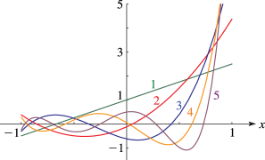
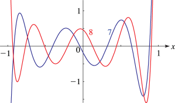
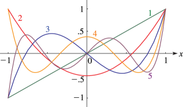
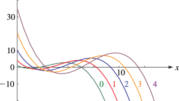
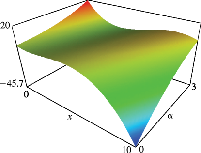

# §18.4 Graphics

:::{note}
**See also:**

Annotations for Ch.18
:::

## §18.4(i) Graphs

:::{note}
**Notes:**

These graphs were produced at NIST.

**See also:**

Annotations for §18.4 and Ch.18
:::

:::{note}
**Symbols:**

$P^{(\NVar{\alpha},\NVar{\beta})}_{\NVar{n}}\left(\NVar{x}\right)$: Jacobi polynomial , $n$: nonnegative integer and $x$: real variable

**Keywords:**

[Jacobi polynomials](http://dlmf.nist.gov/search/search?q=Jacobi%20polynomials) , [graphs](http://dlmf.nist.gov/search/search?q=graphs)

**Referenced by:**

§18.2(vi)

**See also:**

Annotations for §18.4(i) , §18.4 and Ch.18
:::

:::{note}
**Symbols:**

$P^{(\NVar{\alpha},\NVar{\beta})}_{\NVar{n}}\left(\NVar{x}\right)$: Jacobi polynomial , $n$: nonnegative integer and $x$: real variable

**Keywords:**

[Jacobi polynomials](http://dlmf.nist.gov/search/search?q=Jacobi%20polynomials) , [graphs](http://dlmf.nist.gov/search/search?q=graphs)

**See also:**

Annotations for §18.4(i) , §18.4 and Ch.18
:::

:::{note}
**Symbols:**

$P_{\NVar{n}}\left(\NVar{x}\right)$: Legendre polynomial , $n$: nonnegative integer and $x$: real variable

**Keywords:**

[Legendre polynomials](http://dlmf.nist.gov/search/search?q=Legendre%20polynomials) , [graphs](http://dlmf.nist.gov/search/search?q=graphs)

**See also:**

Annotations for §18.4(i) , §18.4 and Ch.18
:::

:::{note}
**Symbols:**

$L^{(\NVar{\alpha})}_{\NVar{n}}\left(\NVar{x}\right)$: Laguerre (or generalized Laguerre) polynomial and $x$: real variable

**Keywords:**

[Laguerre polynomials](http://dlmf.nist.gov/search/search?q=Laguerre%20polynomials) , [graphics](http://dlmf.nist.gov/search/search?q=graphics)

**See also:**

Annotations for §18.4(i) , §18.4 and Ch.18
:::

## §18.4(ii) Surfaces

:::{note}
**Notes:**

These surfaces were produced at NIST.

**See also:**

Annotations for §18.4 and Ch.18
:::

:::{note}
**Symbols:**

$L^{(\NVar{\alpha})}_{\NVar{n}}\left(\NVar{x}\right)$: Laguerre (or generalized Laguerre) polynomial and $x$: real variable

**See also:**

Annotations for §18.4(ii) , §18.4 and Ch.18
:::
