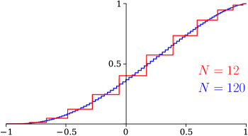

# §18.40 Methods of Computation

:::{note}
**Referenced by:**

Erratum (V1.2.0) Section 18.40 , Version 1.2.0 (March 27, 2024)

**See also:**

Annotations for Ch.18
:::

## §18.40(i) Computation of Polynomials

:::{note}
**Keywords:**

[Clenshaw’s algorithm](http://dlmf.nist.gov/search/search?q=Clenshaw%20algorithm) , [classical orthogonal polynomials](http://dlmf.nist.gov/search/search?q=classical%20orthogonal%20polynomials) , [differential equations](http://dlmf.nist.gov/search/search?q=differential%20equations) , [in series of Chebyshev polynomials](http://dlmf.nist.gov/search/search?q=in%20series%20of%20Chebyshev%20polynomials) , [solutions](http://dlmf.nist.gov/search/search?q=solutions)

**Referenced by:**

Erratum (V1.2.0) Section 18.40 , Version 1.2.0 (March 27, 2024)

**Addition (effective with 1.2.0):**

This subsection was added.

**See also:**

Annotations for §18.40 and Ch.18
:::

Orthogonal polynomials can be computed from their explicit polynomial form by Horner’s scheme (§ 1.11(i) ). Usually, however, other methods are more efficient, especially the numerical solution of difference equations (§ [3.6](./3.6.md "§3.6 Linear Difference Equations ‣ Areas ‣ Chapter 3 Numerical Methods") ) and the application of uniform asymptotic expansions (when available) for OP’s of large degree. For applications in which the OP’s appear only as terms in series expansions (compare § 18.18(i) ) the need to compute them can be avoided altogether by use instead of Clenshaw’s algorithm (§ 3.11(ii) ) and its straightforward generalization to OP’s other than Chebyshev. For further information see Clenshaw ([1955](./bib/C.html#bib523 "A note on the summation of Chebyshev series")), Gautschi ([2004](./bib/G.html#bib899 "Orthogonal Polynomials: Computation and Approximation"), §§2.1, 8.1), and Mason and Handscomb ([2003](./bib/M.html#bib1560 "Chebyshev Polynomials"), §2.4).

## §18.40(ii) The Classical Moment Problem

:::{note}
**Keywords:**

[Stieltjes–Perron inversion](http://dlmf.nist.gov/search/search?q=Stieltjes%E2%80%93Perron%20inversion)

**Referenced by:**

§18.2(ix) , §18.2(x) , Figure 18.39.2 , [Figure 18.39.2](./18.39.F2.mag.md "In §18.39 Applications in the Physical Sciences ‣ Applications ‣ Chapter 18 Orthogonal Polynomials") , §18.39(iv) , Erratum (V1.2.0) Section 18.40 , Version 1.2.0 (March 27, 2024)

**Addition (effective with 1.2.0):**

This subsection was added.

**See also:**

Annotations for §18.40 and Ch.18
:::

The problem of moments is simply stated and the early work of Stieltjes, Markov, and Chebyshev on this problem was the origin of the understanding of the importance of both continued fractions and OP’s in many areas of analysis. Given the power moments, $\mu_{n}=\int_{a}^{b}x^{n}\,\mathrm{d}\mu(x)$ , $n=0,1,2,\dots$ , can these be used to find a unique $\mu(x)$ , a non-decreasing, real, function of $x$ , in the case that the moment problem is *determined* ? Should a unique solution not exist the moment problem is then *indeterminant* . The theory behind these remarks is in Shohat and Tamarkin ([1970](./bib/S.html#bib2973 "The Problem of Moments")), Akhiezer ([2021](./bib/index.html#bib49 "The classical moment problem and some related questions in analysis")), Chihara ([1978](./bib/C.html#bib490 "An Introduction to Orthogonal Polynomials")).

### A numerical approach to the recursion coefficients and quadrature abscissas and weights

:::{note}
**See also:**

Annotations for §18.40(ii) , §18.40 and Ch.18
:::

In what follows we consider only the simple, illustrative, case that $\mu(x)$ is continuously differentiable so that $\,\mathrm{d}\mu(x)=w(x)\,\mathrm{d}x$ , with $w(x)$ real, positive, and continuous on a real interval $[a,b].$ The strategy will be to: 1) use the moments to determine the recursion coefficients $\alpha_{n},\beta_{n}$ of equations ( 18.2.11_5 ) and ( 18.2.11_8 ); then, 2) to construct the quadrature abscissas $x_{i}$ and weights (or Christoffel numbers) $w_{i}$ from the J-matrix of § 3.5(vi) , equations ( 3.5.31 ) and( 3.5.32 ). These quadrature weights and abscissas will then allow construction of a convergent sequence of approximations to $w(x)$ , as will be considered in the following paragraphs.

There are many ways to implement these first two steps, noting that the expressions for $\alpha_{n}$ and $\beta_{n}$ of equation ( 18.2.30 ) are of little practical numerical value, see Gautschi ([2004](./bib/G.html#bib899 "Orthogonal Polynomials: Computation and Approximation")) and Golub and Meurant ([2010](./bib/G.html#bib951 "Matrices, moments and quadrature with applications")). A simple set of choices is spelled out in Gordon ([1968](./bib/G.html#bib3023 "Error bounds in equilibrium statistical mechanics")) which gives a numerically stable algorithm for direct computation of the recursion coefficients in terms of the moments, followed by construction of the J-matrix and quadrature weights and abscissas, and we will follow this approach: Let $N$ be a positive integer and define

$$
\displaystyle P_{1,1} \displaystyle=1,~P_{m,1}=0, \tag{18.40.1}
$$

$$
\displaystyle P_{m,2} \displaystyle=(-1)^{m-1}\mu_{m-1},
$$

$$
\displaystyle P_{m,n} \displaystyle=P_{1,n-1}P_{m+1,n-2}-P_{1,n-2}P_{m+1,n-1},
$$

:::{note}
**Symbols:**

$N$: positive integer , $m$: nonnegative integer and $n$: nonnegative integer

**Referenced by:**

Erratum (V1.2.0) Section 18.40

**See also:**

Annotations for §18.40(ii) , §18.40(ii) , §18.40 and Ch.18
:::

use the first row of this $P$ -matrix for

$$
a_{1}=\mu_{0},~{}a_{n}=\frac{P_{1,n+1}}{P_{1,n}P_{1,n-1}}, \tag{18.40.2}
$$

and these can be used for the recursion coefficients

$$
\alpha_{0}=a_{2},~{}\alpha_{n}=a_{2n+1}+a_{2n+2},~{}\beta_{n}=a_{2n}a_{2n+1}, \tag{18.40.3}
$$

The quadrature abscissas $x_{n}$ and weights $w_{n}$ then follow from the discussion of § 3.5(vi) . See Gautschi ([1983](./bib/G.html#bib889 "How and how not to check Gaussian quadrature formulae")) for examples of numerically stable and unstable use of the above recursion relations, and how one can then usefully differentiate between numerical results of low and high precision, as produced thereby.

Having now directly connected computation of the quadrature abscissas and weights to the moments, what follows uses these for a Stieltjes–Perron *inversion* to regain $w(x)$ .

### Stieltjes Inversion via (approximate) Analytic Continuation

:::{note}
**Keywords:**

[Stieltjes–Perron inversion](http://dlmf.nist.gov/search/search?q=Stieltjes%E2%80%93Perron%20inversion) , [analytic continuation](http://dlmf.nist.gov/search/search?q=analytic%20continuation)

**See also:**

Annotations for §18.40(ii) , §18.40 and Ch.18
:::

We have from ( 18.2.38 ) that

$$
\lim_{N\to\infty}F_{N}(z)=F(z)\equiv\frac{1}{\mu_{0}}\int_{a}^{b}\frac{w(x)\,\mathrm{d}x}{z-x}, \tag{18.40.4}
$$

in which

$$
F_{N}(z)=\frac{1}{\mu_{0}}\sum_{n=1}^{N}\frac{w_{n}}{z-x_{n}}. \tag{18.40.5}
$$

Let $x^{\prime}\in(a,b)$ . It is now necessary to take the limit $\varepsilon\to 0{+}$ of $F(x^{\prime}+\mathrm{i}\varepsilon)$ , and the imaginary part is the required Stieltjes–Perron inversion:

$$
\lim_{\varepsilon\to 0{+}}\int_{a}^{b}\frac{w(x)\,\mathrm{d}x}{x^{\prime}+\mathrm{i}\varepsilon-x}\,\mathrm{d}x=\pvint_{a}^{b}\frac{w(x)\,\mathrm{d}x}{x^{\prime}-x}-\mathrm{i}\pi w(x^{\prime}), \tag{18.40.6}
$$

The question is then: how is this possible given only $F_{N}(z)$ , rather than $F(z)$ itself? $F_{N}(z)$ often converges to smooth results for $z$ off the real axis for $\Im{z}$ at a distance greater than the pole spacing of the $x_{n}$ , this may then be followed by *approximate* numerical analytic continuation via fitting to lower order continued fractions (either Padé, see § 3.11(iv) , or pointwise continued fraction approximants, see Schlessinger ([1968](./bib/S.html#bib3075 "Use of analyticity in the calculation of nonrelativistic scattering amplitudes"), Appendix)), to $F_{N}(z)$ and evaluating these on the real axis in regions of higher pole density that those of the approximating function. Results of low ( $~{}2$ to $3$ decimal digits) precision for $w(x)$ are easily obtained for $N\sim 10$ to $20$ . Gautschi ([2004](./bib/G.html#bib899 "Orthogonal Polynomials: Computation and Approximation"), p. 119–120) has explored the $\varepsilon\to 0^{+}$ limit via the Wynn $\varepsilon$ -algorithm, ( 3.9.11 ) to accelerate convergence, finding four to eight digits of precision in $w(x)$ , depending smoothly on $x^{\prime}$ , for $N\approx 4000$ , for an example involving *first numerator* Legendre OP’s.

### Histogram Approach

:::{note}
**Keywords:**

[Stieltjes–Perron inversion](http://dlmf.nist.gov/search/search?q=Stieltjes%E2%80%93Perron%20inversion) , [graphic](http://dlmf.nist.gov/search/search?q=graphic) , [histogram construction](http://dlmf.nist.gov/search/search?q=histogram%20construction)

**See also:**

Annotations for §18.40(ii) , §18.40 and Ch.18
:::

The quadrature points and weights can be put to a more direct and efficient use. Define

$$
\mu_{N}(x)=\sum_{n=1}^{N}w_{n}H\left(x-x_{n}\right), \tag{18.40.7}
$$

$H\left(x\right)$ being the Heaviside step-function, see ( 1.16.13 ).

Equation ( 18.40.7 ) provides step-histogram approximations to $\int_{a}^{x}\,\mathrm{d}\mu(x)$ , as shown in Figure 18.40.1 for $N=12$ and $120$ , shown here for the repulsive Coulomb–Pollaczek OP’s of Figure 18.39.2 , with the parameters as listed therein.

:::{note}
**Symbols:**

$[\NVar{a},\NVar{b})$: half-closed interval , $N$: positive integer and $x$: real variable

**Referenced by:**

§18.40(ii) , Erratum (V1.2.0) Section 18.40 , Version 1.2.0 (March 27, 2024)

**See also:**

Annotations for §18.40(ii) , §18.40(ii) , §18.40 and Ch.18
:::

The bottom and top of the steps at the $x_{i}$ are lower and upper bounds to $\int_{a}^{x_{i}}\,\mathrm{d}\mu(x)$ as made explicit via the *Chebyshev inequalities* discussed by Shohat and Tamarkin ([1970](./bib/S.html#bib2973 "The Problem of Moments"), pp. 42–43). Interpolation of the midpoints of the jumps followed by differentiation with respect to $x$ yields a Stieltjes–Perron inversion to obtain $w^{\mathrm{RCP}}(x)$ to a precision of $\sim 4$ decimal digits for $N=120$ . Convergence is $\sim O\left(N^{-2}\right)$ . Results similar to these appear in Langhoff et al. ([1976](./bib/L.html#bib3042 "Moment-theory investigations of photoabsorption and dispersion profiles in atoms and ions")) in methods developed for physics applications, and which includes treatments of systems with discontinuities in $\mu(x)$ , using what is referred to as the *Stieltjes derivative* which may be traced back to Stieltjes, as discussed by Deltour ([1968](./bib/D.html#bib3123 "The computation of lattice frequency distribution functions by means of continued fractions"), Eq. 12).

### Derivative Rule Approach

:::{note}
**Keywords:**

[Stieltjes–Perron inversion](http://dlmf.nist.gov/search/search?q=Stieltjes%E2%80%93Perron%20inversion) , [derivative rule](http://dlmf.nist.gov/search/search?q=derivative%20rule) , [graphic](http://dlmf.nist.gov/search/search?q=graphic) , [histogram construction](http://dlmf.nist.gov/search/search?q=histogram%20construction)

**See also:**

Annotations for §18.40(ii) , §18.40 and Ch.18
:::

An alternate, and highly efficient, approach follows from the *derivative rule conjecture* , see Yamani and Reinhardt ([1975](./bib/Y.html#bib3090 "L -squared discretizations of the continuum: Radial kinetic energy and the Coulomb Hamiltonian")), and references therein, namely that

$$
w(x_{i,N})\approx\frac{w_{i,N}}{\left.\frac{\mathrm{d}x(j,N)}{\mathrm{d}j}\right|_{j=i}}. \tag{18.40.8}
$$

This allows Stieltjes–Perron inversion for the $w(x_{i,N})$ , given the quadrature weights and points. Here $x(t,N)$ is an interpolation of the abscissas $x_{i,N},i=1,2,\dots,N$ , that is, $x(i,N)=x_{i,N}$ , allowing differentiation by $i$ . In what follows this is accomplished in two ways: i) via the Lagrange interpolation of § 3.3(i) ; and ii) by constructing a pointwise continued fraction, or PWCF, as follows:

$$
x(t,N)=\cfrac{x_{1,N}}{1+\cfrac{a_{1}(t-1)}{1+\cfrac{a_{2}(t-2)}{1+\cdots}}}\frac{a_{N-1}(t-(N-1))}{1}, \tag{18.40.9}
$$

where the coefficients are defined recursively via $a_{1}=\frac{x_{1,N}}{x_{2,N}}-1$ , and

$$
a_{\ell}=-1-\cfrac{2a_{\ell-1}}{1+\cfrac{3a_{\ell-2}}{1+\cdots}}\frac{\ell a_{1}}{1-\frac{x_{1,N}}{x_{\ell+1,N}}}, \tag{18.40.10}
$$

The PWCF $x(t,N)$ is a minimally oscillatory algebraic interpolation of the abscissas $x_{i,N},i=1,2,\dots,N$ .

Comparisons of the precisions of Lagrange and PWCF interpolations to obtain the derivatives, are shown in Figure 18.40.2 . The example chosen is inversion from the $\alpha_{n},\beta_{n}$ for the weight function for the repulsive Coulomb–Pollaczek, RCP, polynomials of ( 18.39.50 ). This is a challenging case as the desired $w^{\mathrm{RCP}}(x)$ on $[-1,1]$ has an essential singularity at $x=-1$ .

:::{note}
**Symbols:**

$N$: positive integer , $w(x)$: weight function and $x$: real variable

**Referenced by:**

§18.40(ii) , §18.40(ii) , Erratum (V1.2.0) Section 18.40 , Version 1.2.0 (March 27, 2024)

**See also:**

Annotations for §18.40(ii) , §18.40(ii) , §18.40 and Ch.18
:::

Further, *exponential* convergence in $N$ , via the Derivative Rule, rather than the power-law convergence of the histogram methods, is found for the inversion of Gegenbauer, Attractive, as well as Repulsive, Coulomb–Pollaczek, and Hermite weights and zeros to approximate $w(x)$ for these OP systems on $x\in[-1,1]$ and $(-\infty,\infty)$ respectively, Reinhardt ([2018](./bib/R.html#bib3067 "Universality properties of Gaussian quadrature, the derivative rule, and a novel approach to Stieltjes inversion")), and Reinhardt ([2021b](./bib/R.html#bib3068 "Relationships between the zeros, weights, and weight functions of orthogonal polynomials: Derivative rule approach to Stieltjes and spectral imaging")), Reinhardt ([2021a](./bib/R.html#bib3069 "Erratum to:Relationships between the zeros, weights, and weight functions of orthogonal polynomials: Derivative rule approach to Stieltjes and spectral imaging")). Achieving precisions at this level shown above requires higher than normal computational precision, see Gautschi ([2009](./bib/G.html#bib3017 "Variable-precision recurrence coefficients for nonstandard orthogonal polynomials")). In Figure 18.40.2 the approximations were carried out with a precision of 50 decimal digits.
