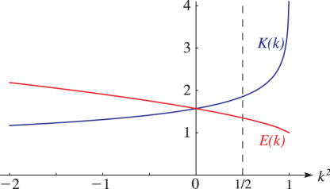
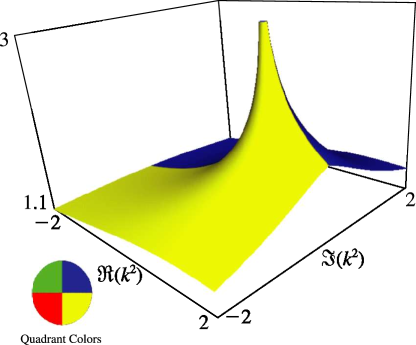
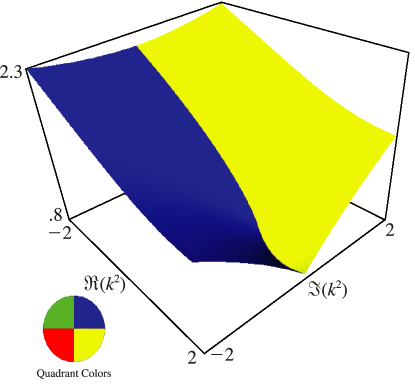

# §19.3 Graphics

:::{note}
**Keywords:**

[Legendre’s elliptic integrals](http://dlmf.nist.gov/search/search?q=Legendre%20elliptic%20integrals) , [graphics](http://dlmf.nist.gov/search/search?q=graphics)

**See also:**

Annotations for Ch.19
:::

## §19.3(i) Real Variables

:::{note}
**Notes:**

These graphics were produced at NIST.

**See also:**

Annotations for §19.3 and Ch.19
:::

See Figures 19.3.1 – 19.3.6 for complete and incomplete Legendre’s elliptic integrals.

:::{note}
**Symbols:**

${K^{\prime}}\left(\NVar{k}\right)$: Legendre’s complementary complete elliptic integral of the first kind , ${E^{\prime}}\left(\NVar{k}\right)$: Legendre’s complementary complete elliptic integral of the second kind , $K\left(\NVar{k}\right)$: Legendre’s complete elliptic integral of the first kind , $E\left(\NVar{k}\right)$: Legendre’s complete elliptic integral of the second kind and $k$: real or complex modulus

**Referenced by:**

§19.3(i)

**See also:**

Annotations for §19.3(i) , §19.3 and Ch.19
:::

:::{note}
**Symbols:**

$R_{C}\left(\NVar{x},\NVar{y}\right)$: Carlson’s combination of inverse circular and inverse hyperbolic functions and $\ln\NVar{z}$: principal branch of logarithm function

**Referenced by:**

§19.17

**See also:**

Annotations for §19.3(i) , §19.3 and Ch.19
:::

:::{note}
**Symbols:**

$K\left(\NVar{k}\right)$: Legendre’s complete elliptic integral of the first kind , $F\left(\NVar{\phi},\NVar{k}\right)$: Legendre’s incomplete elliptic integral of the first kind , $\sin\NVar{z}$: sine function , $\phi$: real or complex argument and $k$: real or complex modulus

**See also:**

Annotations for §19.3(i) , §19.3 and Ch.19
:::

:::{note}
**Symbols:**

$K\left(\NVar{k}\right)$: Legendre’s complete elliptic integral of the first kind , $E\left(\NVar{k}\right)$: Legendre’s complete elliptic integral of the second kind , $E\left(\NVar{\phi},\NVar{k}\right)$: Legendre’s incomplete elliptic integral of the second kind , $\sin\NVar{z}$: sine function , $\phi$: real or complex argument , $k$: real or complex modulus and $k^{\prime}$: complementary modulus

**See also:**

Annotations for §19.3(i) , §19.3 and Ch.19
:::

![Figure 19.3.5: $\Pi\left(\alpha^{2},k\right)$ as a function of $k^{2}$ and $\alpha^{2}$ for $-2\leq k^{2}<1$ , $-2\leq\alpha^{2}\leq 2$ . Cauchy principal values are shown when $\alpha^{2}>1$ . The function is unbounded as $\alpha^{2}\to 1-$ , and also (with the same sign as $1-\alpha^{2}$ ) as $k^{2}\to 1-$ . As $\alpha^{2}\to 1+$ it has the limit $K\left(k\right)-(E\left(k\right)/{k^{\prime}}^{2})$ . If $\alpha^{2}=0$ , then it reduces to $K\left(k\right)$ . If $k^{2}=0$ , then it has the value $\frac{1}{2}\pi/\sqrt{1-\alpha^{2}}$ when $\alpha^{2}<1$ , and 0 when $\alpha^{2}>1$ . See § 19.6(i) . 3D Help](../html/19/3/F5.png)
:::{note}
**Symbols:**

$\pi$: the ratio of the circumference of a circle to its diameter , $K\left(\NVar{k}\right)$: Legendre’s complete elliptic integral of the first kind , $E\left(\NVar{k}\right)$: Legendre’s complete elliptic integral of the second kind , $\Pi\left(\NVar{\alpha}^{2},\NVar{k}\right)$: Legendre’s complete elliptic integral of the third kind , $k$: real or complex modulus , $k^{\prime}$: complementary modulus and $\alpha^{2}$: real or complex parameter

**See also:**

Annotations for §19.3(i) , §19.3 and Ch.19
:::

![Figure 19.3.6: $\Pi\left(\phi,2,k\right)$ as a function of $k^{2}$ and ${\sin}^{2}\phi$ for $-1\leq k^{2}\leq 3$ , $0\leq{\sin}^{2}\phi<1$ . Cauchy principal values are shown when ${\sin}^{2}\phi>\frac{1}{2}$ . The function tends to $+\infty$ as ${\sin}^{2}\phi\to\frac{1}{2}$ , except in the last case below. If ${\sin}^{2}\phi=1$ ( $>k^{2}$ ), then the function reduces to $\Pi\left(2,k\right)$ with Cauchy principal value $K\left(k\right)-\Pi\left(\frac{1}{2}k^{2},k\right)$ , which tends to $-\infty$ as $k^{2}\to 1-$ . See ( 19.6.5 ) and ( 19.6.6 ). If ${\sin}^{2}\phi=1/k^{2}$ ( $<1$ ), then by ( 19.7.4 ) it reduces to $\Pi\left(2/k^{2},1/k\right)/k$ , $k^{2}\neq 2$ , with Cauchy principal value $(K\left(1/k\right)-\Pi\left(\frac{1}{2},1/k\right))/k$ , $1<k^{2}<2$ , by ( 19.6.5 ). Its value tends to $-\infty$ as $k^{2}\to 1+$ by ( 19.6.6 ), and to the negative of the second lemniscate constant (see ( 19.20.22 )) as $k^{2}(={\csc}^{2}\phi)\to 2-$ . 3D Help](../html/19/3/F6.png)
:::{note}
**Symbols:**

$K\left(\NVar{k}\right)$: Legendre’s complete elliptic integral of the first kind , $\Pi\left(\NVar{\alpha}^{2},\NVar{k}\right)$: Legendre’s complete elliptic integral of the third kind , $\csc\NVar{z}$: cosecant function , $\Pi\left(\NVar{\phi},\NVar{\alpha}^{2},\NVar{k}\right)$: Legendre’s incomplete elliptic integral of the third kind , $\sin\NVar{z}$: sine function , $\phi$: real or complex argument and $k$: real or complex modulus

**Referenced by:**

§19.3(i)

**See also:**

Annotations for §19.3(i) , §19.3 and Ch.19
:::

## §19.3(ii) Complex Variables

:::{note}
**Keywords:**

[Legendre’s elliptic integrals](http://dlmf.nist.gov/search/search?q=Legendre%20elliptic%20integrals) , [graphics](http://dlmf.nist.gov/search/search?q=graphics)

**Notes:**

These graphics were produced at NIST.

**See also:**

Annotations for §19.3 and Ch.19
:::

In Figures 19.3.7 and 19.3.8 for complete Legendre’s elliptic integrals with complex arguments, height corresponds to the absolute value of the function and color to the phase. See also [About Color Map](./help/vrml/aboutcolor.md "In Viewing DLMF Interactive 3D Graphics ‣ Need Help?") .

:::{note}
**Symbols:**

$K\left(\NVar{k}\right)$: Legendre’s complete elliptic integral of the first kind , $\Im$: imaginary part , $\Re$: real part and $k$: real or complex modulus

**Referenced by:**

§19.17 , §19.17 , §19.3(ii)

**See also:**

Annotations for §19.3(ii) , §19.3 and Ch.19
:::

:::{note}
**Symbols:**

$E\left(\NVar{k}\right)$: Legendre’s complete elliptic integral of the second kind , $\Im$: imaginary part , $\Re$: real part and $k$: real or complex modulus

**Referenced by:**

§19.3(ii)

**See also:**

Annotations for §19.3(ii) , §19.3 and Ch.19
:::

:::{note}
**Symbols:**

$K\left(\NVar{k}\right)$: Legendre’s complete elliptic integral of the first kind , $\Im$: imaginary part , $\Re$: real part and $k$: real or complex modulus

**See also:**

Annotations for §19.3(ii) , §19.3 and Ch.19
:::

:::{note}
**Symbols:**

$\pi$: the ratio of the circumference of a circle to its diameter , $K\left(\NVar{k}\right)$: Legendre’s complete elliptic integral of the first kind , $\Im$: imaginary part , $\Re$: real part , $k$: real or complex modulus and $k^{\prime}$: complementary modulus

**See also:**

Annotations for §19.3(ii) , §19.3 and Ch.19
:::

:::{note}
**Symbols:**

$K\left(\NVar{k}\right)$: Legendre’s complete elliptic integral of the first kind , $E\left(\NVar{k}\right)$: Legendre’s complete elliptic integral of the second kind , $\Im$: imaginary part , $\Re$: real part , $k$: real or complex modulus and $k^{\prime}$: complementary modulus

**See also:**

Annotations for §19.3(ii) , §19.3 and Ch.19
:::

:::{note}
**Symbols:**

$K\left(\NVar{k}\right)$: Legendre’s complete elliptic integral of the first kind , $E\left(\NVar{k}\right)$: Legendre’s complete elliptic integral of the second kind , $\Im$: imaginary part , $\Re$: real part , $k$: real or complex modulus and $k^{\prime}$: complementary modulus

**Referenced by:**

§19.17 , §19.17

**See also:**

Annotations for §19.3(ii) , §19.3 and Ch.19
:::
