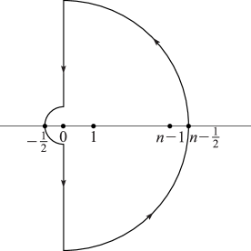

# §2.10 Sums and Sequences

:::{note}
**Keywords:**

[asymptotic approximations of sums and sequences](http://dlmf.nist.gov/search/search?q=asymptotic%20approximations%20of%20sums%20and%20sequences)

**See also:**

Annotations for Ch.2
:::

## §2.10(i) Euler–Maclaurin Formula

:::{note}
**Keywords:**

[Abel–Plana formula](http://dlmf.nist.gov/search/search?q=Abel%E2%80%93Plana%20formula) , [Euler–Maclaurin formula](http://dlmf.nist.gov/search/search?q=Euler%E2%80%93Maclaurin%20formula) , [asymptotic approximations of sums and sequences](http://dlmf.nist.gov/search/search?q=asymptotic%20approximations%20of%20sums%20and%20sequences)

**Notes:**

See Olver ([1997b](./bib/O.html#bib1809 "Asymptotics and Special Functions"), pp. 279–292).

**Referenced by:**

§24.17(i) , §3.5(i) , §5.17 , Erratum (V1.1.0) for Citations

**See also:**

Annotations for §2.10 and Ch.2
:::

As in § [24.2](./24.2.md "§24.2 Definitions and Generating Functions ‣ Properties ‣ Chapter 24 Bernoulli and Euler Polynomials") , let $B_{n}$ and $B_{n}\left(x\right)$ denote the $n$ th Bernoulli number and polynomial, respectively, and $\widetilde{B}_{n}\left(x\right)$ the $n$ th Bernoulli periodic function $B_{n}\left(x-\left\lfloor x\right\rfloor\right)$ .

Assume that $a,m$ , and $n$ are integers such that $n>a$ , $m>0$ , and $f^{(2m)}(x)$ is absolutely integrable over $[a,n]$ . Then

$$
\sum_{j=a}^{n}f(j)=\int_{a}^{n}f(x)\,\mathrm{d}x+\tfrac{1}{2}f(a)+\tfrac{1}{2}f(n)+\sum_{s=1}^{m-1}\frac{B_{2s}}{(2s)!}\left(f^{(2s-1)}(n)-f^{(2s-1)}(a)\right)+\int_{a}^{n}\frac{B_{2m}-\widetilde{B}_{2m}\left(x\right)}{(2m)!}f^{(2m)}(x)\,\mathrm{d}x. \tag{2.10.1}
$$

This is the *Euler–Maclaurin formula* . Another version is the *Abel–Plana formula* :

$$
\sum_{j=a}^{n}f(j)=\int_{a}^{n}f(x)\,\mathrm{d}x+\tfrac{1}{2}f(a)+\tfrac{1}{2}f(n)-2\int_{0}^{\infty}\frac{\Im\left(f(a+iy)\right)}{e^{2\pi y}-1}\,\mathrm{d}y+\sum_{s=1}^{m}\frac{B_{2s}}{(2s)!}f^{(2s-1)}(n)+2\frac{(-1)^{m}}{(2m)!}\int_{0}^{\infty}\Im\left(f^{(2m)}(n+i\vartheta_{n}y)\right)\frac{y^{2m}\,\mathrm{d}y}{e^{2\pi y}-1}, \tag{2.10.2}
$$

$\vartheta_{n}$ being some number in the interval $(0,1)$ . Sufficient conditions for the validity of this second result are:

### Example

:::{note}
**Keywords:**

[Euler–Maclaurin formula](http://dlmf.nist.gov/search/search?q=Euler%E2%80%93Maclaurin%20formula) , [Glaisher’s constant](http://dlmf.nist.gov/search/search?q=Glaisher%20constant) , [asymptotic approximations of sums and sequences](http://dlmf.nist.gov/search/search?q=asymptotic%20approximations%20of%20sums%20and%20sequences) , [extensions](http://dlmf.nist.gov/search/search?q=extensions)

**Referenced by:**

Erratum (V1.1.0) for Citations

**Clarification (effective with 1.1.0):**

Citations were added at the end of this paragraph.

**See also:**

Annotations for §2.10(i) , §2.10 and Ch.2
:::

$$
S(n)=\sum_{j=1}^{n}j\ln j \tag{2.10.3}
$$

for large $n$ . From ( 2.10.1 )

$$
S(n)=\tfrac{1}{2}n^{2}\ln n-\tfrac{1}{4}n^{2}+\tfrac{1}{2}n\ln n+\tfrac{1}{12}\ln n+C+\sum_{s=2}^{m-1}\frac{(-B_{2s})}{2s(2s-1)(2s-2)}\frac{1}{n^{2s-2}}+R_{m}(n), \tag{2.10.4}
$$

where $m$ ( $\geq 2$ ) is arbitrary, $C$ is a constant, and

$$
R_{m}(n)=\int_{n}^{\infty}\frac{\widetilde{B}_{2m}\left(x\right)-B_{2m}}{2m(2m-1)x^{2m-1}}\,\mathrm{d}x. \tag{2.10.5}
$$

From § 24.12(i) , ( 24.2.2 ), and ( 24.4.27 ), $\widetilde{B}_{2m}\left(x\right)-B_{2m}$ is of constant sign $(-1)^{m}$ . Thus $R_{m}(n)$ and $R_{m+1}(n)$ are of opposite signs, and since their difference is the term corresponding to $s=m$ in ( 2.10.4 ), $R_{m}(n)$ is bounded in absolute value by this term and has the same sign.

Formula ( 2.10.2 ) is useful for evaluating the constant term in expansions obtained from ( 2.10.1 ). In the present example it leads to

$$
C=\frac{\gamma+\ln\left(2\pi\right)}{12}-\frac{\zeta'\left(2\right)}{2\pi^{2}}=\frac{1}{12}-\zeta'\left(-1\right), \tag{2.10.6}
$$

where $\gamma$ is Euler’s constant (§ 5.2(ii) ) and $\zeta'$ is the derivative of the Riemann zeta function (§ 25.2(i) ). $e^{C}$ is sometimes called *Glaisher’s constant* . For further information on $C$ see § [5.17](./5.17.md "§5.17 Barnes’ 𝐺-Function (Double Gamma Function) ‣ Properties ‣ Chapter 5 Gamma Function") .

Other examples that can be verified in a similar way are:

$$
\sum_{j=1}^{n-1}j^{\alpha}\sim\zeta\left(-\alpha\right)+\frac{n^{\alpha+1}}{\alpha+1}\sum_{s=0}^{\infty}\genfrac{(}{)}{0.0pt}{}{\alpha+1}{s}\frac{B_{s}}{n^{s}}, \tag{2.10.7}
$$

where $\alpha$ ( $\neq-1$ ) is a real constant, and

$$
\sum_{j=1}^{n-1}\frac{1}{j}\sim\ln n+\gamma-\frac{1}{2n}-\sum_{s=1}^{\infty}\frac{B_{2s}}{2s}\frac{1}{n^{2s}}, \tag{2.10.8}
$$

In both expansions the remainder term is bounded in absolute value by the first neglected term in the sum, and has the same sign, provided that in the case of ( 2.10.7 ), truncation takes place at $s=2m-1$ , where $m$ is any positive integer satisfying $m\geq\frac{1}{2}(\alpha+1)$ .

For extensions of the Euler–Maclaurin formula to functions $f(x)$ with singularities at $x=a$ or $x=n$ (or both) see Sidi ([2004](./bib/S.html#bib2076 "Euler-Maclaurin expansions for integrals with endpoint singularities: A new perspective"), [2012b](./bib/S.html#bib2936 "Euler-Maclaurin expansions for integrals with arbitrary algebraic-logarithmic endpoint singularities"), [2012a](./bib/S.html#bib2937 "Euler-Maclaurin expansions for integrals with arbitrary algebraic endpoint singularities")). See also Weniger ([2007](./bib/W.html#bib2396 "Asymptotic Approximations to Truncation Errors of Series Representations for Special Functions")).

For an extension to integrals with Cauchy principal values see Elliott ([1998](./bib/E.html#bib2572 "The Euler-Maclaurin formula revisited")).

## §2.10(ii) Summation by Parts

:::{note}
**Keywords:**

[asymptotic approximations of sums and sequences](http://dlmf.nist.gov/search/search?q=asymptotic%20approximations%20of%20sums%20and%20sequences) , [summation by parts](http://dlmf.nist.gov/search/search?q=summation%20by%20parts)

**Notes:**

See Olver ([1997b](./bib/O.html#bib1809 "Asymptotics and Special Functions"), pp. 295–299).

**See also:**

Annotations for §2.10 and Ch.2
:::

The formula for summation by parts is

$$
\sum_{j=1}^{n-1}u_{j}v_{j}=U_{n-1}v_{n}+\sum_{j=1}^{n-1}U_{j}(v_{j}-v_{j+1}), \tag{2.10.9}
$$

where

$$
U_{j}=u_{1}+u_{2}+\dots+u_{j}. \tag{2.10.10}
$$

This identity can be used to find asymptotic approximations for large $n$ when the factor $v_{j}$ changes slowly with $j$ , and $u_{j}$ is oscillatory; compare the approximation of Fourier integrals by integration by parts in § 2.3(i) .

### Example

:::{note}
**See also:**

Annotations for §2.10(ii) , §2.10 and Ch.2
:::

$$
S(\alpha,\beta,n)=\sum_{j=1}^{n-1}e^{ij\beta}j^{\alpha}, \tag{2.10.11}
$$

where $\alpha$ and $\beta$ are real constants with $e^{i\beta}\neq 1$ .

As a first estimate for large $n$

$$
|S(\alpha,\beta,n)|\leq\sum_{j=1}^{n-1}j^{\alpha}=O\left(1\right),\;O\left(\ln
n\right),\text{ or }O\left(n^{\alpha+1}\right), \tag{2.10.12}
$$

according as $\alpha<-1$ , $\alpha=-1$ , or $\alpha>-1;$ see ( 2.10.7 ), ( 2.10.8 ). With $u_{j}=e^{ij\beta}$ , $v_{j}=j^{\alpha}$ ,

$$
U_{j}=e^{i\beta}(e^{ij\beta}-1)/(e^{i\beta}-1), \tag{2.10.13}
$$

and

$$
S(\alpha,\beta,n)=\frac{e^{i\beta}}{e^{i\beta}-1}\left(e^{i(n-1)\beta}n^{\alpha}-1+\sum_{j=1}^{n-1}e^{ij\beta}\left(j^{\alpha}-(j+1)^{\alpha}\right)\right). \tag{2.10.14}
$$

Since

$$
j^{\alpha}-(j+1)^{\alpha}=-\alpha j^{\alpha-1}+\alpha(\alpha-1)O\left(j^{\alpha-2}\right) \tag{2.10.15}
$$

for any real constant $\alpha$ and the set of all positive integers $j$ , we derive

$$
S(\alpha,\beta,n)=\frac{e^{i\beta}}{e^{i\beta}-1}\left(e^{i(n-1)\beta}n^{\alpha}-\alpha S(\alpha-1,\beta,n)+O\left(n^{\alpha-1}\right)+O\left(1\right)\right). \tag{2.10.16}
$$

From this result and ( 2.10.12 )

$$
S(\alpha,\beta,n)=O\left(n^{\alpha}\right)+O\left(1\right). \tag{2.10.17}
$$

Then replacing $\alpha$ by $\alpha-1$ and resubstituting in ( 2.10.16 ), we have

$$
S(\alpha,\beta,n)=\frac{e^{in\beta}}{e^{i\beta}-1}n^{\alpha}+O\left(n^{\alpha-1}\right)+O\left(1\right), \tag{2.10.18}
$$

which is a useful approximation when $\alpha>0$ .

For extensions to $\alpha\leq 0$ , higher terms, and other examples, see Olver ([1997b](./bib/O.html#bib1809 "Asymptotics and Special Functions"), Chapter 8).

## §2.10(iii) Asymptotic Expansions of Entire Functions

:::{note}
**Keywords:**

[asymptotic approximations of sums and sequences](http://dlmf.nist.gov/search/search?q=asymptotic%20approximations%20of%20sums%20and%20sequences) , [asymptotic expansions](http://dlmf.nist.gov/search/search?q=asymptotic%20expansions) , [entire functions](http://dlmf.nist.gov/search/search?q=entire%20functions)

**Notes:**

See Olver ([1997b](./bib/O.html#bib1809 "Asymptotics and Special Functions"), pp. 307–309).

**See also:**

Annotations for §2.10 and Ch.2
:::

The asymptotic behavior of entire functions defined by Maclaurin series can be approached by converting the sum into a contour integral by use of the residue theorem and applying the methods of §§ [2.4](./2.4.md "§2.4 Contour Integrals ‣ Areas ‣ Chapter 2 Asymptotic Approximations") and [2.5](./2.5.md "§2.5 Mellin Transform Methods ‣ Areas ‣ Chapter 2 Asymptotic Approximations") .

### Example

:::{note}
**Keywords:**

[generalized hypergeometric function ${{}_{0}F_{2}}$](http://dlmf.nist.gov/search/search?q=generalized%20hypergeometric%20function%200F2) , [of large argument](http://dlmf.nist.gov/search/search?q=of%20large%20argument)

**See also:**

Annotations for §2.10(iii) , §2.10 and Ch.2
:::

From §§ 16.2(i) – 16.2(ii)

$$
{{}_{0}F_{2}}\left(-;1,1;x\right)=\sum_{j=0}^{\infty}\frac{x^{j}}{(j!)^{3}}. \tag{2.10.19}
$$

We seek the behavior as $x\to+\infty$ . From ( 1.10.8 )

$$
\sum_{j=0}^{n-1}\frac{x^{j}}{(j!)^{3}}=\frac{1}{2i}\int_{\mathscr{C}}\frac{x^{t}}{(\Gamma\left(t+1\right))^{3}}\cot\left(\pi t\right)\,\mathrm{d}t, \tag{2.10.20}
$$

where $\mathscr{C}$ comprises the two semicircles and two parts of the imaginary axis depicted in Figure 2.10.1 .

:::{note}
**Symbols:**

$\mathscr{C}$: contour

**Referenced by:**

§2.10(iii)

**See also:**

Annotations for §2.10(iii) , §2.10(iii) , §2.10 and Ch.2
:::

From the identities

$$
\frac{\cot\left(\pi t\right)}{2i}=-\frac{1}{2}-\frac{1}{e^{-2\pi it}-1}=\frac{1}{2}+\frac{1}{e^{2\pi it}-1}, \tag{2.10.21}
$$

and Cauchy’s theorem, we have

$$
\sum_{j=0}^{n-1}\frac{x^{j}}{(j!)^{3}}=\int_{-1/2}^{n-(1/2)}\frac{x^{t}}{(\Gamma\left(t+1\right))^{3}}\,\mathrm{d}t-\int_{\mathscr{C}_{1}}\frac{x^{t}}{(\Gamma\left(t+1\right))^{3}}\frac{\,\mathrm{d}t}{e^{-2\pi it}-1}+\int_{\mathscr{C}_{2}}\frac{x^{t}}{(\Gamma\left(t+1\right))^{3}}\frac{\,\mathrm{d}t}{e^{2\pi it}-1}, \tag{2.10.22}
$$

where $\mathscr{C}_{1},\mathscr{C}_{2}$ denote respectively the upper and lower halves of $\mathscr{C}$ . ( 5.11.7 ) shows that the integrals around the large quarter circles vanish as $n\to\infty$ . Hence

$$
{{}_{0}F_{2}}\left(-;1,1;x\right)=\int_{-1/2}^{\infty}\frac{x^{t}}{(\Gamma\left(t+1\right))^{3}}\,\mathrm{d}t+2\Re\int_{-1/2}^{i\infty}\frac{x^{t}}{(\Gamma\left(t+1\right))^{3}}\frac{\,\mathrm{d}t}{e^{-2\pi it}-1}=\int_{0}^{\infty}\frac{x^{t}}{(\Gamma\left(t+1\right))^{3}}\,\mathrm{d}t+O\left(1\right), \tag{2.10.23}
$$

the last step following from $|x^{t}|\leq 1$ when $t$ is on the interval $[-\frac{1}{2},0]$ , the imaginary axis, or the small semicircle. By application of Laplace’s method (§ 2.3(iii) ) and use again of ( 5.11.7 ), we obtain

$$
{{}_{0}F_{2}}\left(-;1,1;x\right)\sim\frac{\exp\left(3x^{1/3}\right)}{2\pi 3^{1/2}x^{1/3}}, \tag{2.10.24}
$$

For generalizations and other examples see Olver ([1997b](./bib/O.html#bib1809 "Asymptotics and Special Functions"), Chapter 8), Ford ([1960](./bib/F.html#bib822 "Studies on Divergent Series and Summability & The Asymptotic Developments of Functions Defined by Maclaurin Series")), and Berndt and Evans ([1984](./bib/B.html#bib246 "Chapter 13 of Ramanujan’s second notebook: Integrals and asymptotic expansions")). See also Paris and Kaminski ([2001](./bib/P.html#bib1845 "Asymptotics and Mellin-Barnes Integrals"), Chapter 5) and §§ 16.11(i) – 16.11(ii) .

## §2.10(iv) Taylor and Laurent Coefficients: Darboux’s Method

:::{note}
**Keywords:**

[Darboux’s method](http://dlmf.nist.gov/search/search?q=Darboux%20method) , [Laurent series](http://dlmf.nist.gov/search/search?q=Laurent%20series) , [Taylor series](http://dlmf.nist.gov/search/search?q=Taylor%20series) , [asymptotic approximations for coefficients](http://dlmf.nist.gov/search/search?q=asymptotic%20approximations%20for%20coefficients) , [asymptotic approximations of sums and sequences](http://dlmf.nist.gov/search/search?q=asymptotic%20approximations%20of%20sums%20and%20sequences)

**Notes:**

See Olver ([1997b](./bib/O.html#bib1809 "Asymptotics and Special Functions"), pp. 309–315).

**Referenced by:**

§1.10(xi) , Erratum (V1.0.19) for Notation

**See also:**

Annotations for §2.10 and Ch.2
:::

Let $f(z)$ be analytic on the annulus $0<|z|<r$ , with Laurent expansion

$$
f(z)=\sum_{n=-\infty}^{\infty}f_{n}z^{n}, \tag{2.10.25}
$$

What is the asymptotic behavior of $f_{n}$ as $n\to\infty$ or $n\to-\infty$ ? More specially, what is the behavior of the higher coefficients in a Taylor-series expansion?

These problems can be brought within the scope of § [2.4](./2.4.md "§2.4 Contour Integrals ‣ Areas ‣ Chapter 2 Asymptotic Approximations") by means of Cauchy’s integral formula

$$
f_{n}=\frac{1}{2\pi i}\int_{\mathscr{C}}\frac{f(z)}{z^{n+1}}\,\mathrm{d}z, \tag{2.10.26}
$$

where $\mathscr{C}$ is a simple closed contour in the annulus that encloses $z=0$ . For examples see Olver ([1997b](./bib/O.html#bib1809 "Asymptotics and Special Functions"), Chapters 8, 9).

However, if $r$ is finite and $f(z)$ has algebraic or logarithmic singularities on $|z|=r$ , then *Darboux’s method* is usually easier to apply. We need a “comparison function” $g(z)$ with the properties:

$$
g(z)=\sum_{n=-\infty}^{\infty}g_{n}z^{n}, \tag{2.10.27}
$$

By allowing the contour in Cauchy’s formula to expand, we find that

$$
f_{n}-g_{n}=\frac{1}{2\pi i}\int_{|z|=r}\frac{f(z)-g(z)}{z^{n+1}}\,\mathrm{d}z=\frac{1}{2\pi r^{n}}\int_{0}^{2\pi}\left(f\left(re^{i\theta}\right)-g\left(re^{i\theta}\right)\right)e^{-ni\theta}\,\mathrm{d}\theta. \tag{2.10.28}
$$

Hence by the Riemann–Lebesgue lemma (§ 1.8(i) )

$$
f_{n}=g_{n}+o\left(r^{-n}\right), \tag{2.10.29}
$$

This result is refinable in two important ways. First, the conditions can be weakened. It is unnecessary for $f(z)-g(z)$ to be continuous on $|z|=r$ : it suffices that the integrals in ( 2.10.28 ) converge uniformly. For example, Condition (b) can be replaced by:

$$
f(z)-g(z)=O\left((z-z_{j})^{\sigma_{j}-1}\right), \tag{2.10.30}
$$

Secondly, when $f(z)-g(z)$ is $m$ times continuously differentiable on $|z|=r$ the result ( 2.10.29 ) can be strengthened. In these circumstances the integrals in ( 2.10.28 ) are integrable by parts $m$ times, yielding

$$
f_{n}=g_{n}+o\left(r^{-n}|n|^{-m}\right), \tag{2.10.31}
$$

Furthermore, ( 2.10.31 ) remains valid with the weaker condition

$$
f^{(m)}(z)-g^{(m)}(z)=O\left((z-z_{j})^{\sigma_{j}-1}\right), \tag{2.10.32}
$$

in the neighborhood of each singularity $z_{j}$ , again with $\sigma_{j}>0$ .

### Example

:::{note}
**Keywords:**

[Darboux’s method](http://dlmf.nist.gov/search/search?q=Darboux%20method) , [Legendre polynomials](http://dlmf.nist.gov/search/search?q=Legendre%20polynomials) , [asymptotic approximations of sums and sequences](http://dlmf.nist.gov/search/search?q=asymptotic%20approximations%20of%20sums%20and%20sequences) , [large degree](http://dlmf.nist.gov/search/search?q=large%20degree)

**See also:**

Annotations for §2.10(iv) , §2.10 and Ch.2
:::

Let $\alpha$ be a constant in $(0,2\pi)$ and $P_{n}$ denote the Legendre polynomial of degree $n$ . From § 14.7(iv)

$$
f(z)\equiv\frac{1}{(1-2z\cos\alpha+z^{2})^{1/2}}=\sum_{n=0}^{\infty}P_{n}\left(\cos\alpha\right)z^{n}, \tag{2.10.33}
$$

The singularities of $f(z)$ on the unit circle are branch points at $z=e^{\pm i\alpha}$ . To match the limiting behavior of $f(z)$ at these points we set

$$
g(z)=e^{-\pi i/4}(2\sin\alpha)^{-1/2}\left(e^{-i\alpha}-z\right)^{-1/2}+e^{\pi
i/4}(2\sin\alpha)^{-1/2}\left(e^{i\alpha}-z\right)^{-1/2}. \tag{2.10.34}
$$

Here the branch of $\left(e^{-i\alpha}-z\right)^{-1/2}$ is continuous in the $z$ -plane cut along the outward-drawn ray through $z=e^{-i\alpha}$ and equals $e^{i\alpha/2}$ at $z=0$ . Similarly for $\left(e^{i\alpha}-z\right)^{-1/2}$ . In Condition (c) we have

$$
g_{n}=\left(\frac{2}{\pi\sin\alpha}\right)^{1/2}\frac{\Gamma\left(n+\frac{1}{2}\right)}{n!}\cos\left(n\alpha+\tfrac{1}{2}\alpha-\tfrac{1}{4}\pi\right), \tag{2.10.35}
$$

and in the supplementary conditions we may set $m=1$ . Then from ( 2.10.31 ) and ( 5.11.7 )

$$
P_{n}\left(\cos\alpha\right)=\left(\frac{2}{\pi n\sin\alpha}\right)^{1/2}\cos\left(n\alpha+\tfrac{1}{2}\alpha-\tfrac{1}{4}\pi\right)+o\left(n^{-1}\right). \tag{2.10.36}
$$

For higher terms see § 18.15(iii) .

For uniform expansions when two singularities coalesce on the circle of convergence see Wong and Zhao ([2005](./bib/W.html#bib2454 "On a uniform treatment of Darboux’s method")).

For other examples and extensions see Olver ([1997b](./bib/O.html#bib1809 "Asymptotics and Special Functions"), Chapter 8), Olver ([1970](./bib/O.html#bib1791 "A paradox in asymptotics")), Wong ([1989](./bib/W.html#bib2438 "Asymptotic Approximations of Integrals"), Chapter 2), and Wong and Wyman ([1974](./bib/W.html#bib2430 "The method of Darboux")). See also Flajolet and Odlyzko ([1990](./bib/F.html#bib805 "Singularity analysis of generating functions")).
