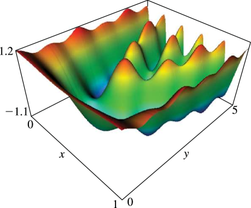

# §21.4 Graphics

:::{note}
**Keywords:**

[Riemann theta functions](http://dlmf.nist.gov/search/search?q=Riemann%20theta%20functions) , [graphics](http://dlmf.nist.gov/search/search?q=graphics)

**Notes:**

These graphics were computed by the author, using the algorithms described in Deconinck et al. ([2004](./bib/D.html#bib632 "Computing Riemann theta functions")).

**See also:**

Annotations for Ch.21
:::

Figure 21.4.1 provides surfaces of the scaled Riemann theta function $\hat{\theta}\left(\mathbf{z}\middle|\boldsymbol{{\Omega}}\right)$ , with

$$
\boldsymbol{{\Omega}}=\begin{bmatrix}1.69098\;3006+0.95105\;6516\,i&1.5+0.36327\;1264\,i\\
1.5+0.36327\;1264\,i&1.30901\;6994+0.95105\;6516\,i\end{bmatrix}. \tag{21.4.1}
$$

This Riemann matrix originates from the Riemann surface represented by the algebraic curve $\mu^{3}-\lambda^{7}+2\lambda^{3}\mu=0$ ; compare § 21.7(i) .

![Figure 21.4.1: $\hat{\theta}\left(\mathbf{z}\middle|\boldsymbol{{\Omega}}\right)$ parametrized by ( 21.4.1 ). The surface plots are of $\hat{\theta}\left(x+iy,0\middle|\boldsymbol{{\Omega}}\right)$ , $0\leq x\leq 1$ , $0\leq y\leq 5$ (suffix 1); $\hat{\theta}\left(x,y\middle|\boldsymbol{{\Omega}}\right)$ , $0\leq x\leq 1$ , $0\leq y\leq 1$ (suffix 2); $\hat{\theta}\left(ix,iy\middle|\boldsymbol{{\Omega}}\right)$ , $0\leq x\leq 5$ , $0\leq y\leq 5$ (suffix 3). Shown are the real part (a), the imaginary part (b), and the modulus (c). 3D Help](../html/21/4/F1a.png)
:::{note}
**Symbols:**

$\hat{\theta}\left(\NVar{\mathbf{z}}\middle|\NVar{\boldsymbol{{\Omega}}}\right)$: scaled Riemann theta function , $\mathrm{i}$: imaginary unit and $\boldsymbol{{\Omega}}$: a Riemann matrix

**Referenced by:**

§21.4

**See also:**

Annotations for §21.4 and Ch.21
:::

For the scaled Riemann theta functions depicted in Figures 21.4.2 – 21.4.5

$$
\boldsymbol{{\Omega}}_{1}=\begin{bmatrix}i&-\tfrac{1}{2}\\
-\tfrac{1}{2}&i\end{bmatrix}, \tag{21.4.2}
$$

and

$$
\boldsymbol{{\Omega}}_{2}=\begin{bmatrix}-\tfrac{1}{2}+i&\tfrac{1}{2}-\tfrac{1}{2}i&-\tfrac{1}{2}-\tfrac{1}{2}i\\
\tfrac{1}{2}-\tfrac{1}{2}i&i&0\\
-\tfrac{1}{2}-\tfrac{1}{2}i&0&i\end{bmatrix}. \tag{21.4.3}
$$

:::{note}
**Symbols:**

$\hat{\theta}\left(\NVar{\mathbf{z}}\middle|\NVar{\boldsymbol{{\Omega}}}\right)$: scaled Riemann theta function , $\mathrm{i}$: imaginary unit , $\Re$: real part and $\boldsymbol{{\Omega}}$: a Riemann matrix

**Referenced by:**

§21.4

**See also:**

Annotations for §21.4 and Ch.21
:::

:::{note}
**Symbols:**

$\hat{\theta}\left(\NVar{\mathbf{z}}\middle|\NVar{\boldsymbol{{\Omega}}}\right)$: scaled Riemann theta function , $\mathrm{i}$: imaginary unit and $\boldsymbol{{\Omega}}$: a Riemann matrix

**See also:**

Annotations for §21.4 and Ch.21
:::
