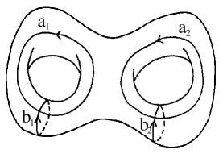

# §21.7 Riemann Surfaces

:::{note}
**Keywords:**

[Riemann surface](http://dlmf.nist.gov/search/search?q=Riemann%20surface)

**See also:**

Annotations for Ch.21
:::

## §21.7(i) Connection of Riemann Theta Functions to Riemann Surfaces

:::{note}
**Keywords:**

[Riemann surface](http://dlmf.nist.gov/search/search?q=Riemann%20surface) , [algebraic curves](http://dlmf.nist.gov/search/search?q=algebraic%20curves) , [connection with Riemann theta functions](http://dlmf.nist.gov/search/search?q=connection%20with%20Riemann%20theta%20functions) , [cycle](http://dlmf.nist.gov/search/search?q=cycle) , [cycles](http://dlmf.nist.gov/search/search?q=cycles) , [definition](http://dlmf.nist.gov/search/search?q=definition) , [genus](http://dlmf.nist.gov/search/search?q=genus) , [handle](http://dlmf.nist.gov/search/search?q=handle) , [holomorphic differentials](http://dlmf.nist.gov/search/search?q=holomorphic%20differentials) , [intersection indices](http://dlmf.nist.gov/search/search?q=intersection%20indices) , [plane algebraic curves](http://dlmf.nist.gov/search/search?q=plane%20algebraic%20curves)

**Referenced by:**

§21.1 , Figure 21.4.5 , [Figure 21.4.5](./21.4.F5.mag.md "In §21.4 Graphics ‣ Properties ‣ Chapter 21 Multidimensional Theta Functions") , [Figure 21.4.5](./21.4.F5.viz.md "In §21.4 Graphics ‣ Properties ‣ Chapter 21 Multidimensional Theta Functions") , §21.4

**See also:**

Annotations for §21.7 and Ch.21
:::

In almost all applications, a Riemann theta function is associated with a compact Riemann surface. Although there are other ways to represent Riemann surfaces (see e.g. Belokolos et al. ([1994](./bib/B.html#bib232 "Algebro-geometric Approach to Nonlinear Integrable Problems"), §2.1)), they are obtainable from *plane algebraic curves* (Springer ([1957](./bib/S.html#bib2146 "Introduction to Riemann Surfaces")), or Riemann ([1851](./bib/R.html#bib1950 "Grundlagen für eine allgemeine Theorie der Functionen einer veränderlichen complexen Grösse"))). Consider the set of points in ${\mathbb{C}}^{2}$ that satisfy the equation

$$
P(\lambda,\mu)=0, \tag{21.7.1}
$$

where $P(\lambda,\mu)$ is a polynomial in $\lambda$ and $\mu$ that does not factor over ${\mathbb{C}}^{2}$ . Equation ( 21.7.1 ) determines a plane algebraic curve in ${\mathbb{C}}^{2}$ , which is made compact by adding its points at infinity. To accomplish this we write ( 21.7.1 ) in terms of homogeneous coordinates:

$$
\tilde{P}(\tilde{\lambda},\tilde{\mu},\tilde{\eta})=0, \tag{21.7.2}
$$

by setting $\lambda=\tilde{\lambda}/\tilde{\eta}$ , $\mu=\tilde{\mu}/\tilde{\eta}$ , and then clearing fractions. This compact curve may have singular points, that is, points at which the gradient of $\tilde{P}$ vanishes. Removing the singularities of this curve gives rise to a two-dimensional connected manifold with a complex-analytic structure, that is, a *Riemann surface. All compact Riemann surfaces can be obtained this way.*

Since a Riemann surface $\Gamma$ is a two-dimensional manifold that is orientable (owing to its analytic structure), its only topological invariant is its *genus* $g$ (the number of *handles* in the surface). On this surface, we choose $2g$ *cycles* (that is, closed oriented curves, each with at most a finite number of singular points) $a_{j}$ , $b_{j}$ , $j=1,2,\dots,g$ , such that their *intersection indices* satisfy

$$
\displaystyle a_{j}\circ a_{k} \displaystyle=0, \tag{21.7.3}
$$

$$
\displaystyle b_{j}\circ b_{k} \displaystyle=0,
$$

$$
\displaystyle a_{j}\circ b_{k} \displaystyle=\delta_{j,k}.
$$

:::{note}
**Symbols:**

$\delta_{\NVar{j},\NVar{k}}$: Kronecker delta , $a_{j}$: cycles and $b_{j}$: cycles

**See also:**

Annotations for §21.7(i) , §21.7 and Ch.21
:::

For example, Figure 21.7.1 depicts a genus 2 surface.

:::{note}
**Referenced by:**

§21.7(i)

**See also:**

Annotations for §21.7(i) , §21.7 and Ch.21
:::

On a Riemann surface of genus $g$ , there are $g$ linearly independent *holomorphic differentials* $\omega_{j}$ , $j=1,2,\dots,g$ . If a local coordinate $z$ is chosen on the Riemann surface, then the local coordinate representation of these holomorphic differentials is given by

$$
\omega_{j}=f_{j}(z)\,\mathrm{d}z, \tag{21.7.4}
$$

where $f_{j}(z)$ , $j=1,2,\dots,g$ are analytic functions. Thus the differentials $\omega_{j}$ , $j=1,2,\dots,g$ have no singularities on $\Gamma$ . Note that for the purposes of integrating these holomorphic differentials, all cycles on the surface are a linear combination of the cycles $a_{j}$ , $b_{j}$ , $j=1,2,\dots,g$ . The $\omega_{j}$ are normalized so that

$$
\oint_{a_{k}}\omega_{j}=\delta_{j,k}, \tag{21.7.5}
$$

Then the matrix defined by

$$
\Omega_{jk}=\oint_{b_{k}}\omega_{j}, \tag{21.7.6}
$$

is a Riemann matrix and it is used to define the corresponding Riemann theta function. *In this way, we associate a Riemann theta function with every compact Riemann surface $\Gamma$.*

Riemann theta functions originating from Riemann surfaces are special in the sense that a general $g$ -dimensional Riemann theta function depends on $g(g+1)/2$ complex parameters. In contrast, a $g$ -dimensional Riemann theta function arising from a compact Riemann surface of genus $g$ ( $>1$ ) depends on at most $3g-3$ complex parameters (one complex parameter for the case $g=1$ ). These special Riemann theta functions satisfy many special identities, two of which appear in the following subsections. For more information, see Dubrovin ([1981](./bib/D.html#bib685 "Theta functions and non-linear equations")), Brieskorn and Knörrer ([1986](./bib/B.html#bib353 "Plane Algebraic Curves"), §9.3), Belokolos et al. ([1994](./bib/B.html#bib232 "Algebro-geometric Approach to Nonlinear Integrable Problems"), Chapter 2), and Mumford ([1984](./bib/M.html#bib1682 "Tata Lectures on Theta. II"), §2.2–2.3).

## §21.7(ii) Fay’s Trisecant Identity

:::{note}
**Keywords:**

[Fay’s trisecant identity](http://dlmf.nist.gov/search/search?q=Fay%20trisecant%20identity) , [Riemann surface](http://dlmf.nist.gov/search/search?q=Riemann%20surface) , [Riemann theta functions with characteristics](http://dlmf.nist.gov/search/search?q=Riemann%20theta%20functions%20with%20characteristics) , [generalizations](http://dlmf.nist.gov/search/search?q=generalizations) , [prime form](http://dlmf.nist.gov/search/search?q=prime%20form)

**Notes:**

See Mumford ([1984](./bib/M.html#bib1682 "Tata Lectures on Theta. II"), pp. 207-260).

**See also:**

Annotations for §21.7 and Ch.21
:::

Let $\boldsymbol{{\alpha}}$ , $\boldsymbol{{\beta}}$ be such that

$$
\left(\frac{\partial}{\partial z_{1}}\theta\genfrac{[}{]}{0.0pt}{}{\boldsymbol{{\alpha}}}{\boldsymbol{{\beta}}}\left(\mathbf{z}\middle|\boldsymbol{{\Omega}}\right)\Big{|}_{\mathbf{z}=\boldsymbol{{0}}},\dots,\frac{\partial}{\partial z_{g}}\theta\genfrac{[}{]}{0.0pt}{}{\boldsymbol{{\alpha}}}{\boldsymbol{{\beta}}}\left(\mathbf{z}\middle|\boldsymbol{{\Omega}}\right)\Big{|}_{\mathbf{z}=\boldsymbol{{0}}}\right)\neq\boldsymbol{{0}}. \tag{21.7.7}
$$

Define the holomorphic differential

$$
\zeta=\sum_{j=1}^{g}\omega_{j}\frac{\partial}{\partial z_{j}}\theta\genfrac{[}{]}{0.0pt}{}{\boldsymbol{{\alpha}}}{\boldsymbol{{\beta}}}\left(\mathbf{z}\middle|\boldsymbol{{\Omega}}\right)\Big{|}_{\mathbf{z}=\boldsymbol{{0}}}. \tag{21.7.8}
$$

Then the *prime form* on the corresponding compact Riemann surface $\Gamma$ is defined by

$$
E(P_{1},P_{2})=\theta\genfrac{[}{]}{0.0pt}{}{\boldsymbol{{\alpha}}}{\boldsymbol{{\beta}}}\left(\int_{P_{1}}^{P_{2}}\boldsymbol{{\omega}}\middle|\boldsymbol{{\Omega}}\right)\Bigg{/}\left(\sqrt{\zeta(P_{1})}\sqrt{\zeta(P_{2})}\right), \tag{21.7.9}
$$

where $P_{1}$ and $P_{2}$ are points on $\Gamma$ , $\boldsymbol{{\omega}}=(\omega_{1},\omega_{2},\dots,\omega_{g})$ , and the path of integration on $\Gamma$ from $P_{1}$ to $P_{2}$ is identical for all components. Here $\sqrt{\zeta(P)}$ is such that $\sqrt{\zeta(P)}^{2}=\zeta(P)$ , $P\in\Gamma$ . Either branch of the square roots may be chosen, as long as the branch is consistent across $\Gamma$ . For all $\mathbf{z}\in{\mathbb{C}}^{g}$ , and all $P_{1}$ , $P_{2}$ , $P_{3}$ , $P_{4}$ on $\Gamma$ , Fay’s identity is given by

$$
\theta\left(\mathbf{z}+\int_{P_{1}}^{P_{3}}\boldsymbol{{\omega}}\middle|\boldsymbol{{\Omega}}\right)\theta\left(\mathbf{z}+\int_{P_{2}}^{P_{4}}\boldsymbol{{\omega}}\middle|\boldsymbol{{\Omega}}\right)E(P_{3},P_{2})E(P_{1},P_{4})+\theta\left(\mathbf{z}+\int_{P_{2}}^{P_{3}}\boldsymbol{{\omega}}\middle|\boldsymbol{{\Omega}}\right)\theta\left(\mathbf{z}+\int_{P_{1}}^{P_{4}}\boldsymbol{{\omega}}\middle|\boldsymbol{{\Omega}}\right)E(P_{3},P_{1})E(P_{4},P_{2})=\theta\left(\mathbf{z}\middle|\boldsymbol{{\Omega}}\right)\theta\left(\mathbf{z}+\int_{P_{1}}^{P_{3}}\boldsymbol{{\omega}}+\int_{P_{2}}^{P_{4}}\boldsymbol{{\omega}}\middle|\boldsymbol{{\Omega}}\right)E(P_{1},P_{2})E(P_{3},P_{4}), \tag{21.7.10}
$$

where again all integration paths are identical for all components. Generalizations of this identity are given in Fay ([1973](./bib/F.html#bib778 "Theta Functions on Riemann Surfaces"), Chapter 2). Fay derives ( 21.7.10 ) as a special case of a more general class of addition theorems for Riemann theta functions on Riemann surfaces.

## §21.7(iii) Frobenius’ Identity

:::{note}
**Keywords:**

[Frobenius’ identity](http://dlmf.nist.gov/search/search?q=Frobenius%E2%80%99%20identity) , [Riemann surface](http://dlmf.nist.gov/search/search?q=Riemann%20surface) , [Riemann theta functions with characteristics](http://dlmf.nist.gov/search/search?q=Riemann%20theta%20functions%20with%20characteristics) , [algebraic curves](http://dlmf.nist.gov/search/search?q=algebraic%20curves) , [hyperelliptic](http://dlmf.nist.gov/search/search?q=hyperelliptic)

**Notes:**

See Mumford ([1984](./bib/M.html#bib1682 "Tata Lectures on Theta. II"), pp. 106–120).

**Referenced by:**

§20.11(iv)

**See also:**

Annotations for §21.7 and Ch.21
:::

Let $\Gamma$ be a *hyperelliptic Riemann surface* . These are Riemann surfaces that may be obtained from algebraic curves of the form

$$
\mu^{2}=Q(\lambda), \tag{21.7.11}
$$

where $Q(\lambda)$ is a polynomial in $\lambda$ of odd degree $2g+1$ $(\geq 5)$ . The genus of this surface is $g$ . The zeros $\lambda_{j}$ , $j=1,2,\dots,2g+1$ of $Q(\lambda)$ specify the finite branch points $P_{j}$ , that is, points at which $\mu_{j}=0$ , on the Riemann surface. Denote the set of all branch points by $B=\{P_{1},P_{2},\dots,P_{2g+1},P_{\infty}\}$ . Consider a fixed subset $U$ of $B$ , such that the number of elements $|U|$ in the set $U$ is $g+1$ , and $P_{\infty}\notin U$ . Next, define an isomorphism $\boldsymbol{{\eta}}$ which maps every subset $T$ of $B$ with an even number of elements to a $2g$ -dimensional vector $\boldsymbol{{\eta}}(T)$ with elements either $0$ or $\tfrac{1}{2}$ . Define the operation

$$
T_{1}\ominus T_{2}=(T_{1}\cup T_{2})\setminus(T_{1}\cap T_{2}). \tag{21.7.12}
$$

Also, $T^{c}=B\setminus T$ , $\boldsymbol{{\eta}}^{1}(T)=(\eta_{1}(T),\eta_{2}(T),\dots,\eta_{g}(T))$ , and $\boldsymbol{{\eta}}^{2}(T)=(\eta_{g+1}(T),\eta_{g+2}(T),\dots,\eta_{2g}(T))$ . Then the isomorphism is determined completely by:

$$
\boldsymbol{{\eta}}(T)=\boldsymbol{{\eta}}(T^{c}), \tag{21.7.13}
$$

$$
\boldsymbol{{\eta}}(T_{1}\ominus T_{2})=\boldsymbol{{\eta}}(T_{1})+\boldsymbol{{\eta}}(T_{2}), \tag{21.7.14}
$$

$$
4\boldsymbol{{\eta}}^{1}(T)\cdot\boldsymbol{{\eta}}^{2}(T)=\tfrac{1}{2}\left(|T\ominus U|-g-1\right)\pmod{2}, \tag{21.7.15}
$$

$$
4(\boldsymbol{{\eta}}^{1}(T_{1})\cdot\boldsymbol{{\eta}}^{2}(T_{2})-\boldsymbol{{\eta}}^{2}(T_{1})\cdot\boldsymbol{{\eta}}^{1}(T_{2}))=|T_{1}\cap T_{2}|\pmod{2}. \tag{21.7.16}
$$

Furthermore, let $\boldsymbol{{\eta}}(P_{\infty})=\boldsymbol{{0}}$ and $\boldsymbol{{\eta}}(P_{j})=\boldsymbol{{\eta}}(\{P_{j},P_{\infty}\})$ . Then for all $\mathbf{z}_{j}\in{\mathbb{C}}^{g}$ , $j=1,2,3,4$ , such that $\mathbf{z}_{1}+\mathbf{z}_{2}+\mathbf{z}_{3}+\mathbf{z}_{4}=0$ , and for all $\boldsymbol{{\alpha}}_{j}$ , $\boldsymbol{{\beta}}_{j}$ $\in{\mathbb{R}}^{g}$ , such that $\boldsymbol{{\alpha}}_{1}+\boldsymbol{{\alpha}}_{2}+\boldsymbol{{\alpha}}_{3}+\boldsymbol{{\alpha}}_{4}=0$ and $\boldsymbol{{\beta}}_{1}+\boldsymbol{{\beta}}_{2}+\boldsymbol{{\beta}}_{3}+\boldsymbol{{\beta}}_{4}=0$ , we have *Frobenius’ identity* :

$$
\sum_{P_{j}\in U}\prod_{k=1}^{4}\theta\genfrac{[}{]}{0.0pt}{}{\boldsymbol{{\alpha}}_{k}+\boldsymbol{{\eta}}^{1}(P_{j})}{\boldsymbol{{\beta}}_{k}+\boldsymbol{{\eta}}^{2}(P_{j})}\left(\mathbf{z}_{k}\middle|\boldsymbol{{\Omega}}\right)=\sum_{P_{j}\in U^{c}}\prod_{k=1}^{4}\theta\genfrac{[}{]}{0.0pt}{}{\boldsymbol{{\alpha}}_{k}+\boldsymbol{{\eta}}^{1}(P_{j})}{\boldsymbol{{\beta}}_{k}+\boldsymbol{{\eta}}^{2}(P_{j})}\left(\mathbf{z}_{k}\middle|\boldsymbol{{\Omega}}\right). \tag{21.7.17}
$$
