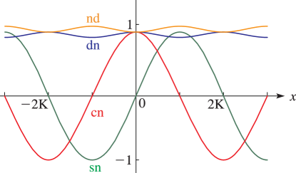
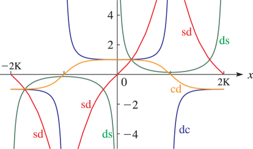
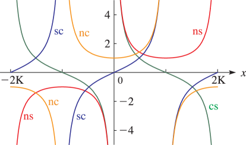
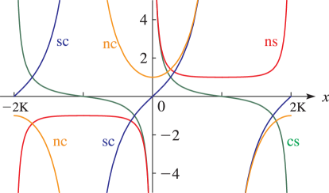
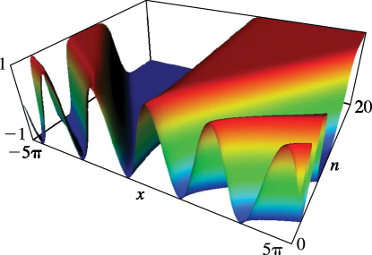
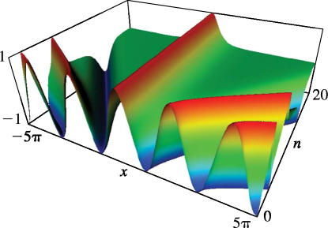

# §22.3 Graphics

:::{note}
**See also:**

Annotations for Ch.22
:::

## §22.3(i) Real Variables: Line Graphs

:::{note}
**Keywords:**

[Jacobian elliptic functions](http://dlmf.nist.gov/search/search?q=Jacobian%20elliptic%20functions) , [graphics](http://dlmf.nist.gov/search/search?q=graphics) , [real variable](http://dlmf.nist.gov/search/search?q=real%20variable)

**Notes:**

Figures 22.3.1 – 22.3.12 were produced at NIST and by the authors.

**Referenced by:**

Figure 22.16.2 , [Figure 22.16.2](./22.16.F2.mag.md "In §22.16 Related Functions ‣ Properties ‣ Chapter 22 Jacobian Elliptic Functions") , §23.4(i)

**See also:**

Annotations for §22.3 and Ch.22
:::

Line graphs of the functions $\operatorname{sn}\left(x,k\right)$ , $\operatorname{cn}\left(x,k\right)$ , $\operatorname{dn}\left(x,k\right)$ , $\operatorname{cd}\left(x,k\right)$ , $\operatorname{sd}\left(x,k\right)$ , $\operatorname{nd}\left(x,k\right)$ , $\operatorname{dc}\left(x,k\right)$ , $\operatorname{nc}\left(x,k\right)$ , $\operatorname{sc}\left(x,k\right)$ , $\operatorname{ns}\left(x,k\right)$ , $\operatorname{ds}\left(x,k\right)$ , and $\operatorname{cs}\left(x,k\right)$ for representative values of real $x$ and real $k$ illustrating the near trigonometric ( $k=0$ ), and near hyperbolic ( $k=1$ ) limits.

:::{note}
**Symbols:**

$\operatorname{cn}\left(\NVar{z},\NVar{k}\right)$: Jacobian elliptic function , $\operatorname{dn}\left(\NVar{z},\NVar{k}\right)$: Jacobian elliptic function , $\operatorname{sn}\left(\NVar{z},\NVar{k}\right)$: Jacobian elliptic function , $K\left(\NVar{k}\right)$: Legendre’s complete elliptic integral of the first kind , $x$: real and $k$: modulus

**Referenced by:**

§22.3(i)

**See also:**

Annotations for §22.3(i) , §22.3 and Ch.22
:::

:::{note}
**Symbols:**

$\operatorname{cn}\left(\NVar{z},\NVar{k}\right)$: Jacobian elliptic function , $\operatorname{dn}\left(\NVar{z},\NVar{k}\right)$: Jacobian elliptic function , $\operatorname{sn}\left(\NVar{z},\NVar{k}\right)$: Jacobian elliptic function , $K\left(\NVar{k}\right)$: Legendre’s complete elliptic integral of the first kind , $x$: real and $k$: modulus

**See also:**

Annotations for §22.3(i) , §22.3 and Ch.22
:::

:::{note}
**Symbols:**

$\operatorname{dc}\left(\NVar{z},\NVar{k}\right)$: Jacobian elliptic function , $\operatorname{ds}\left(\NVar{z},\NVar{k}\right)$: Jacobian elliptic function , $\operatorname{sd}\left(\NVar{z},\NVar{k}\right)$: Jacobian elliptic function , $K\left(\NVar{k}\right)$: Legendre’s complete elliptic integral of the first kind , $x$: real and $k$: modulus

**See also:**

Annotations for §22.3(i) , §22.3 and Ch.22
:::

:::{note}
**Symbols:**

$\operatorname{dc}\left(\NVar{z},\NVar{k}\right)$: Jacobian elliptic function , $\operatorname{ds}\left(\NVar{z},\NVar{k}\right)$: Jacobian elliptic function , $\operatorname{sd}\left(\NVar{z},\NVar{k}\right)$: Jacobian elliptic function , $K\left(\NVar{k}\right)$: Legendre’s complete elliptic integral of the first kind , $x$: real and $k$: modulus

**See also:**

Annotations for §22.3(i) , §22.3 and Ch.22
:::

:::{note}
**Symbols:**

$\operatorname{cs}\left(\NVar{z},\NVar{k}\right)$: Jacobian elliptic function , $\operatorname{ns}\left(\NVar{z},\NVar{k}\right)$: Jacobian elliptic function , $\operatorname{sc}\left(\NVar{z},\NVar{k}\right)$: Jacobian elliptic function , $K\left(\NVar{k}\right)$: Legendre’s complete elliptic integral of the first kind , $x$: real and $k$: modulus

**See also:**

Annotations for §22.3(i) , §22.3 and Ch.22
:::

:::{note}
**Symbols:**

$\operatorname{cs}\left(\NVar{z},\NVar{k}\right)$: Jacobian elliptic function , $\operatorname{ns}\left(\NVar{z},\NVar{k}\right)$: Jacobian elliptic function , $\operatorname{sc}\left(\NVar{z},\NVar{k}\right)$: Jacobian elliptic function , $K\left(\NVar{k}\right)$: Legendre’s complete elliptic integral of the first kind , $x$: real and $k$: modulus

**See also:**

Annotations for §22.3(i) , §22.3 and Ch.22
:::

## §22.3(ii) Real Variables: Surfaces

:::{note}
**Keywords:**

[Jacobian elliptic functions](http://dlmf.nist.gov/search/search?q=Jacobian%20elliptic%20functions) , [graphics](http://dlmf.nist.gov/search/search?q=graphics) , [real variable](http://dlmf.nist.gov/search/search?q=real%20variable)

**Notes:**

These graphics were produced at NIST.

**See also:**

Annotations for §22.3 and Ch.22
:::

$\operatorname{sn}\left(x,k\right)$ , $\operatorname{cn}\left(x,k\right)$ , and $\operatorname{dn}\left(x,k\right)$ as functions of real arguments $x$ and $k$ . The period diverges logarithmically as $k\to 1-$ ; see § [19.12](./19.12.md "§19.12 Asymptotic Approximations ‣ Legendre’s Integrals ‣ Chapter 19 Elliptic Integrals") .

:::{note}
**Symbols:**

$\operatorname{sn}\left(\NVar{z},\NVar{k}\right)$: Jacobian elliptic function , $\pi$: the ratio of the circumference of a circle to its diameter , $\mathrm{e}$: base of natural logarithm , $x$: real , $k$: modulus and $n$: integer

**See also:**

Annotations for §22.3(ii) , §22.3 and Ch.22
:::

:::{note}
**Symbols:**

$\operatorname{cn}\left(\NVar{z},\NVar{k}\right)$: Jacobian elliptic function , $\pi$: the ratio of the circumference of a circle to its diameter , $\mathrm{e}$: base of natural logarithm , $x$: real , $k$: modulus and $n$: integer

**See also:**

Annotations for §22.3(ii) , §22.3 and Ch.22
:::

## §22.3(iii) Complex z; Real k

:::{note}
**Keywords:**

[Jacobian elliptic functions](http://dlmf.nist.gov/search/search?q=Jacobian%20elliptic%20functions) , [complex variable](http://dlmf.nist.gov/search/search?q=complex%20variable) , [graphics](http://dlmf.nist.gov/search/search?q=graphics)

**Notes:**

These graphics were produced at NIST and by the authors.

**Referenced by:**

§23.4(ii)

**See also:**

Annotations for §22.3 and Ch.22
:::

In the graphics shown in this subsection height corresponds to the absolute value of the function and color to the phase. See [About Color Map](./help/vrml/aboutcolor.md "In Viewing DLMF Interactive 3D Graphics ‣ Need Help?") .

:::{note}
**Symbols:**

$\operatorname{sn}\left(\NVar{z},\NVar{k}\right)$: Jacobian elliptic function , ${K^{\prime}}\left(\NVar{k}\right)$: Legendre’s complementary complete elliptic integral of the first kind , $K\left(\NVar{k}\right)$: Legendre’s complete elliptic integral of the first kind , $\mathrm{i}$: imaginary unit , $x$: real , $y$: real and $k$: modulus

**See also:**

Annotations for §22.3(iii) , §22.3 and Ch.22
:::

:::{note}
**Symbols:**

$\operatorname{cn}\left(\NVar{z},\NVar{k}\right)$: Jacobian elliptic function , ${K^{\prime}}\left(\NVar{k}\right)$: Legendre’s complementary complete elliptic integral of the first kind , $K\left(\NVar{k}\right)$: Legendre’s complete elliptic integral of the first kind , $\mathrm{i}$: imaginary unit , $x$: real , $y$: real and $k$: modulus

**See also:**

Annotations for §22.3(iii) , §22.3 and Ch.22
:::

:::{note}
**Symbols:**

$\operatorname{dn}\left(\NVar{z},\NVar{k}\right)$: Jacobian elliptic function , ${K^{\prime}}\left(\NVar{k}\right)$: Legendre’s complementary complete elliptic integral of the first kind , $K\left(\NVar{k}\right)$: Legendre’s complete elliptic integral of the first kind , $\mathrm{i}$: imaginary unit , $x$: real , $y$: real and $k$: modulus

**See also:**

Annotations for §22.3(iii) , §22.3 and Ch.22
:::

:::{note}
**Symbols:**

$\operatorname{dc}\left(\NVar{z},\NVar{k}\right)$: Jacobian elliptic function , ${K^{\prime}}\left(\NVar{k}\right)$: Legendre’s complementary complete elliptic integral of the first kind , $K\left(\NVar{k}\right)$: Legendre’s complete elliptic integral of the first kind , $\mathrm{i}$: imaginary unit , $x$: real , $y$: real and $k$: modulus

**See also:**

Annotations for §22.3(iii) , §22.3 and Ch.22
:::

## §22.3(iv) Complex k

:::{note}
**Keywords:**

[Jacobian elliptic functions](http://dlmf.nist.gov/search/search?q=Jacobian%20elliptic%20functions) , [complex modulus](http://dlmf.nist.gov/search/search?q=complex%20modulus) , [graphics](http://dlmf.nist.gov/search/search?q=graphics)

**Notes:**

Figures 22.3.22 – 22.3.23 and the graphics 22.3.24 – 22.3.25 were produced at NIST and by the authors. Figures 22.3.26 – 22.3.29 were produced by the authors.

**Referenced by:**

§22.1

**See also:**

Annotations for §22.3 and Ch.22
:::

:::{note}
**Symbols:**

$\operatorname{sn}\left(\NVar{z},\NVar{k}\right)$: Jacobian elliptic function , $\mathrm{i}$: imaginary unit , $\Re$: real part , $x$: real and $k$: modulus

**Referenced by:**

§22.3(iv) , Erratum (V1.0.5) for Figures 22.3.22 and 22.3.23 , Erratum (V1.0.5) for Figures 22.3.22 and 22.3.23

**Errata (effective with 1.0.5):**

The caption for this figure has been corrected. Previously it read, in part, “as a function of $k^{2}=i\kappa$ .” Also, the resolution of the graph was improved, resulting in an additional positive maximum and two additional zero crossings near $\kappa=3$ ; previously it appeared as *Reported 2011-10-30 by Paul Abbott*

**See also:**

Annotations for §22.3(iv) , §22.3 and Ch.22
:::

:::{note}
**Symbols:**

$\operatorname{sn}\left(\NVar{z},\NVar{k}\right)$: Jacobian elliptic function , $\Im$: imaginary part , $\mathrm{i}$: imaginary unit , $x$: real and $k$: modulus

**Referenced by:**

§22.3(iv) , Erratum (V1.0.5) for Figures 22.3.22 and 22.3.23

**Errata (effective with 1.0.5):**

The caption for this figure has been corrected. Previously it read, in part, “as a function of $k^{2}=i\kappa$ .” *Reported 2011-10-30 by Paul Abbott*

**See also:**

Annotations for §22.3(iv) , §22.3 and Ch.22
:::

In Figures 22.3.24 and 22.3.25 , height corresponds to the absolute value of the function and color to the phase. See p. [About Color Map](./help/vrml/aboutcolor.md "In Viewing DLMF Interactive 3D Graphics ‣ Need Help?") .

:::{note}
**Symbols:**

$\operatorname{sn}\left(\NVar{z},\NVar{k}\right)$: Jacobian elliptic function , ${K^{\prime}}\left(\NVar{k}\right)$: Legendre’s complementary complete elliptic integral of the first kind , $K\left(\NVar{k}\right)$: Legendre’s complete elliptic integral of the first kind , $\mathrm{i}$: imaginary unit , $x$: real , $y$: real and $k$: modulus

**Keywords:**

[Jacobian elliptic functions](http://dlmf.nist.gov/search/search?q=Jacobian%20elliptic%20functions) , [complex](http://dlmf.nist.gov/search/search?q=complex) , [modulus](http://dlmf.nist.gov/search/search?q=modulus)

**Referenced by:**

§22.3(iv) , §22.3(iv) , DLMF Update; Version 1.0.3

**See also:**

Annotations for §22.3(iv) , §22.3 and Ch.22
:::

:::{note}
**Symbols:**

$\operatorname{sn}\left(\NVar{z},\NVar{k}\right)$: Jacobian elliptic function , $\Im$: imaginary part , $\Re$: real part and $k$: modulus

**Keywords:**

[Jacobian elliptic functions](http://dlmf.nist.gov/search/search?q=Jacobian%20elliptic%20functions) , [complex](http://dlmf.nist.gov/search/search?q=complex) , [modulus](http://dlmf.nist.gov/search/search?q=modulus)

**Referenced by:**

§22.3(iv)

**See also:**

Annotations for §22.3(iv) , §22.3 and Ch.22
:::

:::{note}
**Symbols:**

$\operatorname{sn}\left(\NVar{z},\NVar{k}\right)$: Jacobian elliptic function , $\Im$: imaginary part , $\Re$: real part and $k$: modulus

**Keywords:**

[Jacobian elliptic functions](http://dlmf.nist.gov/search/search?q=Jacobian%20elliptic%20functions) , [complex](http://dlmf.nist.gov/search/search?q=complex) , [modulus](http://dlmf.nist.gov/search/search?q=modulus)

**See also:**

Annotations for §22.3(iv) , §22.3 and Ch.22
:::
