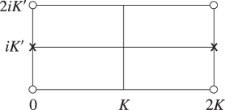
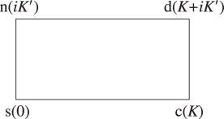

# §22.4 Periods, Poles, and Zeros

:::{note}
**See also:**

Annotations for Ch.22
:::

## §22.4(i) Distribution

:::{note}
**Keywords:**

[Jacobian elliptic functions](http://dlmf.nist.gov/search/search?q=Jacobian%20elliptic%20functions) , [congruent points](http://dlmf.nist.gov/search/search?q=congruent%20points) , [coperiodic](http://dlmf.nist.gov/search/search?q=coperiodic) , [copolar](http://dlmf.nist.gov/search/search?q=copolar) , [periods](http://dlmf.nist.gov/search/search?q=periods) , [poles](http://dlmf.nist.gov/search/search?q=poles) , [zeros](http://dlmf.nist.gov/search/search?q=zeros)

**Notes:**

See Lawden ([1989](./bib/L.html#bib1385 "Elliptic Functions and Applications"), pp. 24–30), Walker ([1996](./bib/W.html#bib2359 "Elliptic Functions. A Constructive Approach"), pp. 126–131), Whittaker and Watson ([1927](./bib/W.html#bib2404 "A Course of Modern Analysis"), pp. 491–498).

**Referenced by:**

Erratum (V1.0.3) for References

**Addition (effective with 1.0.3):**

The paragraph on the distribution of the $k$ -zeros was added.

**See also:**

Annotations for §22.4 and Ch.22
:::

For each Jacobian function, Table 22.4.1 gives its periods in the $z$ -plane in the left column, and the position of one of its poles in the second row. The other poles are at *congruent points* , which is the set of points obtained by making translations by $2mK+2niK^{\prime}$ , where $m,n\in\mathbb{Z}$ . For example, the poles of $\operatorname{sn}\left(z,k\right)$ , abbreviated as $\operatorname{sn}$ in the following tables, are at $z=2mK+(2n+1)iK^{\prime}$ .

| **Periods** | **$z$ -Poles** |   |   |   |
|---|---|---|---|---|
| **$iK^{\prime}$** | **$K+iK^{\prime}$** | **$K$** | **$0$** |   |
| **$4K$ , $2iK^{\prime}$** | **$\operatorname{sn}$** | **$\operatorname{cd}$** | **$\operatorname{dc}$** | **$\operatorname{ns}$** |
| **$4K$ , $2K+2iK^{\prime}$** | **$\operatorname{cn}$** | **$\operatorname{sd}$** | **$\operatorname{nc}$** | **$\operatorname{ds}$** |
| **$2K$ , $4iK^{\prime}$** | **$\operatorname{dn}$** | **$\operatorname{nd}$** | **$\operatorname{sc}$** | **$\operatorname{cs}$** |
: Table 22.4.1: Periods and poles of Jacobian elliptic functions.

:::{note}
**Symbols:**

$\operatorname{cd}\left(\NVar{z},\NVar{k}\right)$: Jacobian elliptic function , $\operatorname{cn}\left(\NVar{z},\NVar{k}\right)$: Jacobian elliptic function , $\operatorname{cs}\left(\NVar{z},\NVar{k}\right)$: Jacobian elliptic function , $\operatorname{dc}\left(\NVar{z},\NVar{k}\right)$: Jacobian elliptic function , $\operatorname{dn}\left(\NVar{z},\NVar{k}\right)$: Jacobian elliptic function , $\operatorname{ds}\left(\NVar{z},\NVar{k}\right)$: Jacobian elliptic function , $\operatorname{nc}\left(\NVar{z},\NVar{k}\right)$: Jacobian elliptic function , $\operatorname{nd}\left(\NVar{z},\NVar{k}\right)$: Jacobian elliptic function , $\operatorname{ns}\left(\NVar{z},\NVar{k}\right)$: Jacobian elliptic function , $\operatorname{sc}\left(\NVar{z},\NVar{k}\right)$: Jacobian elliptic function , $\operatorname{sd}\left(\NVar{z},\NVar{k}\right)$: Jacobian elliptic function , $\operatorname{sn}\left(\NVar{z},\NVar{k}\right)$: Jacobian elliptic function , ${K^{\prime}}\left(\NVar{k}\right)$: Legendre’s complementary complete elliptic integral of the first kind , $K\left(\NVar{k}\right)$: Legendre’s complete elliptic integral of the first kind , $\mathrm{i}$: imaginary unit and $z$: complex

**A&S Ref:**

Table 16.2 (modified)

**Referenced by:**

§22.4(i) , §22.4(i) , §22.4(i)

**See also:**

Annotations for §22.4(i) , §22.4 and Ch.22
:::

Three functions in the same column of Table 22.4.1 are *copolar* , and four functions in the same row are *coperiodic* .

Table 22.4.2 displays the periods and zeros of the functions in the $z$ -plane in a similar manner to Table 22.4.1 . Again, one member of each congruent set of zeros appears in the second row; all others are generated by translations of the form $2mK+2niK^{\prime}$ , where $m,n\in\mathbb{Z}$ .

| **Periods** | **$z$ -Zeros** |   |   |   |
|---|---|---|---|---|
| **$0$** | **$K$** | **$K+iK^{\prime}$** | **$iK^{\prime}$** |   |
| **$4K$ , $2iK^{\prime}$** | **$\operatorname{sn}$** | **$\operatorname{cd}$** | **$\operatorname{dc}$** | **$\operatorname{ns}$** |
| **$4K$ , $2K+2iK^{\prime}$** | **$\operatorname{sd}$** | **$\operatorname{cn}$** | **$\operatorname{ds}$** | **$\operatorname{nc}$** |
| **$2K$ , $4iK^{\prime}$** | **$\operatorname{sc}$** | **$\operatorname{cs}$** | **$\operatorname{dn}$** | **$\operatorname{nd}$** |
: Table 22.4.2: Periods and zeros of Jacobian elliptic functions.

:::{note}
**Symbols:**

$\operatorname{cd}\left(\NVar{z},\NVar{k}\right)$: Jacobian elliptic function , $\operatorname{cn}\left(\NVar{z},\NVar{k}\right)$: Jacobian elliptic function , $\operatorname{cs}\left(\NVar{z},\NVar{k}\right)$: Jacobian elliptic function , $\operatorname{dc}\left(\NVar{z},\NVar{k}\right)$: Jacobian elliptic function , $\operatorname{dn}\left(\NVar{z},\NVar{k}\right)$: Jacobian elliptic function , $\operatorname{ds}\left(\NVar{z},\NVar{k}\right)$: Jacobian elliptic function , $\operatorname{nc}\left(\NVar{z},\NVar{k}\right)$: Jacobian elliptic function , $\operatorname{nd}\left(\NVar{z},\NVar{k}\right)$: Jacobian elliptic function , $\operatorname{ns}\left(\NVar{z},\NVar{k}\right)$: Jacobian elliptic function , $\operatorname{sc}\left(\NVar{z},\NVar{k}\right)$: Jacobian elliptic function , $\operatorname{sd}\left(\NVar{z},\NVar{k}\right)$: Jacobian elliptic function , $\operatorname{sn}\left(\NVar{z},\NVar{k}\right)$: Jacobian elliptic function , ${K^{\prime}}\left(\NVar{k}\right)$: Legendre’s complementary complete elliptic integral of the first kind , $K\left(\NVar{k}\right)$: Legendre’s complete elliptic integral of the first kind , $\mathrm{i}$: imaginary unit and $z$: complex

**A&S Ref:**

Table 16.2 (modified)

**Referenced by:**

§22.4(i)

**See also:**

Annotations for §22.4(i) , §22.4 and Ch.22
:::

Figure 22.4.1 illustrates the locations in the $z$ -plane of the poles and zeros of the three principal Jacobian functions in the rectangle with vertices $0$ , $2K$ , $2K+2iK^{\prime}$ , $2iK^{\prime}$ . The other poles and zeros are at the congruent points.

:::{note}
**Symbols:**

$\operatorname{cn}\left(\NVar{z},\NVar{k}\right)$: Jacobian elliptic function , $\operatorname{dn}\left(\NVar{z},\NVar{k}\right)$: Jacobian elliptic function , $\operatorname{sn}\left(\NVar{z},\NVar{k}\right)$: Jacobian elliptic function , $z$: complex and $k$: modulus

**Referenced by:**

§22.4(i)

**See also:**

Annotations for §22.4(i) , §22.4 and Ch.22
:::

For the distribution of the $k$ -zeros of the Jacobian elliptic functions see Walker ([2009](./bib/W.html#bib2747 "The distribution of the zeros of Jacobian elliptic functions with respect to the parameter k")).

## §22.4(ii) Graphical Interpretation via Glaisher’s Notation

:::{note}
**Keywords:**

[Glaisher’s notation](http://dlmf.nist.gov/search/search?q=Glaisher%20notation) , [Jacobian elliptic functions](http://dlmf.nist.gov/search/search?q=Jacobian%20elliptic%20functions) , [fundamental unit cell](http://dlmf.nist.gov/search/search?q=fundamental%20unit%20cell) , [graphical interpretation via Glaisher’s notation](http://dlmf.nist.gov/search/search?q=graphical%20interpretation%20via%20Glaisher%20notation) , [lattice](http://dlmf.nist.gov/search/search?q=lattice)

**Notes:**

See Walker ([1996](./bib/W.html#bib2359 "Elliptic Functions. A Constructive Approach"), pp. 126–131), Whittaker and Watson ([1927](./bib/W.html#bib2404 "A Course of Modern Analysis"), pp. 498–505).

**See also:**

Annotations for §22.4 and Ch.22
:::

Figure 22.4.2 depicts the *fundamental unit cell* in the $z$ -plane, with vertices $\mbox{s}=0$ , $\mbox{c}=K$ , $\mbox{d}=K+iK^{\prime}$ , $\mbox{n}=iK^{\prime}$ . The set of points $z=mK+niK^{\prime}$ , $m,n\in\mathbb{Z}$ , comprise the *lattice* for the 12 Jacobian functions; all other lattice unit cells are generated by translation of the fundamental unit cell by $mK+niK^{\prime}$ , where again $m,n\in\mathbb{Z}$ .

:::{note}
**Symbols:**

$z$: complex

**Referenced by:**

§22.4(ii) , §22.4(ii)

**See also:**

Annotations for §22.4(ii) , §22.4 and Ch.22
:::

Using the p,q notation of ( 22.2.10 ), Figure 22.4.2 serves as a mnemonic for the poles, zeros, periods, and half-periods of the 12 Jacobian elliptic functions as follows. Let p,q be any two distinct letters from the set s,c,d,n which appear in counterclockwise orientation at the corners of all lattice unit cells. Then: (a) In any lattice unit cell $\operatorname{pq}\left(z,k\right)$ has a simple zero at $z=\mbox{p}$ and a simple pole at $z=\mbox{q}$ . (b) The difference between p and the nearest q is a half-period of $\operatorname{pq}\left(z,k\right)$ . This half-period will be plus or minus a member of the triple ${K,iK^{\prime},K+iK^{\prime}}$ ; the other two members of this triple are quarter periods of $\operatorname{pq}\left(z,k\right)$ .

## §22.4(iii) Translation by Half or Quarter Periods

:::{note}
**Keywords:**

[Jacobian elliptic functions](http://dlmf.nist.gov/search/search?q=Jacobian%20elliptic%20functions) , [translation of variable](http://dlmf.nist.gov/search/search?q=translation%20of%20variable)

**Notes:**

See Lawden ([1989](./bib/L.html#bib1385 "Elliptic Functions and Applications"), pp. 26–30), Whittaker and Watson ([1927](./bib/W.html#bib2404 "A Course of Modern Analysis"), pp. 498–505).

**Referenced by:**

§23.6(ii)

**See also:**

Annotations for §22.4 and Ch.22
:::

See Table 22.4.3 .

For example, $\operatorname{sn}\left(z+K,k\right)=\operatorname{cd}\left(z,k\right)$ . (The modulus $k$ is suppressed throughout the table.)

|   | **$u$** |   |   |   |   |   |
|---|---|---|---|---|---|---|
|   | **$z+K$** | **$z+K+iK^{\prime}$** | **$z+iK^{\prime}$** | **$z+2K$** | **$z+2K+2iK^{\prime}$** | **$z+2iK^{\prime}$** |
| **$\operatorname{sn}u$** | **$\operatorname{cd}z$** | **$k^{-1}\operatorname{dc}z$** | **$k^{-1}\operatorname{ns}z$** | **$-\operatorname{sn}z$** | **$-\operatorname{sn}z$** | **$\operatorname{sn}z$** |
| **$\operatorname{cn}u$** | **$-k^{\prime}\operatorname{sd}z$** | **$-ik^{\prime}k^{-1}\operatorname{nc}z$** | **$-ik^{-1}\operatorname{ds}z$** | **$-\operatorname{cn}z$** | **$\operatorname{cn}z$** | **$-\operatorname{cn}z$** |
| **$\operatorname{dn}u$** | **$k^{\prime}\operatorname{nd}z$** | **$ik^{\prime}\operatorname{sc}z$** | **$-i\operatorname{cs}z$** | **$\operatorname{dn}z$** | **$-\operatorname{dn}z$** | **$-\operatorname{dn}z$** |
| **$\operatorname{cd}u$** | **$-\operatorname{sn}z$** | **$-k^{-1}\operatorname{ns}z$** | **$k^{-1}\operatorname{dc}z$** | **$-\operatorname{cd}z$** | **$-\operatorname{cd}z$** | **$\operatorname{cd}z$** |
| **$\operatorname{sd}u$** | **${k^{\prime}}^{-1}\operatorname{cn}z$** | **$-i(kk^{\prime})^{-1}\operatorname{ds}z$** | **$ik^{-1}\operatorname{nc}z$** | **$-\operatorname{sd}z$** | **$\operatorname{sd}z$** | **$-\operatorname{sd}z$** |
| **$\operatorname{nd}u$** | **${k^{\prime}}^{-1}\operatorname{dn}z$** | **$-i{k^{\prime}}^{-1}\operatorname{cs}z$** | **$i\operatorname{sc}z$** | **$\operatorname{nd}z$** | **$-\operatorname{nd}z$** | **$-\operatorname{nd}z$** |
| **$\operatorname{dc}u$** | **$-\operatorname{ns}z$** | **$-k\operatorname{sn}z$** | **$k\operatorname{cd}z$** | **$-\operatorname{dc}z$** | **$-\operatorname{dc}z$** | **$\operatorname{dc}z$** |
| **$\operatorname{nc}u$** | **$-{k^{\prime}}^{-1}\operatorname{ds}z$** | **$ik{k^{\prime}}^{-1}\operatorname{cn}z$** | **$ik\operatorname{sd}z$** | **$-\operatorname{nc}z$** | **$\operatorname{nc}z$** | **$-\operatorname{nc}z$** |
| **$\operatorname{sc}u$** | **$-{k^{\prime}}^{-1}\operatorname{cs}z$** | **$i{k^{\prime}}^{-1}\operatorname{dn}z$** | **$i\operatorname{nd}z$** | **$\operatorname{sc}z$** | **$-\operatorname{sc}z$** | **$-\operatorname{sc}z$** |
| **$\operatorname{ns}u$** | **$\operatorname{dc}z$** | **$k\operatorname{cd}z$** | **$k\operatorname{sn}z$** | **$-\operatorname{ns}z$** | **$-\operatorname{ns}z$** | **$\operatorname{ns}z$** |
| **$\operatorname{ds}u$** | **$k^{\prime}\operatorname{nc}z$** | **$ikk^{\prime}\operatorname{sd}z$** | **$-ik\operatorname{cn}z$** | **$-\operatorname{ds}z$** | **$\operatorname{ds}z$** | **$-\operatorname{ds}z$** |
| **$\operatorname{cs}u$** | **$-k^{\prime}\operatorname{sc}z$** | **$-ik^{\prime}\operatorname{nd}z$** | **$-i\operatorname{dn}z$** | **$\operatorname{cs}z$** | **$-\operatorname{cs}z$** | **$-\operatorname{cs}z$** |
: Table 22.4.3: Half- or quarter-period shifts of variable for the Jacobian elliptic
functions.

:::{note}
**Symbols:**

$\operatorname{cd}\left(\NVar{z},\NVar{k}\right)$: Jacobian elliptic function , $\operatorname{cn}\left(\NVar{z},\NVar{k}\right)$: Jacobian elliptic function , $\operatorname{cs}\left(\NVar{z},\NVar{k}\right)$: Jacobian elliptic function , $\operatorname{dc}\left(\NVar{z},\NVar{k}\right)$: Jacobian elliptic function , $\operatorname{dn}\left(\NVar{z},\NVar{k}\right)$: Jacobian elliptic function , $\operatorname{ds}\left(\NVar{z},\NVar{k}\right)$: Jacobian elliptic function , $\operatorname{nc}\left(\NVar{z},\NVar{k}\right)$: Jacobian elliptic function , $\operatorname{nd}\left(\NVar{z},\NVar{k}\right)$: Jacobian elliptic function , $\operatorname{ns}\left(\NVar{z},\NVar{k}\right)$: Jacobian elliptic function , $\operatorname{sc}\left(\NVar{z},\NVar{k}\right)$: Jacobian elliptic function , $\operatorname{sd}\left(\NVar{z},\NVar{k}\right)$: Jacobian elliptic function , $\operatorname{sn}\left(\NVar{z},\NVar{k}\right)$: Jacobian elliptic function , ${K^{\prime}}\left(\NVar{k}\right)$: Legendre’s complementary complete elliptic integral of the first kind , $K\left(\NVar{k}\right)$: Legendre’s complete elliptic integral of the first kind , $\mathrm{i}$: imaginary unit , $z$: complex , $k$: modulus and $k^{\prime}$: complementary modulus

**A&S Ref:**

Table 16.8

**Referenced by:**

§22.12 , §22.4(iii) , §23.6(ii) , Erratum (V1.0.7) for Table 22.4.3 , Erratum (V1.0.7) for Table 22.4.3

**Errata (effective with 1.0.7):**

Originally a minus sign was missing in the entries for $\operatorname{cd}u$ and $\operatorname{dc}u$ in the second column (headed $z+K+iK^{\prime}$ ). The correct entries are $-k^{-1}\operatorname{ns}z$ and $-k\operatorname{sn}z$ . *Reported 2014-02-28 by Svante Janson*

**See also:**

Annotations for §22.4(iii) , §22.4 and Ch.22
:::
