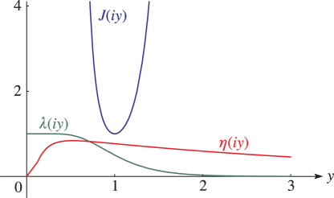
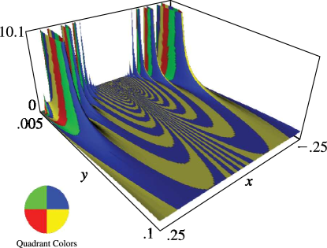

# §23.16 Graphics

:::{note}
**Keywords:**

[graphics](http://dlmf.nist.gov/search/search?q=graphics) , [modular functions](http://dlmf.nist.gov/search/search?q=modular%20functions)

**Notes:**

These graphics were produced at NIST.

**See also:**

Annotations for Ch.23
:::

See Figures 23.16.1 – 23.16.3 for the modular functions $\lambda$ , $J$ , and $\eta$ . In Figures 23.16.2 and 23.16.3 , height corresponds to the absolute value of the function and color to the phase. See also [About Color Map](./help/vrml/aboutcolor.md "In Viewing DLMF Interactive 3D Graphics ‣ Need Help?") .

:::{note}
**Symbols:**

$\eta\left(\NVar{\tau}\right)$: Dedekind’s eta function (or Dedekind modular function) , $J\left(\NVar{\tau}\right)$: Klein’s complete invariant , $\mathrm{i}$: imaginary unit , $\lambda\left(\NVar{\tau}\right)$: elliptic modular function and $y$: imaginary part of $z$

**Referenced by:**

Figure 20.3.2 , [Figure 20.3.2](./20.3.F2.mag.md "In §20.3 Graphics ‣ Properties ‣ Chapter 20 Theta Functions") , §23.16

**See also:**

Annotations for §23.16 and Ch.23
:::

:::{note}
**Symbols:**

$\mathrm{i}$: imaginary unit , $\lambda\left(\NVar{\tau}\right)$: elliptic modular function , $x$: real part of $z$ and $y$: imaginary part of $z$

**Referenced by:**

§23.16

**See also:**

Annotations for §23.16 and Ch.23
:::
