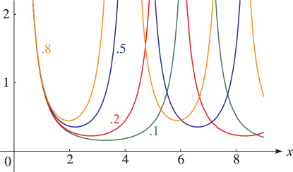
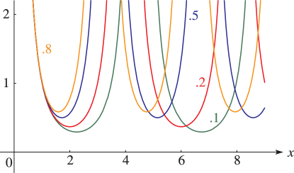
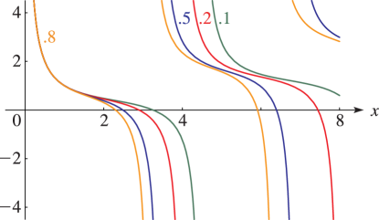
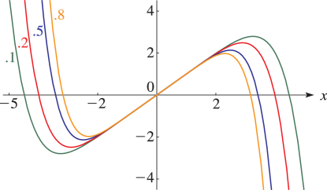
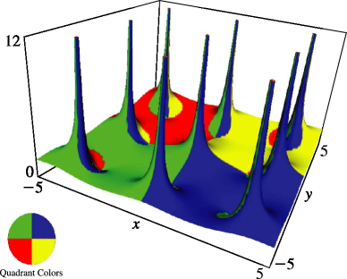
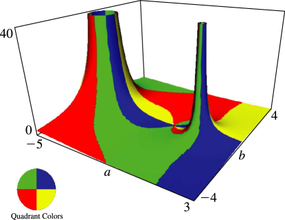

# §23.4 Graphics

:::{note}
**See also:**

Annotations for Ch.23
:::

## §23.4(i) Real Variables

:::{note}
**Keywords:**

[Weierstrass elliptic functions](http://dlmf.nist.gov/search/search?q=Weierstrass%20elliptic%20functions) , [equianharmonic case](http://dlmf.nist.gov/search/search?q=equianharmonic%20case) , [graphics](http://dlmf.nist.gov/search/search?q=graphics) , [lattice](http://dlmf.nist.gov/search/search?q=lattice) , [lemniscatic](http://dlmf.nist.gov/search/search?q=lemniscatic) , [lemniscatic case](http://dlmf.nist.gov/search/search?q=lemniscatic%20case) , [real variables](http://dlmf.nist.gov/search/search?q=real%20variables)

**Notes:**

These graphs were produced at NIST.

**See also:**

Annotations for §23.4 and Ch.23
:::

Line graphs of the Weierstrass functions $\wp\left(x\right)$ , $\zeta\left(x\right)$ , and $\sigma\left(x\right)$ , illustrating the lemniscatic and equianharmonic cases. (The figures in this subsection may be compared with the figures in § 22.3(i) .)

:::{note}
**Symbols:**

$\wp\left(\NVar{z};\NVar{g_{2}},\NVar{g_{3}}\right)$: Weierstrass $\wp$-function , $g_{\NVar{j}}$: Weierstrass lattice invariants $g_{2}$, $g_{3}$ , $\mathbb{L}$: lattice and $x$: real part of $z$

**See also:**

Annotations for §23.4(i) , §23.4 and Ch.23
:::

:::{note}
**Symbols:**

$\wp\left(\NVar{z};\NVar{g_{2}},\NVar{g_{3}}\right)$: Weierstrass $\wp$-function , $g_{\NVar{j}}$: Weierstrass lattice invariants $g_{2}$, $g_{3}$ , $\mathbb{L}$: lattice and $x$: real part of $z$

**See also:**

Annotations for §23.4(i) , §23.4 and Ch.23
:::

:::{note}
**Symbols:**

$g_{\NVar{j}}$: Weierstrass lattice invariants $g_{2}$, $g_{3}$ , $\zeta\left(\NVar{z};\NVar{g_{2}},\NVar{g_{3}}\right)$: Weierstrass zeta function , $\mathbb{L}$: lattice and $x$: real part of $z$

**See also:**

Annotations for §23.4(i) , §23.4 and Ch.23
:::

:::{note}
**Symbols:**

$g_{\NVar{j}}$: Weierstrass lattice invariants $g_{2}$, $g_{3}$ , $\sigma\left(\NVar{z};\NVar{g_{2}},\NVar{g_{3}}\right)$: Weierstrass sigma function , $\mathbb{L}$: lattice and $x$: real part of $z$

**See also:**

Annotations for §23.4(i) , §23.4 and Ch.23
:::

## §23.4(ii) Complex Variables

:::{note}
**Keywords:**

[Weierstrass elliptic functions](http://dlmf.nist.gov/search/search?q=Weierstrass%20elliptic%20functions) , [complex variables](http://dlmf.nist.gov/search/search?q=complex%20variables) , [graphics](http://dlmf.nist.gov/search/search?q=graphics)

**Notes:**

These graphics were produced at NIST.

**See also:**

Annotations for §23.4 and Ch.23
:::

Surfaces for the Weierstrass functions $\wp\left(z\right)$ , $\zeta\left(z\right)$ , and $\sigma\left(z\right)$ . Height corresponds to the absolute value of the function and color to the phase. See also [About Color Map](./help/vrml/aboutcolor.md "In Viewing DLMF Interactive 3D Graphics ‣ Need Help?") . (The figures in this subsection may be compared with the figures in § 22.3(iii) .)

:::{note}
**Symbols:**

$\wp\left(\NVar{z}\right)$ (= $\wp\left(z|\mathbb{L}\right)$ = $\wp\left(z;g_{2},g_{3}\right)$): Weierstrass $\wp$-function , ${K^{\prime}}\left(\NVar{k}\right)$: Legendre’s complementary complete elliptic integral of the first kind , $K\left(\NVar{k}\right)$: Legendre’s complete elliptic integral of the first kind , $\mathrm{i}$: imaginary unit , $\mathbb{L}$: lattice , $x$: real part of $z$ , $y$: imaginary part of $z$ , $\omega_{1}$, $\omega_{3}$, $\omega_{2}=-\omega_{1}-\omega_{3}$: lattice generators and $k$: modulus

**See also:**

Annotations for §23.4(ii) , §23.4 and Ch.23
:::

:::{note}
**Symbols:**

$\zeta\left(\NVar{z};\NVar{g_{2}},\NVar{g_{3}}\right)$: Weierstrass zeta function , $\mathrm{i}$: imaginary unit , $x$: real part of $z$ and $y$: imaginary part of $z$

**See also:**

Annotations for §23.4(ii) , §23.4 and Ch.23
:::

:::{note}
**Symbols:**

$\wp\left(\NVar{z};\NVar{g_{2}},\NVar{g_{3}}\right)$: Weierstrass $\wp$-function and $\mathrm{i}$: imaginary unit

**See also:**

Annotations for §23.4(ii) , §23.4 and Ch.23
:::
