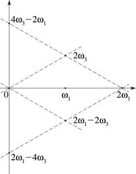

# §23.5 Special Lattices

:::{note}
**Referenced by:**

§23.1

**See also:**

Annotations for Ch.23
:::

## §23.5(i) Real-Valued Functions

:::{note}
**Notes:**

See Walker ([1996](./bib/W.html#bib2359 "Elliptic Functions. A Constructive Approach"), §§7.5, 8.4.2).

**Referenced by:**

§23.6(iv)

**See also:**

Annotations for §23.5 and Ch.23
:::

The Weierstrass functions take real values on the real axis iff the lattice is fixed under complex conjugation: $\mathbb{L}=\overline{\mathbb{L}}$ ; equivalently, when $g_{2},g_{3}\in\mathbb{R}$ . This happens in the cases treated in the following four subsections.

## §23.5(ii) Rectangular Lattice

:::{note}
**Keywords:**

[Weierstrass elliptic functions](http://dlmf.nist.gov/search/search?q=Weierstrass%20elliptic%20functions) , [lattice](http://dlmf.nist.gov/search/search?q=lattice) , [rectangular](http://dlmf.nist.gov/search/search?q=rectangular)

**Notes:**

See Walker ([1996](./bib/W.html#bib2359 "Elliptic Functions. A Constructive Approach"), §8.4.2).

**Referenced by:**

§23.6(iv)

**See also:**

Annotations for §23.5 and Ch.23
:::

This occurs when both $\omega_{1}$ and $\omega_{3}/i$ are real and positive. Then $\Delta>0$ and the parallelogram with vertices at $0$ , $2\omega_{1}$ , $2\omega_{1}+2\omega_{3}$ , $2\omega_{3}$ is a rectangle.

In this case the lattice roots $e_{1}$ , $e_{2}$ , and $e_{3}$ are real and distinct. When they are identified as in ( 23.3.9 )

$$
\displaystyle e_{1} \displaystyle>e_{2}>e_{3}, \tag{23.5.1}
$$

$$
\displaystyle e_{1} \displaystyle>0>e_{3}.
$$

:::{note}
**Symbols:**

$e_{\NVar{j}}$: Weierstrass lattice roots and $\mathbb{L}$: lattice

**Referenced by:**

item 1

**See also:**

Annotations for §23.5(ii) , §23.5 and Ch.23
:::

Also, $e_{2}$ and $g_{3}$ have opposite signs unless $\omega_{3}=i\omega_{1}$ , in which event both are zero.

As functions of $\Im\omega_{3}$ , $e_{1}$ and $e_{2}$ are decreasing and $e_{3}$ is increasing.

## §23.5(iii) Lemniscatic Lattice

:::{note}
**Keywords:**

[Weierstrass elliptic functions](http://dlmf.nist.gov/search/search?q=Weierstrass%20elliptic%20functions) , [lattice](http://dlmf.nist.gov/search/search?q=lattice) , [lemniscatic](http://dlmf.nist.gov/search/search?q=lemniscatic) , [lemniscatic case](http://dlmf.nist.gov/search/search?q=lemniscatic%20case)

**Notes:**

See Walker ([1996](./bib/W.html#bib2359 "Elliptic Functions. A Constructive Approach"), §7.5). Some errors are corrected here.

**Referenced by:**

§22.5(ii)

**See also:**

Annotations for §23.5 and Ch.23
:::

This occurs when $\omega_{1}$ is real and positive and $\omega_{3}=i\omega_{1}$ . The parallelogram $0$ , $2\omega_{1}$ , $2\omega_{1}+2\omega_{3}$ , $2\omega_{3}$ is a square, and

$$
\eta_{1}=i\eta_{3}=\pi/(4\omega_{1}), \tag{23.5.2}
$$

$$
\displaystyle e_{1} \displaystyle=-e_{3}=\left(\Gamma\left(\tfrac{1}{4}\right)\right)^{4}/(32\pi\omega_{1}^{2}), \tag{23.5.3}
$$

$$
\displaystyle e_{2} \displaystyle=0,
$$

:::{note}
**Symbols:**

$\Gamma\left(\NVar{z}\right)$: gamma function , $e_{\NVar{j}}$: Weierstrass lattice roots , $\pi$: the ratio of the circumference of a circle to its diameter , $\mathbb{L}$: lattice and $\omega_{1}$, $\omega_{3}$, $\omega_{2}=-\omega_{1}-\omega_{3}$: lattice generators

**Referenced by:**

§23.22(ii)

**See also:**

Annotations for §23.5(iii) , §23.5 and Ch.23
:::

$$
\displaystyle g_{2} \displaystyle=\left(\Gamma\left(\tfrac{1}{4}\right)\right)^{8}/(256\pi^{2}\omega_{1}^{4}), \tag{23.5.4}
$$

$$
\displaystyle g_{3} \displaystyle=0.
$$

:::{note}
**Symbols:**

$\Gamma\left(\NVar{z}\right)$: gamma function , $g_{\NVar{j}}$: Weierstrass lattice invariants $g_{2}$, $g_{3}$ , $\pi$: the ratio of the circumference of a circle to its diameter , $\mathbb{L}$: lattice and $\omega_{1}$, $\omega_{3}$, $\omega_{2}=-\omega_{1}-\omega_{3}$: lattice generators

**See also:**

Annotations for §23.5(iii) , §23.5 and Ch.23
:::

Note also that in this case $\tau=\mathrm{i}$ . In consequence,

$$
\displaystyle k^{2} \displaystyle=\tfrac{1}{2}, \tag{23.5.5}
$$

$$
\displaystyle K\left(k\right) \displaystyle=K'\left(k\right)=\ifrac{\left(\Gamma\left(\tfrac{1}{4}\right)\right)^{2}}{\left(4\sqrt{\pi}\right)}.
$$

:::{note}
**Symbols:**

$\Gamma\left(\NVar{z}\right)$: gamma function , $\pi$: the ratio of the circumference of a circle to its diameter , $K\left(\NVar{k}\right)$: Legendre’s complete elliptic integral of the first kind and $k$: modulus

**See also:**

Annotations for §23.5(iii) , §23.5 and Ch.23
:::

## §23.5(iv) Rhombic Lattice

:::{note}
**Keywords:**

[Weierstrass elliptic functions](http://dlmf.nist.gov/search/search?q=Weierstrass%20elliptic%20functions) , [lattice](http://dlmf.nist.gov/search/search?q=lattice) , [pseudo-lemniscatic](http://dlmf.nist.gov/search/search?q=pseudo-lemniscatic) , [pseudo-lemniscatic case](http://dlmf.nist.gov/search/search?q=pseudo-lemniscatic%20case) , [rhombic](http://dlmf.nist.gov/search/search?q=rhombic) , [rhombic case](http://dlmf.nist.gov/search/search?q=rhombic%20case)

**Notes:**

See Walker ([1996](./bib/W.html#bib2359 "Elliptic Functions. A Constructive Approach"), §8.4.2).

**Referenced by:**

Erratum (V1.0.19) for Notation

**See also:**

Annotations for §23.5 and Ch.23
:::

This occurs when $\omega_{1}$ is real and positive, $\Im\omega_{3}>0$ , $\Re\omega_{3}=\tfrac{1}{2}\omega_{1}$ , and $\Delta<0$ . The parallelogram $0$ , $2\omega_{1}-2\omega_{3}$ , $2\omega_{1}$ , $2\omega_{3}$ , is a rhombus: see Figure 23.5.1 .

The lattice root $e_{1}$ is real, and $e_{3}=\overline{e_{2}}$ , with $\Im e_{2}>0$ . $e_{1}$ and $g_{3}$ have the same sign unless $2\omega_{3}=(1+i)\omega_{1}$ when both are zero: the *pseudo-lemniscatic* case. As a function of $\Im e_{3}$ the root $e_{1}$ is increasing. For the case $\omega_{3}=e^{\pi i/3}\omega_{1}$ see § 23.5(v) .

## §23.5(v) Equianharmonic Lattice

:::{note}
**Keywords:**

[Weierstrass elliptic functions](http://dlmf.nist.gov/search/search?q=Weierstrass%20elliptic%20functions) , [equianharmonic](http://dlmf.nist.gov/search/search?q=equianharmonic) , [equianharmonic case](http://dlmf.nist.gov/search/search?q=equianharmonic%20case) , [lattice](http://dlmf.nist.gov/search/search?q=lattice)

**Notes:**

See Walker ([1996](./bib/W.html#bib2359 "Elliptic Functions. A Constructive Approach"), §7.5).

**Referenced by:**

§22.5(ii) , §23.5(iv)

**See also:**

Annotations for §23.5 and Ch.23
:::

This occurs when $\omega_{1}$ is real and positive and $\omega_{3}=e^{\pi i/3}\omega_{1}$ . The rhombus $0$ , $2\omega_{1}-2\omega_{3}$ , $2\omega_{1}$ , $2\omega_{3}$ can be regarded as the union of two equilateral triangles: see Figure 23.5.2 .

:::{note}
**Symbols:**

$\Re$: real part and $\omega_{1}$, $\omega_{3}$, $\omega_{2}=-\omega_{1}-\omega_{3}$: lattice generators

**Referenced by:**

§23.5(iv)

**See also:**

Annotations for §23.5(v) , §23.5 and Ch.23
:::

$$
\eta_{1}=e^{\pi i/3}\eta_{3}=\frac{\pi}{2\sqrt{3}\omega_{1}}, \tag{23.5.6}
$$

and the lattice roots and invariants are given by

$$
e_{1}=e^{2\pi i/3}e_{3}=e^{-2\pi i/3}e_{2}=\frac{\left(\Gamma\left(\tfrac{1}{3}\right)\right)^{6}}{2^{14/3}\pi^{2}\omega_{1}^{2}}, \tag{23.5.7}
$$

$$
\displaystyle g_{2} \displaystyle=0, \tag{23.5.8}
$$

$$
\displaystyle g_{3} \displaystyle=\frac{\left(\Gamma\left(\tfrac{1}{3}\right)\right)^{18}}{(4\pi\omega_{1})^{6}}.
$$

:::{note}
**Symbols:**

$\Gamma\left(\NVar{z}\right)$: gamma function , $g_{\NVar{j}}$: Weierstrass lattice invariants $g_{2}$, $g_{3}$ , $\pi$: the ratio of the circumference of a circle to its diameter , $\mathbb{L}$: lattice and $\omega_{1}$, $\omega_{3}$, $\omega_{2}=-\omega_{1}-\omega_{3}$: lattice generators

**See also:**

Annotations for §23.5(v) , §23.5 and Ch.23
:::

Note also that in this case $\tau=e^{\mathrm{i}\pi/3}$ . In consequence,

$$
\displaystyle k^{2} \displaystyle=e^{\mathrm{i}\pi/3}, \tag{23.5.9}
$$

$$
\displaystyle K\left(k\right) \displaystyle=e^{\mathrm{i}\pi/6}K'\left(k\right)=e^{\mathrm{i}\pi/12}\frac{3^{1/4}\left(\Gamma\left(\frac{1}{3}\right)\right)^{3}}{2^{7/3}\pi}.
$$

:::{note}
**Symbols:**

$\Gamma\left(\NVar{z}\right)$: gamma function , $\pi$: the ratio of the circumference of a circle to its diameter , $K\left(\NVar{k}\right)$: Legendre’s complete elliptic integral of the first kind , $\mathrm{e}$: base of natural logarithm , $\mathrm{i}$: imaginary unit and $k$: modulus

**See also:**

Annotations for §23.5(v) , §23.5 and Ch.23
:::
