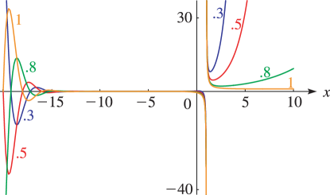

# §25.11 Hurwitz Zeta Function

:::{note}
**Keywords:**

[Hurwitz zeta function](http://dlmf.nist.gov/search/search?q=Hurwitz%20zeta%20function) , [analytic properties](http://dlmf.nist.gov/search/search?q=analytic%20properties)

**Notes:**

See Apostol ([1976](./bib/index.html#bib115 "Introduction to Analytic Number Theory"), Chapter 12), Srivastava and Choi ([2001](./bib/S.html#bib2152 "Series Associated with the Zeta and Related Functions")), Miller and Adamchik ([1998](./bib/M.html#bib1618 "Derivatives of the Hurwitz zeta function for rational arguments")), and Adamchik and Srivastava ([1998](./bib/index.html#bib29 "Some series of the zeta and related functions")).

**Referenced by:**

§25.14(i)

**See also:**

Annotations for Ch.25
:::

## §25.11(i) Definition

:::{note}
**Keywords:**

[Hurwitz zeta function](http://dlmf.nist.gov/search/search?q=Hurwitz%20zeta%20function) , [Riemann zeta function](http://dlmf.nist.gov/search/search?q=Riemann%20zeta%20function) , [definition](http://dlmf.nist.gov/search/search?q=definition) , [relations to other functions](http://dlmf.nist.gov/search/search?q=relations%20to%20other%20functions)

**Notes:**

Analytic properties of $\zeta\left(s,a\right)$ with respect to $a$ follow from ( 25.11.30 ).

**Referenced by:**

§8.15

**See also:**

Annotations for §25.11 and Ch.25
:::

The function $\zeta\left(s,a\right)$ was introduced in Hurwitz ([1882](./bib/H.html#bib1119 "Einige Eigenschaften der Dirichletschen Functionen = ⁢ F ( s ) ∑ ⋅ ( D n ) 1 n , die bei der Bestimmung der Klassenanzahlen binärer quadratischer Formen auftreten")) and defined by the series expansion

$$
\zeta\left(s,a\right)=\sum_{n=0}^{\infty}\frac{1}{(n+a)^{s}}, \tag{25.11.1}
$$

$\zeta\left(s,a\right)$ has a meromorphic continuation in the $s$ -plane, its only singularity in $\mathbb{C}$ being a simple pole at $s=1$ with residue $1$ . As a function of $a$ , with $s$ ( $\neq 1$ ) fixed, $\zeta\left(s,a\right)$ is analytic in the half-plane $\Re a>0$ . The Riemann zeta function is a special case:

$$
\zeta\left(s,1\right)=\zeta\left(s\right). \tag{25.11.2}
$$

For most purposes it suffices to restrict $0<\Re a\leq 1$ because of the following straightforward consequences of ( 25.11.1 ):

$$
\zeta\left(s,a\right)=\zeta\left(s,a+1\right)+a^{-s}, \tag{25.11.3}
$$

$$
\zeta\left(s,a\right)=\zeta\left(s,a+m\right)+\sum_{n=0}^{m-1}\frac{1}{(n+a)^{s}}, \tag{25.11.4}
$$

Most references treat real $a$ with $0

:::{note}
**Symbols:**

$\zeta\left(\NVar{s},\NVar{a}\right)$: Hurwitz zeta function , $x$: real variable and $a$: real or complex parameter

**See also:**

Annotations for §25.11(ii) , §25.11 and Ch.25
:::

## §25.11(iii) Representations by the Euler–Maclaurin Formula

:::{note}
**Keywords:**

[Hurwitz zeta function](http://dlmf.nist.gov/search/search?q=Hurwitz%20zeta%20function) , [representations by Euler–Maclaurin formula](http://dlmf.nist.gov/search/search?q=representations%20by%20Euler%E2%80%93Maclaurin%20formula)

**See also:**

Annotations for §25.11 and Ch.25
:::

$$
\zeta\left(s,a\right)=\sum_{n=0}^{N}\frac{1}{(n+a)^{s}}+\frac{(N+a)^{1-s}}{s-1}-s\int_{N}^{\infty}\frac{x-\left\lfloor x\right\rfloor}{(x+a)^{s+1}}\,\mathrm{d}x, \tag{25.11.5}
$$

$$
\zeta\left(s,a\right)=\frac{1}{a^{s}}\left(\frac{1}{2}+\frac{a}{s-1}\right)-\frac{s(s+1)}{2}\int_{0}^{\infty}\frac{\widetilde{B}_{2}\left(x\right)-B_{2}}{(x+a)^{s+2}}\,\mathrm{d}x, \tag{25.11.6}
$$

$$
\zeta\left(s,a\right)=\frac{1}{a^{s}}+\frac{1}{(1+a)^{s}}\left(\frac{1}{2}+\frac{1+a}{s-1}\right)+\sum_{k=1}^{n}\genfrac{(}{)}{0.0pt}{}{s+2k-2}{2k-1}\frac{B_{2k}}{2k}\frac{1}{(1+a)^{s+2k-1}}-\genfrac{(}{)}{0.0pt}{}{s+2n}{2n+1}\int_{1}^{\infty}\frac{\widetilde{B}_{2n+1}\left(x\right)}{(x+a)^{s+2n+1}}\,\mathrm{d}x, \tag{25.11.7}
$$

For $\widetilde{B}_{n}\left(x\right)$ see § 24.2(iii) .

## §25.11(iv) Series Representations

:::{note}
**Keywords:**

[Hurwitz zeta function](http://dlmf.nist.gov/search/search?q=Hurwitz%20zeta%20function) , [series representations](http://dlmf.nist.gov/search/search?q=series%20representations)

**Notes:**

See Srivastava and Choi ([2001](./bib/S.html#bib2152 "Series Associated with the Zeta and Related Functions")) and Apostol ([1976](./bib/index.html#bib115 "Introduction to Analytic Number Theory"), Section 12.7).

**Referenced by:**

Erratum (V1.0.5) for References

**Addition (effective with 1.0.5):**

The reference to Coffey ([2008](./bib/C.html#bib2777 "On some series representations of the Hurwitz zeta function")) has been added at the end of this subsection.

**See also:**

Annotations for §25.11 and Ch.25
:::

$$
\zeta\left(s,\tfrac{1}{2}a\right)=\zeta\left(s,\tfrac{1}{2}a+\tfrac{1}{2}\right)+2^{s}\sum_{n=0}^{\infty}\frac{(-1)^{n}}{(n+a)^{s}}, \tag{25.11.8}
$$

$$
\zeta\left(1-s,a\right)=\frac{2\Gamma\left(s\right)}{(2\pi)^{s}}\*\sum_{n=1}^{\infty}\frac{1}{n^{s}}\cos\left(\tfrac{1}{2}\pi s-2n\pi a\right), \tag{25.11.9}
$$

$$
\zeta\left(s,a\right)=\sum_{n=0}^{\infty}\frac{{\left(s\right)_{n}}}{n!}\zeta\left(n+s\right)(1-a)^{n}, \tag{25.11.10}
$$

When $a=\frac{1}{2}$ , ( 25.11.10 ) reduces to ( 25.8.3 ); compare ( 25.11.11 ).

For other series expansions similar to ( 25.11.10 ) see Coffey ([2008](./bib/C.html#bib2777 "On some series representations of the Hurwitz zeta function")).

## §25.11(v) Special Values

:::{note}
**Keywords:**

[Hurwitz zeta function](http://dlmf.nist.gov/search/search?q=Hurwitz%20zeta%20function) , [special values](http://dlmf.nist.gov/search/search?q=special%20values)

**See also:**

Annotations for §25.11 and Ch.25
:::

Throughout this subsection $\Re a>0$ .

$$
\zeta\left(s,\tfrac{1}{2}\right)=(2^{s}-1)\zeta\left(s\right), \tag{25.11.11}
$$

$$
\zeta\left(n+1,a\right)=\frac{(-1)^{n+1}{\psi}^{(n)}\left(a\right)}{n!}, \tag{25.11.12}
$$

$$
\zeta\left(0,a\right)=\tfrac{1}{2}-a. \tag{25.11.13}
$$

$$
\zeta\left(-n,a\right)=-\frac{B_{n+1}\left(a\right)}{n+1}, \tag{25.11.14}
$$

$$
\zeta\left(s,ka\right)=k^{-s}\*\sum_{n=0}^{k-1}\zeta\left(s,a+\frac{n}{k}\right), \tag{25.11.15}
$$

$$
\zeta\left(1-s,\frac{h}{k}\right)=\frac{2\Gamma\left(s\right)}{(2\pi k)^{s}}\*\sum_{r=1}^{k}\cos\left(\frac{\pi s}{2}-\frac{2\pi rh}{k}\right)\zeta\left(s,\frac{r}{k}\right), \tag{25.11.16}
$$

## §25.11(vi) Derivatives

:::{note}
**Keywords:**

[Hurwitz zeta function](http://dlmf.nist.gov/search/search?q=Hurwitz%20zeta%20function) , [derivatives](http://dlmf.nist.gov/search/search?q=derivatives)

**Notes:**

See Apostol ([1985a](./bib/index.html#bib117 "Formulas for higher derivatives of the Riemann zeta function"), p. 231) and Miller and Adamchik ([1998](./bib/M.html#bib1618 "Derivatives of the Hurwitz zeta function for rational arguments")).

**See also:**

Annotations for §25.11 and Ch.25
:::

### a-Derivative

:::{note}
**See also:**

Annotations for §25.11(vi) , §25.11 and Ch.25
:::

$$
\frac{\partial}{\partial a}\zeta\left(s,a\right)=-s\zeta\left(s+1,a\right), \tag{25.11.17}
$$

### s-Derivatives

:::{note}
**See also:**

Annotations for §25.11(vi) , §25.11 and Ch.25
:::

In ( 25.11.18 )–( 25.11.24 ) primes on $\zeta$ denote derivatives with respect to $s$ . Similarly in §§ 25.11(viii) and 25.11(xii) .

$$
\zeta'\left(0,a\right)=\ln\Gamma\left(a\right)-\tfrac{1}{2}\ln\left(2\pi\right), \tag{25.11.18}
$$

$$
\zeta'\left(s,a\right)=-\frac{\ln a}{a^{s}}\left(\frac{1}{2}+\frac{a}{s-1}\right)-\frac{a^{1-s}}{(s-1)^{2}}+\frac{s(s+1)}{2}\int_{0}^{\infty}\frac{(\widetilde{B}_{2}\left(x\right)-B_{2})\ln\left(x+a\right)}{(x+a)^{s+2}}\,\mathrm{d}x-\frac{(2s+1)}{2}\int_{0}^{\infty}\frac{\widetilde{B}_{2}\left(x\right)-B_{2}}{(x+a)^{s+2}}\,\mathrm{d}x, \tag{25.11.19}
$$

$$
(-1)^{k}{\zeta}^{(k)}\left(s,a\right)=\frac{(\ln a)^{k}}{a^{s}}\left(\frac{1}{2}+\frac{a}{s-1}\right)+k!a^{1-s}\sum_{r=0}^{k-1}\frac{(\ln a)^{r}}{r!(s-1)^{k-r+1}}-\frac{s(s+1)}{2}\int_{0}^{\infty}\frac{(\widetilde{B}_{2}\left(x\right)-B_{2})(\ln\left(x+a\right))^{k}}{(x+a)^{s+2}}\,\mathrm{d}x+\frac{k(2s+1)}{2}\int_{0}^{\infty}\frac{(\widetilde{B}_{2}\left(x\right)-B_{2})(\ln\left(x+a\right))^{k-1}}{(x+a)^{s+2}}\,\mathrm{d}x-\frac{k(k-1)}{2}\int_{0}^{\infty}\frac{(\widetilde{B}_{2}\left(x\right)-B_{2})(\ln\left(x+a\right))^{k-2}}{(x+a)^{s+2}}\,\mathrm{d}x, \tag{25.11.20}
$$

$$
\zeta'\left(1-2n,\frac{h}{k}\right)=\frac{(\psi\left(2n\right)-\ln\left(2\pi k\right))B_{2n}\left(h/k\right)}{2n}-\frac{(\psi\left(2n\right)-\ln\left(2\pi\right))B_{2n}}{2nk^{2n}}+\frac{(-1)^{n+1}\pi}{(2\pi k)^{2n}}\sum_{r=1}^{k-1}\sin\left(\frac{2\pi rh}{k}\right){\psi}^{(2n-1)}\left(\frac{r}{k}\right)+\frac{(-1)^{n+1}2\cdot(2n-1)!}{(2\pi k)^{2n}}\sum_{r=1}^{k-1}\cos\left(\frac{2\pi rh}{k}\right)\zeta'\left(2n,\frac{r}{k}\right)+\frac{\zeta'\left(1-2n\right)}{k^{2n}}, \tag{25.11.21}
$$

where $h,k$ are integers with $1\leq h\leq k$ and $n=1,2,3,\dots$ .

$$
\zeta'\left(1-2n,\tfrac{1}{2}\right)=-\frac{B_{2n}\ln 2}{n\cdot 4^{n}}-\frac{(2^{2n-1}-1)\zeta'\left(1-2n\right)}{2^{2n-1}}, \tag{25.11.22}
$$

$$
\zeta'\left(1-2n,\tfrac{1}{3}\right)=-\frac{\pi(9^{n}-1)B_{2n}}{8n\sqrt{3}(3^{2n-1}-1)}-\frac{B_{2n}\ln 3}{4n\cdot 3^{2n-1}}-\frac{(-1)^{n}{\psi}^{(2n-1)}\left(\frac{1}{3}\right)}{2\sqrt{3}(6\pi)^{2n-1}}-\frac{\left(3^{2n-1}-1\right)\zeta'\left(1-2n\right)}{2\cdot 3^{2n-1}}, \tag{25.11.23}
$$

$$
\sum_{r=1}^{k-1}\zeta'\left(s,\frac{r}{k}\right)=(k^{s}-1)\zeta'\left(s\right)+k^{s}\zeta\left(s\right)\ln k, \tag{25.11.24}
$$

## §25.11(vii) Integral Representations

:::{note}
**Keywords:**

[Hurwitz zeta function](http://dlmf.nist.gov/search/search?q=Hurwitz%20zeta%20function) , [integral representations](http://dlmf.nist.gov/search/search?q=integral%20representations)

**Notes:**

See Apostol ([1976](./bib/index.html#bib115 "Introduction to Analytic Number Theory"), Section 12.3).

**Clarification (effective with 1.2.1):**

Just below ( 25.11.30 ), we added “(see Figure 5.9.1 )”.

**See also:**

Annotations for §25.11 and Ch.25
:::

$$
\displaystyle\zeta\left(s,a\right) \displaystyle=\frac{1}{\Gamma\left(s\right)}\int_{0}^{\infty}\frac{x^{s-1}e^{-ax}}{1-e^{-x}}\,\mathrm{d}x, \tag{25.11.25}
$$

:::{note}
**Symbols:**

$\Gamma\left(\NVar{z}\right)$: gamma function , $\zeta\left(\NVar{s},\NVar{a}\right)$: Hurwitz zeta function , $\,\mathrm{d}\NVar{x}$: differential of $x$ , $\mathrm{e}$: base of natural logarithm , $\int$: integral , $\Re$: real part , $x$: real variable , $a$: real or complex parameter and $s$: complex variable

**Keywords:**

[improper integral](http://dlmf.nist.gov/search/search?q=improper%20integral) , [integral representation](http://dlmf.nist.gov/search/search?q=integral%20representation)

**Sources:**

Srivastava and Choi ([2001](./bib/S.html#bib2152 "Series Associated with the Zeta and Related Functions"), (2), p. 89); Apostol ([1976](./bib/index.html#bib115 "Introduction to Analytic Number Theory"), (5), p. 251)

**Referenced by:**

(25.11.27) , (25.11.30) , (25.11.35) , §25.11(x)

**See also:**

Annotations for §25.11(vii) , §25.11 and Ch.25
:::

$$
\displaystyle\zeta\left(s,a\right) \displaystyle=-s\int_{-a}^{\infty}\frac{x-\left\lfloor x\right\rfloor-\frac{1}{2}}{(x+a)^{s+1}}\,\mathrm{d}x, \tag{25.11.26}
$$

:::{note}
**Symbols:**

$\zeta\left(\NVar{s},\NVar{a}\right)$: Hurwitz zeta function , $\,\mathrm{d}\NVar{x}$: differential of $x$ , $\left\lfloor\NVar{x}\right\rfloor$: floor of $x$ , $\int$: integral , $\Re$: real part , $x$: real variable , $a$: real or complex parameter and $s$: complex variable

**Keywords:**

[improper integral](http://dlmf.nist.gov/search/search?q=improper%20integral) , [integral representation](http://dlmf.nist.gov/search/search?q=integral%20representation)

**Source:**

Berndt ([1972](./bib/B.html#bib240 "On the Hurwitz zeta-function"), (5.3), p. 156)

**See also:**

Annotations for §25.11(vii) , §25.11 and Ch.25
:::

$$
\zeta\left(s,a\right)=\frac{1}{2}a^{-s}+\frac{a^{1-s}}{s-1}+\frac{1}{\Gamma\left(s\right)}\int_{0}^{\infty}\left(\frac{1}{e^{x}-1}-\frac{1}{x}+\frac{1}{2}\right)x^{s-1}e^{-ax}\,\mathrm{d}x, \tag{25.11.27}
$$

$$
\zeta\left(s,a\right)=\frac{1}{2}a^{-s}+\frac{a^{1-s}}{s-1}+\sum_{k=1}^{n}\frac{B_{2k}}{(2k)!}{\left(s\right)_{2k-1}}a^{1-s-2k}+\frac{1}{\Gamma\left(s\right)}\int_{0}^{\infty}\left(\frac{1}{e^{x}-1}-\frac{1}{x}+\frac{1}{2}-\sum_{k=1}^{n}\frac{B_{2k}}{(2k)!}x^{2k-1}\right)x^{s-1}e^{-ax}\,\mathrm{d}x, \tag{25.11.28}
$$

$$
\zeta\left(s,a\right)=\frac{1}{2}a^{-s}+\frac{a^{1-s}}{s-1}+2\int_{0}^{\infty}\frac{\sin\left(s\operatorname{arctan}\left(x/a\right)\right)}{(a^{2}+x^{2})^{s/2}(e^{2\pi x}-1)}\,\mathrm{d}x, \tag{25.11.29}
$$

$$
\zeta\left(s,a\right)=\frac{\Gamma\left(1-s\right)}{2\pi i}\int_{-\infty}^{(0+)}\frac{e^{az}z^{s-1}}{1-e^{z}}\,\mathrm{d}z, \tag{25.11.30}
$$

where the integration contour (see Figure 5.9.1 ) is a loop around the negative real axis as described for ( 25.5.20 ).

## §25.11(viii) Further Integral Representations

:::{note}
**Notes:**

See Adamchik ([1998](./bib/index.html#bib28 "Polygamma functions of negative order")).

**Referenced by:**

§25.11(vi)

**Addition (effective with 1.1.4):**

A line of text was added just above ( 25.11.33 ) reading “where $H_{n}$ are the harmonic numbers :”. *Suggested 2021-08-23 by Gergő Nemes*

**See also:**

Annotations for §25.11 and Ch.25
:::

$$
\frac{1}{\Gamma\left(s\right)}\int_{0}^{\infty}\frac{x^{s-1}e^{-ax}}{2\cosh x}\,\mathrm{d}x=4^{-s}\left(\zeta\left(s,\tfrac{1}{4}+\tfrac{1}{4}a\right)-\zeta\left(s,\tfrac{3}{4}+\tfrac{1}{4}a\right)\right), \tag{25.11.31}
$$

$$
\int_{0}^{a}x^{n}\psi\left(x\right)\,\mathrm{d}x=(-1)^{n-1}\zeta'\left(-n\right)+(-1)^{n}H_{n}\frac{B_{n+1}}{n+1}-\sum_{k=0}^{n}(-1)^{k}\genfrac{(}{)}{0.0pt}{}{n}{k}H_{k}\frac{B_{k+1}(a)}{k+1}a^{n-k}+\sum_{k=0}^{n}(-1)^{k}\genfrac{(}{)}{0.0pt}{}{n}{k}\zeta'\left(-k,a\right)a^{n-k}, \tag{25.11.32}
$$

where $H_{n}$ are the *harmonic numbers* :

$$
H_{n}=\sum_{k=1}^{n}k^{-1}. \tag{25.11.33}
$$

$$
n\int_{0}^{a}\zeta'\left(1-n,x\right)\,\mathrm{d}x=\zeta'\left(-n,a\right)-\zeta'\left(-n\right)+\frac{B_{n+1}-B_{n+1}\left(a\right)}{n(n+1)}, \tag{25.11.34}
$$

## §25.11(ix) Integrals

:::{note}
**Keywords:**

[Hurwitz zeta function](http://dlmf.nist.gov/search/search?q=Hurwitz%20zeta%20function) , [integrals](http://dlmf.nist.gov/search/search?q=integrals)

**See also:**

Annotations for §25.11 and Ch.25
:::

See Prudnikov et al. ([1990](./bib/P.html#bib1905 "Integrals and Series: More Special Functions, Vol. 3"), §2.3), Prudnikov et al. ([1992a](./bib/P.html#bib1906 "Integrals and Series: Direct Laplace Transforms, Vol. 4"), §3.2), and Prudnikov et al. ([1992b](./bib/P.html#bib1907 "Integrals and Series: Inverse Laplace Transforms, Vol. 5"), §3.2).

## §25.11(x) Further Series Representations

:::{note}
**Keywords:**

[Hurwitz zeta function](http://dlmf.nist.gov/search/search?q=Hurwitz%20zeta%20function) , [series representations](http://dlmf.nist.gov/search/search?q=series%20representations)

**Notes:**

See Apostol ([1976](./bib/index.html#bib115 "Introduction to Analytic Number Theory"), p. 249). For ( 25.11.35 ) use ( 25.11.25 ) and ( 25.11.8 ).

**Referenced by:**

Erratum (V1.1.3) for References

**Removal (effective with 1.1.4):**

The line immediately below ( 25.11.36 ) which previously read “where $\chi(n)$ is a Dirichlet character $\pmod{k}$ (§ [27.8](./27.8.md "§27.8 Dirichlet Characters ‣ Multiplicative Number Theory ‣ Chapter 27 Functions of Number Theory") ). Compare ( 25.15.1 ) and ( 25.15.3 ).” has been removed because ( 25.11.36 ) has been removed.

**Addition (effective with 1.1.4):**

Included mention of ( 8.15.2 ) in the last sentence of this subsection.

**Addition (effective with 1.0.23):**

A sentence just below ( 25.11.36 ) was added indicating that one should make a comparison with ( 25.15.1 ) and ( 25.15.3 ).

**See also:**

Annotations for §25.11 and Ch.25
:::

$$
\sum_{n=0}^{\infty}\frac{(-1)^{n}}{(n+a)^{s}}=\frac{1}{\Gamma\left(s\right)}\int_{0}^{\infty}\frac{x^{s-1}e^{-ax}}{1+e^{-x}}\,\mathrm{d}x=2^{-s}\left(\zeta\left(s,\tfrac{1}{2}a\right)-\zeta\left(s,\tfrac{1}{2}(1+a)\right)\right), \tag{25.11.35}
$$

When $a=1$ , ( 25.11.35 ) reduces to ( 25.2.3 ).

See also ( 8.15.2 ) and Srivastava and Choi ([2001](./bib/S.html#bib2152 "Series Associated with the Zeta and Related Functions")).

## §25.11(xi) Sums

:::{note}
**Keywords:**

[Catalan’s constant](http://dlmf.nist.gov/search/search?q=Catalan%20constant) , [Hurwitz zeta function](http://dlmf.nist.gov/search/search?q=Hurwitz%20zeta%20function) , [Riemann zeta function](http://dlmf.nist.gov/search/search?q=Riemann%20zeta%20function) , [sums](http://dlmf.nist.gov/search/search?q=sums)

**Notes:**

See Adamchik and Srivastava ([1998](./bib/index.html#bib29 "Some series of the zeta and related functions")).

**See also:**

Annotations for §25.11 and Ch.25
:::

$$
\sum_{k=1}^{\infty}\frac{(-1)^{k}}{k}\zeta\left(nk,a\right)=-n\ln\Gamma\left(a\right)+\ln\left(\prod_{j=0}^{n-1}\Gamma\left(a-e^{(2j+1)\pi i/n}\right)\right), \tag{25.11.37}
$$

$$
\sum_{k=1}^{\infty}\genfrac{(}{)}{0.0pt}{}{n+k}{k}\zeta\left(n+k+1,a\right)z^{k}=\frac{(-1)^{n}}{n!}\left({\psi}^{(n)}\left(a\right)-{\psi}^{(n)}\left(a-z\right)\right), \tag{25.11.38}
$$

$$
\sum_{k=2}^{\infty}\frac{k}{2^{k}}\zeta\left(k+1,\tfrac{3}{4}\right)=8G, \tag{25.11.39}
$$

where $G$ is *Catalan’s constant* :

$$
G\equiv\sum_{n=0}^{\infty}\frac{(-1)^{n}}{(2n+1)^{2}}=0.91596\;55941\;772\dots. \tag{25.11.40}
$$

For further sums see Prudnikov et al. ([1990](./bib/P.html#bib1905 "Integrals and Series: More Special Functions, Vol. 3"), pp. 396–397) and Hansen ([1975](./bib/H.html#bib1035 "A Table of Series and Products"), pp. 358–360).

## §25.11(xii) a-Asymptotic Behavior

:::{note}
**Keywords:**

[Hurwitz zeta function](http://dlmf.nist.gov/search/search?q=Hurwitz%20zeta%20function) , [asymptotic expansions for large parameter](http://dlmf.nist.gov/search/search?q=asymptotic%20expansions%20for%20large%20parameter) , [derivatives](http://dlmf.nist.gov/search/search?q=derivatives)

**Notes:**

See Apostol ([1952](./bib/index.html#bib114 "Theorems on generalized Dedekind sums")) and Elizalde ([1986](./bib/E.html#bib737 "An asymptotic expansion for the first derivative of the generalized Riemann zeta function")).

**Referenced by:**

§25.11(vi) , Erratum (V1.2.1) for §25.11(xii)

**Correction and Addition (effective with 1.2.1):**

Just above ( 25.11.44 ), previously it was mentioned that $a\to\infty$ is in the sector “ $|\operatorname{ph}a|\leq\frac{1}{2}\pi-\delta(<\frac{1}{2}\pi)$ ”. This has been updated to be “ $|\operatorname{ph}a|\leq\pi-\delta(<\pi)$ (see Nemes ([2017a](./bib/N.html#bib2943 "Error bounds for the asymptotic expansion of the Hurwitz zeta function")))”. Also, just below ( 25.11.45 ), it was mentioned that “For error bounds for ( 25.11.43 ), ( 25.11.44 ) and ( 25.11.45 ), see Nemes ([2017a](./bib/N.html#bib2943 "Error bounds for the asymptotic expansion of the Hurwitz zeta function")).”

**See also:**

Annotations for §25.11 and Ch.25
:::

As $a\to 0$ with $s$ $(\neq 1)$ fixed,

$$
\zeta\left(s,a+1\right)=\zeta\left(s\right)-s\zeta\left(s+1\right)a+O\left(a^{2}\right). \tag{25.11.41}
$$

As $\beta\to\pm\infty$ with $s$ fixed, $\Re s>1$ ,

$$
\zeta\left(s,\alpha+i\beta\right)\to 0, \tag{25.11.42}
$$

uniformly with respect to bounded nonnegative values of $\alpha$ .

As $a\to\infty$ in the sector $|\operatorname{ph}a|\leq\pi-\delta(<\pi)$ , with $s(\neq 1)$ and $\delta$ fixed, we have the asymptotic expansion

$$
\zeta\left(s,a\right)-\frac{a^{1-s}}{s-1}-\frac{1}{2}a^{-s}\sim\sum_{k=1}^{\infty}\frac{B_{2k}}{(2k)!}{\left(s\right)_{2k-1}}a^{1-s-2k}. \tag{25.11.43}
$$

Similarly, as $a\to\infty$ in the sector $|\operatorname{ph}a|\leq\pi-\delta(<\pi)$ .

$$
\zeta'\left(-1,a\right)-\frac{1}{12}+\frac{1}{4}a^{2}-\left(\frac{1}{12}-\frac{1}{2}a+\frac{1}{2}a^{2}\right)\ln a\sim-\sum_{k=1}^{\infty}\frac{B_{2k+2}}{(2k+2)(2k+1)2k}a^{-2k}, \tag{25.11.44}
$$

and

$$
\zeta'\left(-2,a\right)-\frac{1}{12}a+\frac{1}{9}a^{3}-\left(\frac{1}{6}a-\frac{1}{2}a^{2}+\frac{1}{3}a^{3}\right)\ln a\sim\sum_{k=1}^{\infty}\frac{2B_{2k+2}}{(2k+2)(2k+1)2k(2k-1)}a^{-(2k-1)}. \tag{25.11.45}
$$

For the more general case $\zeta'\left(-m,a\right)$ , $m=1,2,\dots$ , see Elizalde ([1986](./bib/E.html#bib737 "An asymptotic expansion for the first derivative of the generalized Riemann zeta function")). For error bounds for ( 25.11.43 ), ( 25.11.44 ) and ( 25.11.45 ), see Nemes ([2017a](./bib/N.html#bib2943 "Error bounds for the asymptotic expansion of the Hurwitz zeta function")).

For an exponentially-improved form of ( 25.11.43 ) see Paris ([2005b](./bib/P.html#bib1843 "The Stokes phenomenon associated with the Hurwitz zeta function ⁢ ζ ( s , a )")).
