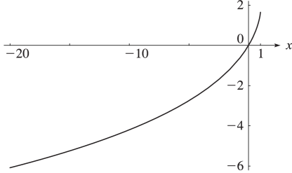

# §25.12 Polylogarithms

:::{note}
**Notes:**

See Maximon ([2003](./bib/M.html#bib1571 "The dilogarithm function for complex argument")), Lewin ([1981](./bib/L.html#bib1431 "Polylogarithms and Associated Functions")), Dingle ([1957a](./bib/D.html#bib2883 "The Bose-Einstein integrals = ⁢ B p ( η ) ⁢ ( ! p ) - 1 ∫ ∞ 0 ⁢ ϵ p ( - e - ϵ η 1 ) - 1 d ϵ")), and Dingle ([1957b](./bib/D.html#bib2884 "The Fermi-Dirac integrals = ⁢ F p ( η ) ⁢ ( ! p ) - 1 ∫ ∞ 0 ⁢ ϵ p ( + e - ϵ η 1 ) - 1 d ϵ")).

**See also:**

Annotations for Ch.25
:::

## §25.12(i) Dilogarithms

:::{note}
**Keywords:**

[Clausen’s integral](http://dlmf.nist.gov/search/search?q=Clausen%20integral) , [analytic properties](http://dlmf.nist.gov/search/search?q=analytic%20properties) , [definition](http://dlmf.nist.gov/search/search?q=definition) , [dilogarithms](http://dlmf.nist.gov/search/search?q=dilogarithms) , [graphics](http://dlmf.nist.gov/search/search?q=graphics) , [principal branch (or value)](http://dlmf.nist.gov/search/search?q=principal%20branch%20%28or%20value%29)

**Notes:**

See Maximon ([2003](./bib/M.html#bib1571 "The dilogarithm function for complex argument"), pp. 2807–2813). The graphics were constructed at NIST.

**Referenced by:**

2nd item , 4th item , §25.21(vi)

**See also:**

Annotations for §25.12 and Ch.25
:::

The notation $\operatorname{Li}_{2}\left(z\right)$ was introduced in Lewin ([1981](./bib/L.html#bib1431 "Polylogarithms and Associated Functions")) for a function discussed in Euler ([1768](./bib/E.html#bib760 "Institutiones Calculi Integralis")) and called the *dilogarithm* in Hill ([1828](./bib/H.html#bib1078 "Über die Integration logarithmisch-rationaler Differentiale")):

$$
\operatorname{Li}_{2}\left(z\right)\equiv\sum_{n=1}^{\infty}\frac{z^{n}}{n^{2}}, \tag{25.12.1}
$$

$$
\operatorname{Li}_{2}\left(z\right)=-\int_{0}^{z}t^{-1}\ln\left(1-t\right)\,\mathrm{d}t, \tag{25.12.2}
$$

Other notations and names for $\operatorname{Li}_{2}\left(z\right)$ include $S_{2}(z)$ (Kölbig et al. ([1970](./bib/K.html#bib1317 "On Nielsen’s generalized polylogarithms and their numerical calculation"))), Spence function $\mathrm{Sp}(z)$ (’t Hooft and Veltman ([1979](./bib/T.html#bib2250 "Scalar one-loop integrals"))), and $\mathrm{L}_{2}(z)$ (Maximon ([2003](./bib/M.html#bib1571 "The dilogarithm function for complex argument"))).

In the complex plane $\operatorname{Li}_{2}\left(z\right)$ has a branch point at $z=1$ . The principal branch has a cut along the interval $[1,\infty)$ and agrees with ( 25.12.1 ) when $|z|\leq 1$ ; see also § 4.2(i) . The remainder of the equations in this subsection apply to principal branches.

$$
\operatorname{Li}_{2}\left(z\right)+\operatorname{Li}_{2}\left(\frac{z}{z-1}\right)=-\frac{1}{2}(\ln\left(1-z\right))^{2}, \tag{25.12.3}
$$

$$
\operatorname{Li}_{2}\left(z\right)+\operatorname{Li}_{2}\left(\frac{1}{z}\right)=-\frac{1}{6}\pi^{2}-\frac{1}{2}(\ln\left(-z\right))^{2}, \tag{25.12.4}
$$

$$
\operatorname{Li}_{2}\left(z^{m}\right)=m\sum_{k=0}^{m-1}\operatorname{Li}_{2}\left(ze^{2\pi ik/m}\right), \tag{25.12.5}
$$

$$
\operatorname{Li}_{2}\left(x\right)+\operatorname{Li}_{2}\left(1-x\right)=\frac{1}{6}\pi^{2}-(\ln x)\ln\left(1-x\right), \tag{25.12.6}
$$

When $z=e^{i\theta}$ , $0\leq\theta\leq 2\pi$ , ( 25.12.1 ) becomes

$$
\operatorname{Li}_{2}\left(e^{i\theta}\right)=\sum_{n=1}^{\infty}\frac{\cos\left(n\theta\right)}{n^{2}}+i\sum_{n=1}^{\infty}\frac{\sin\left(n\theta\right)}{n^{2}}. \tag{25.12.7}
$$

The cosine series in ( 25.12.7 ) has the elementary sum

$$
\sum_{n=1}^{\infty}\frac{\cos\left(n\theta\right)}{n^{2}}=\frac{\pi^{2}}{6}-\frac{\pi\theta}{2}+\frac{\theta^{2}}{4}. \tag{25.12.8}
$$

By ( 25.12.2 )

$$
\sum_{n=1}^{\infty}\frac{\sin\left(n\theta\right)}{n^{2}}=-\int_{0}^{\theta}\ln\left(2\sin\left(\tfrac{1}{2}x\right)\right)\,\mathrm{d}x. \tag{25.12.9}
$$

The right-hand side is called *Clausen’s integral* .

For graphics see Figures 25.12.1 and 25.12.2 , and for further properties see Maximon ([2003](./bib/M.html#bib1571 "The dilogarithm function for complex argument")), Kirillov ([1995](./bib/K.html#bib1276 "Dilogarithm identities")), Lewin ([1981](./bib/L.html#bib1431 "Polylogarithms and Associated Functions")), Nielsen ([1909](./bib/N.html#bib1719 "Der Eulersche Dilogarithmus und seine Verallgemeinerungen")), and Zagier ([1989](./bib/Z.html#bib2478 "The Dilogarithm Function in Geometry and Number Theory")).

:::{note}
**Symbols:**

$\operatorname{Li}_{2}\left(\NVar{z}\right)$: dilogarithm and $x$: real variable

**Referenced by:**

§25.12(i)

**See also:**

Annotations for §25.12(i) , §25.12 and Ch.25
:::

## §25.12(ii) Polylogarithms

:::{note}
**Defines:**

$\phi\left(\NVar{z},\NVar{s}\right)=\operatorname{Li}_{s}\left(z\right)$ : notation used by (Truesdell, [1945](./bib/T.html#bib2282 "On a function which occurs in the theory of the structure of polymers"))

**Keywords:**

[Riemann zeta function](http://dlmf.nist.gov/search/search?q=Riemann%20zeta%20function) , [analytic properties](http://dlmf.nist.gov/search/search?q=analytic%20properties) , [definitions](http://dlmf.nist.gov/search/search?q=definitions) , [polylogarithms](http://dlmf.nist.gov/search/search?q=polylogarithms) , [relations to other functions](http://dlmf.nist.gov/search/search?q=relations%20to%20other%20functions) , [series expansions](http://dlmf.nist.gov/search/search?q=series%20expansions)

**Notes:**

See Lewin ([1981](./bib/L.html#bib1431 "Polylogarithms and Associated Functions"), Section 7.12).

**Referenced by:**

§25.14(i)

**See also:**

Annotations for §25.12 and Ch.25
:::

For real or complex $s$ and $z$ the *polylogarithm* $\operatorname{Li}_{s}\left(z\right)$ is defined by

$$
\operatorname{Li}_{s}\left(z\right)=\sum_{n=1}^{\infty}\frac{z^{n}}{n^{s}}. \tag{25.12.10}
$$

For each fixed complex $s$ the series defines an analytic function of $z$ for $|z|<1$ . The series also converges when $|z|=1$ , provided that $\Re s>1$ . For other values of $z$ , $\operatorname{Li}_{s}\left(z\right)$ is defined by analytic continuation.

The notation $\phi\left(z,s\right)$ was used for $\operatorname{Li}_{s}\left(z\right)$ in Truesdell ([1945](./bib/T.html#bib2282 "On a function which occurs in the theory of the structure of polymers")) for a series treated in Jonquière ([1889](./bib/J.html#bib1187 "Note sur la série ∑ = n 1 ∞ / x n n s")), hence the alternative name *Jonquière’s function* . The special case $z=1$ is the Riemann zeta function: $\zeta\left(s\right)=\operatorname{Li}_{s}\left(1\right)$ .

### Integral Representation

:::{note}
**Keywords:**

[Hurwitz zeta function](http://dlmf.nist.gov/search/search?q=Hurwitz%20zeta%20function) , [Riemann zeta function](http://dlmf.nist.gov/search/search?q=Riemann%20zeta%20function) , [integral representations](http://dlmf.nist.gov/search/search?q=integral%20representations) , [polylogarithms](http://dlmf.nist.gov/search/search?q=polylogarithms) , [relations to other functions](http://dlmf.nist.gov/search/search?q=relations%20to%20other%20functions)

**See also:**

Annotations for §25.12(ii) , §25.12 and Ch.25
:::

$$
\operatorname{Li}_{s}\left(z\right)\equiv\frac{z}{\Gamma\left(s\right)}\int_{0}^{\infty}\frac{x^{s-1}}{e^{x}-z}\,\mathrm{d}x, \tag{25.12.11}
$$

valid when $\Re s>0$ and $\left|\operatorname{ph}\left(1-z\right)\right|<\pi$ , or $\Re s>1$ and $z=1$ . (In the latter case ( 25.12.11 ) becomes ( 25.5.1 )).

Further properties include

$$
\operatorname{Li}_{s}\left(z\right)=\Gamma\left(1-s\right)\left(\ln\frac{1}{z}\right)^{s-1}+\sum_{n=0}^{\infty}\zeta\left(s-n\right)\frac{(\ln z)^{n}}{n!}, \tag{25.12.12}
$$

and

$$
\operatorname{Li}_{s}\left(z\right)+{\mathrm{e}}^{\pi\mathrm{i}s}\operatorname{Li}_{s}\left(\frac{1}{z}\right)=\frac{(2\pi)^{s}{\mathrm{e}}^{\pi\mathrm{i}s/2}}{\Gamma\left(s\right)}\zeta\left(1-s,\frac{\ln z}{2\pi\mathrm{i}}\right), \tag{25.12.13}
$$

When $s=2$ ( 25.12.13 ) becomes ( 25.12.4 ).

See also Lewin ([1981](./bib/L.html#bib1431 "Polylogarithms and Associated Functions")), Kölbig ([1986](./bib/K.html#bib1316 "Nielsen’s generalized polylogarithms")), Maximon ([2003](./bib/M.html#bib1571 "The dilogarithm function for complex argument")), Prudnikov et al. ([1990](./bib/P.html#bib1905 "Integrals and Series: More Special Functions, Vol. 3"), §§1.2 and 2.5), Prudnikov et al. ([1992a](./bib/P.html#bib1906 "Integrals and Series: Direct Laplace Transforms, Vol. 4"), §3.3), and Prudnikov et al. ([1992b](./bib/P.html#bib1907 "Integrals and Series: Inverse Laplace Transforms, Vol. 5"), §3.3).

## §25.12(iii) Fermi–Dirac and Bose–Einstein Integrals

:::{note}
**Keywords:**

[Bose–Einstein integrals](http://dlmf.nist.gov/search/search?q=Bose%E2%80%93Einstein%20integrals) , [Fermi–Dirac integrals](http://dlmf.nist.gov/search/search?q=Fermi%E2%80%93Dirac%20integrals) , [definition](http://dlmf.nist.gov/search/search?q=definition) , [polylogarithms](http://dlmf.nist.gov/search/search?q=polylogarithms) , [relation to polylogarithms](http://dlmf.nist.gov/search/search?q=relation%20to%20polylogarithms) , [relations to other functions](http://dlmf.nist.gov/search/search?q=relations%20to%20other%20functions) , [uniform asymptotic approximation](http://dlmf.nist.gov/search/search?q=uniform%20asymptotic%20approximation)

**Notes:**

See Dingle ([1957a](./bib/D.html#bib2883 "The Bose-Einstein integrals = ⁢ B p ( η ) ⁢ ( ! p ) - 1 ∫ ∞ 0 ⁢ ϵ p ( - e - ϵ η 1 ) - 1 d ϵ")) and Dingle ([1957b](./bib/D.html#bib2884 "The Fermi-Dirac integrals = ⁢ F p ( η ) ⁢ ( ! p ) - 1 ∫ ∞ 0 ⁢ ϵ p ( + e - ϵ η 1 ) - 1 d ϵ")).

**See also:**

Annotations for §25.12 and Ch.25
:::

The Fermi–Dirac and Bose–Einstein integrals are defined by

$$
\displaystyle F_{s}(x) \displaystyle=\frac{1}{\Gamma\left(s+1\right)}\int_{0}^{\infty}\frac{t^{s}}{e^{t-x}+1}\,\mathrm{d}t, \tag{25.12.14}
$$

:::{note}
**Defines:**

$F_{s}(x)$ : Fermi–Dirac integral (locally)

**Symbols:**

$\Gamma\left(\NVar{z}\right)$: gamma function , $\,\mathrm{d}\NVar{x}$: differential of $x$ , $\mathrm{e}$: base of natural logarithm , $\int$: integral , $x$: real variable and $s$: complex variable

**Keywords:**

[Fermi–Dirac integral](http://dlmf.nist.gov/search/search?q=Fermi%E2%80%93Dirac%20integral) , [definition](http://dlmf.nist.gov/search/search?q=definition) , [improper integral](http://dlmf.nist.gov/search/search?q=improper%20integral) , [integral representation](http://dlmf.nist.gov/search/search?q=integral%20representation)

**Source:**

Dingle ([1957b](./bib/D.html#bib2884 "The Fermi-Dirac integrals = ⁢ F p ( η ) ⁢ ( ! p ) - 1 ∫ ∞ 0 ⁢ ϵ p ( + e - ϵ η 1 ) - 1 d ϵ"), (1), p. 226)

**Referenced by:**

(25.12.16) , 3rd item , 5th item

**See also:**

Annotations for §25.12(iii) , §25.12 and Ch.25
:::

$$
\displaystyle G_{s}(x) \displaystyle=\frac{1}{\Gamma\left(s+1\right)}\int_{0}^{\infty}\frac{t^{s}}{e^{t-x}-1}\,\mathrm{d}t, \tag{25.12.15}
$$

:::{note}
**Defines:**

$G_{s}(x)$ : Bose–Einstein integral (locally)

**Symbols:**

$\Gamma\left(\NVar{z}\right)$: gamma function , $\,\mathrm{d}\NVar{x}$: differential of $x$ , $\mathrm{e}$: base of natural logarithm , $\int$: integral , $x$: real variable and $s$: complex variable

**Keywords:**

[Bose–Einstein integral](http://dlmf.nist.gov/search/search?q=Bose%E2%80%93Einstein%20integral) , [definition](http://dlmf.nist.gov/search/search?q=definition) , [improper integral](http://dlmf.nist.gov/search/search?q=improper%20integral) , [integral representation](http://dlmf.nist.gov/search/search?q=integral%20representation)

**Source:**

Dingle ([1957a](./bib/D.html#bib2883 "The Bose-Einstein integrals = ⁢ B p ( η ) ⁢ ( ! p ) - 1 ∫ ∞ 0 ⁢ ϵ p ( - e - ϵ η 1 ) - 1 d ϵ"), p. 240)

**Referenced by:**

(25.12.16)

**See also:**

Annotations for §25.12(iii) , §25.12 and Ch.25
:::

respectively. Sometimes the factor $1/\Gamma\left(s+1\right)$ is omitted. See Cloutman ([1989](./bib/C.html#bib531 "Numerical evaluation of the Fermi-Dirac integrals")) and Gautschi ([1993](./bib/G.html#bib891 "On the computation of generalized Fermi-Dirac and Bose-Einstein integrals")).

In terms of polylogarithms

$$
\displaystyle F_{s}(x) \displaystyle=-\operatorname{Li}_{s+1}\left(-e^{x}\right), \tag{25.12.16}
$$

$$
\displaystyle G_{s}(x) \displaystyle=\operatorname{Li}_{s+1}\left(e^{x}\right).
$$

:::{note}
**Symbols:**

$\mathrm{e}$: base of natural logarithm , $\operatorname{Li}_{\NVar{s}}\left(\NVar{z}\right)$: polylogarithm , $x$: real variable , $s$: complex variable , $F_{s}(x)$: Fermi–Dirac integral and $G_{s}(x)$: Bose–Einstein integral

**Proof sketch:**

Derivable from ( 25.12.11 ), ( 25.12.14 ), ( 25.12.15 ).

**See also:**

Annotations for §25.12(iii) , §25.12 and Ch.25
:::

For a uniform asymptotic approximation for $F_{s}(x)$ see Temme and Olde Daalhuis ([1990](./bib/T.html#bib2220 "Uniform asymptotic approximation of Fermi-Dirac integrals")).
