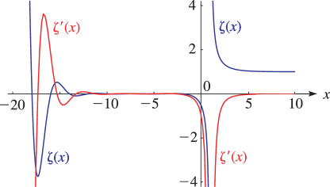
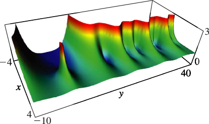
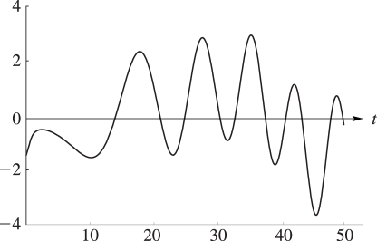
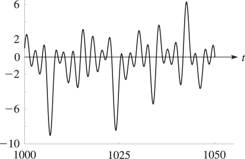
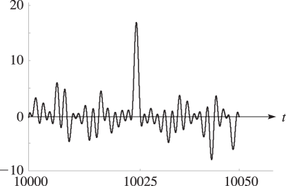

# §25.3 Graphics

:::{note}
**Keywords:**

[Riemann zeta function](http://dlmf.nist.gov/search/search?q=Riemann%20zeta%20function) , [graphics](http://dlmf.nist.gov/search/search?q=graphics)

**Notes:**

These graphics were constructed at NIST.

**See also:**

Annotations for Ch.25
:::

:::{note}
**Symbols:**

$\zeta\left(\NVar{s}\right)$: Riemann zeta function and $x$: real variable

**See also:**

Annotations for §25.3 and Ch.25
:::

:::{note}
**Symbols:**

$\zeta\left(\NVar{s}\right)$: Riemann zeta function and $x$: real variable

**See also:**

Annotations for §25.3 and Ch.25
:::

:::{note}
**Symbols:**

$\zeta\left(\NVar{s}\right)$: Riemann zeta function , $\mathrm{i}$: imaginary unit and $x$: real variable

**See also:**

Annotations for §25.3 and Ch.25
:::

:::{note}
**Symbols:**

$\zeta\left(\NVar{s}\right)$: Riemann zeta function , $\mathrm{i}$: imaginary unit and $Z(t)$: zeros function

**See also:**

Annotations for §25.3 and Ch.25
:::

:::{note}
**Symbols:**

$Z(t)$: zeros function

**See also:**

Annotations for §25.3 and Ch.25
:::

:::{note}
**Symbols:**

$Z(t)$: zeros function

**See also:**

Annotations for §25.3 and Ch.25
:::
