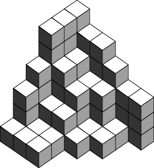

# §26.12 Plane Partitions

:::{note}
**See also:**

Annotations for Ch.26
:::

## §26.12(i) Definitions

:::{note}
**Defines:**

$\operatorname{pp}\left(\NVar{n}\right)$ : number of plane partitions of $n$

**Keywords:**

[box](http://dlmf.nist.gov/search/search?q=box) , [complementary](http://dlmf.nist.gov/search/search?q=complementary) , [definitions](http://dlmf.nist.gov/search/search?q=definitions) , [descending](http://dlmf.nist.gov/search/search?q=descending) , [plane partitions](http://dlmf.nist.gov/search/search?q=plane%20partitions) , [strict shifted](http://dlmf.nist.gov/search/search?q=strict%20shifted) , [symmetric](http://dlmf.nist.gov/search/search?q=symmetric)

**Notes:**

See Bressoud ([1999](./bib/B.html#bib348 "Proofs and Confirmations: The Story of the Alternating Sign Matrix Conjecture"), pp. 197–199) (as corrected here). Table 26.12.1 was computed by the author. For ( 26.12.7 ) see Andrews ([1979](./bib/index.html#bib93 "Plane partitions. III. The weak Macdonald conjecture"), p. 195).

**See also:**

Annotations for §26.12 and Ch.26
:::

A *plane partition* , $\pi$ , of a positive integer $n$ , is a partition of $n$ in which the parts have been arranged in a 2-dimensional array that is weakly decreasing (nonincreasing) across rows and down columns. Different configurations are counted as different plane partitions. As an example, there are six plane partitions of 3:

$$
3 \tag{26.12.1}
$$

$$
\begin{array}[]{cc}2&1\end{array}
$$

$$
\begin{array}[]{c}2\\
1\end{array}
$$

$$
\begin{array}[]{ccc}1&1&1\end{array}
$$

$$
\begin{array}[]{cc}1&1\\
1\end{array}
$$

$$
\begin{array}[]{c}1\\
1\\
1\end{array}
$$

:::{note}
**See also:**

Annotations for §26.12(i) , §26.12 and Ch.26
:::

An equivalent definition is that a plane partition is a finite subset of $\mathbb{N}\times\mathbb{N}\times\mathbb{N}$ with the property that if $(r,s,t)\in\pi$ and $(1,1,1)\leq(h,j,k)\leq(r,s,t)$ , then $(h,j,k)$ must be an element of $\pi$ . Here $(h,j,k)\leq(r,s,t)$ means $h\leq r$ , $j\leq s$ , and $k\leq t$ . It is useful to be able to visualize a plane partition as a pile of blocks, one block at each lattice point $(h,j,k)\in\pi$ . For example, Figure 26.12.1 depicts the pile of blocks that represents the plane partition of 75 given by ( 26.12.2 ).

:::{note}
**Referenced by:**

§26.12(i) , §26.12(i)

**See also:**

Annotations for §26.12(i) , §26.12 and Ch.26
:::

$$
\begin{array}[]{cccccc}6&5&5&4&3&3\\
6&4&3&3&1\\
6&4&3&1&1\\
4&2&2&1\\
3&1&1\\
1&1&1\end{array} \tag{26.12.2}
$$

The number of plane partitions of $n$ is denoted by $\operatorname{pp}\left(n\right)$ , with $\operatorname{pp}\left(0\right)=1$ . See Table 26.12.1 .

| **$n$** | **$\operatorname{pp}\left(n\right)$** | **$n$** | **$\operatorname{pp}\left(n\right)$** | **$n$** | **$\operatorname{pp}\left(n\right)$** |
|---|---|---|---|---|---|
| **0** | **1** | **17** | **18334** | **34** | **281 75955** |
| **1** | **1** | **18** | **29601** | **35** | **416 91046** |
| **2** | **3** | **19** | **47330** | **36** | **614 84961** |
| **3** | **6** | **20** | **75278** | **37** | **903 79784** |
| **4** | **13** | **21** | **1 18794** | **38** | **1324 41995** |
| **5** | **24** | **22** | **1 86475** | **39** | **1934 87501** |
| **6** | **48** | **23** | **2 90783** | **40** | **2818 46923** |
| **7** | **86** | **24** | **4 51194** | **41** | **4093 83981** |
| **8** | **160** | **25** | **6 96033** | **42** | **5930 01267** |
| **9** | **282** | **26** | **10 68745** | **43** | **8566 67495** |
| **10** | **500** | **27** | **16 32658** | **44** | **12343 63833** |
| **11** | **859** | **28** | **24 83234** | **45** | **17740 79109** |
| **12** | **1479** | **29** | **37 59612** | **46** | **25435 35902** |
| **13** | **2485** | **30** | **56 68963** | **47** | **36379 93036** |
| **14** | **4167** | **31** | **85 12309** | **48** | **51913 04973** |
| **15** | **6879** | **32** | **127 33429** | **49** | **73910 26522** |
| **16** | **11297** | **33** | **189 74973** | **50** | **1 04996 40707** |
: Table 26.12.1: Plane partitions.

:::{note}
**Symbols:**

$\operatorname{pp}\left(\NVar{n}\right)$: number of plane partitions of $n$ and $n$: nonnegative integer

**Keywords:**

[partitions](http://dlmf.nist.gov/search/search?q=partitions) , [plane partitions](http://dlmf.nist.gov/search/search?q=plane%20partitions) , [table](http://dlmf.nist.gov/search/search?q=table) , [tables](http://dlmf.nist.gov/search/search?q=tables)

**Referenced by:**

§26.12(i) , §26.12(i)

**See also:**

Annotations for §26.12(i) , §26.12 and Ch.26
:::

We define the $r\times s\times t$ *box* $B(r,s,t)$ as

$$
B(r,s,t)=\{(h,j,k)\>|\>1\leq h\leq r,1\leq j\leq s,1\leq k\leq t\}. \tag{26.12.3}
$$

Then the number of plane partitions in $B(r,s,t)$ is

$$
\prod_{(h,j,k)\in B(r,s,t)}\frac{h+j+k-1}{h+j+k-2}=\prod_{h=1}^{r}\prod_{j=1}^{s}\frac{h+j+t-1}{h+j-1}. \tag{26.12.4}
$$

A plane partition is *symmetric* if $(h,j,k)\in\pi$ implies that $(j,h,k)\in\pi$ . The number of symmetric plane partitions in $B(r,r,t)$ is

$$
\prod_{h=1}^{r}\frac{2h+t-1}{2h-1}\prod_{1\leq h<j\leq r}\frac{h+j+t-1}{h+j-1}. \tag{26.12.5}
$$

A plane partition is *cyclically symmetric* if $(h,j,k)\in\pi$ implies $(j,k,h)\in\pi$ . The plane partition in Figure 26.12.1 is an example of a cyclically symmetric plane partition. The number of cyclically symmetric plane partitions in $B(r,r,r)$ is

$$
\prod_{h=1}^{r}\frac{3h-1}{3h-2}\prod_{1\leq h<j\leq r}\frac{h+2j-1}{h+j-1}, \tag{26.12.6}
$$

or equivalently,

$$
\prod_{h=1}^{r}\left(\frac{3h-1}{3h-2}\prod_{j=h}^{r}\frac{r+h+j-1}{2h+j-1}\right). \tag{26.12.7}
$$

A plane partition is *totally symmetric* if it is both symmetric and cyclically symmetric. The number of totally symmetric plane partitions in $B(r,r,r)$ is

$$
\prod_{1\leq h\leq j\leq r}\frac{h+j+r-1}{h+2j-2}. \tag{26.12.8}
$$

The *complement* of $\pi\subseteq B(r,s,t)$ is $\pi^{c}=\{(h,j,k)\>|\>(r-h+1,s-j+1,t-k+1)\notin\pi\}$ . A plane partition is *self-complementary* if it is equal to its complement. The number of self-complementary plane partitions in $B(2r,2s,2t)$ is

$$
\left(\prod_{h=1}^{r}\prod_{j=1}^{s}\frac{h+j+t-1}{h+j-1}\right)^{2}; \tag{26.12.9}
$$

in $B(2r+1,2s,2t)$ it is

$$
\left(\prod_{h=1}^{r}\prod_{j=1}^{s}\frac{h+j+t-1}{h+j-1}\right)\*\left(\prod_{h=1}^{r+1}\prod_{j=1}^{s}\frac{h+j+t-1}{h+j-1}\right); \tag{26.12.10}
$$

in $B(2r+1,2s+1,2t)$ it is

$$
\left(\prod_{h=1}^{r+1}\prod_{j=1}^{s}\frac{h+j+t-1}{h+j-1}\right)\*\left(\prod_{h=1}^{r}\prod_{j=1}^{s+1}\frac{h+j+t-1}{h+j-1}\right). \tag{26.12.11}
$$

A plane partition is *transpose complement* if it is equal to the reflection through the $(x,y)$ -plane of its complement. The number of transpose complement plane partitions in $B(r,r,2t)$ is

$$
\genfrac{(}{)}{0.0pt}{}{t+r-1}{r-1}\prod_{1\leq h\leq j\leq r-2}\frac{h+j+2t+1}{h+j+1}. \tag{26.12.12}
$$

The number of symmetric self-complementary plane partitions in $B(2r,2r,2t)$ is

$$
\prod_{h=1}^{r}\prod_{j=1}^{r}\frac{h+j+t-1}{h+j-1}; \tag{26.12.13}
$$

in $B(2r+1,2r+1,2t)$ it is

$$
\prod_{h=1}^{r}\prod_{j=1}^{r+1}\frac{h+j+t-1}{h+j-1}. \tag{26.12.14}
$$

The number of cyclically symmetric transpose complement plane partitions in $B(2r,2r,2r)$ is

$$
\prod_{h=0}^{r-1}\frac{(3h+1)\,(6h)!\,(2h)!}{(4h+1)!\,(4h)!}. \tag{26.12.15}
$$

The number of cyclically symmetric self-complementary plane partitions in $B(2r,2r,2r)$ is

$$
\left(\prod_{h=0}^{r-1}\frac{(3h+1)!}{(r+h)!}\right)^{2}. \tag{26.12.16}
$$

The number of totally symmetric self-complementary plane partitions in $B(2r,2r,2r)$ is

$$
\prod_{h=0}^{r-1}\frac{(3h+1)!}{(r+h)!}. \tag{26.12.17}
$$

A *strict shifted plane partition* is an arrangement of the parts in a partition so that each row is indented one space from the previous row and there is weak decrease across rows and strict decrease down columns. An example is given by:

$$
\begin{array}[]{ccccc}6&6&6&4&3\\
&3&3\\
&&2\end{array} \tag{26.12.18}
$$

A *descending plane partition* is a strict shifted plane partition in which the number of parts in each row is strictly less than the largest part in that row and is greater than or equal to the largest part in the next row. The example of a strict shifted plane partition also satisfies the conditions of a descending plane partition. The number of descending plane partitions in $B(r,r,r)$ is

$$
\prod_{h=0}^{r-1}\frac{(3h+1)!}{(r+h)!}. \tag{26.12.19}
$$

## §26.12(ii) Generating Functions

:::{note}
**Keywords:**

[generating functions](http://dlmf.nist.gov/search/search?q=generating%20functions) , [plane partitions](http://dlmf.nist.gov/search/search?q=plane%20partitions)

**Notes:**

See Bressoud ([1999](./bib/B.html#bib348 "Proofs and Confirmations: The Story of the Alternating Sign Matrix Conjecture"), pp. 11, 13–18, 22). For ( 26.12.22 ) see also Andrews ([1979](./bib/index.html#bib93 "Plane partitions. III. The weak Macdonald conjecture"), p. 195).

**See also:**

Annotations for §26.12 and Ch.26
:::

The notation $\sum_{\pi\subseteq B(r,s,t)}$ denotes the sum over all plane partitions contained in $B(r,s,t)$ , and $|\pi|$ denotes the number of elements in $\pi$ .

$$
\sum_{\pi\subseteq\mathbb{N}\times\mathbb{N}\times\mathbb{N}}q^{|\pi|}=\prod_{k=1}^{\infty}\frac{1}{(1-q^{k})^{k}}, \tag{26.12.20}
$$

$$
\sum_{\pi\subseteq B(r,s,t)}q^{|\pi|}=\prod_{(h,j,k)\in B(r,s,t)}\frac{1-q^{h+j+k-1}}{1-q^{h+j+k-2}}=\prod_{h=1}^{r}\prod_{j=1}^{s}\frac{1-q^{h+j+t-1}}{1-q^{h+j-1}}, \tag{26.12.21}
$$

$$
\sum_{\begin{subarray}{c}\pi\subseteq B(r,r,t)\\
\pi\mbox{\scriptsize\ symmetric}\end{subarray}}q^{|\pi|}=\prod_{h=1}^{r}\frac{1-q^{2h+t-1}}{1-q^{2h-1}}\prod_{1\leq h<j\leq r}\frac{1-q^{2(h+j+t-1)}}{1-q^{2(h+j-1)}}. \tag{26.12.22}
$$

$$
\sum_{\begin{subarray}{c}\pi\subseteq B(r,r,r)\\
\pi\mbox{\scriptsize\ cyclically symmetric}\end{subarray}}q^{\left|\pi\right|}=\prod_{h=1}^{r}\frac{1-q^{3h-1}}{1-q^{3h-2}}\prod_{1\leq h<j\leq r}\frac{1-q^{3(h+2j-1)}}{1-q^{3(h+j-1)}}=\prod_{h=1}^{r}\left(\frac{1-q^{3h-1}}{1-q^{3h-2}}\prod_{j=h}^{r}\frac{1-q^{3(r+h+j-1)}}{1-q^{3(2h+j-1)}}\right). \tag{26.12.23}
$$

$$
\sum_{\begin{subarray}{c}\pi\subseteq B(r,r,r)\\
\pi\mbox{\scriptsize\ descending plane partition}\end{subarray}}q^{|\pi|}=\prod_{1\leq h<j\leq r}\frac{1-q^{r+h+j-1}}{1-q^{2h+j-1}}. \tag{26.12.24}
$$

## §26.12(iii) Recurrence Relation

:::{note}
**Keywords:**

[plane partitions](http://dlmf.nist.gov/search/search?q=plane%20partitions) , [recurrence relation](http://dlmf.nist.gov/search/search?q=recurrence%20relation)

**Notes:**

See Bressoud ([1999](./bib/B.html#bib348 "Proofs and Confirmations: The Story of the Alternating Sign Matrix Conjecture"), p. 57).

**See also:**

Annotations for §26.12 and Ch.26
:::

$$
\operatorname{pp}\left(n\right)=\frac{1}{n}\sum_{j=1}^{n}\operatorname{pp}\left(n-j\right)\sigma_{2}(j), \tag{26.12.25}
$$

where $\sigma_{2}(j)$ is the sum of the squares of the divisors of $j$ .

## §26.12(iv) Limiting Form

:::{note}
**Keywords:**

[limiting form](http://dlmf.nist.gov/search/search?q=limiting%20form) , [partitions](http://dlmf.nist.gov/search/search?q=partitions) , [plane partitions](http://dlmf.nist.gov/search/search?q=plane%20partitions)

**Notes:**

See Mutafchiev and Kamenov ([2006](./bib/M.html#bib2752 "Asymptotic formula for the number of plane partitions of positive integers")). (A former incorrect version of ( 26.12.26 ) was from Andrews ([1976](./bib/index.html#bib92 "The Theory of Partitions"), p. 199)).

**Referenced by:**

Erratum (V1.0.5) for References

**Addition (effective with 1.0.5):**

Mutafchiev and Kamenov ([2006](./bib/M.html#bib2752 "Asymptotic formula for the number of plane partitions of positive integers")) was added as the reference for this subsection, replacing Andrews ([1976](./bib/index.html#bib92 "The Theory of Partitions")).

**See also:**

Annotations for §26.12 and Ch.26
:::

As $n\to\infty$

$$
\operatorname{pp}\left(n\right)\sim\frac{\left(\zeta\left(3\right)\right)^{7/36}}{2^{11/36}(3\pi)^{1/2}n^{25/36}}\exp\left(3\left(\zeta\left(3\right)\right)^{1/3}\left(\tfrac{1}{2}n\right)^{2/3}+\zeta'\left(-1\right)\right), \tag{26.12.26}
$$

where $\zeta$ is the Riemann $\zeta$ -function (§ 25.2(i) ).

Addendum: To ten decimal places,

$$
\displaystyle\zeta\left(3\right) \displaystyle=1.20205\;69032, \tag{26.12.27}
$$

$$
\displaystyle\zeta'\left(-1\right) \displaystyle=-0.16542\;11437.
$$

:::{note}
**Symbols:**

$\zeta\left(\NVar{s}\right)$: Riemann zeta function

**Referenced by:**

Erratum (V1.0.5) for Chapters 8, 20, 36

**Addition (effective with 1.0.5):**

This equation has been added to give decimal values of $\zeta\left(3\right)$ and $\zeta'\left(-1\right)$ . It will be included in the next print edition.

**See also:**

Annotations for §26.12(iv) , §26.12 and Ch.26
:::
