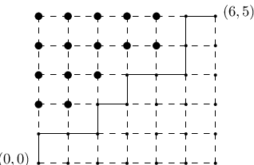

# §26.9 Integer Partitions:
Restricted Number and Part Size

:::{note}
**Keywords:**

[of integers](http://dlmf.nist.gov/search/search?q=of%20integers) , [partitions](http://dlmf.nist.gov/search/search?q=partitions)

**Referenced by:**

§17.16 , §27.14(vi)

**See also:**

Annotations for Ch.26
:::

## §26.9(i) Definitions

:::{note}
**Defines:**

$p_{\NVar{k}}\left(\NVar{n}\right)$ : total number of partitions of $n$ into at most $k$ parts and $p_{\NVar{k}}\left(\leq\NVar{m},\NVar{n}\right)$ : number of partitions of $n$ into at most $k$ parts, each less than or equal to $m$

**Keywords:**

[Ferrers graph](http://dlmf.nist.gov/search/search?q=Ferrers%20graph) , [conjugate](http://dlmf.nist.gov/search/search?q=conjugate) , [notation](http://dlmf.nist.gov/search/search?q=notation) , [partitions](http://dlmf.nist.gov/search/search?q=partitions) , [relation to lattice paths](http://dlmf.nist.gov/search/search?q=relation%20to%20lattice%20paths) , [restricted integer partitions](http://dlmf.nist.gov/search/search?q=restricted%20integer%20partitions)

**Notes:**

See Andrews ([1976](./bib/index.html#bib92 "The Theory of Partitions"), pp. 1–13, 81). Table 26.9.1 was computed by the author.

**Referenced by:**

§26.17 , §27.14(i) , §27.14(i)

**See also:**

Annotations for §26.9 and Ch.26
:::

$p_{k}\left(n\right)$ denotes the number of partitions of $n$ into at most $k$ parts. See Table 26.9.1 .

$$
p_{k}\left(n\right)=p\left(n\right), \tag{26.9.1}
$$

Unrestricted partitions are covered in § [27.14](./27.14.md "§27.14 Unrestricted Partitions ‣ Additive Number Theory ‣ Chapter 27 Functions of Number Theory") .

| **$n$** | **$k$** |   |   |   |   |   |   |   |   |   |   |
|---|---|---|---|---|---|---|---|---|---|---|---|
| **0** | **1** | **2** | **3** | **4** | **5** | **6** | **7** | **8** | **9** | **10** |   |
| **0** | **1** | **1** | **1** | **1** | **1** | **1** | **1** | **1** | **1** | **1** | **1** |
| **1** | **0** | **1** | **1** | **1** | **1** | **1** | **1** | **1** | **1** | **1** | **1** |
| **2** | **0** | **1** | **2** | **2** | **2** | **2** | **2** | **2** | **2** | **2** | **2** |
| **3** | **0** | **1** | **2** | **3** | **3** | **3** | **3** | **3** | **3** | **3** | **3** |
| **4** | **0** | **1** | **3** | **4** | **5** | **5** | **5** | **5** | **5** | **5** | **5** |
| **5** | **0** | **1** | **3** | **5** | **6** | **7** | **7** | **7** | **7** | **7** | **7** |
| **6** | **0** | **1** | **4** | **7** | **9** | **10** | **11** | **11** | **11** | **11** | **11** |
| **7** | **0** | **1** | **4** | **8** | **11** | **13** | **14** | **15** | **15** | **15** | **15** |
| **8** | **0** | **1** | **5** | **10** | **15** | **18** | **20** | **21** | **22** | **22** | **22** |
| **9** | **0** | **1** | **5** | **12** | **18** | **23** | **26** | **28** | **29** | **30** | **30** |
| **10** | **0** | **1** | **6** | **14** | **23** | **30** | **35** | **38** | **40** | **41** | **42** |
: Table 26.9.1: Partitions p k ⁡ ( n ) .

:::{note}
**Symbols:**

$p_{\NVar{k}}\left(\NVar{n}\right)$: total number of partitions of $n$ into at most $k$ parts , $k$: nonnegative integer and $n$: nonnegative integer

**Keywords:**

[restricted integer partitions](http://dlmf.nist.gov/search/search?q=restricted%20integer%20partitions) , [tables](http://dlmf.nist.gov/search/search?q=tables)

**Referenced by:**

§26.9(i) , §26.9(i)

**See also:**

Annotations for §26.9(i) , §26.9 and Ch.26
:::

A useful representation for a partition is the *Ferrers graph* in which the integers in the partition are each represented by a row of dots. An example is provided in Figure 26.9.1 .

| $\bullet$ | $\bullet$ | $\bullet$ | $\bullet$ | $\bullet$ | $\bullet$ | $\bullet$ |
|---|---|---|---|---|---|---|
| $\bullet$ | $\bullet$ | $\bullet$ | $\bullet$ |   |   |   |
| $\bullet$ | $\bullet$ | $\bullet$ |   |   |   |   |
| $\bullet$ | $\bullet$ | $\bullet$ |   |   |   |   |
| $\bullet$ | $\bullet$ |   |   |   |   |   |
| $\bullet$ |   |   |   |   |   |   |
: Figure 26.9.1: Ferrers graph of the partition 7 + 4 + 3 + 3 + 2 + 1 .

:::{note}
**Referenced by:**

§26.9(i) , §26.9(i)

**See also:**

Annotations for §26.9(i) , §26.9 and Ch.26
:::

The *conjugate* partition is obtained by reflecting the Ferrers graph across the main diagonal or, equivalently, by representing each integer by a column of dots. The conjugate to the example in Figure 26.9.1 is $6+5+4+2+1+1+1$ . Conjugation establishes a one-to-one correspondence between partitions of $n$ into at most $k$ parts and partitions of $n$ into parts with largest part less than or equal to $k$ . It follows that $p_{k}\left(n\right)$ also equals the number of partitions of $n$ into parts that are less than or equal to $k$ .

$p_{k}\left(\leq m,n\right)$ is the number of partitions of $n$ into at most $k$ parts, each less than or equal to $m$ . It is also equal to the number of lattice paths from $(0,0)$ to $(m,k)$ that have exactly $n$ vertices $(h,j)$ , $1\leq h\leq m$ , $1\leq j\leq k$ , above and to the left of the lattice path. See Figure 26.9.2 .

:::{note}
**Symbols:**

$(\NVar{a},\NVar{b})$: open interval

**Referenced by:**

§26.2 , §26.9(i)

**See also:**

Annotations for §26.9(i) , §26.9 and Ch.26
:::

Equations ( 26.9.2 )–( 26.9.3 ) are examples of closed forms that can be computed explicitly for any positive integer $k$ . See Andrews ([1976](./bib/index.html#bib92 "The Theory of Partitions"), p. 81).

$$
p_{0}\left(n\right)=0, \tag{26.9.2}
$$

$$
\displaystyle p_{1}\left(n\right) \displaystyle=1, \tag{26.9.3}
$$

$$
\displaystyle p_{2}\left(n\right) \displaystyle=1+\left\lfloor n/2\right\rfloor,
$$

$$
\displaystyle p_{3}\left(n\right) \displaystyle=1+\left\lfloor\frac{n^{2}+6n}{12}\right\rfloor.
$$

:::{note}
**Symbols:**

$\left\lfloor\NVar{x}\right\rfloor$: floor of $x$ , $p_{\NVar{k}}\left(\NVar{n}\right)$: total number of partitions of $n$ into at most $k$ parts and $n$: nonnegative integer

**Referenced by:**

§26.9(i)

**See also:**

Annotations for §26.9(i) , §26.9 and Ch.26
:::

## §26.9(ii) Generating Functions

:::{note}
**Keywords:**

[Gaussian polynomials](http://dlmf.nist.gov/search/search?q=Gaussian%20polynomials) , [definition](http://dlmf.nist.gov/search/search?q=definition) , [generating functions](http://dlmf.nist.gov/search/search?q=generating%20functions) , [$q$-binomial coefficient](http://dlmf.nist.gov/search/search?q=q-binomial%20coefficient) , [restricted integer partitions](http://dlmf.nist.gov/search/search?q=restricted%20integer%20partitions)

**Notes:**

See Andrews ([1976](./bib/index.html#bib92 "The Theory of Partitions"), pp. 36, 47).

**Referenced by:**

§17.2(iii) , §17.2(iii) , §26.16

**See also:**

Annotations for §26.9 and Ch.26
:::

In what follows

$$
\genfrac{[}{]}{0.0pt}{}{m}{n}_{q}=\prod_{j=1}^{n}\frac{1-q^{m-n+j}}{1-q^{j}}, \tag{26.9.4}
$$

is the *Gaussian polynomial* (or $q$ - *binomial coefficient* ); see also §§ 17.2(i) – 17.2(ii) . In the present chapter $m\geq n\geq 0$ in all cases. It is also assumed everywhere that $|q|<1$ .

$$
\sum_{n=0}^{\infty}p_{k}\left(n\right)q^{n}=\prod_{j=1}^{k}\frac{1}{1-q^{j}}=1+\sum_{m=1}^{\infty}\genfrac{[}{]}{0.0pt}{}{k+m-1}{m}_{q}q^{m}, \tag{26.9.5}
$$

$$
\sum_{n=0}^{\infty}p_{k}\left(\leq m,n\right)q^{n}=\genfrac{[}{]}{0.0pt}{}{m+k}{k}_{q}. \tag{26.9.6}
$$

Also, when $|xq|<1$

$$
\sum_{m,n=0}^{\infty}p_{k}\left(\leq m,n\right)x^{k}q^{n}=1+\sum_{k=1}^{\infty}\genfrac{[}{]}{0.0pt}{}{m+k}{k}_{q}x^{k}=\prod_{j=0}^{m}\frac{1}{1-x\,q^{j}}. \tag{26.9.7}
$$

## §26.9(iii) Recurrence Relations

:::{note}
**Keywords:**

[recurrence relations](http://dlmf.nist.gov/search/search?q=recurrence%20relations) , [restricted integer partitions](http://dlmf.nist.gov/search/search?q=restricted%20integer%20partitions)

**Notes:**

( 26.9.9 ) is a special case of equation (2.23) in Bressoud ([1999](./bib/B.html#bib348 "Proofs and Confirmations: The Story of the Alternating Sign Matrix Conjecture"), p. 60).

**See also:**

Annotations for §26.9 and Ch.26
:::

$$
p_{k}\left(n\right)=p_{k}\left(n-k\right)+p_{k-1}\left(n\right); \tag{26.9.8}
$$

equivalently, partitions into at most $k$ parts either have exactly $k$ parts, in which case we can subtract one from each part, or they have strictly fewer than $k$ parts.

$$
p_{k}\left(n\right)=\frac{1}{n}\sum_{t=1}^{n}p_{k}\left(n-t\right)\sum_{\begin{subarray}{c}j\mathbin{|}t\\
j\leq k\end{subarray}}j, \tag{26.9.9}
$$

where the inner sum is taken over all positive divisors of $t$ that are less than or equal to $k$ .

## §26.9(iv) Limiting Form

:::{note}
**Keywords:**

[limiting form](http://dlmf.nist.gov/search/search?q=limiting%20form) , [restricted integer partitions](http://dlmf.nist.gov/search/search?q=restricted%20integer%20partitions)

**Notes:**

See Andrews ([1976](./bib/index.html#bib92 "The Theory of Partitions"), Chapter 6).

**See also:**

Annotations for §26.9 and Ch.26
:::

As $n\to\infty$ with $k$ fixed,

$$
p_{k}\left(n\right)\sim\frac{n^{k-1}}{k!(k-1)!}. \tag{26.9.10}
$$
