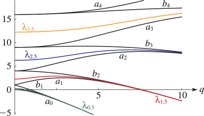
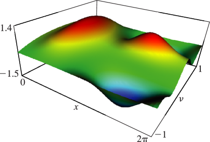
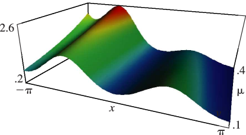

# §28.13 Graphics

:::{note}
**Keywords:**

[Mathieu functions](http://dlmf.nist.gov/search/search?q=Mathieu%20functions) , [graphics](http://dlmf.nist.gov/search/search?q=graphics)

**See also:**

Annotations for Ch.28
:::

## §28.13(i) Eigenvalues λν⁡(q) for General ν

:::{note}
**Keywords:**

[Mathieu’s equation](http://dlmf.nist.gov/search/search?q=Mathieu%20equation) , [eigenvalues (or characteristic values)](http://dlmf.nist.gov/search/search?q=eigenvalues%20%28or%20characteristic%20values%29) , [graphics](http://dlmf.nist.gov/search/search?q=graphics)

**Notes:**

Figures 28.13.1 and 28.13.2 were produced at NIST.

**See also:**

Annotations for §28.13 and Ch.28
:::

:::{note}
**Symbols:**

$a_{\NVar{n}}\left(\NVar{q}\right)$: eigenvalues of Mathieu equation , $b_{\NVar{n}}\left(\NVar{q}\right)$: eigenvalues of Mathieu equation , $\lambda_{\NVar{\nu+2n}}\left(\NVar{q}\right)$: eigenvalues of Mathieu equation , $q=h^{2}$: parameter , $n$: integer , $\nu$: complex parameter and $a$: parameter

**Referenced by:**

§28.12(i) , §28.13(i) , §28.16

**See also:**

Annotations for §28.13(i) , §28.13 and Ch.28
:::

## §28.13(ii) Solutions ceν⁡(x,q),seν⁡(x,q), and meν⁡(x,q) for General ν

:::{note}
**Notes:**

Figures 28.13.3 – 28.13.5 were produced at NIST.

**See also:**

Annotations for §28.13 and Ch.28
:::

:::{note}
**Symbols:**

$\operatorname{ce}_{\NVar{n}}\left(\NVar{z},\NVar{q}\right)$: Mathieu function , $\pi$: the ratio of the circumference of a circle to its diameter , $x$: real variable and $\nu$: complex parameter

**Referenced by:**

§28.12(iii) , §28.13(ii)

**See also:**

Annotations for §28.13(ii) , §28.13 and Ch.28
:::

:::{note}
**Symbols:**

$\operatorname{me}_{\NVar{n}}\left(\NVar{z},\NVar{q}\right)$: Mathieu function , $\pi$: the ratio of the circumference of a circle to its diameter , $\mathrm{i}$: imaginary unit and $x$: real variable

**Referenced by:**

§28.13(ii) , §28.17

**See also:**

Annotations for §28.13(ii) , §28.13 and Ch.28
:::
