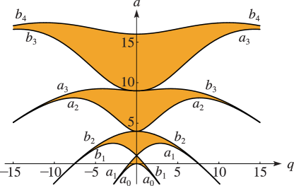

# §28.17 Stability as x→±∞

:::{note}
**Keywords:**

[Mathieu’s equation](http://dlmf.nist.gov/search/search?q=Mathieu%20equation) , [characteristic curves](http://dlmf.nist.gov/search/search?q=characteristic%20curves) , [eigenvalues (or characteristic values)](http://dlmf.nist.gov/search/search?q=eigenvalues%20%28or%20characteristic%20values%29) , [parameters](http://dlmf.nist.gov/search/search?q=parameters) , [stability chart](http://dlmf.nist.gov/search/search?q=stability%20chart) , [stable pairs](http://dlmf.nist.gov/search/search?q=stable%20pairs) , [stable regions](http://dlmf.nist.gov/search/search?q=stable%20regions) , [unstable pairs](http://dlmf.nist.gov/search/search?q=unstable%20pairs)

**Notes:**

See Arscott ([1964b](./bib/index.html#bib142 "Periodic Differential Equations. An Introduction to Mathieu, Lamé, and Allied Functions"), §6.2) and Meixner and Schäfke ([1954](./bib/M.html#bib1598 "Mathieusche Funktionen und Sphäroidfunktionen mit Anwendungen auf physikalische und technische Probleme"), §§2.31–2.32). Figure 28.17.1 was recomputed by the author.

**Referenced by:**

§28.33(iii)

**See also:**

Annotations for Ch.28
:::

If all solutions of ( 28.2.1 ) are bounded when $x\to\pm\infty$ along the real axis, then the corresponding pair of parameters $(a,q)$ is called *stable* . All other pairs are *unstable* .

For example, positive real values of $a$ with $q=0$ comprise stable pairs, as do values of $a$ and $q$ that correspond to real, but noninteger, values of $\nu$ .

However, if $\Im\nu\neq 0$ , then $(a,q)$ always comprises an unstable pair. For example, as $x\to+\infty$ one of the solutions $\operatorname{me}_{\nu}\left(x,q\right)$ and $\operatorname{me}_{\nu}\left(-x,q\right)$ tends to $0$ and the other is unbounded (compare Figure 28.13.5 ). Also, all nontrivial solutions of ( 28.2.1 ) are unbounded on $\mathbb{R}$ .

For real $a$ and $q$ $(\neq 0)$ the stable regions are the open regions indicated in color in Figure 28.17.1 . The boundary of each region comprises the *characteristic curves* $a=a_{n}\left(q\right)$ and $a=b_{n}\left(q\right)$ ; compare Figure 28.2.1 .

:::{note}
**Referenced by:**

§28.17 , §28.17 , §28.33(iii)

**See also:**

Annotations for §28.17 and Ch.28
:::
