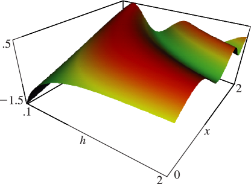

# §28.21 Graphics

:::{note}
**Keywords:**

[graphics](http://dlmf.nist.gov/search/search?q=graphics) , [modified Mathieu functions](http://dlmf.nist.gov/search/search?q=modified%20Mathieu%20functions)

**Notes:**

Figures 28.21.1 – 28.21.6 were produced at NIST.

**See also:**

Annotations for Ch.28
:::

:::{note}
**Keywords:**

[graphics](http://dlmf.nist.gov/search/search?q=graphics) , [modified Mathieu functions](http://dlmf.nist.gov/search/search?q=modified%20Mathieu%20functions) , [radial Mathieu functions](http://dlmf.nist.gov/search/search?q=radial%20Mathieu%20functions)

**See also:**

Annotations for §28.21 and Ch.28
:::

:::{note}
**Symbols:**

${\operatorname{Mc}^{(\NVar{j})}_{\NVar{n}}}\left(\NVar{z},\NVar{h}\right)$: radial Mathieu function , $h$: parameter and $x$: real variable

**Referenced by:**

§28.21

**See also:**

Annotations for §28.21 , §28.21 and Ch.28
:::

:::{note}
**Symbols:**

${\operatorname{Mc}^{(\NVar{j})}_{\NVar{n}}}\left(\NVar{z},\NVar{h}\right)$: radial Mathieu function , $h$: parameter and $x$: real variable

**See also:**

Annotations for §28.21 , §28.21 and Ch.28
:::

:::{note}
**Symbols:**

${\operatorname{Ms}^{(\NVar{j})}_{\NVar{n}}}\left(\NVar{z},\NVar{h}\right)$: radial Mathieu function , $h$: parameter and $x$: real variable

**See also:**

Annotations for §28.21 , §28.21 and Ch.28
:::
