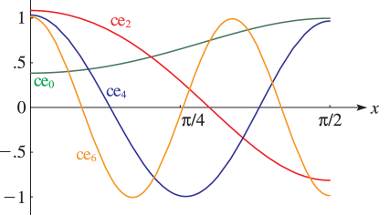
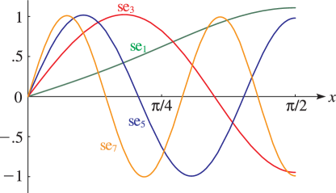

# §28.3 Graphics

:::{note}
**Keywords:**

[Mathieu functions](http://dlmf.nist.gov/search/search?q=Mathieu%20functions) , [graphics](http://dlmf.nist.gov/search/search?q=graphics)

**See also:**

Annotations for Ch.28
:::

## §28.3(i) Line Graphs: Mathieu Functions with Fixed q and Variable x

:::{note}
**Notes:**

Figures 28.3.1 – 28.3.8 were produced at NIST.

**See also:**

Annotations for §28.3 and Ch.28
:::

### Even π-Periodic Solutions

:::{note}
**See also:**

Annotations for §28.3(i) , §28.3 and Ch.28
:::

:::{note}
**Symbols:**

$\operatorname{ce}_{\NVar{n}}\left(\NVar{z},\NVar{q}\right)$: Mathieu function , $\pi$: the ratio of the circumference of a circle to its diameter , $n$: integer and $x$: real variable

**Referenced by:**

§28.3(i)

**See also:**

Annotations for §28.3(i) , §28.3(i) , §28.3 and Ch.28
:::

### Even π-Antiperiodic Solutions

:::{note}
**See also:**

Annotations for §28.3(i) , §28.3 and Ch.28
:::

:::{note}
**Symbols:**

$\operatorname{ce}_{\NVar{n}}\left(\NVar{z},\NVar{q}\right)$: Mathieu function , $\pi$: the ratio of the circumference of a circle to its diameter , $n$: integer and $x$: real variable

**See also:**

Annotations for §28.3(i) , §28.3(i) , §28.3 and Ch.28
:::

### Odd π-Antiperiodic Solutions

:::{note}
**See also:**

Annotations for §28.3(i) , §28.3 and Ch.28
:::

:::{note}
**Symbols:**

$\operatorname{se}_{\NVar{n}}\left(\NVar{z},\NVar{q}\right)$: Mathieu function , $\pi$: the ratio of the circumference of a circle to its diameter , $n$: integer and $x$: real variable

**See also:**

Annotations for §28.3(i) , §28.3(i) , §28.3 and Ch.28
:::

### Odd π-Periodic Solutions

:::{note}
**See also:**

Annotations for §28.3(i) , §28.3 and Ch.28
:::

:::{note}
**Symbols:**

$\operatorname{se}_{\NVar{n}}\left(\NVar{z},\NVar{q}\right)$: Mathieu function , $\pi$: the ratio of the circumference of a circle to its diameter , $n$: integer and $x$: real variable

**See also:**

Annotations for §28.3(i) , §28.3(i) , §28.3 and Ch.28
:::

For further graphs see Jahnke et al. ([1966](./bib/J.html#bib1160 "Tafeln höherer Funktionen (Tables of Higher Functions)"), pp. 264–265 and 268–275).

## §28.3(ii) Surfaces: Mathieu Functions with Variable x and q

:::{note}
**Keywords:**

[Mathieu functions](http://dlmf.nist.gov/search/search?q=Mathieu%20functions) , [graphics](http://dlmf.nist.gov/search/search?q=graphics)

**Notes:**

Figures 28.3.9 – 28.3.13 were produced at NIST.

**See also:**

Annotations for §28.3 and Ch.28
:::

:::{note}
**Symbols:**

$\operatorname{ce}_{\NVar{n}}\left(\NVar{z},\NVar{q}\right)$: Mathieu function , $\pi$: the ratio of the circumference of a circle to its diameter , $q=h^{2}$: parameter and $x$: real variable

**Referenced by:**

§28.3(ii)

**See also:**

Annotations for §28.3(ii) , §28.3 and Ch.28
:::

:::{note}
**Symbols:**

$\operatorname{ce}_{\NVar{n}}\left(\NVar{z},\NVar{q}\right)$: Mathieu function , $\pi$: the ratio of the circumference of a circle to its diameter , $q=h^{2}$: parameter and $x$: real variable

**See also:**

Annotations for §28.3(ii) , §28.3 and Ch.28
:::

:::{note}
**Symbols:**

$\operatorname{ce}_{\NVar{n}}\left(\NVar{z},\NVar{q}\right)$: Mathieu function , $\pi$: the ratio of the circumference of a circle to its diameter , $q=h^{2}$: parameter and $x$: real variable

**Referenced by:**

§28.3(ii)

**See also:**

Annotations for §28.3(ii) , §28.3 and Ch.28
:::
