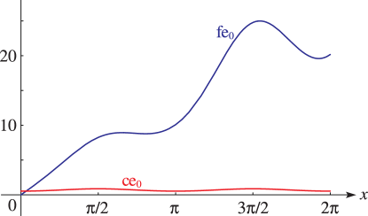
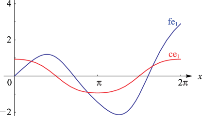
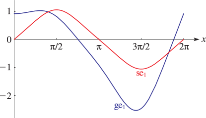

# §28.5 Second Solutions fen, gen

:::{note}
**See also:**

Annotations for Ch.28
:::

## §28.5(i) Definitions

:::{note}
**Keywords:**

[Mathieu’s equation](http://dlmf.nist.gov/search/search?q=Mathieu%20equation) , [Theorem of Ince](http://dlmf.nist.gov/search/search?q=Theorem%20of%20Ince) , [periodicity](http://dlmf.nist.gov/search/search?q=periodicity) , [second solutions](http://dlmf.nist.gov/search/search?q=second%20solutions)

**Notes:**

See McLachlan ([1947](./bib/M.html#bib1585 "Theory and Application of Mathieu Functions"), pp. 141–155) and Meixner and Schäfke ([1954](./bib/M.html#bib1598 "Mathieusche Funktionen und Sphäroidfunktionen mit Anwendungen auf physikalische und technische Probleme"), §2.72). For a proof of the Theorem of Ince see Arscott ([1964b](./bib/index.html#bib142 "Periodic Differential Equations. An Introduction to Mathieu, Lamé, and Allied Functions"), §2.4).

**Referenced by:**

§28.2(iv) , §28.22(i) , §28.28(i)

**See also:**

Annotations for §28.5 and Ch.28
:::

### Theorem of Ince (1922)

:::{note}
**Keywords:**

[Mathieu’s equation](http://dlmf.nist.gov/search/search?q=Mathieu%20equation) , [antiperiodicity](http://dlmf.nist.gov/search/search?q=antiperiodicity) , [definitions](http://dlmf.nist.gov/search/search?q=definitions) , [normalization](http://dlmf.nist.gov/search/search?q=normalization) , [reflection properties in $q$](http://dlmf.nist.gov/search/search?q=reflection%20properties%20in%20q) , [second solutions](http://dlmf.nist.gov/search/search?q=second%20solutions) , [values at $q=0$](http://dlmf.nist.gov/search/search?q=values%20at%20q%3D0)

**See also:**

Annotations for §28.5(i) , §28.5 and Ch.28
:::

If a nontrivial solution of Mathieu’s equation with $q\neq 0$ has period $\pi$ or $2\pi$ , then any linearly independent solution cannot have either period.

Second solutions of ( 28.2.1 ) are given by

$$
\operatorname{fe}_{n}\left(z,q\right)=C_{n}(q)\left(z\operatorname{ce}_{n}\left(z,q\right)+f_{n}(z,q)\right), \tag{28.5.1}
$$

when $a=a_{n}\left(q\right)$ , $n=0,1,2,\dots$ , and by

$$
\operatorname{ge}_{n}\left(z,q\right)=S_{n}(q)\left(z\operatorname{se}_{n}\left(z,q\right)+g_{n}(z,q)\right), \tag{28.5.2}
$$

when $a=b_{n}\left(q\right)$ , $n=1,2,3,\dots$ . For $m=0,1,2,\dots$ , we have

$$
\begin{array}[]{ll}f_{2m}(z,q)&\mbox{$\pi$-periodic, odd},\\
f_{2m+1}(z,q)&\mbox{$\pi$-antiperiodic, odd},\end{array} \tag{28.5.3}
$$

and

$$
\begin{array}[]{ll}g_{2m+1}(z,q)&\mbox{$\pi$-antiperiodic, even},\\
g_{2m+2}(z,q)&\mbox{$\pi$-periodic, even};\end{array} \tag{28.5.4}
$$

compare § 28.2(vi) . The functions $f_{n}(z,q)$ , $g_{n}(z,q)$ are unique.

The factors $C_{n}(q)$ and $S_{n}(q)$ in ( 28.5.1 ) and ( 28.5.2 ) are normalized so that

$$
(C_{n}(q))^{2}\int_{0}^{2\pi}(f_{n}(x,q))^{2}\,\mathrm{d}x=(S_{n}(q))^{2}\int_{0}^{2\pi}(g_{n}(x,q))^{2}\,\mathrm{d}x=\pi. \tag{28.5.5}
$$

As $q\to 0$ with $n\neq 0$ , $C_{n}(q)\to 0$ , $S_{n}(q)\to 0$ , $C_{n}(q)f_{n}(z,q)\to\sin nz$ , and $S_{n}(q)g_{n}(z,q)\to\cos nz$ . This determines the signs of $C_{n}(q)$ and $S_{n}(q)$ . (Other normalizations for $C_{n}(q)$ and $S_{n}(q)$ can be found in the literature, but most formulas—including connection formulas—are unaffected since $\operatorname{fe}_{n}\left(z,q\right)/C_{n}(q)$ and $\operatorname{ge}_{n}\left(z,q\right)/S_{n}(q)$ are invariant.)

$$
\displaystyle C_{2m}(-q) \displaystyle=C_{2m}(q), \tag{28.5.6}
$$

$$
\displaystyle C_{2m+1}(-q) \displaystyle=S_{2m+1}(q),
$$

$$
\displaystyle S_{2m+2}(-q) \displaystyle=S_{2m+2}(q).
$$

:::{note}
**Symbols:**

$m$: integer , $q=h^{2}$: parameter , $C_{n}(q)$: factor and $S_{n}(q)$: factor

**See also:**

Annotations for §28.5(i) , §28.5(i) , §28.5 and Ch.28
:::

For $q=0$ ,

$$
\displaystyle\operatorname{fe}_{0}\left(z,0\right) \displaystyle=z, \tag{28.5.7}
$$

$$
\displaystyle\operatorname{fe}_{n}\left(z,0\right) \displaystyle=\sin nz,
$$

$$
\displaystyle\operatorname{ge}_{n}\left(z,0\right) \displaystyle=\cos nz
$$

:::{note}
**Symbols:**

$\operatorname{fe}_{\NVar{n}}\left(\NVar{z},\NVar{q}\right)$: second solution, Mathieu’s equation , $\operatorname{ge}_{\NVar{n}}\left(\NVar{z},\NVar{q}\right)$: second solution, Mathieu’s equation , $\cos\NVar{z}$: cosine function , $\sin\NVar{z}$: sine function , $n$: integer and $z$: complex variable

**See also:**

Annotations for §28.5(i) , §28.5(i) , §28.5 and Ch.28
:::

compare ( 28.2.29 ).

As a consequence of the factor $z$ on the right-hand sides of ( 28.5.1 ), ( 28.5.2 ), all solutions of Mathieu’s equation that are linearly independent of the periodic solutions are unbounded as $z\to\pm\infty$ on $\mathbb{R}$ .

### Wronskians

:::{note}
**Keywords:**

[Fourier series](http://dlmf.nist.gov/search/search?q=Fourier%20series) , [Mathieu functions](http://dlmf.nist.gov/search/search?q=Mathieu%20functions) , [Mathieu’s equation](http://dlmf.nist.gov/search/search?q=Mathieu%20equation) , [Wronskians](http://dlmf.nist.gov/search/search?q=Wronskians) , [expansions in Mathieu functions](http://dlmf.nist.gov/search/search?q=expansions%20in%20Mathieu%20functions) , [second solutions](http://dlmf.nist.gov/search/search?q=second%20solutions)

**See also:**

Annotations for §28.5(i) , §28.5 and Ch.28
:::

$$
\displaystyle\mathscr{W}\left\{\operatorname{ce}_{n},\operatorname{fe}_{n}\right\} \displaystyle=\operatorname{ce}_{n}\left(0,q\right)\operatorname{fe}_{n}'\left(0,q\right), \tag{28.5.8}
$$

:::{note}
**Symbols:**

$\operatorname{ce}_{\NVar{n}}\left(\NVar{z},\NVar{q}\right)$: Mathieu function , $\operatorname{fe}_{\NVar{n}}\left(\NVar{z},\NVar{q}\right)$: second solution, Mathieu’s equation , $\mathscr{W}$: Wronskian , $q=h^{2}$: parameter and $n$: integer

**See also:**

Annotations for §28.5(i) , §28.5(i) , §28.5 and Ch.28
:::

$$
\displaystyle\mathscr{W}\left\{\operatorname{se}_{n},\operatorname{ge}_{n}\right\} \displaystyle=-\operatorname{se}_{n}'\left(0,q\right)\operatorname{ge}_{n}\left(0,q\right). \tag{28.5.9}
$$

:::{note}
**Symbols:**

$\operatorname{ge}_{\NVar{n}}\left(\NVar{z},\NVar{q}\right)$: second solution, Mathieu’s equation , $\operatorname{se}_{\NVar{n}}\left(\NVar{z},\NVar{q}\right)$: Mathieu function , $\mathscr{W}$: Wronskian , $q=h^{2}$: parameter and $n$: integer

**See also:**

Annotations for §28.5(i) , §28.5(i) , §28.5 and Ch.28
:::

See ( 28.22.12 ) for $\operatorname{fe}_{n}'\left(0,q\right)$ and $\operatorname{ge}_{n}\left(0,q\right)$ .

For further information on $C_{n}(q)$ , $S_{n}(q)$ , and expansions of $f_{n}(z,q)$ , $g_{n}(z,q)$ in Fourier series or in series of $\operatorname{ce}_{n}$ , $\operatorname{se}_{n}$ functions, see McLachlan ([1947](./bib/M.html#bib1585 "Theory and Application of Mathieu Functions"), Chapter VII) or Meixner and Schäfke ([1954](./bib/M.html#bib1598 "Mathieusche Funktionen und Sphäroidfunktionen mit Anwendungen auf physikalische und technische Probleme"), §2.72).

## §28.5(ii) Graphics: Line Graphs of Second Solutions of Mathieu’s Equation

:::{note}
**Keywords:**

[Mathieu’s equation](http://dlmf.nist.gov/search/search?q=Mathieu%20equation) , [graphics](http://dlmf.nist.gov/search/search?q=graphics) , [second solutions](http://dlmf.nist.gov/search/search?q=second%20solutions)

**Notes:**

Figures 28.5.1 – 28.5.6 were produced at NIST.

**See also:**

Annotations for §28.5 and Ch.28
:::

### Odd Second Solutions

:::{note}
**See also:**

Annotations for §28.5(ii) , §28.5 and Ch.28
:::

:::{note}
**Symbols:**

$\operatorname{ce}_{\NVar{n}}\left(\NVar{z},\NVar{q}\right)$: Mathieu function , $\operatorname{fe}_{\NVar{n}}\left(\NVar{z},\NVar{q}\right)$: second solution, Mathieu’s equation , $\pi$: the ratio of the circumference of a circle to its diameter and $x$: real variable

**Referenced by:**

§28.5(ii)

**See also:**

Annotations for §28.5(ii) , §28.5(ii) , §28.5 and Ch.28
:::

:::{note}
**Symbols:**

$\operatorname{ce}_{\NVar{n}}\left(\NVar{z},\NVar{q}\right)$: Mathieu function , $\operatorname{fe}_{\NVar{n}}\left(\NVar{z},\NVar{q}\right)$: second solution, Mathieu’s equation , $\pi$: the ratio of the circumference of a circle to its diameter and $x$: real variable

**See also:**

Annotations for §28.5(ii) , §28.5(ii) , §28.5 and Ch.28
:::

### Even Second Solutions

:::{note}
**See also:**

Annotations for §28.5(ii) , §28.5 and Ch.28
:::

:::{note}
**Symbols:**

$\operatorname{ge}_{\NVar{n}}\left(\NVar{z},\NVar{q}\right)$: second solution, Mathieu’s equation , $\operatorname{se}_{\NVar{n}}\left(\NVar{z},\NVar{q}\right)$: Mathieu function , $\pi$: the ratio of the circumference of a circle to its diameter and $x$: real variable

**See also:**

Annotations for §28.5(ii) , §28.5(ii) , §28.5 and Ch.28
:::
