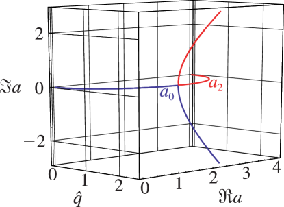

# §28.7 Analytic Continuation of Eigenvalues

:::{note}
**Keywords:**

[Mathieu functions](http://dlmf.nist.gov/search/search?q=Mathieu%20functions) , [Mathieu’s equation](http://dlmf.nist.gov/search/search?q=Mathieu%20equation) , [analytic continuation](http://dlmf.nist.gov/search/search?q=analytic%20continuation) , [analytic properties](http://dlmf.nist.gov/search/search?q=analytic%20properties) , [branch points](http://dlmf.nist.gov/search/search?q=branch%20points) , [eigenvalues (or characteristic values)](http://dlmf.nist.gov/search/search?q=eigenvalues%20%28or%20characteristic%20values%29) , [exceptional values](http://dlmf.nist.gov/search/search?q=exceptional%20values) , [irreducibility](http://dlmf.nist.gov/search/search?q=irreducibility) , [normal values](http://dlmf.nist.gov/search/search?q=normal%20values)

**Notes:**

See Meixner and Schäfke ([1954](./bib/M.html#bib1598 "Mathieusche Funktionen und Sphäroidfunktionen mit Anwendungen auf physikalische und technische Probleme"), pp. 107–108). Figure 28.7.1 was provided by the author.

**Referenced by:**

§28.11 , §28.12(i) , §28.12(ii) , §28.2(v)

**See also:**

Annotations for Ch.28
:::

As functions of $q$ , $a_{n}\left(q\right)$ and $b_{n}\left(q\right)$ can be continued analytically in the complex $q$ -plane. The only singularities are algebraic branch points, with $a_{n}\left(q\right)$ and $b_{n}\left(q\right)$ finite at these points. The number of branch points is infinite, but countable, and there are no finite limit points. In consequence, the functions can be defined uniquely by introducing suitable cuts in the $q$ -plane. See Meixner and Schäfke ([1954](./bib/M.html#bib1598 "Mathieusche Funktionen und Sphäroidfunktionen mit Anwendungen auf physikalische und technische Probleme"), §2.22). The branch points are called the *exceptional values* , and the other points *normal values* . The normal values are simple roots of the corresponding equations ( 28.2.21 ) and ( 28.2.22 ). All real values of $q$ are normal values. To 4D the first branch points between $a_{0}\left(q\right)$ and $a_{2}\left(q\right)$ are at $q_{0}=\pm\mathrm{i}1.4688$ with $a_{0}\left(q_{0}\right)=a_{2}\left(q_{0}\right)=2.0886$ , and between $b_{2}\left(q\right)$ and $b_{4}\left(q\right)$ they are at $q_{1}=\pm\mathrm{i}6.9289$ with $b_{2}\left(q_{1}\right)=b_{4}\left(q_{1}\right)=11.1904$ . For real $q$ with $|q|<|q_{0}|$ , $a_{0}\left(\mathrm{i}q\right)$ and $a_{2}\left(\mathrm{i}q\right)$ are real-valued, whereas for real $q$ with $|q|>|q_{0}|$ , $a_{0}\left(\mathrm{i}q\right)$ and $a_{2}\left(\mathrm{i}q\right)$ are complex conjugates. See also Mulholland and Goldstein ([1929](./bib/M.html#bib1672 "The characteristic numbers of the Mathieu equation with purely imaginary parameter")), Bouwkamp ([1948](./bib/B.html#bib324 "A note on Mathieu functions")), Meixner et al. ([1980](./bib/M.html#bib1599 "Mathieu Functions and Spheroidal Functions and Their Mathematical Foundations: Further Studies")), Hunter and Guerrieri ([1981](./bib/H.html#bib1116 "The eigenvalues of Mathieu’s equation and their branch points")), Hunter ([1981](./bib/H.html#bib1115 "Two Parametric Eigenvalue Problems of Differential Equations")), and Shivakumar and Xue ([1999](./bib/S.html#bib2072 "On the double points of a Mathieu equation")).

For a visualization of the first branch point of $a_{0}\left(\mathrm{i}\hat{q}\right)$ and $a_{2}\left(\mathrm{i}\hat{q}\right)$ see Figure 28.7.1 .

:::{note}
**Symbols:**

$a_{\NVar{n}}\left(\NVar{q}\right)$: eigenvalues of Mathieu equation , $\mathrm{i}$: imaginary unit and $q=h^{2}$: parameter

**Referenced by:**

§28.7 , §28.7

**See also:**

Annotations for §28.7 and Ch.28
:::

All the $a_{2n}\left(q\right)$ , $n=0,1,2,\dots$ , can be regarded as belonging to a complete analytic function (in the large). Therefore $w^{\prime}_{\mbox{\tiny I}}(\frac{1}{2}\pi;a,q)$ is irreducible, in the sense that it cannot be decomposed into a product of entire functions that contain its zeros; see Meixner et al. ([1980](./bib/M.html#bib1599 "Mathieu Functions and Spheroidal Functions and Their Mathematical Foundations: Further Studies"), p. 88). Analogous statements hold for $a_{2n+1}\left(q\right)$ , $b_{2n+1}\left(q\right)$ , and $b_{2n+2}\left(q\right)$ , also for $n=0,1,2,\dots$ . Closely connected with the preceding statements, we have

$$
\displaystyle\sum_{n=0}^{\infty}\left(a_{2n}\left(q\right)-(2n)^{2}\right) \displaystyle=0, \tag{28.7.1}
$$

:::{note}
**Symbols:**

$a_{\NVar{n}}\left(\NVar{q}\right)$: eigenvalues of Mathieu equation , $q=h^{2}$: parameter and $n$: integer

**See also:**

Annotations for §28.7 and Ch.28
:::

$$
\displaystyle\sum_{n=0}^{\infty}\left(a_{2n+1}\left(q\right)-(2n+1)^{2}\right) \displaystyle=q, \tag{28.7.2}
$$

:::{note}
**Symbols:**

$a_{\NVar{n}}\left(\NVar{q}\right)$: eigenvalues of Mathieu equation , $q=h^{2}$: parameter and $n$: integer

**See also:**

Annotations for §28.7 and Ch.28
:::

$$
\displaystyle\sum_{n=0}^{\infty}\left(b_{2n+1}\left(q\right)-(2n+1)^{2}\right) \displaystyle=-q, \tag{28.7.3}
$$

:::{note}
**Symbols:**

$b_{\NVar{n}}\left(\NVar{q}\right)$: eigenvalues of Mathieu equation , $q=h^{2}$: parameter and $n$: integer

**See also:**

Annotations for §28.7 and Ch.28
:::

$$
\displaystyle\sum_{n=0}^{\infty}\left(b_{2n+2}\left(q\right)-(2n+2)^{2}\right) \displaystyle=0. \tag{28.7.4}
$$

:::{note}
**Symbols:**

$b_{\NVar{n}}\left(\NVar{q}\right)$: eigenvalues of Mathieu equation , $q=h^{2}$: parameter and $n$: integer

**See also:**

Annotations for §28.7 and Ch.28
:::
