# §29.13 Graphics

:::{note}
**See also:**

Annotations for Ch.29
:::

## §29.13(i) Eigenvalues for Lamé Polynomials

:::{note}
**Keywords:**

[Lamé polynomials](http://dlmf.nist.gov/search/search?q=Lam%C3%A9%20polynomials) , [eigenvalues](http://dlmf.nist.gov/search/search?q=eigenvalues) , [graphics](http://dlmf.nist.gov/search/search?q=graphics)

**Notes:**

These graphs were produced at NIST.

**See also:**

Annotations for §29.13 and Ch.29
:::

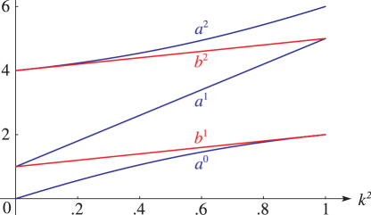
:::{note}
**Symbols:**

$a^{\NVar{n}}_{\NVar{\nu}}\left(\NVar{k^{2}}\right)$: eigenvalues of Lamé’s equation , $b^{\NVar{n}}_{\NVar{\nu}}\left(\NVar{k^{2}}\right)$: eigenvalues of Lamé’s equation , $m$: nonnegative integer and $k$: real parameter

**See also:**

Annotations for §29.13(i) , §29.13 and Ch.29
:::

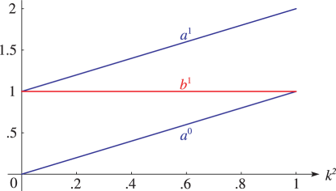
:::{note}
**Symbols:**

$a^{\NVar{n}}_{\NVar{\nu}}\left(\NVar{k^{2}}\right)$: eigenvalues of Lamé’s equation , $b^{\NVar{n}}_{\NVar{\nu}}\left(\NVar{k^{2}}\right)$: eigenvalues of Lamé’s equation , $m$: nonnegative integer and $k$: real parameter

**See also:**

Annotations for §29.13(i) , §29.13 and Ch.29
:::

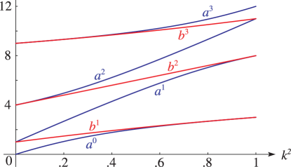
:::{note}
**Symbols:**

$a^{\NVar{n}}_{\NVar{\nu}}\left(\NVar{k^{2}}\right)$: eigenvalues of Lamé’s equation , $b^{\NVar{n}}_{\NVar{\nu}}\left(\NVar{k^{2}}\right)$: eigenvalues of Lamé’s equation , $m$: nonnegative integer and $k$: real parameter

**See also:**

Annotations for §29.13(i) , §29.13 and Ch.29
:::

## §29.13(ii) Lamé Polynomials: Real Variable

:::{note}
**Keywords:**

[Lamé polynomials](http://dlmf.nist.gov/search/search?q=Lam%C3%A9%20polynomials) , [graphics](http://dlmf.nist.gov/search/search?q=graphics)

**Notes:**

These graphs were produced at NIST.

**See also:**

Annotations for §29.13 and Ch.29
:::

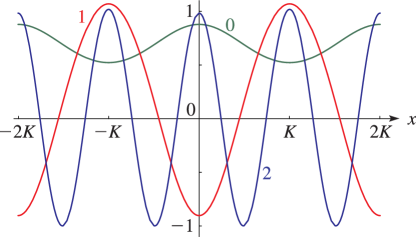
:::{note}
**Symbols:**

$\mathit{uE}^{\NVar{m}}_{2\NVar{n}}\left(\NVar{z},\NVar{k^{2}}\right)$: Lamé polynomial , $K\left(\NVar{k}\right)$: Legendre’s complete elliptic integral of the first kind , $m$: nonnegative integer , $x$: real variable and $k$: real parameter

**See also:**

Annotations for §29.13(ii) , §29.13 and Ch.29
:::

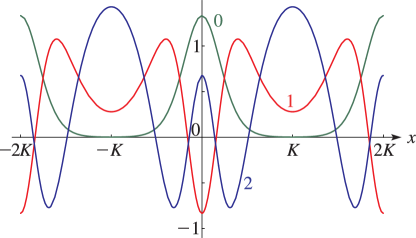
:::{note}
**Symbols:**

$\mathit{uE}^{\NVar{m}}_{2\NVar{n}}\left(\NVar{z},\NVar{k^{2}}\right)$: Lamé polynomial , $K\left(\NVar{k}\right)$: Legendre’s complete elliptic integral of the first kind , $m$: nonnegative integer , $x$: real variable and $k$: real parameter

**See also:**

Annotations for §29.13(ii) , §29.13 and Ch.29
:::

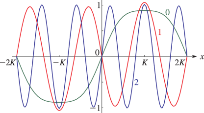
:::{note}
**Symbols:**

$\mathit{sE}^{\NVar{m}}_{2\NVar{n}+1}\left(\NVar{z},\NVar{k^{2}}\right)$: Lamé polynomial , $K\left(\NVar{k}\right)$: Legendre’s complete elliptic integral of the first kind , $m$: nonnegative integer , $x$: real variable and $k$: real parameter

**See also:**

Annotations for §29.13(ii) , §29.13 and Ch.29
:::

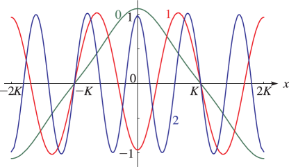
:::{note}
**Symbols:**

$\mathit{cE}^{\NVar{m}}_{2\NVar{n}+1}\left(\NVar{z},\NVar{k^{2}}\right)$: Lamé polynomial , $K\left(\NVar{k}\right)$: Legendre’s complete elliptic integral of the first kind , $m$: nonnegative integer , $x$: real variable and $k$: real parameter

**See also:**

Annotations for §29.13(ii) , §29.13 and Ch.29
:::

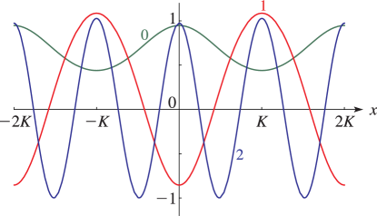
:::{note}
**Symbols:**

$\mathit{dE}^{\NVar{m}}_{2\NVar{n}+1}\left(\NVar{z},\NVar{k^{2}}\right)$: Lamé polynomial , $K\left(\NVar{k}\right)$: Legendre’s complete elliptic integral of the first kind , $m$: nonnegative integer , $x$: real variable and $k$: real parameter

**See also:**

Annotations for §29.13(ii) , §29.13 and Ch.29
:::

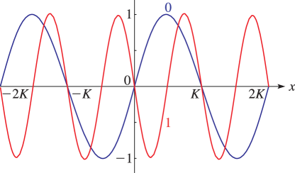
:::{note}
**Symbols:**

$\mathit{scE}^{\NVar{m}}_{2\NVar{n}+2}\left(\NVar{z},\NVar{k^{2}}\right)$: Lamé polynomial , $K\left(\NVar{k}\right)$: Legendre’s complete elliptic integral of the first kind , $m$: nonnegative integer , $x$: real variable and $k$: real parameter

**See also:**

Annotations for §29.13(ii) , §29.13 and Ch.29
:::

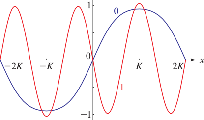
:::{note}
**Symbols:**

$\mathit{sdE}^{\NVar{m}}_{2\NVar{n}+2}\left(\NVar{z},\NVar{k^{2}}\right)$: Lamé polynomial , $K\left(\NVar{k}\right)$: Legendre’s complete elliptic integral of the first kind , $m$: nonnegative integer , $x$: real variable and $k$: real parameter

**See also:**

Annotations for §29.13(ii) , §29.13 and Ch.29
:::

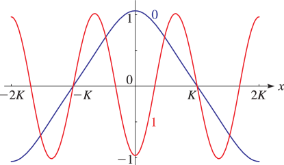
:::{note}
**Symbols:**

$\mathit{cdE}^{\NVar{m}}_{2\NVar{n}+2}\left(\NVar{z},\NVar{k^{2}}\right)$: Lamé polynomial , $K\left(\NVar{k}\right)$: Legendre’s complete elliptic integral of the first kind , $m$: nonnegative integer , $x$: real variable and $k$: real parameter

**See also:**

Annotations for §29.13(ii) , §29.13 and Ch.29
:::

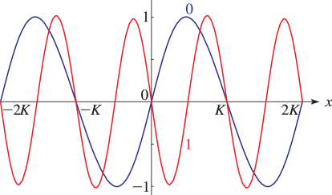
:::{note}
**Symbols:**

$\mathit{scdE}^{\NVar{m}}_{2\NVar{n}+3}\left(\NVar{z},\NVar{k^{2}}\right)$: Lamé polynomial , $K\left(\NVar{k}\right)$: Legendre’s complete elliptic integral of the first kind , $m$: nonnegative integer , $x$: real variable and $k$: real parameter

**See also:**

Annotations for §29.13(ii) , §29.13 and Ch.29
:::

## §29.13(iii) Lamé Polynomials: Complex Variable

:::{note}
**Keywords:**

[Lamé polynomials](http://dlmf.nist.gov/search/search?q=Lam%C3%A9%20polynomials) , [graphics](http://dlmf.nist.gov/search/search?q=graphics)

**Notes:**

These surfaces were produced at NIST.

**See also:**

Annotations for §29.13 and Ch.29
:::

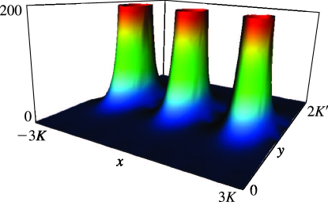
:::{note}
**Symbols:**

$\mathit{uE}^{\NVar{m}}_{2\NVar{n}}\left(\NVar{z},\NVar{k^{2}}\right)$: Lamé polynomial , ${K^{\prime}}\left(\NVar{k}\right)$: Legendre’s complementary complete elliptic integral of the first kind , $K\left(\NVar{k}\right)$: Legendre’s complete elliptic integral of the first kind , $\mathrm{i}$: imaginary unit , $x$: real variable , $y$: real variable and $k$: real parameter

**See also:**

Annotations for §29.13(iii) , §29.13 and Ch.29
:::

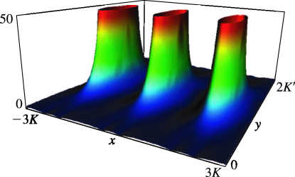
:::{note}
**Symbols:**

$\mathit{uE}^{\NVar{m}}_{2\NVar{n}}\left(\NVar{z},\NVar{k^{2}}\right)$: Lamé polynomial , ${K^{\prime}}\left(\NVar{k}\right)$: Legendre’s complementary complete elliptic integral of the first kind , $K\left(\NVar{k}\right)$: Legendre’s complete elliptic integral of the first kind , $\mathrm{i}$: imaginary unit , $x$: real variable , $y$: real variable and $k$: real parameter

**See also:**

Annotations for §29.13(iii) , §29.13 and Ch.29
:::
