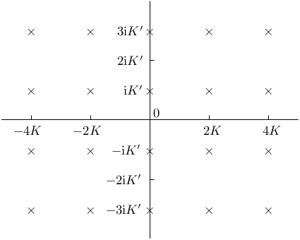

# §29.2 Differential Equations

:::{note}
**See also:**

Annotations for Ch.29
:::

## §29.2(i) Lamé’s Equation

:::{note}
**Keywords:**

[Lamé’s equation](http://dlmf.nist.gov/search/search?q=Lam%C3%A9%20equation) , [algebraic form](http://dlmf.nist.gov/search/search?q=algebraic%20form) , [singularities](http://dlmf.nist.gov/search/search?q=singularities)

**Notes:**

See Erdélyi et al. ([1955](./bib/E.html#bib755 "Higher Transcendental Functions. Vol. III"), §15.2).

**See also:**

Annotations for §29.2 and Ch.29
:::

$$
\frac{{\mathrm{d}}^{2}w}{{\mathrm{d}z}^{2}}+(h-\nu(\nu+1)k^{2}{\operatorname{sn}}^{2}\left(z,k\right))w=0, \tag{29.2.1}
$$

where $k$ and $\nu$ are real parameters such that $0<k<1$ and $\nu\geq-\tfrac{1}{2}$ . For $\operatorname{sn}\left(z,k\right)$ see § [22.2](./22.2.md "§22.2 Definitions ‣ Properties ‣ Chapter 22 Jacobian Elliptic Functions") . This equation has regular singularities at the points $2pK+(2q+1)\mathrm{i}{K^{\prime}}$ , where $p,q\in\mathbb{Z}$ , and $K$ , ${K^{\prime}}$ are the complete elliptic integrals of the first kind with moduli $k$ , $k^{\prime}(=(1-k^{2})^{1/2})$ , respectively; see § 19.2(ii) . In general, at each singularity each solution of ( 29.2.1 ) has a branch point (§ 2.7(i) ). See Figure 29.2.1 .

:::{note}
**Symbols:**

${K^{\prime}}\left(\NVar{k}\right)$: Legendre’s complementary complete elliptic integral of the first kind , $K\left(\NVar{k}\right)$: Legendre’s complete elliptic integral of the first kind , $\mathrm{i}$: imaginary unit , $z$: complex variable and $k$: real parameter

**Referenced by:**

§29.2(i) , §31.7(ii)

**See also:**

Annotations for §29.2(i) , §29.2 and Ch.29
:::

## §29.2(ii) Other Forms

:::{note}
**Keywords:**

[Heun’s equation](http://dlmf.nist.gov/search/search?q=Heun%20equation) , [Jacobian elliptic-function form](http://dlmf.nist.gov/search/search?q=Jacobian%20elliptic-function%20form) , [Lamé’s equation](http://dlmf.nist.gov/search/search?q=Lam%C3%A9%20equation) , [Weierstrass elliptic-function form](http://dlmf.nist.gov/search/search?q=Weierstrass%20elliptic-function%20form) , [other forms](http://dlmf.nist.gov/search/search?q=other%20forms) , [relation to Heun’s equation](http://dlmf.nist.gov/search/search?q=relation%20to%20Heun%20equation) , [relation to Lamé’s equation](http://dlmf.nist.gov/search/search?q=relation%20to%20Lam%C3%A9%20equation) , [trigonometric form](http://dlmf.nist.gov/search/search?q=trigonometric%20form)

**Notes:**

See Erdélyi et al. ([1955](./bib/E.html#bib755 "Higher Transcendental Functions. Vol. III"), §15.2).

**See also:**

Annotations for §29.2 and Ch.29
:::

$$
\frac{{\mathrm{d}}^{2}w}{{\mathrm{d}\xi}^{2}}+\frac{1}{2}\left(\frac{1}{\xi}+\frac{1}{\xi-1}+\frac{1}{\xi-k^{-2}}\right)\frac{\mathrm{d}w}{\mathrm{d}\xi}+\frac{hk^{-2}-\nu(\nu+1)\xi}{4\xi(\xi-1)(\xi-k^{-2})}w=0, \tag{29.2.2}
$$

where

$$
\xi={\operatorname{sn}}^{2}\left(z,k\right). \tag{29.2.3}
$$

$$
(1-k^{2}{\cos}^{2}\phi)\frac{{\mathrm{d}}^{2}w}{{\mathrm{d}\phi}^{2}}+k^{2}\cos\phi\sin\phi\frac{\mathrm{d}w}{\mathrm{d}\phi}+(h-\nu(\nu+1)k^{2}{\cos}^{2}\phi)w=0, \tag{29.2.4}
$$

where

$$
\phi=\tfrac{1}{2}\pi-\operatorname{am}\left(z,k\right). \tag{29.2.5}
$$

For $\operatorname{am}\left(z,k\right)$ see § 22.16(i) .

Next, let $e_{1},e_{2},e_{3}$ be any real constants that satisfy $e_{1}>e_{2}>e_{3}$ and

$$
\displaystyle e_{1}+e_{2}+e_{3} \displaystyle=0, \tag{29.2.6}
$$

$$
\displaystyle\ifrac{(e_{2}-e_{3})}{(e_{1}-e_{3})} \displaystyle=k^{2}.
$$

:::{note}
**Symbols:**

$k$: real parameter and $e_{j}$: constants

**See also:**

Annotations for §29.2(ii) , §29.2 and Ch.29
:::

(These constants are not unique.) Then with

$$
\displaystyle g \displaystyle=(e_{1}-e_{3})h+\nu(\nu+1)e_{3}, \tag{29.2.7}
$$

:::{note}
**Defines:**

$g$ (locally)

**Symbols:**

$h$: real parameter , $\nu$: real parameter and $e_{j}$: constants

**See also:**

Annotations for §29.2(ii) , §29.2 and Ch.29
:::

$$
\displaystyle\eta \displaystyle=(e_{1}-e_{3})^{-1/2}(z-\mathrm{i}{K^{\prime}}), \tag{29.2.8}
$$

:::{note}
**Defines:**

$\eta$ (locally)

**Symbols:**

${K^{\prime}}\left(\NVar{k}\right)$: Legendre’s complementary complete elliptic integral of the first kind , $\mathrm{i}$: imaginary unit , $z$: complex variable , $k$: real parameter and $e_{j}$: constants

**See also:**

Annotations for §29.2(ii) , §29.2 and Ch.29
:::

we have

$$
\frac{{\mathrm{d}}^{2}w}{{\mathrm{d}\eta}^{2}}+(g-\nu(\nu+1)\wp\left(\eta\right))w=0, \tag{29.2.9}
$$

and

$$
{\frac{{\mathrm{d}}^{2}w}{{\mathrm{d}\zeta}^{2}}+\frac{1}{2}\left(\frac{1}{\zeta-e_{1}}+\frac{1}{\zeta-e_{2}}+\frac{1}{\zeta-e_{3}}\right)\frac{\mathrm{d}w}{\mathrm{d}\zeta}}+\frac{g-\nu(\nu+1)\zeta}{4(\zeta-e_{1})(\zeta-e_{2})(\zeta-e_{3})}w=0, \tag{29.2.10}
$$

where

$$
\zeta=\wp\left(\eta;g_{2},g_{3}\right)=\wp\left(\eta\right), \tag{29.2.11}
$$

with

$$
\displaystyle g_{2} \displaystyle=-4(e_{2}e_{3}+e_{3}e_{1}+e_{1}e_{2}), \tag{29.2.12}
$$

$$
\displaystyle g_{3} \displaystyle=4e_{1}e_{2}e_{3}.
$$

:::{note}
**Defines:**

$g_{2}$ (locally) and $g_{3}$ (locally)

**Symbols:**

$e_{j}$: constants

**See also:**

Annotations for §29.2(ii) , §29.2 and Ch.29
:::

For the Weierstrass function $\wp$ see § 23.2(ii) .

Equation ( 29.2.10 ) is a special case of Heun’s equation ( 31.2.1 ).
