# §29.4 Graphics

:::{note}
**See also:**

Annotations for Ch.29
:::

## §29.4(i) Eigenvalues of Lamé’s Equation: Line Graphs

:::{note}
**Keywords:**

[Lamé functions](http://dlmf.nist.gov/search/search?q=Lam%C3%A9%20functions) , [eigenvalues](http://dlmf.nist.gov/search/search?q=eigenvalues) , [graphics](http://dlmf.nist.gov/search/search?q=graphics)

**Notes:**

These graphs were produced at NIST.

**See also:**

Annotations for §29.4 and Ch.29
:::

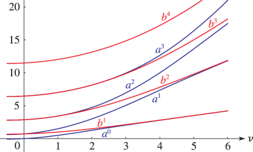
:::{note}
**Symbols:**

$a^{\NVar{n}}_{\NVar{\nu}}\left(\NVar{k^{2}}\right)$: eigenvalues of Lamé’s equation , $b^{\NVar{n}}_{\NVar{\nu}}\left(\NVar{k^{2}}\right)$: eigenvalues of Lamé’s equation , $m$: nonnegative integer and $\nu$: real parameter

**See also:**

Annotations for §29.4(i) , §29.4 and Ch.29
:::

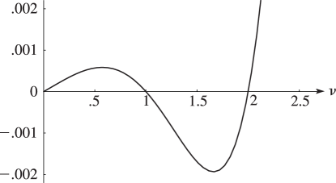
:::{note}
**Symbols:**

$a^{\NVar{n}}_{\NVar{\nu}}\left(\NVar{k^{2}}\right)$: eigenvalues of Lamé’s equation , $b^{\NVar{n}}_{\NVar{\nu}}\left(\NVar{k^{2}}\right)$: eigenvalues of Lamé’s equation and $\nu$: real parameter

**See also:**

Annotations for §29.4(i) , §29.4 and Ch.29
:::

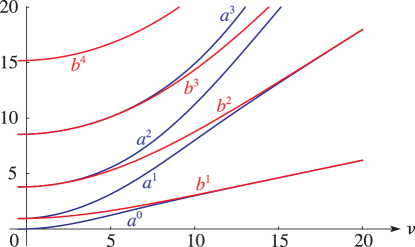
:::{note}
**Symbols:**

$a^{\NVar{n}}_{\NVar{\nu}}\left(\NVar{k^{2}}\right)$: eigenvalues of Lamé’s equation , $b^{\NVar{n}}_{\NVar{\nu}}\left(\NVar{k^{2}}\right)$: eigenvalues of Lamé’s equation , $m$: nonnegative integer and $\nu$: real parameter

**See also:**

Annotations for §29.4(i) , §29.4 and Ch.29
:::

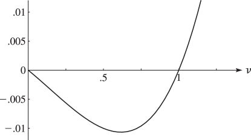
:::{note}
**Symbols:**

$a^{\NVar{n}}_{\NVar{\nu}}\left(\NVar{k^{2}}\right)$: eigenvalues of Lamé’s equation , $b^{\NVar{n}}_{\NVar{\nu}}\left(\NVar{k^{2}}\right)$: eigenvalues of Lamé’s equation and $\nu$: real parameter

**See also:**

Annotations for §29.4(i) , §29.4 and Ch.29
:::

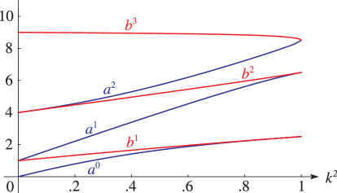
:::{note}
**Symbols:**

$a^{\NVar{n}}_{\NVar{\nu}}\left(\NVar{k^{2}}\right)$: eigenvalues of Lamé’s equation , $b^{\NVar{n}}_{\NVar{\nu}}\left(\NVar{k^{2}}\right)$: eigenvalues of Lamé’s equation , $m$: nonnegative integer and $k$: real parameter

**See also:**

Annotations for §29.4(i) , §29.4 and Ch.29
:::

## §29.4(ii) Eigenvalues of Lamé’s Equation: Surfaces

:::{note}
**Keywords:**

[Lamé functions](http://dlmf.nist.gov/search/search?q=Lam%C3%A9%20functions) , [eigenvalues](http://dlmf.nist.gov/search/search?q=eigenvalues) , [graphics](http://dlmf.nist.gov/search/search?q=graphics)

**Notes:**

These surfaces were produced at NIST.

**See also:**

Annotations for §29.4 and Ch.29
:::

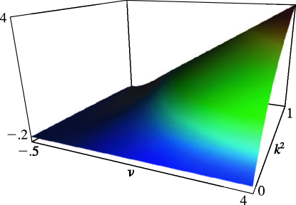
:::{note}
**Symbols:**

$a^{\NVar{n}}_{\NVar{\nu}}\left(\NVar{k^{2}}\right)$: eigenvalues of Lamé’s equation , $k$: real parameter and $\nu$: real parameter

**See also:**

Annotations for §29.4(ii) , §29.4 and Ch.29
:::

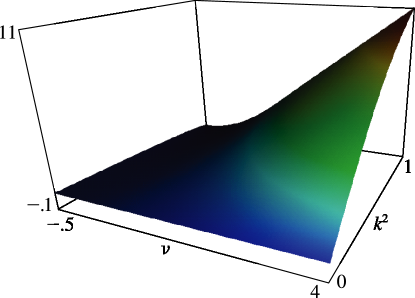
:::{note}
**Symbols:**

$a^{\NVar{n}}_{\NVar{\nu}}\left(\NVar{k^{2}}\right)$: eigenvalues of Lamé’s equation , $k$: real parameter and $\nu$: real parameter

**See also:**

Annotations for §29.4(ii) , §29.4 and Ch.29
:::

## §29.4(iii) Lamé Functions: Line Graphs

:::{note}
**Keywords:**

[Lamé functions](http://dlmf.nist.gov/search/search?q=Lam%C3%A9%20functions) , [graphics](http://dlmf.nist.gov/search/search?q=graphics)

**Notes:**

These graphs were produced at NIST.

**See also:**

Annotations for §29.4 and Ch.29
:::

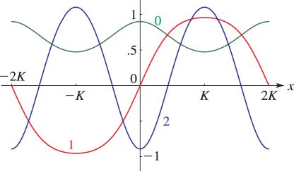
:::{note}
**Symbols:**

$\mathit{Ec}^{\NVar{m}}_{\NVar{\nu}}\left(\NVar{z},\NVar{k^{2}}\right)$: Lamé function , $K\left(\NVar{k}\right)$: Legendre’s complete elliptic integral of the first kind , $m$: nonnegative integer , $x$: real variable and $k$: real parameter

**See also:**

Annotations for §29.4(iii) , §29.4 and Ch.29
:::

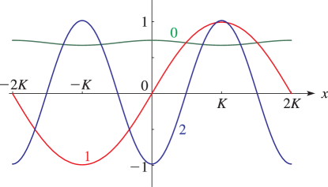
:::{note}
**Symbols:**

$\mathit{Ec}^{\NVar{m}}_{\NVar{\nu}}\left(\NVar{z},\NVar{k^{2}}\right)$: Lamé function , $K\left(\NVar{k}\right)$: Legendre’s complete elliptic integral of the first kind , $m$: nonnegative integer , $x$: real variable and $k$: real parameter

**See also:**

Annotations for §29.4(iii) , §29.4 and Ch.29
:::

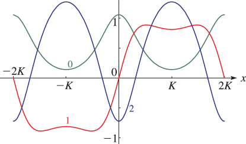
:::{note}
**Symbols:**

$\mathit{Ec}^{\NVar{m}}_{\NVar{\nu}}\left(\NVar{z},\NVar{k^{2}}\right)$: Lamé function , $K\left(\NVar{k}\right)$: Legendre’s complete elliptic integral of the first kind , $m$: nonnegative integer , $x$: real variable and $k$: real parameter

**See also:**

Annotations for §29.4(iii) , §29.4 and Ch.29
:::

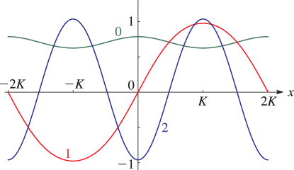
:::{note}
**Symbols:**

$\mathit{Ec}^{\NVar{m}}_{\NVar{\nu}}\left(\NVar{z},\NVar{k^{2}}\right)$: Lamé function , $K\left(\NVar{k}\right)$: Legendre’s complete elliptic integral of the first kind , $m$: nonnegative integer , $x$: real variable and $k$: real parameter

**See also:**

Annotations for §29.4(iii) , §29.4 and Ch.29
:::

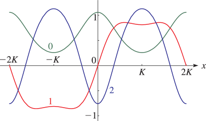
:::{note}
**Symbols:**

$\mathit{Ec}^{\NVar{m}}_{\NVar{\nu}}\left(\NVar{z},\NVar{k^{2}}\right)$: Lamé function , $K\left(\NVar{k}\right)$: Legendre’s complete elliptic integral of the first kind , $m$: nonnegative integer , $x$: real variable and $k$: real parameter

**See also:**

Annotations for §29.4(iii) , §29.4 and Ch.29
:::

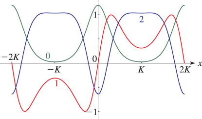
:::{note}
**Symbols:**

$\mathit{Ec}^{\NVar{m}}_{\NVar{\nu}}\left(\NVar{z},\NVar{k^{2}}\right)$: Lamé function , $K\left(\NVar{k}\right)$: Legendre’s complete elliptic integral of the first kind , $m$: nonnegative integer , $x$: real variable and $k$: real parameter

**See also:**

Annotations for §29.4(iii) , §29.4 and Ch.29
:::

## §29.4(iv) Lamé Functions: Surfaces

:::{note}
**Keywords:**

[Lamé functions](http://dlmf.nist.gov/search/search?q=Lam%C3%A9%20functions) , [graphics](http://dlmf.nist.gov/search/search?q=graphics)

**Notes:**

These surfaces were produced at NIST.

**See also:**

Annotations for §29.4 and Ch.29
:::

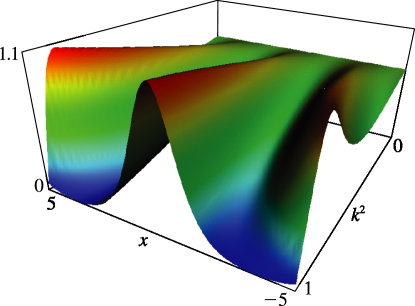
:::{note}
**Symbols:**

$\mathit{Ec}^{\NVar{m}}_{\NVar{\nu}}\left(\NVar{z},\NVar{k^{2}}\right)$: Lamé function , $x$: real variable and $k$: real parameter

**See also:**

Annotations for §29.4(iv) , §29.4 and Ch.29
:::

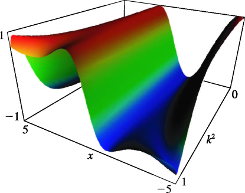
:::{note}
**Symbols:**

$\mathit{Ec}^{\NVar{m}}_{\NVar{\nu}}\left(\NVar{z},\NVar{k^{2}}\right)$: Lamé function , $x$: real variable and $k$: real parameter

**See also:**

Annotations for §29.4(iv) , §29.4 and Ch.29
:::

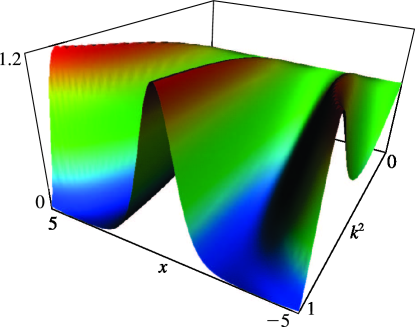
:::{note}
**Symbols:**

$\mathit{Ec}^{\NVar{m}}_{\NVar{\nu}}\left(\NVar{z},\NVar{k^{2}}\right)$: Lamé function , $x$: real variable and $k$: real parameter

**See also:**

Annotations for §29.4(iv) , §29.4 and Ch.29
:::

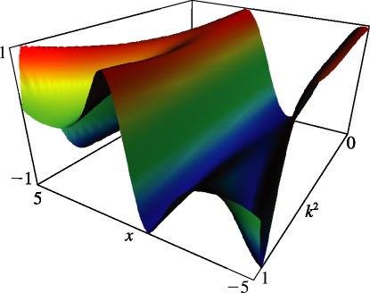
:::{note}
**Symbols:**

$\mathit{Ec}^{\NVar{m}}_{\NVar{\nu}}\left(\NVar{z},\NVar{k^{2}}\right)$: Lamé function , $x$: real variable and $k$: real parameter

**See also:**

Annotations for §29.4(iv) , §29.4 and Ch.29
:::
