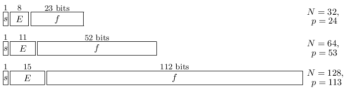

# §3.1 Arithmetics and Error Measures

:::{note}
**Referenced by:**

Erratum (V1.0.25) for Section 3.1

**See also:**

Annotations for Ch.3
:::

## §3.1(i) Floating-Point Arithmetic

:::{note}
**Keywords:**

[arithmetics](http://dlmf.nist.gov/search/search?q=arithmetics) , [binary number system](http://dlmf.nist.gov/search/search?q=binary%20number%20system) , [bits](http://dlmf.nist.gov/search/search?q=bits) , [exponent](http://dlmf.nist.gov/search/search?q=exponent) , [floating-point](http://dlmf.nist.gov/search/search?q=floating-point) , [floating-point arithmetic](http://dlmf.nist.gov/search/search?q=floating-point%20arithmetic) , [format width](http://dlmf.nist.gov/search/search?q=format%20width) , [fractional part](http://dlmf.nist.gov/search/search?q=fractional%20part) , [hexadecimal number system](http://dlmf.nist.gov/search/search?q=hexadecimal%20number%20system) , [machine epsilon](http://dlmf.nist.gov/search/search?q=machine%20epsilon) , [machine number](http://dlmf.nist.gov/search/search?q=machine%20number) , [machine precision](http://dlmf.nist.gov/search/search?q=machine%20precision) , [overflow](http://dlmf.nist.gov/search/search?q=overflow) , [significand](http://dlmf.nist.gov/search/search?q=significand) , [significant](http://dlmf.nist.gov/search/search?q=significant) , [underflow](http://dlmf.nist.gov/search/search?q=underflow)

**Referenced by:**

§4.48(i) , Erratum (V1.0.19) for Notation , Erratum (V1.0.25) for Section 3.1

**Modification (effective with 1.0.25):**

In the first sentence of this subsection, the phrase “another frequently used system is the hexadecimal system with base 16” has been replaced with “another system that has been used is the hexadecimal system with base 16”. *Suggested 2019-02-22 by Nicola Torracca*

**See also:**

Annotations for §3.1 and Ch.3
:::

Computer arithmetic is described for the *binary* based system with base 2; another system that has been used is the *hexadecimal* system with base 16.

A nonzero *normalized binary floating-point machine number* $x$ is represented as

$$
x=(-1)^{s}\cdot(b_{0}.b_{1}b_{2}\dots b_{p-1})\cdot 2^{E}, \tag{3.1.1}
$$

where $s$ is equal to $1$ or $0$ , each $b_{j}$ , $j\geq 1$ , is either $0$ or $1$ , $b_{1}$ is the *most significant bit* , $p$ ( $\in\mathbb{N}$ ) is the number of significant bits $b_{j}$ , $b_{p-1}$ is the *least significant bit* , $E$ is an integer called the *exponent* , $b_{0}.b_{1}b_{2}\dots b_{p-1}$ is the *significand* , and $f=.b_{1}b_{2}\dots b_{p-1}$ is the *fractional part* .

The set of *machine numbers* $\mathbb{R}_{{\rm fl}}$ is the union of $0$ and the set

$$
(-1)^{s}2^{E}\sum_{j=0}^{p-1}b_{j}2^{-j}, \tag{3.1.2}
$$

with $b_{0}=1$ and all allowable choices of $E$ , $p$ , $s$ , and $b_{j}$ .

Let $E_{{\rm min}}\leq E\leq E_{{\rm max}}$ with $E_{{\rm min}}<0$ and $E_{{\rm max}}>0$ . For given values of $E_{{\rm min}}$ , $E_{{\rm max}}$ , and $p$ , the *format width in bits* $N$ of a computer word is the total number of bits: the sign (one bit), the significant bits $b_{1},b_{2},\dots,b_{p-1}$ ( $p-1$ bits), and the bits allocated to the exponent (the remaining $N-p$ bits). The integers $p$ , $E_{{\rm min}}$ , and $E_{{\rm max}}$ are characteristics of the machine. The *machine epsilon* $\epsilon_{M}$ , that is, the distance between $1$ and the next larger machine number with $E=0$ is given by $\epsilon_{M}=2^{-p+1}$ . The *machine precision* is $\frac{1}{2}\epsilon_{M}=2^{-p}$ . The lower and upper bounds for the absolute values of the nonzero machine numbers are given by

$$
N_{{\rm min}}\equiv 2^{E_{{\rm min}}}\leq|x|\leq 2^{E_{{\rm max}}+1}\left(1-2^{-p}\right)\equiv N_{{\rm max}}. \tag{3.1.3}
$$

*Underflow (overflow)* after computing $x\neq 0$ occurs when $|x|$ is smaller (larger) than $N_{{\rm min}}$ ( $N_{{\rm max}}$ ).

### IEEE Standard

:::{note}
**Keywords:**

[IEEE standard](http://dlmf.nist.gov/search/search?q=IEEE%20standard) , [double precision](http://dlmf.nist.gov/search/search?q=double%20precision) , [floating-point arithmetic](http://dlmf.nist.gov/search/search?q=floating-point%20arithmetic) , [single precision](http://dlmf.nist.gov/search/search?q=single%20precision)

**Referenced by:**

Erratum (V1.0.25) for Section 3.1

**Modification (effective with 1.0.25):**

The material in this paragraph has been modified to reflect the most recent IEEE 754-2019 Floating-Point Arithmetic Standard IEEE ([2019](./bib/I.html#bib2911 "IEEE International Standard for Information Technology—Microprocessor Systems—Floating-Point arithmetic: IEEE Std 754-2019")). In the new standard, single, double and quad floating-point precisions are replaced with new standard names of binary32 , binary64 and binary128 . Also, the terminology “memory positions” has been replaced with the more current “representation of data in the binary interchange formats”. *Suggested 2019-02-22 by Nicola Torracca*

**See also:**

Annotations for §3.1(i) , §3.1 and Ch.3
:::

The current floating point arithmetic standard is IEEE 754-2019 IEEE ([2019](./bib/I.html#bib2911 "IEEE International Standard for Information Technology—Microprocessor Systems—Floating-Point arithmetic: IEEE Std 754-2019")), a minor technical revision of IEEE 754-2008 IEEE ([2008](./bib/I.html#bib2906 "IEEE Standard for Floating-Point Arithmetic")), which was adopted in 2011 by the International Standards Organization as ISO/IEC/IEEE 60559. In the case of the normalized binary interchange formats, the representation of data for *binary32* (previously *single precision* ) ( $N=32$ , $p=24$ , $E_{{\rm min}}=-126$ , $E_{{\rm max}}=127$ ), *binary64* (previously *double precision* ) ( $N=64$ , $p=53$ , $E_{{\rm min}}=-1022$ , $E_{{\rm max}}=1023$ ) and *binary128* (previously *quad precision* ) ( $N=128$ , $p=113$ , $E_{{\rm min}}=-16382$ , $E_{{\rm max}}=16383$ ) are as in Figure 3.1.1 . The respective machine precisions are $\frac{1}{2}\epsilon_{M}=0.596\times 10^{-7}$ , $\frac{1}{2}\epsilon_{M}=0.111\times 10^{-15}$ and $\frac{1}{2}\epsilon_{M}=0.963\times 10^{-34}$ .

:::{note}
**Symbols:**

$s$: sign , $p$: number of significant bits , $E$: exponent , $f$: fractional part and $N$: number of bits in floating point

**Referenced by:**

§3.1(i) , Erratum (V1.0.25) for Section 3.1

**Modification (effective with 1.0.25):**

The figure has been expanded to include the binary128 floating-point representation of data in the binary interchange format described in the 2019 Floating-Point Arithmetic Standard IEEE 754-2019 IEEE ([2019](./bib/I.html#bib2911 "IEEE International Standard for Information Technology—Microprocessor Systems—Floating-Point arithmetic: IEEE Std 754-2019")). The figure caption has been updated using the terminology of the 2019 Floating-Point Arithmetic Standard. *Suggested 2019-02-22 by Nicola Torracca*

**See also:**

Annotations for §3.1(i) , §3.1(i) , §3.1 and Ch.3
:::

### Rounding

:::{note}
**Keywords:**

[by chopping](http://dlmf.nist.gov/search/search?q=by%20chopping) , [down](http://dlmf.nist.gov/search/search?q=down) , [floating-point arithmetic](http://dlmf.nist.gov/search/search?q=floating-point%20arithmetic) , [rounding](http://dlmf.nist.gov/search/search?q=rounding) , [symmetric](http://dlmf.nist.gov/search/search?q=symmetric) , [to nearest machine number](http://dlmf.nist.gov/search/search?q=to%20nearest%20machine%20number)

**See also:**

Annotations for §3.1(i) , §3.1 and Ch.3
:::

Let $x$ be any positive number with

$$
x=(1.b_{1}b_{2}\dots b_{p-1}b_{p}b_{p+1}\dots)\cdot 2^{E}, \tag{3.1.4}
$$

$N_{{\rm min}}\leq x\leq N_{{\rm max}}$ , and

$$
\displaystyle x_{-} \displaystyle=(1.b_{1}b_{2}\dots b_{p-1})\cdot 2^{E}, \tag{3.1.5}
$$

$$
\displaystyle x_{+} \displaystyle=((1.b_{1}b_{2}\dots b_{p-1})+\epsilon_{M})\cdot 2^{E}.
$$

:::{note}
**Symbols:**

$b_{p}$: bit , $p$: number of significant bits , $E$: exponent and $\epsilon_{M}$: machine epsilon

**See also:**

Annotations for §3.1(i) , §3.1(i) , §3.1 and Ch.3
:::

Then *rounding by chopping* or *rounding down* of $x$ gives $x_{-}$ , with maximum relative error $\epsilon_{M}$ . *Symmetric rounding* or *rounding to nearest* of $x$ gives $x_{-}$ or $x_{+}$ , whichever is nearer to $x$ , with maximum relative error equal to the machine precision $\frac{1}{2}\epsilon_{M}=2^{-p}$ .

Negative numbers $x$ are rounded in the same way as $-x$ .

For further information see Goldberg ([1991](./bib/G.html#bib948 "What every computer scientist should know about floating-point arithmetic")) and Overton ([2001](./bib/O.html#bib1822 "Numerical Computing with IEEE Floating Point Arithmetic")).

## §3.1(ii) Interval Arithmetic

:::{note}
**Keywords:**

[arithmetics](http://dlmf.nist.gov/search/search?q=arithmetics) , [interval](http://dlmf.nist.gov/search/search?q=interval) , [interval arithmetic](http://dlmf.nist.gov/search/search?q=interval%20arithmetic) , [validated computing](http://dlmf.nist.gov/search/search?q=validated%20computing)

**Referenced by:**

Erratum (V1.0.25) for Section 3.1

**Addition (effective with 1.0.25):**

A sentence at the end of this subsection has been added referring readers to the IEEE Standards for Interval Arithmetic IEEE ([2015](./bib/I.html#bib2912 "IEEE Standard for Interval Arithmetic: IEEE Std 1788-2015"), [2018](./bib/I.html#bib2913 "IEEE Standard for Interval Arithmetic: IEEE Std 1788.1-2017")). *Suggested 2019-02-22 by Nicola Torracca*

**See also:**

Annotations for §3.1 and Ch.3
:::

*Interval arithmetic* is intended for bounding the total effect of rounding errors of calculations with machine numbers. With this arithmetic the computed result can be proved to lie in a certain interval, which leads to *validated computing* with guaranteed and rigorous inclusion regions for the results.

Let $G$ be the set of closed intervals $\{[a,b]\}$ . The elementary arithmetical operations on intervals are defined as follows:

$$
I*J=\{x*y\,|\,x\in I,y\in J\}, \tag{3.1.6}
$$

where $*\in\{+,-,\cdot,/\}$ , with appropriate roundings of the end points of $I*J$ when machine numbers are being used. Division is possible only if the divisor interval does not contain zero.

A basic text on interval arithmetic and analysis is Alefeld and Herzberger ([1983](./bib/index.html#bib57 "Introduction to Interval Computations")), and for applications and further information see Moore ([1979](./bib/M.html#bib1649 "Methods and Applications of Interval Analysis")) and Petković and Petković ([1998](./bib/P.html#bib1868 "Complex Interval Arithmetic and its Applications")). The last reference includes analogs for arithmetic in the complex plane $\mathbb{C}$ . For interval arithmetic, one should refer to the IEEE Standards for Interval Arithmetic IEEE ([2015](./bib/I.html#bib2912 "IEEE Standard for Interval Arithmetic: IEEE Std 1788-2015"), [2018](./bib/I.html#bib2913 "IEEE Standard for Interval Arithmetic: IEEE Std 1788.1-2017")).

## §3.1(iii) Rational Arithmetics

:::{note}
**Keywords:**

[arithmetics](http://dlmf.nist.gov/search/search?q=arithmetics) , [exact](http://dlmf.nist.gov/search/search?q=exact) , [exact rational](http://dlmf.nist.gov/search/search?q=exact%20rational) , [exact rational arithmetic](http://dlmf.nist.gov/search/search?q=exact%20rational%20arithmetic) , [rational arithmetics](http://dlmf.nist.gov/search/search?q=rational%20arithmetics)

**See also:**

Annotations for §3.1 and Ch.3
:::

Computer algebra systems use *exact rational arithmetic* with rational numbers $p/q$ , where $p$ and $q$ are multi-length integers. During the calculations common divisors are removed from the rational numbers, and the final results can be converted to decimal representations of arbitrary length. For further information see Matula and Kornerup ([1980](./bib/M.html#bib1567 "Foundations of Finite Precision Rational Arithmetic")).

## §3.1(iv) Level-Index Arithmetic

:::{note}
**Keywords:**

[arithmetics](http://dlmf.nist.gov/search/search?q=arithmetics) , [generalized logarithms](http://dlmf.nist.gov/search/search?q=generalized%20logarithms) , [generalized precision](http://dlmf.nist.gov/search/search?q=generalized%20precision) , [level-index](http://dlmf.nist.gov/search/search?q=level-index) , [level-index arithmetic](http://dlmf.nist.gov/search/search?q=level-index%20arithmetic)

**Referenced by:**

§4.44 , Erratum (V1.0.19) for Notation

**See also:**

Annotations for §3.1 and Ch.3
:::

To eliminate overflow or underflow in finite-precision arithmetic numbers are represented by using *generalized logarithms* $\ln_{\ell}(x)$ given by

$$
\displaystyle\ln_{0}(x) \displaystyle=x, \tag{3.1.7}
$$

$$
\displaystyle\ln_{\ell}(x) \displaystyle=\ln\left(\ln_{\ell-1}(x)\right),
$$

:::{note}
**Symbols:**

$\ln\NVar{z}$: principal branch of logarithm function and $\ell$: base

**See also:**

Annotations for §3.1(iv) , §3.1 and Ch.3
:::

with $x\geq 0$ and $\ell$ the unique nonnegative integer such that $a\equiv\ln_{\ell}(x)\in[0,1)$ . In *level-index arithmetic* $x$ is represented by $\ell+a$ (or $-(\ell+a)$ for negative numbers). Also in this arithmetic *generalized precision* can be defined, which includes absolute error and relative precision (§ 3.1(v) ) as special cases.

For further information see Clenshaw and Olver ([1984](./bib/C.html#bib529 "Beyond floating point")) and Clenshaw et al. ([1989](./bib/C.html#bib530 "Level-Index Arithmetic: An Introductory Survey")). For applications see Lozier ([1993](./bib/L.html#bib2731 "An underflow-induced graphics failure solved by SLI arithmetic")).

For further references on level-index arithmetic (and also other arithmetics) see Anuta et al. ([1996](./bib/index.html#bib109 "The MasPar MP-1 as a computer arithmetic laboratory")). See also Hayes ([2009](./bib/H.html#bib2730 "The higher arithmetic")).

## §3.1(v) Error Measures

:::{note}
**Keywords:**

[absolute error](http://dlmf.nist.gov/search/search?q=absolute%20error) , [arithmetics](http://dlmf.nist.gov/search/search?q=arithmetics) , [complex](http://dlmf.nist.gov/search/search?q=complex) , [complex arithmetic](http://dlmf.nist.gov/search/search?q=complex%20arithmetic) , [error measures](http://dlmf.nist.gov/search/search?q=error%20measures) , [mollified error](http://dlmf.nist.gov/search/search?q=mollified%20error) , [relative error](http://dlmf.nist.gov/search/search?q=relative%20error) , [relative precision](http://dlmf.nist.gov/search/search?q=relative%20precision)

**Referenced by:**

§3.1(iv)

**See also:**

Annotations for §3.1 and Ch.3
:::

If $x^{*}$ is an approximation to a real or complex number $x$ , then the *absolute error* is

$$
\epsilon_{a}=\left|x^{*}-x\right|. \tag{3.1.8}
$$

If $x\neq 0$ , the *relative error* is

$$
\epsilon_{r}=\left|\frac{x^{*}-x}{x}\right|=\frac{\epsilon_{a}}{\left|x\right|}. \tag{3.1.9}
$$

The *relative precision* is

$$
\epsilon_{\mathit{rp}}=\left|\ln\left(\ifrac{x^{*}}{x}\right)\right|, \tag{3.1.10}
$$

where $xx^{*}>0$ for real variables, and $xx^{*}\neq 0$ for complex variables (with the principal value of the logarithm).

The *mollified error* is

$$
\epsilon_{m}=\frac{\left|x^{*}-x\right|}{\max(\left|x\right|,1)}. \tag{3.1.11}
$$

For error measures for complex arithmetic see Olver ([1983](./bib/O.html#bib1803 "Error Analysis of Complex Arithmetic")).
