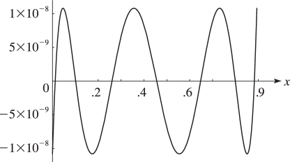

# §3.11 Approximation Techniques

:::{note}
**Referenced by:**

Ch.3

**See also:**

Annotations for Ch.3
:::

## §3.11(i) Minimax Polynomial Approximations

:::{note}
**Keywords:**

[approximation techniques](http://dlmf.nist.gov/search/search?q=approximation%20techniques) , [best uniform polynomial approximation](http://dlmf.nist.gov/search/search?q=best%20uniform%20polynomial%20approximation) , [computation of coefficients](http://dlmf.nist.gov/search/search?q=computation%20of%20coefficients) , [minimax polynomial approximations](http://dlmf.nist.gov/search/search?q=minimax%20polynomial%20approximations) , [minimax polynomials](http://dlmf.nist.gov/search/search?q=minimax%20polynomials)

**Referenced by:**

§19.38 , §3.11(ii) , §3.11(iii)

**See also:**

Annotations for §3.11 and Ch.3
:::

Let $f(x)$ be continuous on a closed interval $[a,b]$ . Then there exists a unique $n$ th degree polynomial $p_{n}(x)$ , called the *minimax* (or *best uniform* ) polynomial approximation to $f(x)$ on $[a,b]$ , that minimizes $\max_{a\leq x\leq b}\left|\epsilon_{n}(x)\right|$ , where $\epsilon_{n}(x)=f(x)-p_{n}(x)$ .

A sufficient condition for $p_{n}(x)$ to be the minimax polynomial is that $\left|\epsilon_{n}(x)\right|$ attains its maximum at $n+2$ distinct points in $[a,b]$ and $\epsilon_{n}(x)$ changes sign at these consecutive maxima.

If we have a sufficiently close approximation

$$
p_{n}(x)=a_{n}x^{n}+a_{n-1}x^{n-1}+\dots+a_{0} \tag{3.11.1}
$$

to $f(x)$ , then the coefficients $a_{k}$ can be computed iteratively. Assume that $f^{\prime}(x)$ is continuous on $[a,b]$ and let $x_{0}=a$ , $x_{n+1}=b$ , and $x_{1},x_{2},\dots,x_{n}$ be the zeros of $\epsilon_{n}^{\mspace{1.0mu}\prime}(x)$ in $(a,b)$ arranged so that

$$
x_{0}<x_{1}<x_{2}<\cdots<x_{n}<x_{n+1}. \tag{3.11.2}
$$

Also, let

$$
m_{j}=(-1)^{j}\epsilon_{n}(x_{j}), \tag{3.11.3}
$$

(Thus the $m_{j}$ are approximations to $m$ , where $\pm m$ is the maximum value of $\left|\epsilon_{n}(x)\right|$ on $[a,b]$ .)

Then (in general) a better approximation to $p_{n}(x)$ is given by

$$
\sum_{k=0}^{n}(a_{k}+\delta a_{k})x^{k}, \tag{3.11.4}
$$

where

$$
\sum_{k=0}^{n}x_{j}^{k}\delta a_{k}=(-1)^{j}(m_{j}-m), \tag{3.11.5}
$$

This is a set of $n+2$ equations for the $n+2$ unknowns $\delta a_{0},\delta a_{1},\dots,\delta a_{n}$ and $m$ .

The iterative process converges locally and quadratically (§ 3.8(i) ).

A method for obtaining a sufficiently accurate first approximation is described in the next subsection.

For the theory of minimax approximations see Meinardus ([1967](./bib/M.html#bib1595 "Approximation of Functions: Theory and Numerical Methods")). For examples of minimax polynomial approximations to elementary and special functions see Hart et al. ([1968](./bib/H.html#bib1051 "Computer Approximations")). See also Cody ([1970](./bib/C.html#bib542 "A survey of practical rational and polynomial approximation of functions")) and Ralston ([1965](./bib/R.html#bib1922 "Rational Chebyshev approximation by Remes’ algorithms")).

## §3.11(ii) Chebyshev-Series Expansions

:::{note}
**Keywords:**

[Chebyshev polynomials](http://dlmf.nist.gov/search/search?q=Chebyshev%20polynomials) , [expansions in series of](http://dlmf.nist.gov/search/search?q=expansions%20in%20series%20of) , [orthogonality properties](http://dlmf.nist.gov/search/search?q=orthogonality%20properties) , [recurrence relations](http://dlmf.nist.gov/search/search?q=recurrence%20relations) , [with respect to integration](http://dlmf.nist.gov/search/search?q=with%20respect%20to%20integration) , [with respect to summation](http://dlmf.nist.gov/search/search?q=with%20respect%20to%20summation)

**Referenced by:**

§18.18(i) , §18.38(i) , §18.40(i) , §19.38 , item (d) , §29.20(i) , §3.5(iv) , §7.6(ii)

**See also:**

Annotations for §3.11 and Ch.3
:::

The Chebyshev polynomials $T_{n}$ are given by

$$
T_{n}\left(x\right)=\cos\left(n\operatorname{arccos}x\right), \tag{3.11.6}
$$

They satisfy the recurrence relation

$$
T_{n+1}\left(x\right)-2xT_{n}\left(x\right)+T_{n-1}\left(x\right)=0, \tag{3.11.7}
$$

with initial values $T_{0}\left(x\right)=1$ , $T_{1}\left(x\right)=x$ . They enjoy an orthogonal property with respect to integrals:

$$
\int_{-1}^{1}\frac{T_{j}\left(x\right)T_{k}\left(x\right)}{\sqrt{1-x^{2}}}\,\mathrm{d}x=\begin{cases}\pi,&j=k=0,\\
\frac{1}{2}\pi,&j=k\neq 0,\\
0,&j\neq k,\end{cases} \tag{3.11.8}
$$

as well as an orthogonal property with respect to sums, as follows. When $n>0$ and $0\leq j\leq n$ , $0\leq k\leq n$ ,

$$
\sideset{}{{}^{\prime\prime}}{\sum}_{\ell=0}^{n}T_{j}\left(x_{\ell}\right)T_{k}\left(x_{\ell}\right)=\begin{cases}n,&j=k=0\text{ or }n,\\
\frac{1}{2}n,&j=k\neq 0\text{ or }n,\\
0,&j\neq k,\end{cases} \tag{3.11.9}
$$

where $x_{\ell}=\cos\left(\pi\ell/n\right)$ and the double prime means that the first and last terms are to be halved.

For these and further properties of Chebyshev polynomials, see Chapter [18](./18.md "Chapter 18 Orthogonal Polynomials") , Gil et al. ([2007a](./bib/G.html#bib935 "Numerical Methods for Special Functions"), Chapter 3), and Mason and Handscomb ([2003](./bib/M.html#bib1560 "Chebyshev Polynomials")).

### Chebyshev Expansions

:::{note}
**Keywords:**

[Chebyshev-series expansions](http://dlmf.nist.gov/search/search?q=Chebyshev-series%20expansions) , [Lebesgue constants](http://dlmf.nist.gov/search/search?q=Lebesgue%20constants) , [approximation techniques](http://dlmf.nist.gov/search/search?q=approximation%20techniques) , [relation to minimax polynomials](http://dlmf.nist.gov/search/search?q=relation%20to%20minimax%20polynomials)

**Notes:**

See Powell ([1967](./bib/P.html#bib1897 "On the maximum errors of polynomial approximations defined by interpolation and by least squares criteria")).

**See also:**

Annotations for §3.11(ii) , §3.11 and Ch.3
:::

If $f$ is continuously differentiable on $[-1,1]$ , then with

$$
c_{n}=\frac{2}{\pi}\int_{0}^{\pi}f(\cos\theta)\cos\left(n\theta\right)\,\mathrm{d}\theta, \tag{3.11.10}
$$

the expansion

$$
f(x)=\sideset{}{{}^{\prime}}{\sum}_{n=0}^{\infty}c_{n}T_{n}\left(x\right), \tag{3.11.11}
$$

converges uniformly. Here the single prime on the summation symbol means that the first term is to be halved. In fact, ( 3.11.11 ) is the Fourier-series expansion of $f(\cos\theta)$ ; compare ( 3.11.6 ) and § 1.8(i) .

Furthermore, if $f\in C^{\infty}[-1,1]$ , then the convergence of ( 3.11.11 ) is usually very rapid; compare ( 1.8.7 ) with $k$ arbitrary.

For general intervals $[a,b]$ we rescale:

$$
f(x)=\sideset{}{{}^{\prime}}{\sum}_{n=0}^{\infty}d_{n}T_{n}\left(\frac{2x-a-b}{b-a}\right). \tag{3.11.12}
$$

Because the series ( 3.11.12 ) converges rapidly we obtain a very good first approximation to the minimax polynomial $p_{n}(x)$ for $[a,b]$ if we truncate ( 3.11.12 ) at its $(n+1)$ th term. This is because in the notation of § 3.11(i)

$$
\epsilon_{n}(x)=d_{n+1}T_{n+1}\left(\frac{2x-a-b}{b-a}\right), \tag{3.11.13}
$$

approximately, and the right-hand side enjoys exactly those properties concerning its maxima and minima that are required for the minimax approximation; compare Figure 18.4.3 .

More precisely, it is known that for the interval $[a,b]$ , the ratio of the maximum value of the remainder

$$
\left|\sum_{k=n+1}^{\infty}{}d_{k}T_{k}\left(\frac{2x-a-b}{b-a}\right)\right| \tag{3.11.14}
$$

to the maximum error of the minimax polynomial $p_{n}(x)$ is bounded by $1+L_{n}$ , where $L_{n}$ is the $n$ th *Lebesgue constant* for Fourier series; see § 1.8(i) . Since $L_{0}=1$ , $L_{n}$ is a monotonically increasing function of $n$ , and (for example) $L_{1000}=4.07\dots$ , this means that in practice the gain in replacing a truncated Chebyshev-series expansion by the corresponding minimax polynomial approximation is hardly worthwhile. Moreover, the set of minimax approximations $p_{0}(x),p_{1}(x),p_{2}(x),\dots,p_{n}(x)$ requires the calculation and storage of $\frac{1}{2}(n+1)(n+2)$ coefficients, whereas the corresponding set of Chebyshev-series approximations requires only $n+1$ coefficients.

### Calculation of Chebyshev Coefficients

:::{note}
**Keywords:**

[Chebyshev-series expansions](http://dlmf.nist.gov/search/search?q=Chebyshev-series%20expansions) , [computation of coefficients](http://dlmf.nist.gov/search/search?q=computation%20of%20coefficients)

**See also:**

Annotations for §3.11(ii) , §3.11 and Ch.3
:::

The $c_{n}$ in ( 3.11.11 ) can be calculated from ( 3.11.10 ), but in general it is more efficient to make use of the orthogonal property ( 3.11.9 ). Also, in cases where $f(x)$ satisfies a linear ordinary differential equation with polynomial coefficients, the expansion ( 3.11.11 ) can be substituted in the differential equation to yield a recurrence relation satisfied by the $c_{n}$ .

For details and examples of these methods, see Clenshaw ([1957](./bib/C.html#bib524 "The numerical solution of linear differential equations in Chebyshev series"), [1962](./bib/C.html#bib525 "Chebyshev Series for Mathematical Functions")) and Miller ([1966](./bib/M.html#bib1617 "On the convergence of the Chebyshev series for functions possessing a singularity in the range of representation")). See also Mason and Handscomb ([2003](./bib/M.html#bib1560 "Chebyshev Polynomials"), Chapter 10) and Fox and Parker ([1968](./bib/F.html#bib829 "Chebyshev Polynomials in Numerical Analysis"), Chapter 5).

### Summation of Chebyshev Series: Clenshaw’s Algorithm

:::{note}
**Keywords:**

[Chebyshev series](http://dlmf.nist.gov/search/search?q=Chebyshev%20series) , [Chebyshev-series expansions](http://dlmf.nist.gov/search/search?q=Chebyshev-series%20expansions) , [Clenshaw’s algorithm](http://dlmf.nist.gov/search/search?q=Clenshaw%20algorithm) , [summation](http://dlmf.nist.gov/search/search?q=summation)

**See also:**

Annotations for §3.11(ii) , §3.11 and Ch.3
:::

For the expansion ( 3.11.11 ), numerical values of the Chebyshev polynomials $T_{n}\left(x\right)$ can be generated by application of the recurrence relation ( 3.11.7 ). A more efficient procedure is as follows. Let $c_{n}T_{n}\left(x\right)$ be the last term retained in the truncated series. Beginning with $u_{n+1}=0$ , $u_{n}=c_{n}$ , we apply

$$
u_{k}=2xu_{k+1}-u_{k+2}+c_{k}, \tag{3.11.15}
$$

Then the sum of the truncated expansion equals $\frac{1}{2}(u_{0}-u_{2})$ . For error analysis and modifications of Clenshaw’s algorithm, see Oliver ([1977](./bib/O.html#bib1776 "An error analysis of the modified Clenshaw method for evaluating Chebyshev and Fourier series")).

### Complex Variables

:::{note}
**Keywords:**

[Chebyshev-series expansions](http://dlmf.nist.gov/search/search?q=Chebyshev-series%20expansions) , [complex variables](http://dlmf.nist.gov/search/search?q=complex%20variables)

**See also:**

Annotations for §3.11(ii) , §3.11 and Ch.3
:::

If $x$ is replaced by a complex variable $z$ and $f(z)$ is analytic, then the expansion ( 3.11.11 ) converges within an ellipse. However, in general ( 3.11.11 ) affords no advantage in $\mathbb{C}$ for numerical purposes compared with the Maclaurin expansion of $f(z)$ .

For further details on Chebyshev-series expansions in the complex plane, see Mason and Handscomb ([2003](./bib/M.html#bib1560 "Chebyshev Polynomials"), §5.10).

## §3.11(iii) Minimax Rational Approximations

:::{note}
**Keywords:**

[Remez’s second algorithm](http://dlmf.nist.gov/search/search?q=Remez%20second%20algorithm) , [approximation techniques](http://dlmf.nist.gov/search/search?q=approximation%20techniques) , [best uniform rational approximation](http://dlmf.nist.gov/search/search?q=best%20uniform%20rational%20approximation) , [computation of coefficients](http://dlmf.nist.gov/search/search?q=computation%20of%20coefficients) , [minimax rational approximations](http://dlmf.nist.gov/search/search?q=minimax%20rational%20approximations) , [minimax rational functions](http://dlmf.nist.gov/search/search?q=minimax%20rational%20functions) , [type](http://dlmf.nist.gov/search/search?q=type) , [weight function](http://dlmf.nist.gov/search/search?q=weight%20function) , [weight functions](http://dlmf.nist.gov/search/search?q=weight%20functions)

**Notes:**

See Meinardus ([1967](./bib/M.html#bib1595 "Approximation of Functions: Theory and Numerical Methods"), §3).

**See also:**

Annotations for §3.11 and Ch.3
:::

Let $f$ be continuous on a closed interval $[a,b]$ and $w$ be a continuous nonvanishing function on $[a,b]$ : $w$ is called a *weight function* . Then the *minimax* (or *best uniform* ) rational approximation

$$
R_{k,\ell}(x)=\frac{p_{0}+p_{1}x+\dots+p_{k}x^{k}}{1+q_{1}x+\dots+q_{\ell}x^{\ell}} \tag{3.11.16}
$$

of *type* $[k,\ell]$ to $f$ on $[a,b]$ minimizes the maximum value of $\left|\epsilon_{k,\ell}(x)\right|$ on $[a,b]$ , where

$$
\epsilon_{k,\ell}(x)=\frac{R_{k,\ell}(x)-f(x)}{w(x)}. \tag{3.11.17}
$$

The theory of polynomial minimax approximation given in § 3.11(i) can be extended to the case when $p_{n}(x)$ is replaced by a rational function $R_{k,\ell}(x)$ . There exists a unique solution of this minimax problem and there are at least $k+\ell+2$ values $x_{j}$ , $a\leq x_{0}<x_{1}<\cdots<x_{k+\ell+1}\leq b$ , such that $m_{j}=m$ , where

$$
m_{j}=(-1)^{j}\epsilon_{k,\ell}(x_{j}), \tag{3.11.18}
$$

and $\pm m$ is the maximum of $\left|\epsilon_{k,\ell}(x)\right|$ on $[a,b]$ .

A collection of minimax rational approximations to elementary and special functions can be found in Hart et al. ([1968](./bib/H.html#bib1051 "Computer Approximations")).

A widely implemented and used algorithm for calculating the coefficients $p_{j}$ and $q_{j}$ in ( 3.11.16 ) is *Remez’s second algorithm* . See Remez ([1957](./bib/R.html#bib1943 "General Computation Methods of Chebyshev Approximation. The Problems with Linear Real Parameters")), Werner et al. ([1967](./bib/W.html#bib2397 "Rational Chebyshev approximation")), and Johnson and Blair ([1973](./bib/J.html#bib1174 "REMES2 — a Fortran program to calculate rational minimax approximations to a given function")).

### Example

:::{note}
**Keywords:**

[Bessel functions](http://dlmf.nist.gov/search/search?q=Bessel%20functions) , [minimax rational approximation](http://dlmf.nist.gov/search/search?q=minimax%20rational%20approximation)

**See also:**

Annotations for §3.11(iii) , §3.11 and Ch.3
:::

With $w(x)=1$ and 14-digit computation, we obtain the following rational approximation of type $[3,3]$ to the Bessel function $J_{0}\left(x\right)$ (§ 10.2(ii) ) on the interval $0\leq x\leq j_{0,1}$ , where $j_{0,1}$ is the first positive zero of $J_{0}\left(x\right)$ :

$$
R_{3,3}(x)=\frac{p_{0}+p_{1}x+p_{2}x^{2}+p_{3}x^{3}}{1+q_{1}x+q_{2}x^{2}+q_{3}x^{3}}, \tag{3.11.19}
$$

with coefficients given in Table 3.11.1 .

| **$j$** | **$p_{j}$** | **$q_{j}$** |
|---|---|---|
| **0** | **0.99999 99891 7854** |   |
| **1** | **$-$ 0.34038 93820 9347** | **$-$ 0.34039 05233 8838** |
| **2** | **$-$ 0.18915 48376 3222** | **0.06086 50162 9812** |
| **3** | **0.06658 31942 0166** | **$-$ 0.01864 47680 9090** |
: Table 3.11.1: Coefficients p j , q j for the minimax rational approximation R 3 , 3 ⁡ ( x ) .

:::{note}
**Symbols:**

$R_{k,\ell}(x)$: rational approximation , $p_{k}$: coefficients and $q_{\ell}$: coefficients

**Referenced by:**

§3.11(iii)

**See also:**

Annotations for §3.11(iii) , §3.11(iii) , §3.11 and Ch.3
:::

The error curve is shown in Figure 3.11.1 .

:::{note}
**Symbols:**

$J_{\NVar{\nu}}\left(\NVar{z}\right)$: Bessel function of the first kind and $R_{k,\ell}(x)$: rational approximation

**Referenced by:**

§3.11(iii)

**See also:**

Annotations for §3.11(iii) , §3.11(iii) , §3.11 and Ch.3
:::

## §3.11(iv) Padé Approximations

:::{note}
**Defines:**

${[\NVar{p}/\NVar{q}]_{\NVar{f}}}$ : Padé approximant

**Keywords:**

[Padé](http://dlmf.nist.gov/search/search?q=Pad%C3%A9) , [Padé approximations](http://dlmf.nist.gov/search/search?q=Pad%C3%A9%20approximations) , [Padé table](http://dlmf.nist.gov/search/search?q=Pad%C3%A9%20table) , [Wynn’s cross rule](http://dlmf.nist.gov/search/search?q=Wynn%20cross%20rule) , [approximation techniques](http://dlmf.nist.gov/search/search?q=approximation%20techniques) , [computation of coefficients](http://dlmf.nist.gov/search/search?q=computation%20of%20coefficients) , [convergence](http://dlmf.nist.gov/search/search?q=convergence) , [for Padé approximations](http://dlmf.nist.gov/search/search?q=for%20Pad%C3%A9%20approximations)

**Notes:**

See Wynn ([1966](./bib/W.html#bib2462 "Upon systems of recursions which obtain among the quotients of the Padé table")).

**Referenced by:**

§18.40(ii) , §3.9(iv) , §33.23(vi)

**See also:**

Annotations for §3.11 and Ch.3
:::

Let

$$
f(z)=c_{0}+c_{1}z+c_{2}z^{2}+\cdots \tag{3.11.20}
$$

be a formal power series. The rational function

$$
\frac{N_{p,q}(z)}{D_{p,q}(z)}=\frac{a_{0}+a_{1}z+\dots+a_{p}z^{p}}{b_{0}+b_{1}z+\dots+b_{q}z^{q}} \tag{3.11.21}
$$

is called a *Padé approximant at zero* of $f$ if

$$
N_{p,q}(z)-f(z)D_{p,q}(z)=O\left(z^{p+q+1}\right), \tag{3.11.22}
$$

It is denoted by ${[p/q]_{f}}\left(z\right)$ . Thus if $b_{0}\neq 0$ , then the Maclaurin expansion of ( 3.11.21 ) agrees with ( 3.11.20 ) up to, and including, the term in $z^{p+q}$ .

The requirement ( 3.11.22 ) implies

$$
\displaystyle a_{0} \displaystyle=c_{0}b_{0}, \tag{3.11.23}
$$

$$
\displaystyle a_{1} \displaystyle=c_{1}b_{0}+c_{0}b_{1},
$$

$$
\displaystyle\vdots
$$

$$
\displaystyle a_{p} \displaystyle=c_{p}b_{0}+c_{p-1}b_{1}+\dots+c_{p-q}b_{q},
$$

$$
\displaystyle 0 \displaystyle=c_{p+1}b_{0}+c_{p}b_{1}+\dots+c_{p-q+1}b_{q},
$$

$$
\displaystyle\vdots
$$

$$
\displaystyle 0 \displaystyle=c_{p+q}b_{0}+c_{p+q-1}b_{1}+\dots+c_{p}b_{q},
$$

:::{note}
**Symbols:**

$c_{q}$: coefficients

**See also:**

Annotations for §3.11(iv) , §3.11 and Ch.3
:::

where $c_{j}=0$ if $j<0$ . With $b_{0}=1$ , the last $q$ equations give $b_{1},\dots,b_{q}$ as the solution of a system of linear equations. The first $p+1$ equations then yield $a_{0},\dots,a_{p}$ .

The array of Padé approximants

$$
\begin{array}[]{cccc}{[0/0]_{f}}&{[0/1]_{f}}&{[0/2]_{f}}&\cdots\\
{[1/0]_{f}}&{[1/1]_{f}}&{[1/2]_{f}}&\cdots\\
{[2/0]_{f}}&{[2/1]_{f}}&{[2/2]_{f}}&\cdots\\
\vdots&\vdots&\vdots&\ddots\\
\end{array} \tag{3.11.24}
$$

is called a *Padé table* . Approximants with the same denominator degree are located in the same column of the table.

For convergence results for Padé approximants, and the connection with continued fractions and Gaussian quadrature, see Baker and Graves-Morris ([1996](./bib/B.html#bib177 "Padé Approximants"), §4.7).

The Padé approximants can be computed by *Wynn’s cross rule* . Any five approximants arranged in the Padé table as

satisfy

$$
(N-C)^{-1}+(S-C)^{-1}=(W-C)^{-1}+(E-C)^{-1}. \tag{3.11.25}
$$

Starting with the first column ${[n/0]_{f}}$ , $n=0,1,2,\dots$ , and initializing the preceding column by ${[n/-1]_{f}}=\infty$ , $n=1,2,\dots$ , we can compute the lower triangular part of the table via ( 3.11.25 ). Similarly, the upper triangular part follows from the first row ${[0/n]_{f}}$ , $n=0,1,2,\dots$ , by initializing ${[-1/n]_{f}}=0$ , $n=1,2,\dots$ .

For the recursive computation of ${[n+k/k]_{f}}$ by Wynn’s epsilon algorithm, see ( 3.9.11 ) and the subsequent text.

### Laplace Transform Inversion

:::{note}
**Keywords:**

[Laplace transform](http://dlmf.nist.gov/search/search?q=Laplace%20transform) , [Padé](http://dlmf.nist.gov/search/search?q=Pad%C3%A9) , [Padé approximations](http://dlmf.nist.gov/search/search?q=Pad%C3%A9%20approximations) , [approximation techniques](http://dlmf.nist.gov/search/search?q=approximation%20techniques) , [numerical inversion](http://dlmf.nist.gov/search/search?q=numerical%20inversion)

**See also:**

Annotations for §3.11(iv) , §3.11 and Ch.3
:::

Numerical inversion of the Laplace transform (§ 1.14(iii) )

$$
F(s)=\mathscr{L}\mskip-3.0muf\mskip 3.0mu\left(s\right)=\int_{0}^{\infty}e^{-st}f(t)\,\mathrm{d}t \tag{3.11.26}
$$

requires $f={\mathscr{L}}^{-1}F$ to be obtained from numerical values of $F$ . A general procedure is to approximate $F$ by a rational function $R$ (vanishing at infinity) and then approximate $f$ by $r={\mathscr{L}}^{-1}R$ . When $F$ has an explicit power-series expansion a possible choice of $R$ is a Padé approximation to $F$ . See Luke ([1969b](./bib/L.html#bib1496 "The Special Functions and their Approximations. Vol. 2"), §16.4) for several examples involving special functions.

For further information on Padé approximations, see Baker and Graves-Morris ([1996](./bib/B.html#bib177 "Padé Approximants"), §4.7), Brezinski ([1980](./bib/B.html#bib350 "Padé-type Approximation and General Orthogonal Polynomials"), pp. 9–39 and 126–177), and Lorentzen and Waadeland ([1992](./bib/L.html#bib1468 "Continued Fractions with Applications"), pp. 367–395).

## §3.11(v) Least Squares Approximations

:::{note}
**Keywords:**

[Gram–Schmidt procedure](http://dlmf.nist.gov/search/search?q=Gram%E2%80%93Schmidt%20procedure) , [approximation techniques](http://dlmf.nist.gov/search/search?q=approximation%20techniques) , [conditioning](http://dlmf.nist.gov/search/search?q=conditioning) , [for least squares approximation](http://dlmf.nist.gov/search/search?q=for%20least%20squares%20approximation) , [least squares](http://dlmf.nist.gov/search/search?q=least%20squares) , [least squares approximations](http://dlmf.nist.gov/search/search?q=least%20squares%20approximations) , [normal equations](http://dlmf.nist.gov/search/search?q=normal%20equations) , [orthogonal functions with respect to weighted summation](http://dlmf.nist.gov/search/search?q=orthogonal%20functions%20with%20respect%20to%20weighted%20summation) , [weight functions](http://dlmf.nist.gov/search/search?q=weight%20functions)

**See also:**

Annotations for §3.11 and Ch.3
:::

Suppose a function $f(x)$ is approximated by the polynomial

$$
p_{n}(x)=a_{n}x^{n}+a_{n-1}x^{n-1}+\dots+a_{0} \tag{3.11.27}
$$

that minimizes

$$
S=\sum_{j=1}^{J}\left(f(x_{j})-p_{n}(x_{j})\right)^{2}. \tag{3.11.28}
$$

Here $x_{j}$ , $j=1,2,\dots,J$ , is a given set of distinct real points and $J\geq n+1$ . From the equations $\ifrac{\partial S}{\partial a_{k}}=0$ , $k=0,1,\dots,n$ , we derive the *normal equations*

$$
\begin{bmatrix}X_{0}&X_{1}&\cdots&X_{n}\\
X_{1}&X_{2}&\cdots&X_{n+1}\\
\vdots&\vdots&\ddots&\vdots\\
X_{n}&X_{n+1}&\cdots&X_{2n}\end{bmatrix}\begin{bmatrix}a_{0}\\
a_{1}\\
\vdots\\
a_{n}\end{bmatrix}=\begin{bmatrix}F_{0}\\
F_{1}\\
\vdots\\
F_{n}\end{bmatrix}, \tag{3.11.29}
$$

where

$$
\displaystyle X_{k} \displaystyle=\sum_{j=1}^{J}x_{j}^{k}, \tag{3.11.30}
$$

$$
\displaystyle F_{k} \displaystyle=\sum_{j=1}^{J}f(x_{j})x_{j}^{k}.
$$

:::{note}
**Defines:**

$X_{k}$ : elements (locally) and $F_{k}$ : elements (locally)

**Symbols:**

$J>n+1$: number of points

**See also:**

Annotations for §3.11(v) , §3.11 and Ch.3
:::

( 3.11.29 ) is a system of $n+1$ linear equations for the coefficients $a_{0},a_{1},\dots,a_{n}$ . The matrix is symmetric and positive definite, but the system is ill-conditioned when $n$ is large because the lower rows of the matrix are approximately proportional to one another. If $J=n+1$ , then $p_{n}(x)$ is the Lagrange interpolation polynomial for the set $x_{1},x_{2},\dots,x_{J}$ (§ 3.3(i) ).

More generally, let $f(x)$ be approximated by a linear combination

$$
\Phi_{n}(x)=a_{n}\phi_{n}(x)+a_{n-1}\phi_{n-1}(x)+\dots+a_{0}\phi_{0}(x) \tag{3.11.31}
$$

of given functions $\phi_{k}(x)$ , $k=0,1,\dots,n$ , that minimizes

$$
\sum_{j=1}^{J}w(x_{j})\left(f(x_{j})-\Phi_{n}(x_{j})\right)^{2}, \tag{3.11.32}
$$

$w(x)$ being a given positive *weight function* , and again $J\geq n+1$ . Then ( 3.11.29 ) is replaced by

$$
\begin{bmatrix}X_{00}&X_{01}&\cdots&X_{0n}\\
X_{10}&X_{11}&\cdots&X_{1n}\\
\vdots&\vdots&\ddots&\vdots\\
X_{n0}&X_{n1}&\cdots&X_{nn}\end{bmatrix}\begin{bmatrix}a_{0}\\
a_{1}\\
\vdots\\
a_{n}\end{bmatrix}=\begin{bmatrix}F_{0}\\
F_{1}\\
\vdots\\
F_{n}\end{bmatrix}, \tag{3.11.33}
$$

with

$$
X_{k\ell}=\sum_{j=1}^{J}w(x_{j})\phi_{k}(x_{j})\phi_{\ell}(x_{j}), \tag{3.11.34}
$$

and

$$
F_{k}=\sum_{j=1}^{J}w(x_{j})f(x_{j})\phi_{k}(x_{j}). \tag{3.11.35}
$$

Since $X_{k\ell}=X_{\ell k}$ , the matrix is again symmetric.

If the functions $\phi_{k}(x)$ are linearly independent on the set $x_{1},x_{2},\dots,x_{J}$ , that is, the only solution of the system of equations

$$
\sum_{k=0}^{n}c_{k}\phi_{k}(x_{j})=0, \tag{3.11.36}
$$

is $c_{0}=c_{1}=\dots=c_{n}=0$ , then the approximation $\Phi_{n}(x)$ is determined uniquely.

Now suppose that $X_{k\ell}=0$ when $k\neq\ell$ , that is, the functions $\phi_{k}(x)$ *are orthogonal with respect to weighted summation on the discrete set* $x_{1},x_{2},\dots,x_{J}$ . Then the system ( 3.11.33 ) is diagonal and hence well-conditioned.

A set of functions $\phi_{0}(x),\phi_{1}(x),\dots,\phi_{n}(x)$ that is linearly independent on the set $x_{1},x_{2},\dots,x_{J}$ (compare ( 3.11.36 )) can always be orthogonalized in the sense given in the preceding paragraph by the *Gram–Schmidt* procedure; see Gautschi ([1997a](./bib/G.html#bib895 "Numerical Analysis. An Introduction")).

### Example. The Discrete Fourier Transform

:::{note}
**Keywords:**

[Fourier transform](http://dlmf.nist.gov/search/search?q=Fourier%20transform) , [discrete](http://dlmf.nist.gov/search/search?q=discrete) , [discrete Fourier transform](http://dlmf.nist.gov/search/search?q=discrete%20Fourier%20transform)

**See also:**

Annotations for §3.11(v) , §3.11 and Ch.3
:::

We take $n$ complex exponentials $\phi_{k}(x)=e^{\mathrm{i}kx}$ , $k=0,1,\dots,n-1$ , and approximate $f(x)$ by the linear combination ( 3.11.31 ). The functions $\phi_{k}(x)$ are orthogonal on the set $x_{0},x_{1},\dots,x_{n-1}$ , $x_{j}=2\pi j/n$ , with respect to the weight function $w(x)=1$ , in the sense that

$$
\sum_{j=0}^{n-1}\phi_{k}(x_{j})\overline{\phi_{\ell}(x_{j})}=n\delta_{k,\ell}, \tag{3.11.37}
$$

$\delta_{k,\ell}$ being Kronecker’s symbol and the bar denoting complex conjugate. In consequence we can solve the system

$$
f_{j}=\sum_{k=0}^{n-1}a_{k}\phi_{k}(x_{j}), \tag{3.11.38}
$$

and obtain

$$
a_{k}=\frac{1}{n}\sum_{j=0}^{n-1}f_{j}\overline{\phi_{k}(x_{j})}, \tag{3.11.39}
$$

With this choice of $a_{k}$ and $f_{j}=f(x_{j})$ , the corresponding sum ( 3.11.32 ) vanishes.

The pair of vectors $\{\mathbf{f},\mathbf{a}\}$

$$
\displaystyle\mathbf{f} \displaystyle=[f_{0},f_{1},\dots,f_{n-1}]^{\rm T}, \tag{3.11.40}
$$

$$
\displaystyle\mathbf{a} \displaystyle=[a_{0},a_{1},\dots,a_{n-1}]^{\rm T},
$$

:::{note}
**See also:**

Annotations for §3.11(v) , §3.11(v) , §3.11 and Ch.3
:::

is called a *discrete Fourier transform pair* .

### The Fast Fourier Transform

:::{note}
**Keywords:**

[Fourier transform](http://dlmf.nist.gov/search/search?q=Fourier%20transform) , [approximation techniques](http://dlmf.nist.gov/search/search?q=approximation%20techniques) , [fast](http://dlmf.nist.gov/search/search?q=fast) , [fast Fourier transform](http://dlmf.nist.gov/search/search?q=fast%20Fourier%20transform) , [least squares](http://dlmf.nist.gov/search/search?q=least%20squares) , [least squares approximations](http://dlmf.nist.gov/search/search?q=least%20squares%20approximations)

**See also:**

Annotations for §3.11(v) , §3.11 and Ch.3
:::

The direct computation of the discrete Fourier transform ( 3.11.38 ), that is, of

$$
\displaystyle f_{j} \displaystyle=\sum_{k=0}^{n-1}a_{k}\omega_{n}^{jk}, \tag{3.11.41}
$$

$$
\displaystyle\omega_{n} \displaystyle=e^{2\pi i/n}
$$

:::{note}
**Symbols:**

$\pi$: the ratio of the circumference of a circle to its diameter , $\mathrm{e}$: base of natural logarithm and $\mathrm{i}$: imaginary unit

**See also:**

Annotations for §3.11(v) , §3.11(v) , §3.11 and Ch.3
:::

requires approximately $n^{2}$ multiplications. The method of the *fast Fourier transform* (FFT) exploits the structure of the matrix $\boldsymbol{{\Omega}}$ with elements $\omega_{n}^{jk}$ , $j,k=0,1,\dots,n-1$ . If $n=2^{m}$ , then $\boldsymbol{{\Omega}}$ can be factored into $m$ matrices, the rows of which contain only a few nonzero entries and the nonzero entries are equal apart from signs. In consequence of this structure the number of operations can be reduced to $nm=n\log_{2}n$ operations.

The property

$$
\omega_{n}^{2(k-(n/2))}=\omega_{n/2}^{k} \tag{3.11.42}
$$

is of fundamental importance in the FFT algorithm. If $n$ is not a power of 2, then modifications are possible. For the original reference see Cooley and Tukey ([1965](./bib/C.html#bib575 "An algorithm for the machine calculation of complex Fourier series")). For further details and algorithms, see Van Loan ([1992](./bib/V.html#bib2318 "Computational Frameworks for the Fast Fourier Transform")).

For further information on least squares approximations, including examples, see Gautschi ([1997a](./bib/G.html#bib895 "Numerical Analysis. An Introduction"), Chapter 2) and Björck ([1996](./bib/B.html#bib287 "Numerical Methods for Least Squares Problems"), Chapters 1 and 2).

## §3.11(vi) Splines

:::{note}
**Keywords:**

[Bézier curves](http://dlmf.nist.gov/search/search?q=B%C3%A9zier%20curves) , [approximation techniques](http://dlmf.nist.gov/search/search?q=approximation%20techniques) , [definitions](http://dlmf.nist.gov/search/search?q=definitions) , [splines](http://dlmf.nist.gov/search/search?q=splines)

**See also:**

Annotations for §3.11 and Ch.3
:::

Splines are defined piecewise and usually by low-degree polynomials. Given $n+1$ distinct points $x_{k}$ in the real interval $[a,b]$ , with ( $a=$ ) $x_{0}<x_{1}<\cdots<x_{n-1}<x_{n}$ ( $=b$ ), on each subinterval $[x_{k},x_{k+1}]$ , $k=0,1,\ldots,n-1$ , a low-degree polynomial is defined with coefficients determined by, for example, values $f_{k}$ and $f_{k}^{\prime}$ of a function $f$ and its derivative at the nodes $x_{k}$ and $x_{k+1}$ . The set of all the polynomials defines a function, the *spline* , on $[a,b]$ . By taking more derivatives into account, the smoothness of the spline will increase.

For splines based on Bernoulli and Euler polynomials, see § 24.17(ii) .

For many applications a spline function is a more adaptable approximating tool than the Lagrange interpolation polynomial involving a comparable number of parameters; see § 3.3(i) , where a single polynomial is used for interpolating $f(x)$ on the complete interval $[a,b]$ . Multivariate functions can also be approximated in terms of multivariate polynomial splines. See de Boor ([2001](./bib/D.html#bib622 "A Practical Guide to Splines")), Chui ([1988](./bib/C.html#bib503 "Multivariate Splines")), and Schumaker ([1981](./bib/S.html#bib2027 "Spline Functions: Basic Theory")) for further information.

In computer graphics a special type of spline is used which produces a *Bézier curve* . A cubic Bézier curve is defined by four points. Two are endpoints: $(x_{0},y_{0})$ and $(x_{3},y_{3})$ ; the other points $(x_{1},y_{1})$ and $(x_{2},y_{2})$ are control points. The slope of the curve at $(x_{0},y_{0})$ is tangent to the line between $(x_{0},y_{0})$ and $(x_{1},y_{1})$ ; similarly the slope at $(x_{3},y_{3})$ is tangent to the line between $x_{2},y_{2}$ and $x_{3},y_{3}$ . The curve is described by $x(t)$ and $y(t)$ , which are cubic polynomials with $t\in[0,1]$ . A complete spline results by composing several Bézier curves. A special applications area of Bézier curves is mathematical typography and the design of type fonts. See Knuth ([1986](./bib/K.html#bib1295 "METAFONT: The Program"), pp. 116-136).
