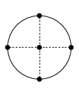

# §3.5 Quadrature

:::{note}
**Keywords:**

integration , numerical , quadrature

**Referenced by:**

[3rd item](https://dlmf.nist.gov/14.32#I1.i3.p1 "In §14.32 Methods of Computation ‣ Computation ‣ Chapter 14 Legendre and Related Functions") , [§19.36(iv)](https://dlmf.nist.gov/19.36#iv.p1 "§19.36(iv) Other Methods ‣ §19.36 Methods of Computation ‣ Computation ‣ Chapter 19 Elliptic Integrals") , [§29.20(i)](https://dlmf.nist.gov/29.20#i.p1 "§29.20(i) Lamé Functions ‣ §29.20 Methods of Computation ‣ Computation ‣ Chapter 29 Lamé Functions") , [§5.21](https://dlmf.nist.gov/5.21#p3 "§5.21 Methods of Computation ‣ Computation ‣ Chapter 5 Gamma Function")

**See also:**

Annotations for [Ch.3](https://dlmf.nist.gov/3#info "Chapter 3 Numerical Methods")
:::

## §3.5(i) Trapezoidal Rules

:::{note}
**Keywords:**

composite , elementary , improved , quadrature , trapezoidal rule

**Notes:**

See Davis and Rabinowitz ([1984](./https://dlmf.nist.gov/bib/D#bib618 "Methods of Numerical Integration"), pp. 54 and 137).

**Referenced by:**

[§3.4(ii)](https://dlmf.nist.gov/3.4#Px8.p1 "Example ‣ §3.4(ii) Analytic Functions ‣ §3.4 Differentiation ‣ Areas ‣ Chapter 3 Numerical Methods") , §3.5(ix) , [§9.17(iii)](https://dlmf.nist.gov/9.17#iii.p2 "§9.17(iii) Integral Representations ‣ §9.17 Methods of Computation ‣ Computation ‣ Chapter 9 Airy and Related Functions")

**See also:**

Annotations for §3.5 and [Ch.3](https://dlmf.nist.gov/3#info "Chapter 3 Numerical Methods")
:::

The *elementary trapezoidal rule* is given by

$$
\int_{a}^{b}f(x)\,\mathrm{d}x=\tfrac{1}{2}h(f(a)+f(b))-\tfrac{1}{12}h^{3}f^{\prime\prime}(\xi), \tag{3.5.1}
$$

where $h=b-a$ , $f\in C^{2}[a,b]$ , and $a<\xi<b$ .

The *composite trapezoidal rule* is

$$
\displaystyle\int_{a}^{b}f(x)\,\mathrm{d}x=h(\tfrac{1}{2}f_{0}+f_{1}+\dots+f_{n-1}+\tfrac{1}{2}f_{n})+E_{n}(f), \tag{3.5.2}
$$

where $h=(b-a)/n$ , $x_{k}=a+kh$ , $f_{k}=f(x_{k})$ , $k=0,1,\dots,n$ , and

$$
E_{n}(f)=-\frac{b-a}{12}h^{2}f^{\prime\prime}(\xi), \tag{3.5.3}
$$

If in addition $f$ is periodic, $f\in C^{k}(\mathbb{R})$ , and the integral is taken over a period, then

$$
E_{n}(f)=O\left(h^{k}\right), \tag{3.5.4}
$$

In particular, when $k=\infty$ the error term is an exponentially-small function of $1/h$ , and in these circumstances the composite trapezoidal rule is exceptionally efficient. For an example see § 3.5(ix) .

Similar results hold for the trapezoidal rule in the form

$$
\int_{-\infty}^{\infty}f(t)\,\mathrm{d}t=h\sum_{k=-\infty}^{\infty}f(kh)+E_{h}(f), \tag{3.5.5}
$$

with a function $f$ that is analytic in a strip containing $\mathbb{R}$ . For further information and examples, see Goodwin ([1949b](./https://dlmf.nist.gov/bib/G#bib956 "The evaluation of integrals of the form ∫ ∞ - ∞ ⁢ f ( x ) e - x 2 d x")). In Stenger ([1993](./https://dlmf.nist.gov/bib/S#bib2171 "Numerical Methods Based on Sinc and Analytic Functions"), Chapter 3) the rule ( 3.5.5 ) is considered in the framework of Sinc approximations (§ [3.3(vi)](https://dlmf.nist.gov/3.3#vi "§3.3(vi) Other Interpolation Methods ‣ §3.3 Interpolation ‣ Areas ‣ Chapter 3 Numerical Methods") ). See also Poisson’s summation formula (§ [1.8(iv)](https://dlmf.nist.gov/1.8#iv "§1.8(iv) Poisson’s Summation Formula ‣ §1.8 Fourier Series ‣ Topics of Discussion ‣ Chapter 1 Algebraic and Analytic Methods") ).

If $k$ in ( 3.5.4 ) is not arbitrarily large, and if odd-order derivatives of $f$ are known at the end points $a$ and $b$ , then the composite trapezoidal rule can be improved by means of the Euler–Maclaurin formula (§ [2.10(i)](https://dlmf.nist.gov/2.10#i "§2.10(i) Euler–Maclaurin Formula ‣ §2.10 Sums and Sequences ‣ Areas ‣ Chapter 2 Asymptotic Approximations") ). See Davis and Rabinowitz ([1984](./https://dlmf.nist.gov/bib/D#bib618 "Methods of Numerical Integration"), pp. 134–142) and Temme ([1996b](./https://dlmf.nist.gov/bib/T#bib2230 "Special Functions: An Introduction to the Classical Functions of Mathematical Physics"), p. 25).

## §3.5(ii) Simpson’s Rule

:::{note}
**Keywords:**

Simpson’s rule , composite , elementary , quadrature

**Notes:**

See Davis and Rabinowitz ([1984](./https://dlmf.nist.gov/bib/D#bib618 "Methods of Numerical Integration"), pp. 57–58).

**See also:**

Annotations for §3.5 and [Ch.3](https://dlmf.nist.gov/3#info "Chapter 3 Numerical Methods")
:::

Let $h=\frac{1}{2}(b-a)$ and $f\in C^{4}[a,b]$ . Then the *elementary Simpson’s rule* is

$$
\int_{a}^{b}f(x)\,\mathrm{d}x=\tfrac{1}{3}h(f(a)+4f(\tfrac{1}{2}(a+b))+f(b))-\tfrac{1}{90}h^{5}f^{(4)}(\xi), \tag{3.5.6}
$$

where $a<\xi<b$ .

Now let $h=(b-a)/n$ , $x_{k}=a+kh$ , and $f_{k}=f(x_{k})$ , $k=0,1,\dots,n$ . Then the *composite Simpson’s rule* is

$$
\int_{a}^{b}f(x)\,\mathrm{d}x=\tfrac{1}{3}h(f_{0}+4f_{1}+2f_{2}+4f_{3}+2f_{4}+\cdots+4f_{n-1}+f_{n})+E_{n}(f), \tag{3.5.7}
$$

where $n$ is even and

$$
E_{n}(f)=-\frac{b-a}{180}h^{4}f^{(4)}(\xi), \tag{3.5.8}
$$

Simpson’s rule can be regarded as a combination of two trapezoidal rules, one with step size $h$ and one with step size $h/2$ to refine the error term.

## §3.5(iii) Romberg Integration

:::{note}
**Keywords:**

Romberg integration , quadrature

**Notes:**

See Davis and Rabinowitz ([1984](./https://dlmf.nist.gov/bib/D#bib618 "Methods of Numerical Integration"), pp. 434–436) and Bauer et al. ([1963](./https://dlmf.nist.gov/bib/B#bib218 "New Aspects in Numerical Quadrature")).

**See also:**

Annotations for §3.5 and [Ch.3](https://dlmf.nist.gov/3#info "Chapter 3 Numerical Methods")
:::

Further refinements are achieved by *Romberg integration* . If $f\in C^{2m+2}[a,b]$ , then the remainder $E_{n}(f)$ in ( 3.5.2 ) can be expanded in the form

$$
E_{n}(f)=c_{1}h^{2}+c_{2}h^{4}+\dots+c_{m}h^{2m}+O\left(h^{2m+2}\right), \tag{3.5.9}
$$

where $h=(b-a)/n$ . As in Simpson’s rule, by combining the rule for $h$ with that for $h/2$ , the first error term $c_{1}h^{2}$ in ( 3.5.9 ) can be eliminated. With the Romberg scheme successive terms $c_{1}h^{2},c_{2}h^{4},\dots$ , in ( 3.5.9 ) are eliminated, according to the formula

$$
G_{k}(\tfrac{1}{2}h)=G_{k-1}(\tfrac{1}{2}h)+\frac{G_{k-1}(\frac{1}{2}h)-G_{k-1}(h)}{4^{k}-1}, \tag{3.5.10}
$$

beginning with

$$
G_{0}(h)=h(\tfrac{1}{2}f_{0}+f_{1}+\dots+f_{n-1}+\tfrac{1}{2}f_{n}), \tag{3.5.11}
$$

although we may also start with the elementary rule with $G_{0}(h)=\frac{1}{2}h(f(a)+f(b))$ and $h=b-a$ . To generate $G_{k}(h)$ the quantities $G_{0}(h),G_{0}(h/2),\dots,G_{0}(h/2^{k})$ are needed. These can be found by means of the recursion

$$
G_{0}(\tfrac{1}{2}h)=\tfrac{1}{2}G_{0}(h)+\tfrac{1}{2}h\sum_{k=0}^{n-1}f\left(x_{0}+(k+\tfrac{1}{2})h\right), \tag{3.5.12}
$$

which depends on function values computed previously.

If $f\in C^{2k+2}(a,b)$ , then for $j,k=0,1,\dots$ ,

$$
\int_{a}^{b}f(x)\,\mathrm{d}x-G_{k}\left(\frac{b-a}{2^{j}}\right)=-\frac{(b-a)^{2k+3}}{2^{k(k+1)}}\frac{4^{-j(k+1)}}{(2k+2)!}\left|B_{2k+2}\right|f^{(2k+2)}(\xi), \tag{3.5.13}
$$

for some $\xi\in(a,b)$ . For the Bernoulli numbers $B_{m}$ see § [24.2(i)](https://dlmf.nist.gov/24.2#i "§24.2(i) Bernoulli Numbers and Polynomials ‣ §24.2 Definitions and Generating Functions ‣ Properties ‣ Chapter 24 Bernoulli and Euler Polynomials") .

When $f\in C^{\infty}$ , the Romberg method affords a means of obtaining high accuracy in many cases with a relatively simple adaptive algorithm. However, as illustrated by the next example, other methods may be more efficient.

### Example

:::{note}
**See also:**

Annotations for §3.5(iii) , §3.5 and [Ch.3](https://dlmf.nist.gov/3#info "Chapter 3 Numerical Methods")
:::

With $J_{0}\left(t\right)$ denoting the Bessel function (§ [10.2(ii)](https://dlmf.nist.gov/10.2#ii "§10.2(ii) Standard Solutions ‣ §10.2 Definitions ‣ Bessel and Hankel Functions ‣ Chapter 10 Bessel Functions") ) the integral

$$
\int_{0}^{\infty}e^{-pt}J_{0}\left(t\right)\,\mathrm{d}t=\frac{1}{\sqrt{p^{2}+1}} \tag{3.5.14}
$$

is computed with $p=1$ on the interval $[0,30]$ . Using ( 3.5.10 ) with $h=30/4=7.5$ we obtain $G_{7}(h)$ with 14 correct digits. About $2^{9}=512$ function evaluations are needed. (With the 20-point Gauss–Laguerre formula (§ 3.5(v) ) the same precision can be achieved with 15 function evaluations.) With $j=2$ and $k=7$ , the coefficient of the derivative $f^{(16)}(\xi)$ in ( 3.5.13 ) is found to be $(0.14\dots)\times 10^{-13}$ .

See Davis and Rabinowitz ([1984](./https://dlmf.nist.gov/bib/D#bib618 "Methods of Numerical Integration"), pp. 440–441) for modifications of the Romberg method when the function $f$ is singular.

## §3.5(iv) Interpolatory Quadrature Rules

:::{note}
**Keywords:**

Clenshaw–Curtis , Clenshaw–Curtis quadrature formula , Fejér’s , Gauss quadrature , Newton–Cotes , Simpson’s rule , closed , comparison with Clenshaw–Curtis formula , comparison with Gauss quadrature , composite , definition , elementary , error term , interpolatory rules (or formulas) , midpoint , nodes , open , quadrature , trapezoidal rule , weight function , weight functions

**Notes:**

For ( 3.5.18 )–( 3.5.19 ) see Waldvogel ([2006](./https://dlmf.nist.gov/bib/W#bib2354 "Fast construction of the Fejér and Clenshaw-Curtis quadrature rules")).

**Referenced by:**

§3.5(vii) , [Erratum (V1.0.3) for References](https://dlmf.nist.gov/errata/#V1.0.3.I2.ix1.p1 "In Other Changes ‣ Version 1.0.3 (Aug 29, 2011) ‣ Errata")

**Addition (effective with 1.0.3):**

The reference to Trefethen ([2011](./https://dlmf.nist.gov/bib/T#bib2749 "Six myths of polynomial interpolation and quadrature")) was added at the end of this subsection.

**See also:**

Annotations for §3.5 and [Ch.3](https://dlmf.nist.gov/3#info "Chapter 3 Numerical Methods")
:::

An *interpolatory quadrature rule*

$$
\int_{a}^{b}f(x)w(x)\,\mathrm{d}x=\sum_{k=1}^{n}w_{k}f(x_{k})+E_{n}(f), \tag{3.5.15}
$$

with *weight function* $w(x)$ , is one for which $E_{n}(f)=0$ whenever $f$ is a polynomial of degree $\leq n-1$ . The *nodes* $x_{1},x_{2},\dots,x_{n}$ are prescribed, and the *weights* $w_{k}$ and *error term* $E_{n}(f)$ are found by integrating the product of the Lagrange interpolation polynomial of degree $n-1$ and $w(x)$ .

If the extreme members of the set of nodes $x_{1},x_{2},\dots,x_{n}$ are the endpoints $a$ and $b$ , then the quadrature rule is said to be *closed* . Or if the set $x_{1},x_{2},\dots,x_{n}$ lies in the open interval $(a,b)$ , then the quadrature rule is said to be *open* .

Rules of closed type include the *Newton–Cotes formulas* such as the trapezoidal rules and *Simpson’s rule* . Examples of open rules are the Gauss formulas (§ 3.5(v) ), the *midpoint rule* , and *Fejér’s quadrature rule* . For the latter $a=-1$ , $b=1$ , and the nodes $x_{k}$ are the extrema of the Chebyshev polynomial $T_{n}\left(x\right)$ (§ [3.11(ii)](https://dlmf.nist.gov/3.11#ii "§3.11(ii) Chebyshev-Series Expansions ‣ §3.11 Approximation Techniques ‣ Areas ‣ Chapter 3 Numerical Methods") and § [18.3](https://dlmf.nist.gov/18.3 "§18.3 Definitions ‣ Classical Orthogonal Polynomials ‣ Chapter 18 Orthogonal Polynomials") ). If we add $-1$ and $1$ to this set of $x_{k}$ , then the resulting closed formula is the frequently-used *Clenshaw–Curtis formula* , whose weights are positive and given by

$$
w_{k}=\frac{g_{k}}{n}\left(1-\sum_{j=1}^{\left\lfloor n/2\right\rfloor}\frac{b_{j}}{4j^{2}-1}\cos\left(2jk\pi/n\right)\right), \tag{3.5.16}
$$

where $x_{k}=\cos\left(k\pi/n\right),k=0,1,\ldots,n$ , and

$$
g_{k}=\begin{cases}1,&\text{$k=0,n$},\\
2,&\text{otherwise},\end{cases}\quad b_{j}=\begin{cases}1,&\text{$j=\frac{1}{2}n$},\\
2,&\text{otherwise}.\end{cases} \tag{3.5.17}
$$

For further information, see Mason and Handscomb ([2003](./https://dlmf.nist.gov/bib/M#bib1560 "Chebyshev Polynomials"), Chapter 8), Davis and Rabinowitz ([1984](./https://dlmf.nist.gov/bib/D#bib618 "Methods of Numerical Integration"), pp. 74–92), and Clenshaw and Curtis ([1960](./https://dlmf.nist.gov/bib/C#bib526 "A method for numerical integration on an automatic copmputer")).

For detailed comparisons of the Clenshaw–Curtis formula with Gauss quadrature (§ 3.5(v) ), see Trefethen ([2008](./https://dlmf.nist.gov/bib/T#bib2269 "Is Gauss quadrature better than Clenshaw-Curtis?"), [2011](./https://dlmf.nist.gov/bib/T#bib2749 "Six myths of polynomial interpolation and quadrature")).

## §3.5(v) Gauss Quadrature

:::{note}
**Keywords:**

Christoffel coefficients (or numbers) , Gauss quadrature , Gauss–Christoffel quadrature , interpolatory rules (or formulas) , nodes , quadrature , remainder terms , weight functions

**Notes:**

In this subsection all numerical values of the nodes $x_{k}$ and corresponding weights $w_{k}$ that appear in the tables in the text and on the website can be computed, for example, by means of the quadruple-precision analogs of the softwares recur and gauss given in Gautschi ([1994](./https://dlmf.nist.gov/bib/G#bib892 "Algorithm 726: ORTHPOL — a package of routines for generating orthogonal polynomials and Gauss-type quadrature rules")), or in the case of the tables for the logarithmic weight function with recur replaced by cheb , also provided in Gautschi ([1994](./https://dlmf.nist.gov/bib/G#bib892 "Algorithm 726: ORTHPOL — a package of routines for generating orthogonal polynomials and Gauss-type quadrature rules")). The three softwares can be used for other values of $n$ , and other values of the parameters $\alpha$ and $\beta$ that appear in some of the weight functions.

**Referenced by:**

[§10.74(iii)](https://dlmf.nist.gov/10.74#iii.p2 "§10.74(iii) Integral Representations ‣ §10.74 Methods of Computation ‣ Computation ‣ Chapter 10 Bessel Functions") , [§18.2(iv)](https://dlmf.nist.gov/18.2#Px8.p3 "Monic and Orthonormal Forms ‣ §18.2(iv) Recurrence Relations ‣ §18.2 General Orthogonal Polynomials ‣ General Orthogonal Polynomials ‣ Chapter 18 Orthogonal Polynomials") , [§18.2(vi)](https://dlmf.nist.gov/18.2#vi.p3 "§18.2(vi) Zeros ‣ §18.2 General Orthogonal Polynomials ‣ General Orthogonal Polynomials ‣ Chapter 18 Orthogonal Polynomials") , [§18.38(i)](https://dlmf.nist.gov/18.38#Px3.p1 "Quadrature ‣ §18.38(i) Classical OP’s: Numerical Analysis ‣ §18.38 Mathematical Applications ‣ Applications ‣ Chapter 18 Orthogonal Polynomials") , [§18.41(ii)](https://dlmf.nist.gov/18.41#ii.p1 "§18.41(ii) Zeros ‣ §18.41 Tables ‣ Computation ‣ Chapter 18 Orthogonal Polynomials") , [§3.2(vi)](https://dlmf.nist.gov/3.2#vi.info "§3.2(vi) Lanczos Tridiagonalization of a Symmetric Matrix ‣ §3.2 Linear Algebra ‣ Areas ‣ Chapter 3 Numerical Methods") , [§3.2(vi)](https://dlmf.nist.gov/3.2#vi.p4 "§3.2(vi) Lanczos Tridiagonalization of a Symmetric Matrix ‣ §3.2 Linear Algebra ‣ Areas ‣ Chapter 3 Numerical Methods") , §3.5(iii) , §3.5(iv) , §3.5(iv) , [§6.18(i)](https://dlmf.nist.gov/6.18#i.p3 "§6.18(i) Main Functions ‣ §6.18 Methods of Computation ‣ Computation ‣ Chapter 6 Exponential, Logarithmic, Sine, and Cosine Integrals") , [§9.17(iii)](https://dlmf.nist.gov/9.17#iii.p2 "§9.17(iii) Integral Representations ‣ §9.17 Methods of Computation ‣ Computation ‣ Chapter 9 Airy and Related Functions")

**Addition and Clarification (effective with 1.1.0):**

Equations ( 3.5.20_1 ) and ( 3.5.20_2 ) were added, along with explanatory text.

**See also:**

Annotations for §3.5 and [Ch.3](https://dlmf.nist.gov/3#info "Chapter 3 Numerical Methods")
:::

Let $\{p_{n}\}$ denote the set of monic polynomials $p_{n}$ of degree $n$ (coefficient of $x^{n}$ equal to $1$ ) that are orthogonal with respect to a positive weight function $w$ on a finite or infinite interval $(a,b)$ ; compare § [18.2(i)](https://dlmf.nist.gov/18.2#i "§18.2(i) Definition ‣ §18.2 General Orthogonal Polynomials ‣ General Orthogonal Polynomials ‣ Chapter 18 Orthogonal Polynomials") . In *Gauss quadrature* (also known as *Gauss–Christoffel quadrature* ) we use ( 3.5.15 ) with nodes $x_{k}$ the zeros of $p_{n}$ , and weights $w_{k}$ given by

$$
w_{k}=\int_{a}^{b}\frac{p_{n}(x)}{(x-x_{k})p^{\mspace{1.0mu}\prime}_{n}(x_{k})}\,w(x)\,\mathrm{d}x. \tag{3.5.18}
$$

The $w_{k}$ are also known as *Christoffel coefficients* or *Christoffel numbers* and they are all positive. The remainder is given by

$$
E_{n}(f)=\gamma_{n}f^{(2n)}(\xi)/(2n)!, \tag{3.5.19}
$$

where

$$
\gamma_{n}=\int_{a}^{b}p_{n}^{2}(x)w(x)\,\mathrm{d}x, \tag{3.5.20}
$$

and $\xi$ is some point in $(a,b)$ . As a consequence, the rule is exact for any polynomial $f(x)$ of degree $\leq 2n-1$ , that is,

$$
\int_{a}^{b}f(x)w(x)\,\mathrm{d}x=\sum_{k=1}^{n}w_{k}f(x_{k}). \tag{3.5.20_1}
$$

In particular, with $h_{m}=\int_{a}^{b}p_{m}(x)^{2}w(x)\,\mathrm{d}x$ , we have a finite system of orthogonal polynomials $p_{m}(x)$ ( $m=0,1,\ldots,n-1$ ) on $\{x_{1},x_{2},\ldots,x_{n}\}$ with respect to the weights $w_{k}$ :

$$
\sum_{k=1}^{n}p_{\ell}(x_{k})p_{m}(x_{k})w_{k}=h_{m}\delta_{\ell,m}, \tag{3.5.20_2}
$$

In practical applications the weight function $w(x)$ is chosen to simulate the asymptotic behavior of the integrand as the endpoints are approached. For $C^{\infty}$ functions Gauss quadrature can be very efficient. In adaptive algorithms the evaluation of the nodes and weights may cause difficulties, unless exact values are known.

For the derivation of Gauss quadrature formulas see Gautschi ([2004](./https://dlmf.nist.gov/bib/G#bib899 "Orthogonal Polynomials: Computation and Approximation"), pp. 22–32), Gil et al. ([2007a](./https://dlmf.nist.gov/bib/G#bib935 "Numerical Methods for Special Functions"), §5.3), and Davis and Rabinowitz ([1984](./https://dlmf.nist.gov/bib/D#bib618 "Methods of Numerical Integration"), §§2.7 and 3.6). Stroud and Secrest ([1966](./https://dlmf.nist.gov/bib/S#bib2181 "Gaussian Quadrature Formulas")) includes computational methods and extensive tables. For further extensions, applications, and computation of orthogonal polynomials and Gauss-type formulas, see Gautschi ([1994](./https://dlmf.nist.gov/bib/G#bib892 "Algorithm 726: ORTHPOL — a package of routines for generating orthogonal polynomials and Gauss-type quadrature rules"), [1996](./https://dlmf.nist.gov/bib/G#bib893 "Orthogonal Polynomials: Applications and Computation"), [2004](./https://dlmf.nist.gov/bib/G#bib899 "Orthogonal Polynomials: Computation and Approximation")). For effective testing of Gaussian quadrature rules see Gautschi ([1983](./https://dlmf.nist.gov/bib/G#bib889 "How and how not to check Gaussian quadrature formulae")).

For the classical orthogonal polynomials related to the following Gauss rules, see § [18.3](https://dlmf.nist.gov/18.3 "§18.3 Definitions ‣ Classical Orthogonal Polynomials ‣ Chapter 18 Orthogonal Polynomials") . The given quantities $\gamma_{n}$ follow from ( [18.2.5](https://dlmf.nist.gov/18.2#E5 "(18.2.5) ‣ Constants ‣ §18.2(iii) Standardization and Related Constants ‣ §18.2 General Orthogonal Polynomials ‣ General Orthogonal Polynomials ‣ Chapter 18 Orthogonal Polynomials") ), ( [18.2.7](https://dlmf.nist.gov/18.2#E7 "(18.2.7) ‣ Constants ‣ §18.2(iii) Standardization and Related Constants ‣ §18.2 General Orthogonal Polynomials ‣ General Orthogonal Polynomials ‣ Chapter 18 Orthogonal Polynomials") ), Table [18.3.1](https://dlmf.nist.gov/18.3#T1 "Table 18.3.1 ‣ §18.3 Definitions ‣ Classical Orthogonal Polynomials ‣ Chapter 18 Orthogonal Polynomials") , and the relation $\gamma_{n}=\ifrac{h_{n}}{k_{n}^{2}}$ .

### Gauss–Legendre Formula

:::{note}
**Keywords:**

Gauss quadrature , Gauss–Legendre formula , Legendre polynomials , monic , monic polynomial , nodes , polynomials , tables , weight functions

**See also:**

Annotations for §3.5(v) , §3.5 and [Ch.3](https://dlmf.nist.gov/3#info "Chapter 3 Numerical Methods")
:::

$$
\displaystyle[a,b] \displaystyle=[-1,1], \tag{3.5.21}
$$

$$
\displaystyle w(x) \displaystyle=1,
$$

$$
\displaystyle\gamma_{n} \displaystyle=\frac{2^{2n+1}}{2n+1}\,\frac{(n!)^{4}}{((2n)!)^{2}}\,.
$$

:::{note}
**Symbols:**

[$[\NVar{a},\NVar{b}]$: closed interval](https://dlmf.nist.gov/front/introduction#common.t1.r30 "Common Notations and Definitions ‣ Mathematical Introduction") , [$!$: factorial (as in $n!$)](https://dlmf.nist.gov/front/introduction#common.t1.r15 "Common Notations and Definitions ‣ Mathematical Introduction") , $\gamma_{n}$: coefficients and $w$: weight

**A&S Ref:**

25.4.29

**See also:**

Annotations for §3.5(v) , §3.5(v) , §3.5 and [Ch.3](https://dlmf.nist.gov/3#info "Chapter 3 Numerical Methods")
:::

The nodes $x_{k}$ and weights $w_{k}$ for $n=5$ , $10$ are shown in Tables 3.5.1 and 3.5.2 . The $p_{n}(x)$ are the *monic* Legendre polynomials, that is, the polynomials $P_{n}\left(x\right)$ (§ [18.3](https://dlmf.nist.gov/18.3 "§18.3 Definitions ‣ Classical Orthogonal Polynomials ‣ Chapter 18 Orthogonal Polynomials") ) scaled so that the coefficient of the highest power of $x$ in their explicit forms is unity.

| **$\pm x_{k}$** |   | **$w_{k}$** |   |
|---|---|---|---|
| **$0.00000\;00000\;00000$** |   | **$0.56888\;88888\;88889$** |   |
| **$0.53846\;93101\;05683$** |   | **$0.47862\;86704\;99366$** |   |
| **$0.90617\;98459\;38664$** |   | **$0.23692\;68850\;56189$** |   |
: Table 3.5.1: Nodes and weights for the 5-point Gauss–Legendre formula.

:::{note}
**Symbols:**

$w_{k}$: weights

**Referenced by:**

§3.5(v) , §3.5(vi)

**See also:**

Annotations for §3.5(v) , §3.5(v) , §3.5 and [Ch.3](https://dlmf.nist.gov/3#info "Chapter 3 Numerical Methods")
:::

| **$\pm x_{k}$** | **$w_{k}$** |
|---|---|
| **0.14887 43389 81631 211** | **0.29552 42247 14752 870** |
| **0.43339 53941 29247 191** | **0.26926 67193 09996 355** |
| **0.67940 95682 99024 406** | **0.21908 63625 15982 044** |
| **0.86506 33666 88984 511** | **0.14945 13491 50580 593** |
| **0.97390 65285 17171 720** | **0.06667 13443 08688 138** |
: Table 3.5.2: Nodes and weights for the 10-point Gauss–Legendre formula.

:::{note}
**Symbols:**

$w_{k}$: weights

**Keywords:**

Legendre polynomials , of zeros , tables , zeros

**Referenced by:**

§3.5(v)

**See also:**

Annotations for §3.5(v) , §3.5(v) , §3.5 and [Ch.3](https://dlmf.nist.gov/3#info "Chapter 3 Numerical Methods")
:::

| **$\pm x_{k}$** | **$w_{k}$** |
|---|---|
| **0.07652 65211 33497 33375 5** | **0.15275 33871 30725 85069 8** |
| **0.22778 58511 41645 07808 0** | **0.14917 29864 72603 74678 8** |
| **0.37370 60887 15419 56067 3** | **0.14209 61093 18382 05132 9** |
| **0.51086 70019 50827 09800 4** | **0.13168 86384 49176 62689 8** |
| **0.63605 36807 26515 02545 3** | **0.11819 45319 61518 41731 2** |
| **0.74633 19064 60150 79261 4** | **0.10193 01198 17240 43503 7** |
| **0.83911 69718 22218 82339 5** | **0.08327 67415 76704 74872 5** |
| **0.91223 44282 51325 90586 8** | **0.06267 20483 34109 06357 0** |
| **0.96397 19272 77913 79126 8** | **0.04060 14298 00386 94133 1** |
| **0.99312 85991 85094 92478 6** | **0.01761 40071 39152 11831 2** |
: Table 3.5.3: Nodes and weights for the 20-point Gauss–Legendre formula.

:::{note}
**Symbols:**

$w_{k}$: weights

**Keywords:**

Legendre polynomials , tables of zeros

**See also:**

Annotations for §3.5(v) , §3.5(v) , §3.5 and [Ch.3](https://dlmf.nist.gov/3#info "Chapter 3 Numerical Methods")
:::

| **$\pm x_{k}$** | **$w_{k}$** |
|---|---|
| **0.03877 24175 06050 82193 3** | **0.07750 59479 78424 81126 4** |
| **0.11608 40706 75255 20848 3** | **0.07703 98181 64247 96558 8** |
| **0.19269 75807 01371 09971 6** | **0.07611 03619 00626 24237 2** |
| **0.26815 21850 07253 68114 1** | **0.07472 31690 57968 26420 0** |
| **0.34199 40908 25758 47300 7** | **0.07288 65823 95804 05906 1** |
| **0.41377 92043 71605 00152 5** | **0.07061 16473 91286 77969 6** |
| **0.48307 58016 86178 71290 9** | **0.06791 20458 15233 90382 6** |
| **0.54946 71250 95128 20207 6** | **0.06480 40134 56601 03807 5** |
| **0.61255 38896 67980 23795 3** | **0.06130 62424 92928 93916 7** |
| **0.67195 66846 14179 54837 9** | **0.05743 97690 99391 55136 7** |
| **0.72731 82551 89927 10328 1** | **0.05322 78469 83936 82435 5** |
| **0.77830 56514 26519 38769 5** | **0.04869 58076 35072 23206 1** |
| **0.82461 22308 33311 66319 6** | **0.04387 09081 85673 27199 2** |
| **0.86595 95032 12259 50382 1** | **0.03878 21679 74472 01764 0** |
| **0.90209 88069 68874 29672 8** | **0.03346 01952 82547 84739 3** |
| **0.93281 28082 78676 53336 1** | **0.02793 70069 80023 40109 9** |
| **0.95791 68192 13791 65580 5** | **0.02224 58491 94166 95726 2** |
| **0.97725 99499 83774 26266 3** | **0.01642 10583 81907 88871 3** |
| **0.99072 62386 99457 00645 3** | **0.01049 82845 31152 81361 5** |
| **0.99823 77097 10559 20035 0** | **0.00452 12770 98533 19125 8** |
: Table 3.5.4: Nodes and weights for the 40-point Gauss–Legendre formula.

:::{note}
**Symbols:**

$w_{k}$: weights

**Keywords:**

Legendre polynomials , tables of zeros

**See also:**

Annotations for §3.5(v) , §3.5(v) , §3.5 and [Ch.3](https://dlmf.nist.gov/3#info "Chapter 3 Numerical Methods")
:::

| **$\pm x_{k}$** | **$w_{k}$** |
|---|---|
| **0.01951 13832 56793 99765 4** | **0.03901 78136 56306 65481 1** |
| **0.05850 44371 52420 66862 9** | **0.03895 83959 62769 53119 9** |
| **0.09740 83984 41584 59906 3** | **0.03883 96510 59051 96893 2** |
| **0.13616 40228 09143 88655 9** | **0.03866 17597 74076 46332 7** |
| **0.17471 22918 32646 81255 9** | **0.03842 49930 06959 42318 5** |
| **0.21299 45028 57666 13257 2** | **0.03812 97113 14477 63834 4** |
| **0.25095 23583 92272 12049 3** | **0.03777 63643 62001 39749 0** |
| **0.28852 80548 84511 85310 9** | **0.03736 54902 38730 49002 7** |
| **0.32566 43707 47701 91461 9** | **0.03689 77146 38276 00883 9** |
| **0.36230 47534 99487 31561 9** | **0.03637 37499 05835 97804 4** |
| **0.39839 34058 81969 22702 4** | **0.03579 43939 53416 05460 3** |
| **0.43387 53708 31756 09306 2** | **0.03516 05290 44747 59349 6** |
| **0.46869 66151 70544 47703 6** | **0.03447 31204 51753 92879 4** |
| **0.50280 41118 88784 98759 4** | **0.03373 32149 84611 52281 7** |
| **0.53614 59208 97131 93202 0** | **0.03294 19393 97645 40138 3** |
| **0.56867 12681 22709 78472 5** | **0.03210 04986 73487 77314 8** |
| **0.60033 06228 29751 74315 5** | **0.03121 01741 88114 70164 2** |
| **0.63107 57730 46871 96624 8** | **0.03027 23217 59557 98066 1** |
| **0.66085 98989 86119 80173 6** | **0.02928 83695 83267 84769 3** |
| **0.68963 76443 42027 60077 1** | **0.02825 98160 57276 86239 7** |
| **0.71736 51853 62099 88025 4** | **0.02718 82275 00486 38067 4** |
| **0.74400 02975 83597 27231 7** | **0.02607 52357 67565 11790 3** |
| **0.76950 24201 35041 37386 6** | **0.02492 25357 64115 49110 5** |
| **0.79383 27175 04605 44994 9** | **0.02373 18828 65930 10129 3** |
| **0.81695 41386 81463 47037 1** | **0.02250 50902 46332 46192 6** |
| **0.83883 14735 80255 27561 7** | **0.02124 40261 15782 00638 9** |
| **0.85943 14066 63111 09697 7** | **0.01995 06108 78141 99892 9** |
| **0.87872 25676 78213 82870 4** | **0.01862 68142 08299 03142 9** |
| **0.89667 55794 38770 68319 4** | **0.01727 46520 56269 30635 9** |
| **0.91326 31025 71757 65416 5** | **0.01589 61835 83725 68804 5** |
| **0.92845 98771 72445 79595 3** | **0.01449 35080 40509 07611 7** |
| **0.94224 27613 09872 67475 2** | **0.01306 87615 92401 33929 4** |
| **0.95459 07663 43634 90549 3** | **0.01162 41141 20797 82691 7** |
| **0.96548 50890 43799 25145 2** | **0.01016 17660 41103 06452 1** |
| **0.97490 91405 85727 79338 6** | **0.00868 39452 69260 85842 6** |
| **0.98284 85727 38629 07041 8** | **0.00719 29047 68117 31275 3** |
| **0.98929 13024 99755 53102 7** | **0.00569 09224 51403 19864 9** |
| **0.99422 75409 65688 27789 2** | **0.00418 03131 24694 89523 7** |
| **0.99764 98643 98237 68889 9** | **0.00266 35335 89512 68166 9** |
| **0.99955 38226 51630 62988 0** | **0.00114 49500 03186 94153 5** |
: Table 3.5.5: Nodes and weights for the 80-point Gauss–Legendre formula.

:::{note}
**Symbols:**

$w_{k}$: weights

**Keywords:**

Legendre polynomials , tables of zeros

**See also:**

Annotations for §3.5(v) , §3.5(v) , §3.5 and [Ch.3](https://dlmf.nist.gov/3#info "Chapter 3 Numerical Methods")
:::

### Gauss–Chebyshev Formula

:::{note}
**Keywords:**

Chebyshev polynomials , Gauss quadrature , Gauss–Chebyshev formula , zeros

**See also:**

Annotations for §3.5(v) , §3.5 and [Ch.3](https://dlmf.nist.gov/3#info "Chapter 3 Numerical Methods")
:::

$$
\displaystyle[a,b] \displaystyle=[-1,1], \tag{3.5.22}
$$

$$
\displaystyle w(x) \displaystyle=(1-x^{2})^{-1/2},
$$

$$
\displaystyle\gamma_{n} \displaystyle=\frac{\pi}{2^{2n-1}}.
$$

:::{note}
**Symbols:**

[$\pi$: the ratio of the circumference of a circle to its diameter](https://dlmf.nist.gov/3.12#E1 "(3.12.1) ‣ §3.12 Mathematical Constants ‣ Areas ‣ Chapter 3 Numerical Methods") , [$[\NVar{a},\NVar{b}]$: closed interval](https://dlmf.nist.gov/front/introduction#common.t1.r30 "Common Notations and Definitions ‣ Mathematical Introduction") , $\gamma_{n}$: coefficients and $w$: weight

**Referenced by:**

[§18.3](https://dlmf.nist.gov/18.3#Px1.p5 "Chebyshev ‣ §18.3 Definitions ‣ Classical Orthogonal Polynomials ‣ Chapter 18 Orthogonal Polynomials")

**See also:**

Annotations for §3.5(v) , §3.5(v) , §3.5 and [Ch.3](https://dlmf.nist.gov/3#info "Chapter 3 Numerical Methods")
:::

The nodes $x_{k}$ and weights $w_{k}$ are known explicitly:

$$
\displaystyle x_{k} \displaystyle=\cos\left(\frac{2k-1}{2n}\pi\right), \tag{3.5.23}
$$

$$
\displaystyle w_{k} \displaystyle=\frac{\pi}{n}
$$

:::{note}
**Symbols:**

[$\pi$: the ratio of the circumference of a circle to its diameter](https://dlmf.nist.gov/3.12#E1 "(3.12.1) ‣ §3.12 Mathematical Constants ‣ Areas ‣ Chapter 3 Numerical Methods") , [$\cos\NVar{z}$: cosine function](https://dlmf.nist.gov/4.14#E2 "(4.14.2) ‣ §4.14 Definitions and Periodicity ‣ Trigonometric Functions ‣ Chapter 4 Elementary Functions") and $w_{k}$: weights

**A&S Ref:**

25.4.38

**Referenced by:**

[§18.16(iii)](https://dlmf.nist.gov/18.16#iii.p1 "§18.16(iii) Ultraspherical, Legendre and Chebyshev ‣ §18.16 Zeros ‣ Classical Orthogonal Polynomials ‣ Chapter 18 Orthogonal Polynomials") , [§18.3](https://dlmf.nist.gov/18.3#Px1.p5 "Chebyshev ‣ §18.3 Definitions ‣ Classical Orthogonal Polynomials ‣ Chapter 18 Orthogonal Polynomials")

**See also:**

Annotations for §3.5(v) , §3.5(v) , §3.5 and [Ch.3](https://dlmf.nist.gov/3#info "Chapter 3 Numerical Methods")
:::

In the case of *Chebyshev weight functions* $w(x)=(1-x)^{\alpha}(1+x)^{\beta}$ on $[-1,1]$ , with $\left|\alpha\right|=\left|\beta\right|=\frac{1}{2}$ , the nodes $x_{k}$ , weights $w_{k}$ , and error constant $\gamma_{n}$ , are as follows:

$$
\displaystyle x_{k} \displaystyle=\cos\left(\frac{k}{n+1}\pi\right), \tag{3.5.24}
$$

$$
\displaystyle w_{k} \displaystyle=\frac{\pi}{n+1}{\sin}^{2}\left(\frac{k}{n+1}\pi\right),
$$

$$
\displaystyle\gamma_{n} \displaystyle=\frac{\pi}{2^{2n+1}},
$$

:::{note}
**Symbols:**

[$\pi$: the ratio of the circumference of a circle to its diameter](https://dlmf.nist.gov/3.12#E1 "(3.12.1) ‣ §3.12 Mathematical Constants ‣ Areas ‣ Chapter 3 Numerical Methods") , [$\cos\NVar{z}$: cosine function](https://dlmf.nist.gov/4.14#E2 "(4.14.2) ‣ §4.14 Definitions and Periodicity ‣ Trigonometric Functions ‣ Chapter 4 Elementary Functions") , [$\sin\NVar{z}$: sine function](https://dlmf.nist.gov/4.14#E1 "(4.14.1) ‣ §4.14 Definitions and Periodicity ‣ Trigonometric Functions ‣ Chapter 4 Elementary Functions") , $\gamma_{n}$: coefficients , $\alpha$: exponent , $\beta$: exponent and $w_{k}$: weights

**A&S Ref:**

25.4.40 (with corrected nodes and weights)

**See also:**

Annotations for §3.5(v) , §3.5(v) , §3.5 and [Ch.3](https://dlmf.nist.gov/3#info "Chapter 3 Numerical Methods")
:::

and

$$
\displaystyle x_{k} \displaystyle=\pm\cos\left(\frac{2k}{2n+1}\pi\right), \tag{3.5.25}
$$

$$
\displaystyle w_{k} \displaystyle=\frac{4\pi}{2n+1}{\sin}^{2}\left(\frac{k}{2n+1}\pi\right),
$$

$$
\displaystyle\gamma_{n} \displaystyle=\frac{\pi}{2^{2n}},
$$

:::{note}
**Symbols:**

[$\pi$: the ratio of the circumference of a circle to its diameter](https://dlmf.nist.gov/3.12#E1 "(3.12.1) ‣ §3.12 Mathematical Constants ‣ Areas ‣ Chapter 3 Numerical Methods") , [$\cos\NVar{z}$: cosine function](https://dlmf.nist.gov/4.14#E2 "(4.14.2) ‣ §4.14 Definitions and Periodicity ‣ Trigonometric Functions ‣ Chapter 4 Elementary Functions") , [$\sin\NVar{z}$: sine function](https://dlmf.nist.gov/4.14#E1 "(4.14.1) ‣ §4.14 Definitions and Periodicity ‣ Trigonometric Functions ‣ Chapter 4 Elementary Functions") , $\gamma_{n}$: coefficients , $\alpha$: exponent , $\beta$: exponent and $w_{k}$: weights

**A&S Ref:**

25.4.42 and 25.4.43 (in different form)

**Referenced by:**

[§18.16(iii)](https://dlmf.nist.gov/18.16#iii.p1 "§18.16(iii) Ultraspherical, Legendre and Chebyshev ‣ §18.16 Zeros ‣ Classical Orthogonal Polynomials ‣ Chapter 18 Orthogonal Polynomials")

**See also:**

Annotations for §3.5(v) , §3.5(v) , §3.5 and [Ch.3](https://dlmf.nist.gov/3#info "Chapter 3 Numerical Methods")
:::

where $k=1,2,\dots,n$ .

### Gauss–Jacobi Formula

:::{note}
**Keywords:**

Gauss quadrature , Gauss–Jacobi formula , Jacobi polynomials , monic

**See also:**

Annotations for §3.5(v) , §3.5 and [Ch.3](https://dlmf.nist.gov/3#info "Chapter 3 Numerical Methods")
:::

$$
\displaystyle[a,b] \displaystyle=[-1,1], \tag{3.5.26}
$$

$$
\displaystyle w(x) \displaystyle=(1-x)^{\alpha}(1+x)^{\beta},
$$

$$
\displaystyle\gamma_{n} \displaystyle=\dfrac{\Gamma\left(n+\alpha+1\right)\Gamma\left(n+\beta+1\right)\Gamma\left(n+\alpha+\beta+1\right)}{(2n+\alpha+\beta+1)(\Gamma\left(2n+\alpha+\beta+1\right))^{2}}2^{2n+\alpha+\beta+1}n!,
$$

:::{note}
**Symbols:**

[$\Gamma\left(\NVar{z}\right)$: gamma function](https://dlmf.nist.gov/5.2#E1 "(5.2.1) ‣ Euler’s Integral ‣ §5.2(i) Gamma and Psi Functions ‣ §5.2 Definitions ‣ Properties ‣ Chapter 5 Gamma Function") , [$[\NVar{a},\NVar{b}]$: closed interval](https://dlmf.nist.gov/front/introduction#common.t1.r30 "Common Notations and Definitions ‣ Mathematical Introduction") , [$!$: factorial (as in $n!$)](https://dlmf.nist.gov/front/introduction#common.t1.r15 "Common Notations and Definitions ‣ Mathematical Introduction") , $\gamma_{n}$: coefficients , $\alpha$: exponent , $\beta$: exponent and $w$: weight

**See also:**

Annotations for §3.5(v) , §3.5(v) , §3.5 and [Ch.3](https://dlmf.nist.gov/3#info "Chapter 3 Numerical Methods")
:::

The $p_{n}(x)$ are the monic Jacobi polynomials $P^{(\alpha,\beta)}_{n}\left(x\right)$ (§ [18.3](https://dlmf.nist.gov/18.3 "§18.3 Definitions ‣ Classical Orthogonal Polynomials ‣ Chapter 18 Orthogonal Polynomials") ).

### Gauss–Laguerre Formula

:::{note}
**Keywords:**

Gauss quadrature , Gauss–Laguerre formula , Laguerre polynomials , generalized , monic

**See also:**

Annotations for §3.5(v) , §3.5 and [Ch.3](https://dlmf.nist.gov/3#info "Chapter 3 Numerical Methods")
:::

$$
\displaystyle[a,b) \displaystyle=[0,\infty), \tag{3.5.27}
$$

$$
\displaystyle w(x) \displaystyle=x^{\alpha}e^{-x},
$$

$$
\displaystyle\gamma_{n} \displaystyle=n!\,\Gamma\left(n+\alpha+1\right),
$$

:::{note}
**Symbols:**

[$\Gamma\left(\NVar{z}\right)$: gamma function](https://dlmf.nist.gov/5.2#E1 "(5.2.1) ‣ Euler’s Integral ‣ §5.2(i) Gamma and Psi Functions ‣ §5.2 Definitions ‣ Properties ‣ Chapter 5 Gamma Function") , [$[\NVar{a},\NVar{b})$: half-closed interval](https://dlmf.nist.gov/front/introduction#common.t2.r1 "Common Notations and Definitions ‣ Mathematical Introduction") , [$\mathrm{e}$: base of natural logarithm](https://dlmf.nist.gov/4.2#E11 "(4.2.11) ‣ §4.2(ii) Logarithms to a General Base 𝑎 ‣ §4.2 Definitions ‣ Logarithm, Exponential, Powers ‣ Chapter 4 Elementary Functions") , [$!$: factorial (as in $n!$)](https://dlmf.nist.gov/front/introduction#common.t1.r15 "Common Notations and Definitions ‣ Mathematical Introduction") , $\gamma_{n}$: coefficients , $\alpha$: exponent and $w$: weight

**A&S Ref:**

25.4.45 (in more general form)

**See also:**

Annotations for §3.5(v) , §3.5(v) , §3.5 and [Ch.3](https://dlmf.nist.gov/3#info "Chapter 3 Numerical Methods")
:::

If $\alpha\neq 0$ this is called the *generalized Gauss–Laguerre formula* .

The nodes $x_{k}$ and weights $w_{k}$ for $\alpha=0$ and $n=5$ , $10$ are shown in Tables 3.5.6 and 3.5.7 . The $p_{n}(x)$ are the monic Laguerre polynomials $L_{n}\left(x\right)$ (§ [18.3](https://dlmf.nist.gov/18.3 "§18.3 Definitions ‣ Classical Orthogonal Polynomials ‣ Chapter 18 Orthogonal Polynomials") ).

| **$x_{k}$** |   | **$w_{k}$** |   |
|---|---|---|---|
| **$0.26356\;03197\;18141$** |   | **$0.52175\;56105\;82809$** |   |
| **$0.14134\;03059\;10652$** | **$\times 10^{1}$** | **$0.39866\;68110\;83176$** |   |
| **$0.35964\;25771\;04072$** | **$\times 10^{1}$** | **$0.75942\;44968\;17076$** | **$\times 10^{-1}$** |
| **$0.70858\;10005\;85884$** | **$\times 10^{1}$** | **$0.36117\;58679\;92205$** | **$\times 10^{-2}$** |
| **$0.12640\;80084\;42758$** | **$\times 10^{2}$** | **$0.23369\;97238\;57762$** | **$\times 10^{-4}$** |
: Table 3.5.6: Nodes and weights for the 5-point Gauss–Laguerre formula.

:::{note}
**Symbols:**

$w_{k}$: weights

**Keywords:**

Laguerre polynomials , of zeros , tables , zeros

**Referenced by:**

§3.5(v)

**See also:**

Annotations for §3.5(v) , §3.5(v) , §3.5 and [Ch.3](https://dlmf.nist.gov/3#info "Chapter 3 Numerical Methods")
:::

| **$x_{k}$** |   | **$w_{k}$** |   |
|---|---|---|---|
| **$0.13779\;34705\;40492\;431$** |   | **$0.30844\;11157\;65020\;141$** |   |
| **$0.72945\;45495\;03170\;498$** |   | **$0.40111\;99291\;55273\;552$** |   |
| **$0.18083\;42901\;74031\;605$** | **$\times 10^{1}$** | **$0.21806\;82876\;11809\;422$** |   |
| **$0.34014\;33697\;85489\;951$** | **$\times 10^{1}$** | **$0.62087\;45609\;86777\;475$** | **$\times 10^{-1}$** |
| **$0.55524\;96140\;06380\;363$** | **$\times 10^{1}$** | **$0.95015\;16975\;18110\;055$** | **$\times 10^{-2}$** |
| **$0.83301\;52746\;76449\;670$** | **$\times 10^{1}$** | **$0.75300\;83885\;87538\;775$** | **$\times 10^{-3}$** |
| **$0.11843\;78583\;79000\;656$** | **$\times 10^{2}$** | **$0.28259\;23349\;59956\;557$** | **$\times 10^{-4}$** |
| **$0.16279\;25783\;13781\;021$** | **$\times 10^{2}$** | **$0.42493\;13984\;96268\;637$** | **$\times 10^{-6}$** |
| **$0.21996\;58581\;19807\;620$** | **$\times 10^{2}$** | **$0.18395\;64823\;97963\;078$** | **$\times 10^{-8}$** |
| **$0.29920\;69701\;22738\;916$** | **$\times 10^{2}$** | **$0.99118\;27219\;60900\;856$** | **$\times 10^{-12}$** |
: Table 3.5.7: Nodes and weights for the 10-point Gauss–Laguerre formula.

:::{note}
**Symbols:**

$w_{k}$: weights

**Keywords:**

Laguerre polynomials , tables of zeros

**Referenced by:**

§3.5(v)

**See also:**

Annotations for §3.5(v) , §3.5(v) , §3.5 and [Ch.3](https://dlmf.nist.gov/3#info "Chapter 3 Numerical Methods")
:::

| **$x_{k}$** |   | **$w_{k}$** |   |
|---|---|---|---|
| **$0.93307\;81201\;72818\;04762\;9$** | **$\times 10^{-1}$** | **$0.21823\;48859\;40086\;88985\;6$** |   |
| **$0.49269\;17403\;01883\;90896\;0$** |   | **$0.34221\;01779\;22883\;32963\;9$** |   |
| **$0.12155\;95412\;07094\;94637\;3$** | **$\times 10^{1}$** | **$0.26302\;75779\;41680\;09741\;5$** |   |
| **$0.22699\;49526\;20374\;32024\;7$** | **$\times 10^{1}$** | **$0.12642\;58181\;05930\;53584\;3$** |   |
| **$0.36676\;22721\;75143\;72772\;5$** | **$\times 10^{1}$** | **$0.40206\;86492\;10009\;14841\;6$** | **$\times 10^{-1}$** |
| **$0.54253\;36627\;41355\;31653\;4$** | **$\times 10^{1}$** | **$0.85638\;77803\;61183\;83639\;2$** | **$\times 10^{-2}$** |
| **$0.75659\;16226\;61306\;78605\;0$** | **$\times 10^{1}$** | **$0.12124\;36147\;21425\;20762\;2$** | **$\times 10^{-2}$** |
| **$0.10120\;22856\;80191\;12734\;8$** | **$\times 10^{2}$** | **$0.11167\;43923\;44251\;94199\;3$** | **$\times 10^{-3}$** |
| **$0.13130\;28248\;21757\;23564\;1$** | **$\times 10^{2}$** | **$0.64599\;26762\;02290\;09246\;5$** | **$\times 10^{-5}$** |
| **$0.16654\;40770\;83299\;57822\;5$** | **$\times 10^{2}$** | **$0.22263\;16907\;09627\;26303\;3$** | **$\times 10^{-6}$** |
| **$0.20776\;47889\;94487\;66772\;9$** | **$\times 10^{2}$** | **$0.42274\;30384\;97936\;50073\;5$** | **$\times 10^{-8}$** |
| **$0.25623\;89422\;67287\;80144\;6$** | **$\times 10^{2}$** | **$0.39218\;97267\;04108\;92903\;8$** | **$\times 10^{-10}$** |
| **$0.31407\;51916\;97539\;38515\;2$** | **$\times 10^{2}$** | **$0.14565\;15264\;07312\;64063\;3$** | **$\times 10^{-12}$** |
| **$0.38530\;68330\;64860\;09416\;3$** | **$\times 10^{2}$** | **$0.14830\;27051\;11330\;13354\;6$** | **$\times 10^{-15}$** |
| **$0.48026\;08557\;26857\;94346\;6$** | **$\times 10^{2}$** | **$0.16005\;94906\;21113\;32310\;5$** | **$\times 10^{-19}$** |
: Table 3.5.8: Nodes and weights for the 15-point Gauss–Laguerre formula.

:::{note}
**Symbols:**

$w_{k}$: weights

**Keywords:**

Laguerre polynomials , tables of zeros

**See also:**

Annotations for §3.5(v) , §3.5(v) , §3.5 and [Ch.3](https://dlmf.nist.gov/3#info "Chapter 3 Numerical Methods")
:::

| **$x_{k}$** |   | **$w_{k}$** |   |
|---|---|---|---|
| **$0.70539\;88969\;19887\;53366\;7$** | **$\times 10^{-1}$** | **$0.16874\;68018\;51113\;86214\;9$** |   |
| **$0.37212\;68180\;01611\;44379\;4$** |   | **$0.29125\;43620\;06068\;28171\;7$** |   |
| **$0.91658\;21024\;83273\;56466\;8$** |   | **$0.26668\;61028\;67001\;28855\;0$** |   |
| **$0.17073\;06531\;02834\;38806\;9$** | **$\times 10^{1}$** | **$0.16600\;24532\;69506\;84003\;1$** |   |
| **$0.27491\;99255\;30943\;21296\;5$** | **$\times 10^{1}$** | **$0.74826\;06466\;87923\;70540\;1$** | **$\times 10^{-1}$** |
| **$0.40489\;25313\;85088\;69223\;7$** | **$\times 10^{1}$** | **$0.24964\;41730\;92832\;21072\;8$** | **$\times 10^{-1}$** |
| **$0.56151\;74970\;86161\;65141\;0$** | **$\times 10^{1}$** | **$0.62025\;50844\;57223\;68474\;5$** | **$\times 10^{-2}$** |
| **$0.74590\;17453\;67106\;33097\;7$** | **$\times 10^{1}$** | **$0.11449\;62386\;47690\;82420\;4$** | **$\times 10^{-2}$** |
| **$0.95943\;92869\;58109\;67724\;7$** | **$\times 10^{1}$** | **$0.15574\;17730\;27811\;97478\;0$** | **$\times 10^{-3}$** |
| **$0.12038\;80254\;69643\;16309\;6$** | **$\times 10^{2}$** | **$0.15401\;44086\;52249\;15689\;4$** | **$\times 10^{-4}$** |
| **$0.14814\;29344\;26307\;39978\;5$** | **$\times 10^{2}$** | **$0.10864\;86366\;51798\;23514\;8$** | **$\times 10^{-5}$** |
| **$0.17948\;89552\;05193\;76017\;4$** | **$\times 10^{2}$** | **$0.53301\;20909\;55671\;47509\;3$** | **$\times 10^{-7}$** |
| **$0.21478\;78824\;02850\;10975\;7$** | **$\times 10^{2}$** | **$0.17579\;81179\;05058\;20035\;8$** | **$\times 10^{-8}$** |
| **$0.25451\;70279\;31869\;05503\;5$** | **$\times 10^{2}$** | **$0.37255\;02402\;51232\;08726\;3$** | **$\times 10^{-10}$** |
| **$0.29932\;55463\;17006\;12006\;7$** | **$\times 10^{2}$** | **$0.47675\;29251\;57819\;05244\;9$** | **$\times 10^{-12}$** |
| **$0.35013\;43424\;04790\;00006\;3$** | **$\times 10^{2}$** | **$0.33728\;44243\;36243\;84123\;7$** | **$\times 10^{-14}$** |
| **$0.40833\;05705\;67285\;71062\;0$** | **$\times 10^{2}$** | **$0.11550\;14339\;50039\;88309\;6$** | **$\times 10^{-16}$** |
| **$0.47619\;99404\;73465\;02139\;9$** | **$\times 10^{2}$** | **$0.15395\;22140\;58234\;35534\;6$** | **$\times 10^{-19}$** |
| **$0.55810\;79575\;00638\;98890\;8$** | **$\times 10^{2}$** | **$0.52864\;42725\;56915\;78288\;0$** | **$\times 10^{-23}$** |
| **$0.66524\;41652\;56157\;53818\;6$** | **$\times 10^{2}$** | **$0.16564\;56612\;49902\;32959\;1$** | **$\times 10^{-27}$** |
: Table 3.5.9: Nodes and weights for the 20-point Gauss–Laguerre formula.

:::{note}
**Symbols:**

$w_{k}$: weights

**Keywords:**

Laguerre polynomials , tables of zeros

**See also:**

Annotations for §3.5(v) , §3.5(v) , §3.5 and [Ch.3](https://dlmf.nist.gov/3#info "Chapter 3 Numerical Methods")
:::

### Gauss–Hermite Formula

:::{note}
**Keywords:**

Gauss quadrature , Gauss–Hermite formula , Hermite polynomials , monic , tables , zeros

**See also:**

Annotations for §3.5(v) , §3.5 and [Ch.3](https://dlmf.nist.gov/3#info "Chapter 3 Numerical Methods")
:::

$$
\displaystyle(a,b) \displaystyle=(-\infty,\infty), \tag{3.5.28}
$$

$$
\displaystyle w(x) \displaystyle=e^{-x^{2}},
$$

$$
\displaystyle\gamma_{n} \displaystyle=\sqrt{\pi}\,\frac{n!}{2^{n}}.
$$

:::{note}
**Symbols:**

[$\pi$: the ratio of the circumference of a circle to its diameter](https://dlmf.nist.gov/3.12#E1 "(3.12.1) ‣ §3.12 Mathematical Constants ‣ Areas ‣ Chapter 3 Numerical Methods") , [$\mathrm{e}$: base of natural logarithm](https://dlmf.nist.gov/4.2#E11 "(4.2.11) ‣ §4.2(ii) Logarithms to a General Base 𝑎 ‣ §4.2 Definitions ‣ Logarithm, Exponential, Powers ‣ Chapter 4 Elementary Functions") , [$!$: factorial (as in $n!$)](https://dlmf.nist.gov/front/introduction#common.t1.r15 "Common Notations and Definitions ‣ Mathematical Introduction") , [$(\NVar{a},\NVar{b})$: open interval](https://dlmf.nist.gov/front/introduction#common.t1.r29 "Common Notations and Definitions ‣ Mathematical Introduction") , $\gamma_{n}$: coefficients and $w$: weight

**A&S Ref:**

25.4.46

**See also:**

Annotations for §3.5(v) , §3.5(v) , §3.5 and [Ch.3](https://dlmf.nist.gov/3#info "Chapter 3 Numerical Methods")
:::

The nodes $x_{k}$ and weights $w_{k}$ for $n=5,10$ are shown in Tables 3.5.10 and 3.5.11 . The $p_{n}(x)$ are the monic Hermite polynomials $H_{n}\left(x\right)$ (§ [18.3](https://dlmf.nist.gov/18.3 "§18.3 Definitions ‣ Classical Orthogonal Polynomials ‣ Chapter 18 Orthogonal Polynomials") ).

| **$\pm x_{k}$** |   | **$w_{k}$** |   |
|---|---|---|---|
| **$0.00000\;00000\;00000$** |   | **$0.94530\;87204\;82942$** |   |
| **$0.95857\;24646\;13819$** |   | **$0.39361\;93231\;52241$** |   |
| **$0.20201\;82870\;45609$** | **$\times 10^{1}$** | **$0.19953\;24205\;90459$** | **$\times 10^{-1}$** |
: Table 3.5.10: Nodes and weights for the 5-point Gauss–Hermite formula.

:::{note}
**Symbols:**

$w_{k}$: weights

**Keywords:**

Hermite polynomials , of zeros , tables

**Referenced by:**

§3.5(v)

**See also:**

Annotations for §3.5(v) , §3.5(v) , §3.5 and [Ch.3](https://dlmf.nist.gov/3#info "Chapter 3 Numerical Methods")
:::

| **$\pm x_{k}$** |   | **$w_{k}$** |   |
|---|---|---|---|
| **$0.34290\;13272\;23704\;609$** |   | **$0.61086\;26337\;35325\;799$** |   |
| **$0.10366\;10829\;78951\;365$** | **$\times 10^{1}$** | **$0.24013\;86110\;82314\;686$** |   |
| **$0.17566\;83649\;29988\;177$** | **$\times 10^{1}$** | **$0.33874\;39445\;54810\;631$** | **$\times 10^{-1}$** |
| **$0.25327\;31674\;23278\;980$** | **$\times 10^{1}$** | **$0.13436\;45746\;78123\;269$** | **$\times 10^{-2}$** |
| **$0.34361\;59118\;83773\;760$** | **$\times 10^{1}$** | **$0.76404\;32855\;23262\;063$** | **$\times 10^{-5}$** |
: Table 3.5.11: Nodes and weights for the 10-point Gauss–Hermite formula.

:::{note}
**Symbols:**

$w_{k}$: weights

**Keywords:**

Hermite polynomials , of zeros , tables

**Referenced by:**

§3.5(v)

**See also:**

Annotations for §3.5(v) , §3.5(v) , §3.5 and [Ch.3](https://dlmf.nist.gov/3#info "Chapter 3 Numerical Methods")
:::

| **$\pm x_{k}$** |   | **$w_{k}$** |   |
|---|---|---|---|
| **$0.00000\;00000\;00000\;00000\;0$** |   | **$0.56410\;03087\;26417\;53285\;3$** |   |
| **$0.56506\;95832\;55575\;74852\;6$** |   | **$0.41202\;86874\;98898\;62702\;6$** |   |
| **$0.11361\;15585\;21092\;06663\;2$** | **$\times 10^{1}$** | **$0.15848\;89157\;95935\;74688\;4$** |   |
| **$0.17199\;92575\;18648\;89324\;2$** | **$\times 10^{1}$** | **$0.30780\;03387\;25460\;82228\;7$** | **$\times 10^{-1}$** |
| **$0.23257\;32486\;17385\;77454\;5$** | **$\times 10^{1}$** | **$0.27780\;68842\;91277\;58960\;8$** | **$\times 10^{-2}$** |
| **$0.29671\;66927\;90560\;32484\;9$** | **$\times 10^{1}$** | **$0.10000\;44412\;32499\;86812\;7$** | **$\times 10^{-3}$** |
| **$0.36699\;50373\;40445\;25347\;3$** | **$\times 10^{1}$** | **$0.10591\;15547\;71106\;66357\;8$** | **$\times 10^{-5}$** |
| **$0.44999\;90707\;30939\;15536\;6$** | **$\times 10^{1}$** | **$0.15224\;75804\;25351\;70201\;6$** | **$\times 10^{-8}$** |
: Table 3.5.12: Nodes and weights for the 15-point Gauss–Hermite formula.

:::{note}
**Symbols:**

$w_{k}$: weights

**Keywords:**

Hermite polynomials , of zeros , tables

**See also:**

Annotations for §3.5(v) , §3.5(v) , §3.5 and [Ch.3](https://dlmf.nist.gov/3#info "Chapter 3 Numerical Methods")
:::

| **$\pm x_{k}$** |   | **$w_{k}$** |   |
|---|---|---|---|
| **$0.24534\;07083\;00901\;24990\;4$** |   | **$0.46224\;36696\;00610\;08965\;0$** |   |
| **$0.73747\;37285\;45394\;35870\;6$** |   | **$0.28667\;55053\;62834\;12972\;0$** |   |
| **$0.12340\;76215\;39532\;30078\;9$** | **$\times 10^{1}$** | **$0.10901\;72060\;20023\;32001\;4$** |   |
| **$0.17385\;37712\;11658\;62067\;8$** | **$\times 10^{1}$** | **$0.24810\;52088\;74636\;10882\;2$** | **$\times 10^{-1}$** |
| **$0.22549\;74002\;08927\;55230\;8$** | **$\times 10^{1}$** | **$0.32437\;73342\;23786\;18321\;8$** | **$\times 10^{-2}$** |
| **$0.27888\;06058\;42813\;04805\;3$** | **$\times 10^{1}$** | **$0.22833\;86360\;16353\;96725\;7$** | **$\times 10^{-3}$** |
| **$0.33478\;54567\;38321\;63269\;1$** | **$\times 10^{1}$** | **$0.78025\;56478\;53206\;36941\;5$** | **$\times 10^{-5}$** |
| **$0.39447\;64040\;11562\;52103\;8$** | **$\times 10^{1}$** | **$0.10860\;69370\;76928\;16940\;0$** | **$\times 10^{-6}$** |
| **$0.46036\;82449\;55074\;42730\;8$** | **$\times 10^{1}$** | **$0.43993\;40992\;27318\;05536\;3$** | **$\times 10^{-9}$** |
| **$0.53874\;80890\;01123\;28620\;2$** | **$\times 10^{1}$** | **$0.22293\;93645\;53415\;12925\;2$** | **$\times 10^{-12}$** |
: Table 3.5.13: Nodes and weights for the 20-point Gauss–Hermite formula.

:::{note}
**Symbols:**

$w_{k}$: weights

**Keywords:**

Hermite polynomials , of zeros , tables

**Referenced by:**

§3.5(vi)

**See also:**

Annotations for §3.5(v) , §3.5(v) , §3.5 and [Ch.3](https://dlmf.nist.gov/3#info "Chapter 3 Numerical Methods")
:::

### Gauss Formula for a Logarithmic Weight Function

:::{note}
**Keywords:**

Gauss quadrature , logarithmic , logarithmic weight function , weight functions

**See also:**

Annotations for §3.5(v) , §3.5 and [Ch.3](https://dlmf.nist.gov/3#info "Chapter 3 Numerical Methods")
:::

$$
\displaystyle[a,b] \displaystyle=[0,1], \tag{3.5.29}
$$

$$
\displaystyle w(x) \displaystyle=\ln\left(1/x\right).
$$

:::{note}
**Symbols:**

[$[\NVar{a},\NVar{b}]$: closed interval](https://dlmf.nist.gov/front/introduction#common.t1.r30 "Common Notations and Definitions ‣ Mathematical Introduction") , [$\ln\NVar{z}$: principal branch of logarithm function](https://dlmf.nist.gov/4.2#E2 "(4.2.2) ‣ §4.2(i) The Logarithm ‣ §4.2 Definitions ‣ Logarithm, Exponential, Powers ‣ Chapter 4 Elementary Functions") and $w$: weight

**A&S Ref:**

25.4.44 (modification of)

**See also:**

Annotations for §3.5(v) , §3.5(v) , §3.5 and [Ch.3](https://dlmf.nist.gov/3#info "Chapter 3 Numerical Methods")
:::

The nodes $x_{k}$ and weights $w_{k}$ for $n=5,10$ are shown in Tables 3.5.14 and 3.5.15 .

| **$x_{k}$** |   | **$w_{k}$** |   |
|---|---|---|---|
| **$0.29134\;47215\;19721$** | **$\times 10^{-1}$** | **$0.29789\;34717\;82894$** |   |
| **$0.17397\;72133\;20898$** |   | **$0.34977\;62265\;13224$** |   |
| **$0.41170\;25202\;84902$** |   | **$0.23448\;82900\;44052$** |   |
| **$0.67731\;41745\;82820$** |   | **$0.98930\;45951\;66331$** | **$\times 10^{-1}$** |
| **$0.89477\;13610\;31008$** |   | **$0.18911\;55214\;31958$** | **$\times 10^{-1}$** |
: Table 3.5.14: Nodes and weights for the 5-point Gauss formula for the logarithmic
weight function.

:::{note}
**Symbols:**

$w_{k}$: weights

**Referenced by:**

§3.5(v)

**See also:**

Annotations for §3.5(v) , §3.5(v) , §3.5 and [Ch.3](https://dlmf.nist.gov/3#info "Chapter 3 Numerical Methods")
:::

| **$x_{k}$** |   | **$w_{k}$** |   |
|---|---|---|---|
| **$0.90426\;30962\;19965\;064$** | **$\times 10^{-2}$** | **$0.12095\;51319\;54570\;515$** |   |
| **$0.53971\;26622\;25006\;295$** | **$\times 10^{-1}$** | **$0.18636\;35425\;64071\;870$** |   |
| **$0.13531\;18246\;39250\;775$** |   | **$0.19566\;08732\;77759\;983$** |   |
| **$0.24705\;24162\;87159\;824$** |   | **$0.17357\;71421\;82906\;921$** |   |
| **$0.38021\;25396\;09332\;334$** |   | **$0.13569\;56729\;95484\;202$** |   |
| **$0.52379\;23179\;71843\;201$** |   | **$0.93646\;75853\;81105\;260$** | **$\times 10^{-1}$** |
| **$0.66577\;52055\;16424\;597$** |   | **$0.55787\;72735\;14158\;741$** | **$\times 10^{-1}$** |
| **$0.79419\;04160\;11966\;217$** |   | **$0.27159\;81089\;92333\;311$** | **$\times 10^{-1}$** |
| **$0.89816\;10912\;19003\;538$** |   | **$0.95151\;82602\;84851\;500$** | **$\times 10^{-2}$** |
| **$0.96884\;79887\;18633\;539$** |   | **$0.16381\;57633\;59826\;325$** | **$\times 10^{-2}$** |
: Table 3.5.15: Nodes and weights for the 10-point Gauss formula for the logarithmic
weight function.

:::{note}
**Symbols:**

$w_{k}$: weights

**Referenced by:**

§3.5(v)

**See also:**

Annotations for §3.5(v) , §3.5(v) , §3.5 and [Ch.3](https://dlmf.nist.gov/3#info "Chapter 3 Numerical Methods")
:::

| **$x_{k}$** |   | **$w_{k}$** |   |
|---|---|---|---|
| **$0.43831\;10175\;47540\;38348\;5$** | **$\times 10^{-2}$** | **$0.67009\;97891\;64937\;13603\;2$** | **$\times 10^{-1}$** |
| **$0.25935\;89810\;53306\;16102\;3$** | **$\times 10^{-1}$** | **$0.11226\;41502\;86705\;74182\;8$** |   |
| **$0.65596\;09541\;23162\;45254\;1$** | **$\times 10^{-1}$** | **$0.13176\;01770\;39679\;90373\;2$** |   |
| **$0.12210\;19340\;73331\;60333\;0$** |   | **$0.13521\;76490\;61934\;72513\;2$** |   |
| **$0.19339\;52623\;74007\;11598\;3$** |   | **$0.12788\;17986\;45680\;37040\;1$** |   |
| **$0.27677\;28387\;06102\;02439\;4$** |   | **$0.11353\;29074\;90219\;42129\;0$** |   |
| **$0.36901\;51271\;39742\;94381\;6$** |   | **$0.95205\;23978\;43586\;58511\;6$** | **$\times 10^{-1}$** |
| **$0.46652\;43289\;64706\;58267\;6$** |   | **$0.75389\;31416\;73959\;54339\;3$** | **$\times 10^{-1}$** |
| **$0.56547\;34737\;91817\;30642\;5$** |   | **$0.56078\;42449\;26537\;17992\;3$** | **$\times 10^{-1}$** |
| **$0.66196\;29190\;12456\;42139\;0$** |   | **$0.38768\;29537\;50182\;31110\;0$** | **$\times 10^{-1}$** |
| **$0.75217\;88833\;78785\;79878\;8$** |   | **$0.24451\;48326\;87500\;75960\;4$** | **$\times 10^{-1}$** |
| **$0.83254\;80338\;66189\;58925\;7$** |   | **$0.13624\;63013\;82388\;46905\;4$** | **$\times 10^{-1}$** |
| **$0.89988\;20501\;20898\;08433\;0$** |   | **$0.63164\;47598\;59076\;11998\;3$** | **$\times 10^{-2}$** |
| **$0.95150\;61887\;43409\;90272\;6$** |   | **$0.21388\;89915\;94447\;13478\;3$** | **$\times 10^{-2}$** |
| **$0.98536\;44681\;22131\;93892\;7$** |   | **$0.36061\;38183\;35406\;64685\;1$** | **$\times 10^{-3}$** |
: Table 3.5.16: Nodes and weights for the 15-point Gauss formula for the logarithmic
weight function.

:::{note}
**Symbols:**

$w_{k}$: weights

**See also:**

Annotations for §3.5(v) , §3.5(v) , §3.5 and [Ch.3](https://dlmf.nist.gov/3#info "Chapter 3 Numerical Methods")
:::

| **$x_{k}$** |   | **$w_{k}$** |   |
|---|---|---|---|
| **$0.25883\;27955\;92195\;54283\;3$** | **$\times 10^{-2}$** | **$0.43142\;75213\;32080\;78579\;0$** | **$\times 10^{-1}$** |
| **$0.15209\;66234\;95602\;31720\;7$** | **$\times 10^{-1}$** | **$0.75383\;70990\;85893\;59550\;5$** | **$\times 10^{-1}$** |
| **$0.38536\;55037\;21653\;27959\;8$** | **$\times 10^{-1}$** | **$0.93053\;26745\;16630\;51372\;7$** | **$\times 10^{-1}$** |
| **$0.72181\;61381\;58739\;06435\;0$** | **$\times 10^{-1}$** | **$0.10145\;67118\;49829\;75443\;7$** |   |
| **$0.11546\;05264\;87633\;15055\;9$** |   | **$0.10320\;17620\;56072\;06905\;8$** |   |
| **$0.16744\;28562\;75329\;68571\;8$** |   | **$0.10002\;25498\;05273\;16653\;3$** |   |
| **$0.22698\;37872\;60202\;50336\;1$** |   | **$0.93259\;79930\;02976\;78083\;7$** | **$\times 10^{-1}$** |
| **$0.29275\;49609\;41545\;83299\;2$** |   | **$0.84028\;95287\;19410\;56497\;1$** | **$\times 10^{-1}$** |
| **$0.36327\;74298\;57858\;90453\;8$** |   | **$0.73285\;58913\;00307\;40962\;8$** | **$\times 10^{-1}$** |
| **$0.43695\;71400\;90768\;31848\;7$** |   | **$0.61850\;33691\;37302\;89957\;2$** | **$\times 10^{-1}$** |
| **$0.51212\;25946\;78967\;33619\;6$** |   | **$0.50416\;60443\;83746\;77637\;1$** | **$\times 10^{-1}$** |
| **$0.58706\;40449\;14409\;91513\;2$** |   | **$0.39551\;37000\;52983\;85332\;9$** | **$\times 10^{-1}$** |
| **$0.66007\;34133\;14909\;41391\;2$** |   | **$0.29694\;07789\;58128\;44804\;6$** | **$\times 10^{-1}$** |
| **$0.72948\;40839\;29687\;49887\;1$** |   | **$0.21156\;31535\;54270\;97673\;0$** | **$\times 10^{-1}$** |
| **$0.79370\;96719\;87085\;81774\;4$** |   | **$0.14123\;73293\;89640\;20436\;6$** | **$\times 10^{-1}$** |
| **$0.85128\;08927\;89125\;72722\;2$** |   | **$0.86609\;74504\;33549\;86282\;3$** | **$\times 10^{-2}$** |
| **$0.90087\;96808\;54417\;59422\;3$** |   | **$0.47199\;40146\;20360\;49543\;7$** | **$\times 10^{-2}$** |
| **$0.94136\;97491\;29091\;67630\;3$** |   | **$0.21513\;97403\;96520\;61146\;8$** | **$\times 10^{-2}$** |
| **$0.97182\;27410\;75263\;19373\;8$** |   | **$0.71972\;82146\;53202\;64635\;8$** | **$\times 10^{-3}$** |
| **$0.99153\;80814\;38711\;97265\;2$** |   | **$0.12042\;76763\;30216\;74169\;3$** | **$\times 10^{-3}$** |
: Table 3.5.17: Nodes and weights for the 20-point Gauss formula for the logarithmic
weight function.

:::{note}
**Symbols:**

$w_{k}$: weights

**See also:**

Annotations for §3.5(v) , §3.5(v) , §3.5 and [Ch.3](https://dlmf.nist.gov/3#info "Chapter 3 Numerical Methods")
:::

## §3.5(vi) Eigenvalue/Eigenvector Characterization of Gauss QuadratureFormulas

:::{note}
**Keywords:**

Gauss quadrature , Jacobi , eigenvalue/eigenvector characterization , matrix

**Notes:**

See Davis and Rabinowitz ([1984](./https://dlmf.nist.gov/bib/D#bib618 "Methods of Numerical Integration"), pp. 118–120) and Golub and Welsch ([1969](./https://dlmf.nist.gov/bib/G#bib953 "Calculation of Gauss quadrature rules")).

**Referenced by:**

[§18.2(iv)](https://dlmf.nist.gov/18.2#Px8.p3 "Monic and Orthonormal Forms ‣ §18.2(iv) Recurrence Relations ‣ §18.2 General Orthogonal Polynomials ‣ General Orthogonal Polynomials ‣ Chapter 18 Orthogonal Polynomials") , [§18.2(vi)](https://dlmf.nist.gov/18.2#vi.p3 "§18.2(vi) Zeros ‣ §18.2 General Orthogonal Polynomials ‣ General Orthogonal Polynomials ‣ Chapter 18 Orthogonal Polynomials") , [§18.39(iii)](https://dlmf.nist.gov/18.39#iii.p2 "§18.39(iii) Non Classical Weight Functions of Utility in DVR Method in the Physical Sciences ‣ §18.39 Applications in the Physical Sciences ‣ Applications ‣ Chapter 18 Orthogonal Polynomials") , [§18.40(ii)](https://dlmf.nist.gov/18.40#Px1.p1 "A numerical approach to the recursion coefficients and quadrature abscissas and weights ‣ §18.40(ii) The Classical Moment Problem ‣ §18.40 Methods of Computation ‣ Computation ‣ Chapter 18 Orthogonal Polynomials") , [§18.40(ii)](https://dlmf.nist.gov/18.40#Px1.p2 "A numerical approach to the recursion coefficients and quadrature abscissas and weights ‣ §18.40(ii) The Classical Moment Problem ‣ §18.40 Methods of Computation ‣ Computation ‣ Chapter 18 Orthogonal Polynomials") , [§18.9(i)](https://dlmf.nist.gov/18.9#Px2.p4 "Second Form ‣ §18.9(i) Recurrence Relations ‣ §18.9 Recurrence Relations and Derivatives ‣ Classical Orthogonal Polynomials ‣ Chapter 18 Orthogonal Polynomials") , [§3.8(iii)](https://dlmf.nist.gov/3.8#Px6.p1 "Eigenvalue Methods ‣ §3.8(iii) Other Methods ‣ §3.8 Nonlinear Equations ‣ Areas ‣ Chapter 3 Numerical Methods") , [Erratum (V1.1.0) for Subsection 3.5(vi)](https://dlmf.nist.gov/errata/#V1.1.0.I2.ix5 "In Other Changes ‣ Version 1.1.0 (December 15, 2020) ‣ Errata")

**Addition and Clarification (effective with 1.1.0):**

Equation ( 3.5.30 ) was modified, Equation ( 3.5.30_5 ) was added and a sentence was added just below ( 3.5.30_5 ) indicating a relation to § [3.2(vi)](https://dlmf.nist.gov/3.2#vi "§3.2(vi) Lanczos Tridiagonalization of a Symmetric Matrix ‣ §3.2 Linear Algebra ‣ Areas ‣ Chapter 3 Numerical Methods") . The final line of this subsection has been replaced, further clarifying text has been inserted and Equation ( 3.5.33_1 ) and Equation ( 3.5.33_2 ) have been been added. Table 3.5.17_5 has been added. Some text regarding $q_{n}(x)=\frac{1}{\sqrt{h_{n}}}L^{(\alpha)}_{n}\left(x\right)$ and Equation ( 3.5.33_3 ) have been added.

**See also:**

Annotations for §3.5 and [Ch.3](https://dlmf.nist.gov/3#info "Chapter 3 Numerical Methods")
:::

All the monic orthogonal polynomials $\{p_{n}\}$ used with Gauss quadrature satisfy a three-term recurrence relation (§ [18.2(iv)](https://dlmf.nist.gov/18.2#iv "§18.2(iv) Recurrence Relations ‣ §18.2 General Orthogonal Polynomials ‣ General Orthogonal Polynomials ‣ Chapter 18 Orthogonal Polynomials") ):

$$
xp_{n}(x)=p_{n+1}(x)+\alpha_{n}p_{n}(x)+\beta_{n}p_{n-1}(x), \tag{3.5.30}
$$

with $\beta_{n}>0$ , $p_{-1}(x)=0$ , and $p_{0}(x)=1$ . Then $h_{n}=\int_{a}^{b}p_{n}(x)^{2}w(x)\,\mathrm{d}x=h_{0}\beta_{1}\beta_{2}\ldots\beta_{n}$ . The corresponding orthonormal polynomials $q_{n}(x)=p_{n}(x)/\sqrt{h_{n}}$ satisfy the recurrence relation

$$
xq_{n}(x)=\sqrt{\beta_{n+1}}\,q_{n+1}(x)+\alpha_{n}q_{n}(x)+\sqrt{\beta_{n}}q_{n-1}(x), \tag{3.5.30_5}
$$

with $q_{-1}(x)=0$ , and $q_{0}(x)=1/\sqrt{h_{0}}$ .

The monic and orthonormal recursion relations of this section are both closely related to the Lanczos recursion relation in § [3.2(vi)](https://dlmf.nist.gov/3.2#vi "§3.2(vi) Lanczos Tridiagonalization of a Symmetric Matrix ‣ §3.2 Linear Algebra ‣ Areas ‣ Chapter 3 Numerical Methods") .

The Gauss nodes $x_{k}$ (the zeros of $p_{n}$ ) are the eigenvalues of the (symmetric tridiagonal) *Jacobi matrix* of order $n\times n$ :

$$
\mathbf{J}_{n}=\begin{bmatrix}\alpha_{0}&\sqrt{\beta_{1}}&&&0\\
\sqrt{\beta_{1}}&\alpha_{1}&\sqrt{\beta_{2}}&&\\
&\ddots&\ddots&\ddots&\\
&&\sqrt{\beta_{n-2}}&\alpha_{n-2}&\sqrt{\beta_{n-1}}\\
0&&&\sqrt{\beta_{n-1}}&\alpha_{n-1}\end{bmatrix}. \tag{3.5.31}
$$

Let $\mathbf{v}_{k}$ denote the normalized eigenvector of $\mathbf{J}_{n}$ corresponding to the eigenvalue $x_{k}$ . Then the weights are given by

$$
w_{k}=\beta_{0}v_{k,1}^{2}, \tag{3.5.32}
$$

where $\beta_{0}=\int_{a}^{b}w(x)\,\mathrm{d}x$ and $v_{k,1}$ is the first element of $\mathbf{v}_{k}$ . Also, the error constant ( 3.5.20 ) is given by

$$
\gamma_{n}=\beta_{0}\beta_{1}\cdots\beta_{n}. \tag{3.5.33}
$$

Tables 3.5.1 – 3.5.13 can be verified by application of the results given in the present subsection. The monic version $p_{n}(x)$ and orthonormal version $q_{n}(x)$ of a classical orthogonal polynomial are obtained by dividing the orthogonal polynomial by $k_{n}$ respectively $\sqrt{h_{n}}$ , with $k_{n}$ and $h_{n}$ as in Table [18.3.1](https://dlmf.nist.gov/18.3#T1 "Table 18.3.1 ‣ §18.3 Definitions ‣ Classical Orthogonal Polynomials ‣ Chapter 18 Orthogonal Polynomials") . Below we give for the classical orthogonal polynomials the recurrence coefficients $\alpha_{n}$ and $\beta_{n}$ in ( 3.5.30 ). These also immediately yield the recurrence coefficients in ( 3.5.30_5 ). In case of the Jacobi polynomials we have $p_{n}(x)=P^{(\alpha,\beta)}_{n}\left(x\right)/k_{n}$ , $q_{n}(x)=P^{(\alpha,\beta)}_{n}\left(x\right)/\sqrt{h_{n}}$ , and

$$
\displaystyle\alpha_{n} \displaystyle=\frac{\beta^{2}-\alpha^{2}}{(2n+\alpha+\beta)(2n+\alpha+\beta+2)}, \tag{3.5.33_1}
$$

$$
\displaystyle\beta_{n} \displaystyle=\frac{4n(n+\alpha)(n+\beta)(n+\alpha+\beta)}{(2n+\alpha+\beta+1)\left(2n+\alpha+\beta-1)(2n+\alpha+\beta\right)^{2}}.
$$

:::{note}
**Symbols:**

$\alpha$: exponent and $\beta$: exponent

**Referenced by:**

§3.5(vi) , [Erratum (V1.1.0) for Subsection 3.5(vi)](https://dlmf.nist.gov/errata/#V1.1.0.I2.ix5.p1 "In Other Changes ‣ Version 1.1.0 (December 15, 2020) ‣ Errata")

**Addition (effective with 1.1.0):**

These equations were added.

**See also:**

Annotations for §3.5(vi) , §3.5 and [Ch.3](https://dlmf.nist.gov/3#info "Chapter 3 Numerical Methods")
:::

In particular, by continuity in $\alpha$ and $\beta$ ,

$$
\displaystyle\alpha_{0} \displaystyle=\frac{\beta-\alpha}{\alpha+\beta+2}, \tag{3.5.33_2}
$$

$$
\displaystyle\beta_{1} \displaystyle=\frac{4(\alpha+1)(\beta+1)}{(\alpha+\beta+3)\left(\alpha+\beta+2\right)^{2}}.
$$

:::{note}
**Symbols:**

$\alpha$: exponent and $\beta$: exponent

**Referenced by:**

§3.5(vi) , [Erratum (V1.1.0) for Subsection 3.5(vi)](https://dlmf.nist.gov/errata/#V1.1.0.I2.ix5.p1 "In Other Changes ‣ Version 1.1.0 (December 15, 2020) ‣ Errata")

**Addition (effective with 1.1.0):**

These equations was added.

**See also:**

Annotations for §3.5(vi) , §3.5 and [Ch.3](https://dlmf.nist.gov/3#info "Chapter 3 Numerical Methods")
:::

Furthermore, $h_{0}=\ifrac{2^{\alpha+\beta+1}\Gamma(\alpha+1)\Gamma(\beta+1)}{\Gamma(\alpha+\beta+2)}$ . For the other classical OP’s see Table 3.5.17_5 .

| **$p_{n}(x)$** | **$q_{n}(x)$** | **$\alpha_{n}$** | **$\beta_{n}$** | **$h_{0}$** |
|---|---|---|---|---|
| **$\frac{1}{k_{n}}C^{(\lambda)}_{n}\left(x\right)$** | **$\frac{1}{\sqrt{h_{n}}}C^{(\lambda)}_{n}\left(x\right)$** | **$0$** | **$\frac{n(n+2\lambda-1)}{4(n+\lambda)(n+\lambda-1)}$** | **$\frac{\sqrt{\pi}\Gamma(\lambda+\frac{1}{2})}{\Gamma(\lambda+1)}$** |
| **$\frac{1}{k_{n}}T_{n}\left(x\right)$** | **$\frac{1}{\sqrt{h_{n}}}T_{n}\left(x\right)$** | **$0$** | **$\frac{1}{4}\left(1+\delta_{n,1}\right)$** | **$\pi$** |
| **$\frac{1}{k_{n}}U_{n}\left(x\right)$** | **$\frac{1}{\sqrt{h_{n}}}U_{n}\left(x\right)$** | **$0$** | **$\frac{1}{4}$** | **$\frac{1}{2}\pi$** |
| **$\frac{1}{k_{n}}V_{n}\left(x\right)$** | **$\frac{1}{\sqrt{h_{n}}}V_{n}\left(x\right)$** | **$\frac{1}{2}\delta_{n,0}$** | **$\frac{1}{4}$** | **$\pi$** |
| **$\frac{1}{k_{n}}W_{n}\left(x\right)$** | **$\frac{1}{\sqrt{h_{n}}}W_{n}\left(x\right)$** | **$-\frac{1}{2}\delta_{n,0}$** | **$\frac{1}{4}$** | **$\pi$** |
| **$\frac{1}{k_{n}}T^{*}_{n}\left(x\right)$** | **$\frac{1}{\sqrt{h_{n}}}T^{*}_{n}\left(x\right)$** | **$\frac{1}{2}$** | **$\frac{1}{16}\left(1+\delta_{n,1}\right)$** | **$\pi$** |
| **$\frac{1}{k_{n}}P_{n}\left(x\right)$** | **$\frac{1}{\sqrt{h_{n}}}P_{n}\left(x\right)$** | **$0$** | **$\frac{n^{2}}{4n^{2}-1}$** | **$2$** |
| **$\frac{1}{k_{n}}L^{(\alpha)}_{n}\left(x\right)$** | **$\frac{(-1)^{n}}{\sqrt{h_{n}}}L^{(\alpha)}_{n}\left(x\right)$** | **$2n+\alpha+1$** | **$n(n+\alpha)$** | **$\Gamma(\alpha+1)$** |
| **$\frac{1}{k_{n}}H_{n}\left(x\right)$** | **$\frac{1}{\sqrt{h_{n}}}H_{n}\left(x\right)$** | **$0$** | **$\frac{1}{2}n$** | **$\sqrt{\pi}$** |
: Table 3.5.17_5: Recurrence coefficients in ( 3.5.30 ) and ( 3.5.30_5 )
for monic versions p n ⁢ ( x ) and orthonormal versions q n ⁢ ( x ) of the classical orthogonal polynomials.

:::{note}
**Symbols:**

[$T_{\NVar{n}}\left(\NVar{x}\right)$: Chebyshev polynomial of the first kind](https://dlmf.nist.gov/18.3#T1.t1.r4 "Table 18.3.1 ‣ §18.3 Definitions ‣ Classical Orthogonal Polynomials ‣ Chapter 18 Orthogonal Polynomials") , [$W_{\NVar{n}}\left(\NVar{x}\right)$: Chebyshev polynomial of the fourth kind](https://dlmf.nist.gov/18.3#T1.t1.r7 "Table 18.3.1 ‣ §18.3 Definitions ‣ Classical Orthogonal Polynomials ‣ Chapter 18 Orthogonal Polynomials") , [$U_{\NVar{n}}\left(\NVar{x}\right)$: Chebyshev polynomial of the second kind](https://dlmf.nist.gov/18.3#T1.t1.r5 "Table 18.3.1 ‣ §18.3 Definitions ‣ Classical Orthogonal Polynomials ‣ Chapter 18 Orthogonal Polynomials") , [$V_{\NVar{n}}\left(\NVar{x}\right)$: Chebyshev polynomial of the third kind](https://dlmf.nist.gov/18.3#T1.t1.r6 "Table 18.3.1 ‣ §18.3 Definitions ‣ Classical Orthogonal Polynomials ‣ Chapter 18 Orthogonal Polynomials") , [$H_{\NVar{n}}\left(\NVar{x}\right)$: Hermite polynomial](https://dlmf.nist.gov/18.3#T1.t1.r13 "Table 18.3.1 ‣ §18.3 Definitions ‣ Classical Orthogonal Polynomials ‣ Chapter 18 Orthogonal Polynomials") , [$\delta_{\NVar{j},\NVar{k}}$: Kronecker delta](https://dlmf.nist.gov/front/introduction#common.t1.r4 "Common Notations and Definitions ‣ Mathematical Introduction") , [$L^{(\NVar{\alpha})}_{\NVar{n}}\left(\NVar{x}\right)$: Laguerre (or generalized Laguerre) polynomial](https://dlmf.nist.gov/18.3#T1.t1.r12 "Table 18.3.1 ‣ §18.3 Definitions ‣ Classical Orthogonal Polynomials ‣ Chapter 18 Orthogonal Polynomials") , [$P_{\NVar{n}}\left(\NVar{x}\right)$: Legendre polynomial](https://dlmf.nist.gov/18.3#T1.t1.r10 "Table 18.3.1 ‣ §18.3 Definitions ‣ Classical Orthogonal Polynomials ‣ Chapter 18 Orthogonal Polynomials") , [$T^{*}_{\NVar{n}}\left(\NVar{x}\right)$: shifted Chebyshev polynomial of the first kind](https://dlmf.nist.gov/18.3#T1.t1.r8 "Table 18.3.1 ‣ §18.3 Definitions ‣ Classical Orthogonal Polynomials ‣ Chapter 18 Orthogonal Polynomials") , [$C^{(\NVar{\lambda})}_{\NVar{n}}\left(\NVar{x}\right)$: ultraspherical (or Gegenbauer) polynomial](https://dlmf.nist.gov/18.3#T1.t1.r3 "Table 18.3.1 ‣ §18.3 Definitions ‣ Classical Orthogonal Polynomials ‣ Chapter 18 Orthogonal Polynomials") , $\alpha$: exponent and $p_{n}$: set of monic polynomials

**Referenced by:**

[§18.39(iii)](https://dlmf.nist.gov/18.39#iii.p2 "§18.39(iii) Non Classical Weight Functions of Utility in DVR Method in the Physical Sciences ‣ §18.39 Applications in the Physical Sciences ‣ Applications ‣ Chapter 18 Orthogonal Polynomials") , §3.5(vi) , §3.5(vi) , [Erratum (V1.1.0) for Subsection 3.5(vi)](https://dlmf.nist.gov/errata/#V1.1.0.I2.ix5.p1 "In Other Changes ‣ Version 1.1.0 (December 15, 2020) ‣ Errata")

**Addition (effective with 1.1.0):**

This table was added.

**See also:**

Annotations for §3.5(vi) , §3.5 and [Ch.3](https://dlmf.nist.gov/3#info "Chapter 3 Numerical Methods")
:::

For the choice $q_{n}(x)=\frac{1}{\sqrt{h_{n}}}L^{(\alpha)}_{n}\left(x\right)$ the recurrence relation ( 3.5.30_5 ) takes the form

$$
xq_{n}(x)=-\sqrt{\beta_{n+1}}\,q_{n+1}(x)+\alpha_{n}q_{n}(x)-\sqrt{\beta_{n}}\,q_{n-1}(x), \tag{3.5.33_3}
$$

with $q_{-1}(x)=0$ , and $q_{0}(x)=1/\sqrt{h_{0}}$ .

## §3.5(vii) Oscillatory Integrals

:::{note}
**Keywords:**

Clenshaw–Curtis formula (extended) , Clenshaw–Curtis quadrature formula , Filon’s rule , Longman’s method , multidimensional , oscillatory integrals , quadrature

**See also:**

Annotations for §3.5 and [Ch.3](https://dlmf.nist.gov/3#info "Chapter 3 Numerical Methods")
:::

Integrals of the form

$$
\int_{a}^{b}f(x)\cos\left(\omega x\right)\,\mathrm{d}x, \tag{3.5.34}
$$

$$
\int_{a}^{b}f(x)\sin\left(\omega x\right)\,\mathrm{d}x,
$$

:::{note}
**Symbols:**

[$\cos\NVar{z}$: cosine function](https://dlmf.nist.gov/4.14#E2 "(4.14.2) ‣ §4.14 Definitions and Periodicity ‣ Trigonometric Functions ‣ Chapter 4 Elementary Functions") , [$\,\mathrm{d}\NVar{x}$: differential of $x$](https://dlmf.nist.gov/1.4#iv "§1.4(iv) Indefinite Integrals ‣ §1.4 Calculus of One Variable ‣ Topics of Discussion ‣ Chapter 1 Algebraic and Analytic Methods") , [$\int$: integral](https://dlmf.nist.gov/1.4#iv "§1.4(iv) Indefinite Integrals ‣ §1.4 Calculus of One Variable ‣ Topics of Discussion ‣ Chapter 1 Algebraic and Analytic Methods") and [$\sin\NVar{z}$: sine function](https://dlmf.nist.gov/4.14#E1 "(4.14.1) ‣ §4.14 Definitions and Periodicity ‣ Trigonometric Functions ‣ Chapter 4 Elementary Functions")

**See also:**

Annotations for §3.5(vii) , §3.5 and [Ch.3](https://dlmf.nist.gov/3#info "Chapter 3 Numerical Methods")
:::

can be computed by *Filon’s rule* . See Davis and Rabinowitz ([1984](./https://dlmf.nist.gov/bib/D#bib618 "Methods of Numerical Integration"), pp. 146–168).

Oscillatory integral transforms are treated in Wong ([1982](./https://dlmf.nist.gov/bib/W#bib2436 "Quadrature formulas for oscillatory integral transforms")) by a method based on Gaussian quadrature. A comparison of several methods, including an extension of the Clenshaw–Curtis formula (§ 3.5(iv) ), is given in Evans and Webster ([1999](./https://dlmf.nist.gov/bib/E#bib761 "A comparison of some methods for the evaluation of highly oscillatory integrals")).

For computing infinite oscillatory integrals, *Longman’s method* may be used. The integral is written as an alternating series of positive and negative subintegrals that are computed individually; see Longman ([1956](./https://dlmf.nist.gov/bib/L#bib1447 "Note on a method for computing infinite integrals of oscillatory functions")). Convergence acceleration schemes, for example Levin’s transformation (§ [3.9(v)](https://dlmf.nist.gov/3.9#v "§3.9(v) Levin’s and Weniger’s Transformations ‣ §3.9 Acceleration of Convergence ‣ Areas ‣ Chapter 3 Numerical Methods") ), can be used when evaluating the series. Further methods are given in Clendenin ([1966](./https://dlmf.nist.gov/bib/C#bib522 "A method for numerical calculation of Fourier integrals")) and Lyness ([1985](./https://dlmf.nist.gov/bib/L#bib1510 "Integrating some infinite oscillating tails")).

For a comprehensive survey of quadrature of highly oscillatory integrals, including multidimensional integrals, see Iserles et al. ([2006](./https://dlmf.nist.gov/bib/I#bib1135 "Highly Oscillatory Quadrature: The Story So Far")).

## §3.5(viii) Complex Gauss Quadrature

:::{note}
**Keywords:**

Bessel polynomials , Bromwich integral , Gauss quadrature , complex , complex orthogonal polynomials , contour integrals , for contour integrals , nodes , orthogonal polynomials , quadrature , relations to other functions , tables , weight functions

**Notes:**

See Salzer ([1955](./https://dlmf.nist.gov/bib/S#bib1999 "Orthogonal polynomials arising in the numerical evaluation of inverse Laplace transforms")).

**Referenced by:**

[§11.13(iii)](https://dlmf.nist.gov/11.13#iii.p2 "§11.13(iii) Quadrature ‣ §11.13 Methods of Computation ‣ Computation ‣ Chapter 11 Struve and Related Functions") , §3.5(ix)

**See also:**

Annotations for §3.5 and [Ch.3](https://dlmf.nist.gov/3#info "Chapter 3 Numerical Methods")
:::

For the *Bromwich integral*

$$
I(f)=\frac{1}{2\pi\mathrm{i}}\int_{c-\mathrm{i}\infty}^{c+\mathrm{i}\infty}e^{\zeta}\zeta^{-s}f(\zeta)\,\mathrm{d}\zeta, \tag{3.5.35}
$$

a *complex Gauss quadrature formula* is available. Here $f(\zeta)$ is assumed analytic in the half-plane $\Re\zeta>c_{0}$ and bounded as $\zeta\to\infty$ in $\left|\operatorname{ph}\zeta\right|\leq\frac{1}{2}\pi$ . The quadrature rule for ( 3.5.35 ) is

$$
I(f)=\sum_{k=1}^{n}w_{k}f(\zeta_{k})+E_{n}(f), \tag{3.5.36}
$$

where $E_{n}(f)=0$ if $f(\zeta)$ is a polynomial of degree $\leq 2n-1$ in $1/\zeta$ . *Complex orthogonal polynomials* $p_{n}(1/\zeta)$ of degree $n=0,1,2,\dots$ , in $1/\zeta$ that satisfy the orthogonality condition

$$
\int_{c-\mathrm{i}\infty}^{c+\mathrm{i}\infty}e^{\zeta}\zeta^{-s}p_{k}(1/\zeta)p_{\ell}(1/\zeta)\,\mathrm{d}\zeta=0, \tag{3.5.37}
$$

are related to Bessel polynomials (§§ [10.49(ii)](https://dlmf.nist.gov/10.49#ii "§10.49(ii) Modified Functions ‣ §10.49 Explicit Formulas ‣ Spherical Bessel Functions ‣ Chapter 10 Bessel Functions") and [18.34](https://dlmf.nist.gov/18.34 "§18.34 Bessel Polynomials ‣ Other Orthogonal Polynomials ‣ Chapter 18 Orthogonal Polynomials") ). The complex Gauss nodes $\zeta_{k}$ have positive real part for all $s>0$ .

The nodes and weights of the 5-point complex Gauss quadrature formula ( 3.5.36 ) for $s=1$ are shown in Table 3.5.18 . Extensive tables of quadrature nodes and weights can be found in Krylov and Skoblya ([1985](./https://dlmf.nist.gov/bib/K#bib1354 "A Handbook of Methods of Approximate Fourier Transformation and Inversion of the Laplace Transformation")).

| **$\zeta_{k}$** |   |   |   | **$w_{k}$** |   |   |   |
|---|---|---|---|---|---|---|---|
| **$3.65569\;4325$** | **$+$** | **$6.54373\;6899\mathrm{i}$** |   | **$3.83966\;1630$** | **$-$** | **$0.27357\;03863\mathrm{i}$** |   |
| **$3.65569\;4325$** | **$-$** | **$6.54373\;6899\mathrm{i}$** |   | **$3.83966\;1630$** | **$+$** | **$0.27357\;03863\mathrm{i}$** |   |
| **$5.70095\;3299$** | **$+$** | **$3.21026\;5600\mathrm{i}$** |   | **$-25.07945\;221$** | **$+$** | **$2.18725\;2294\mathrm{i}$** |   |
| **$5.70095\;3299$** | **$-$** | **$3.21026\;5600\mathrm{i}$** |   | **$-25.07945\;221$** | **$-$** | **$2.18725\;2294\mathrm{i}$** |   |
| **$6.28670\;4752$** | **$+$** | **$0.00000\;0000\mathrm{i}$** |   | **$43.47958\;116$** | **$+$** | **$0.00000\;0000\mathrm{i}$** |   |
: Table 3.5.18: Nodes and weights for the 5-point complex Gauss quadrature formula
with s = 1 .

:::{note}
**Symbols:**

[$\mathrm{i}$: imaginary unit](https://dlmf.nist.gov/1.9#E1 "(1.9.1) ‣ §1.9(i) Complex Numbers ‣ §1.9 Calculus of a Complex Variable ‣ Topics of Discussion ‣ Chapter 1 Algebraic and Analytic Methods") , $\zeta_{k}$: Gauss nodes and $w_{k}$: weights

**Referenced by:**

§3.5(viii) , §3.5(viii)

**See also:**

Annotations for §3.5(viii) , §3.5 and [Ch.3](https://dlmf.nist.gov/3#info "Chapter 3 Numerical Methods")
:::

### Example. Laplace Transform Inversion

:::{note}
**Keywords:**

Bessel functions , Laplace transform , computation by quadrature , numerical inversion

**See also:**

Annotations for §3.5(viii) , §3.5 and [Ch.3](https://dlmf.nist.gov/3#info "Chapter 3 Numerical Methods")
:::

From § [1.14(iii)](https://dlmf.nist.gov/1.14#iii "§1.14(iii) Laplace Transform ‣ §1.14 Integral Transforms ‣ Topics of Discussion ‣ Chapter 1 Algebraic and Analytic Methods")

$$
G(p)=\int_{0}^{\infty}e^{-pt}g(t)\,\mathrm{d}t, \tag{3.5.38}
$$

$$
g(t)=\frac{1}{2\pi\mathrm{i}}\int_{\sigma-\mathrm{i}\infty}^{\sigma+\mathrm{i}\infty}e^{tp}G(p)\,\mathrm{d}p, \tag{3.5.39}
$$

with appropriate conditions. The pair

$$
\displaystyle g(t) \displaystyle=J_{0}\left(t\right), \tag{3.5.40}
$$

$$
\displaystyle G(p) \displaystyle=\frac{1}{\sqrt{p^{2}+1}},
$$

:::{note}
**Symbols:**

[$J_{\NVar{\nu}}\left(\NVar{z}\right)$: Bessel function of the first kind](https://dlmf.nist.gov/10.2#E2 "(10.2.2) ‣ Bessel Function of the First Kind ‣ §10.2(ii) Standard Solutions ‣ §10.2 Definitions ‣ Bessel and Hankel Functions ‣ Chapter 10 Bessel Functions") , $g(t)$: function and $G(p)$: Laplace transform of $g(t)$

**See also:**

Annotations for §3.5(viii) , §3.5(viii) , §3.5 and [Ch.3](https://dlmf.nist.gov/3#info "Chapter 3 Numerical Methods")
:::

where $J_{0}\left(t\right)$ is the Bessel function (§ [10.2(ii)](https://dlmf.nist.gov/10.2#ii "§10.2(ii) Standard Solutions ‣ §10.2 Definitions ‣ Bessel and Hankel Functions ‣ Chapter 10 Bessel Functions") ), satisfy these conditions, provided that $\sigma>0$ . The integral ( 3.5.39 ) has the form ( 3.5.35 ) if we set $\zeta=tp$ , $c=t\sigma$ , and $f(\zeta)=t^{-1}\zeta^{s}G(\zeta/t)$ . We choose $s=1$ so that $f(\zeta)=O\left(1\right)$ at infinity. Equation ( 3.5.36 ), without the error term, becomes

$$
g(t)=\sum_{k=1}^{n}\frac{w_{k}\zeta_{k}}{\sqrt{\zeta_{k}^{2}+t^{2}}}, \tag{3.5.41}
$$

approximately.

Using Table 3.5.18 we compute $g(t)$ for $n=5$ . The results are given in the middle column of Table 3.5.19 , accompanied by the actual 10D values in the last column. Agreement is very good for small values of $t$ , but not for larger values. For these cases the integration path may need to be deformed; see § 3.5(ix) .

| **$t$** | **$J_{0}(t)$** | **$g(t)$** |
|---|---|---|
| **0.0** | **1.00000 00000** | **1.00000 00000** |
| **0.5** | **0.93846 98072** | **0.93846 98072** |
| **1.0** | **0.76519 76866** | **0.76519 76865** |
| **2.0** | **0.22389 07791** | **0.22389 10326** |
| **5.0** | **$-$ 0.17759 67713** | **$-$ 0.17902 54097** |
| **10.0** | **$-$ 0.24593 57645** | **$-$ 0.07540 53543** |
: Table 3.5.19: Laplace transform inversion.

:::{note}
**Symbols:**

[$J_{\NVar{\nu}}\left(\NVar{z}\right)$: Bessel function of the first kind](https://dlmf.nist.gov/10.2#E2 "(10.2.2) ‣ Bessel Function of the First Kind ‣ §10.2(ii) Standard Solutions ‣ §10.2 Definitions ‣ Bessel and Hankel Functions ‣ Chapter 10 Bessel Functions") and $g(t)$: function

**Referenced by:**

§3.5(viii) , [Erratum (V1.0.7) for Table 3.5.19](https://dlmf.nist.gov/errata/#V1.0.7.I1.ix1 "In Errata ‣ Version 1.0.7 (March 21, 2014) ‣ Errata")

**Errata (effective with 1.0.7):**

The correct headings for the second and third columns of this table are $J_{0}\left(t\right)$ and $g(t)$ , respectively. Previously these columns were mislabeled as $g(t)$ and $J_{0}\left(t\right)$ . *Reported 2014-01-31 by Masataka Urago*

**See also:**

Annotations for §3.5(viii) , §3.5(viii) , §3.5 and [Ch.3](https://dlmf.nist.gov/3#info "Chapter 3 Numerical Methods")
:::

## §3.5(ix) Other Contour Integrals

:::{note}
**Keywords:**

numerical integration , quadrature , steepest-descent paths

**Referenced by:**

[§11.13(iii)](https://dlmf.nist.gov/11.13#iii.p2 "§11.13(iii) Quadrature ‣ §11.13 Methods of Computation ‣ Computation ‣ Chapter 11 Struve and Related Functions") , [§3.4(ii)](https://dlmf.nist.gov/3.4#Px8.p1 "Example ‣ §3.4(ii) Analytic Functions ‣ §3.4 Differentiation ‣ Areas ‣ Chapter 3 Numerical Methods") , §3.5(viii) , §3.5(i)

**See also:**

Annotations for §3.5 and [Ch.3](https://dlmf.nist.gov/3#info "Chapter 3 Numerical Methods")
:::

A frequent problem with contour integrals is heavy cancellation, which occurs especially when the value of the integral is exponentially small compared with the maximum absolute value of the integrand. To avoid cancellation we try to deform the path to pass through a saddle point in such a way that the maximum contribution of the integrand is derived from the neighborhood of the saddle point. For example, steepest descent paths can be used; see § [2.4(iv)](https://dlmf.nist.gov/2.4#iv "§2.4(iv) Saddle Points ‣ §2.4 Contour Integrals ‣ Areas ‣ Chapter 2 Asymptotic Approximations") .

### Example

:::{note}
**Keywords:**

Hilbert transform , Laplace transform , Scorer functions , computation , computation by quadrature , contour integrals , error functions , numerical integration , numerical inversion , quadrature , steepest-descent paths

**See also:**

Annotations for §3.5(ix) , §3.5 and [Ch.3](https://dlmf.nist.gov/3#info "Chapter 3 Numerical Methods")
:::

In ( 3.5.35 ) take $s=1$ and $f(\zeta)=e^{-2\lambda\sqrt{\zeta}}$ , with $\lambda>0$ . When $\lambda$ is large the integral becomes exponentially small, and application of the quadrature rule of § 3.5(viii) is useless. In fact from ( [7.14.4](https://dlmf.nist.gov/7.14#E4 "(7.14.4) ‣ Laplace Transforms ‣ §7.14(i) Error Functions ‣ §7.14 Integrals ‣ Properties ‣ Chapter 7 Error Functions, Dawson’s and Fresnel Integrals") ) and the inversion formula for the Laplace transform (§ [1.14(iii)](https://dlmf.nist.gov/1.14#iii "§1.14(iii) Laplace Transform ‣ §1.14 Integral Transforms ‣ Topics of Discussion ‣ Chapter 1 Algebraic and Analytic Methods") ) we have

$$
\operatorname{erfc}\lambda=\frac{1}{2\pi\mathrm{i}}\int_{c-\mathrm{i}\infty}^{c+\mathrm{i}\infty}e^{\zeta-2\lambda\sqrt{\zeta}}\frac{\,\mathrm{d}\zeta}{\zeta}, \tag{3.5.42}
$$

where $\operatorname{erfc}z$ is the complementary error function, and from ( [7.12.1](https://dlmf.nist.gov/7.12#E1 "(7.12.1) ‣ §7.12(i) Complementary Error Function ‣ §7.12 Asymptotic Expansions ‣ Properties ‣ Chapter 7 Error Functions, Dawson’s and Fresnel Integrals") ) it follows that

$$
\operatorname{erfc}\lambda\sim\frac{e^{-\lambda^{2}}}{\sqrt{\pi}\lambda}, \tag{3.5.43}
$$

With the transformation $\zeta=\lambda^{2}t$ , ( 3.5.42 ) becomes

$$
\operatorname{erfc}\lambda=\frac{1}{2\pi\mathrm{i}}\int_{c-\mathrm{i}\infty}^{c+\mathrm{i}\infty}e^{\lambda^{2}(t-2\sqrt{t})}\frac{\,\mathrm{d}t}{t}, \tag{3.5.44}
$$

with saddle point at $t=1$ , and when $c=1$ the vertical path intersects the real axis at the saddle point. The steepest descent path is given by $\Im\left(t-2\sqrt{t}\right)=0$ , or in polar coordinates $t=re^{i\theta}$ we have $r={\sec}^{2}\left(\frac{1}{2}\theta\right)$ . Thus

$$
\operatorname{erfc}\lambda=\frac{e^{-\lambda^{2}}}{2\pi}\int_{-\pi}^{\pi}e^{-\lambda^{2}{\tan}^{2}\left(\frac{1}{2}\theta\right)}\,\mathrm{d}\theta. \tag{3.5.45}
$$

The integrand can be extended as a periodic $C^{\infty}$ function on $\mathbb{R}$ with period $2\pi$ and as noted in § 3.5(i) , the trapezoidal rule is exceptionally efficient in this case.

Table 3.5.20 gives the results of applying the composite trapezoidal rule ( 3.5.2 ) with step size $h$ ; $n$ indicates the number of function values in the rule that are larger than $10^{-15}$ (we exploit the fact that the integrand is even). All digits shown in the approximation in the final row are correct.

| **$h$** |   | **$\operatorname{erfc}\lambda$** |   | **$n$** |
|---|---|---|---|---|
| **$0.25$** |   | **$0.20949\;49432\;96679$** | **$\times 10^{-44}$** | **5** |
| **$0.20$** |   | **$0.20886\;11645\;34559$** | **$\times 10^{-44}$** | **6** |
| **$0.15$** |   | **$0.20884\;87588\;72946$** | **$\times 10^{-44}$** | **8** |
| **$0.10$** |   | **$0.20884\;87583\;76254$** | **$\times 10^{-44}$** | **11** |
: Table 3.5.20: Composite trapezoidal rule for the integral ( 3.5.45 )
with λ = 10 .

:::{note}
**Symbols:**

[$\operatorname{erfc}\NVar{z}$: complementary error function](https://dlmf.nist.gov/7.2#E2 "(7.2.2) ‣ §7.2(i) Error Functions ‣ §7.2 Definitions ‣ Properties ‣ Chapter 7 Error Functions, Dawson’s and Fresnel Integrals") and $\lambda$: parameter

**Keywords:**

composite , quadrature , trapezoidal rule

**Referenced by:**

§3.5(ix)

**See also:**

Annotations for §3.5(ix) , §3.5(ix) , §3.5 and [Ch.3](https://dlmf.nist.gov/3#info "Chapter 3 Numerical Methods")
:::

A second example is provided in Gil et al. ([2001](./https://dlmf.nist.gov/bib/G#bib921 "On nonoscillating integrals for computing inhomogeneous Airy functions")), where the method of contour integration is used to evaluate Scorer functions of complex argument (§ [9.12](https://dlmf.nist.gov/9.12 "§9.12 Scorer Functions ‣ Related Functions ‣ Chapter 9 Airy and Related Functions") ). See also Gil et al. ([2003b](./https://dlmf.nist.gov/bib/G#bib927 "Computing special functions by using quadrature rules")).

If $f$ is meromorphic, with poles near the saddle point, then the foregoing method can be modified. A special case is the rule for Hilbert transforms (§ [1.14(v)](https://dlmf.nist.gov/1.14#v "§1.14(v) Hilbert Transform ‣ §1.14 Integral Transforms ‣ Topics of Discussion ‣ Chapter 1 Algebraic and Analytic Methods") ):

$$
\mathcal{H}\mskip-3.0muf\mskip 3.0mu\left(x\right)=\frac{1}{\pi}\pvint_{-\infty}^{\infty}\frac{f(t)}{t-x}\,\mathrm{d}t, \tag{3.5.46}
$$

where the integral is the Cauchy principal value. See Kress and Martensen ([1970](./https://dlmf.nist.gov/bib/K#bib1347 "Anwendung der Rechteckregel auf die reelle Hilberttransformation mit unendlichem Intervall")).

Other contour integrals occur in standard integral transforms or their inverses, for example, Hankel transforms (§ [10.22(v)](https://dlmf.nist.gov/10.22#v "§10.22(v) Hankel Transform ‣ §10.22 Integrals ‣ Bessel and Hankel Functions ‣ Chapter 10 Bessel Functions") ), Kontorovich–Lebedev transforms (§ [10.43(v)](https://dlmf.nist.gov/10.43#v "§10.43(v) Kontorovich–Lebedev Transform ‣ §10.43 Integrals ‣ Modified Bessel Functions ‣ Chapter 10 Bessel Functions") ), and Mellin transforms (§ [1.14(iv)](https://dlmf.nist.gov/1.14#iv "§1.14(iv) Mellin Transform ‣ §1.14 Integral Transforms ‣ Topics of Discussion ‣ Chapter 1 Algebraic and Analytic Methods") ).

## §3.5(x) Cubature Formulas

:::{note}
**Keywords:**

Monte Carlo methods , cubature , for disks and squares , for multidimensional integrals , weight functions

**Notes:**

For the cubature formulas shown in Table 3.5.21 see Stroud ([1971](./https://dlmf.nist.gov/bib/S#bib2180 "Approximate Calculation of Multiple Integrals"), pp. 243–249) (for the square) and Stroud ([1971](./https://dlmf.nist.gov/bib/S#bib2180 "Approximate Calculation of Multiple Integrals"), pp. 278–279) (for the disk).

**See also:**

Annotations for §3.5 and [Ch.3](https://dlmf.nist.gov/3#info "Chapter 3 Numerical Methods")
:::

Table 3.5.21 supplies cubature rules, including *weights* $w_{j}$ , for the disk $D$ , given by $x^{2}+y^{2}\leq h^{2}$ :

$$
\frac{1}{\pi h^{2}}\iint_{D}f(x,y)\,\mathrm{d}x\,\mathrm{d}y=\sum_{j=1}^{n}w_{j}f(x_{j},y_{j})+R, \tag{3.5.47}
$$

and the square $S$ , given by $\left|x\right|\leq h$ , $\left|y\right|\leq h$ :

$$
\frac{1}{4h^{2}}\iint_{S}f(x,y)\,\mathrm{d}x\,\mathrm{d}y=\sum_{j=1}^{n}w_{j}f(x_{j},y_{j})+R. \tag{3.5.48}
$$

For these results and further information on cubature formulas see Cools ([2003](./https://dlmf.nist.gov/bib/C#bib576 "An encyclopaedia of cubature formulas")).

For integrals in higher dimensions, *Monte Carlo methods* are another—often the only—alternative. The standard Monte Carlo method samples points uniformly from the integration region to estimate the integral and its error. In more advanced methods points are sampled from a probability distribution, so that they are concentrated in regions that make the largest contribution to the integral. With $N$ function values, the Monte Carlo method aims at an error of order $1/\sqrt{N}$ , independently of the dimension of the domain of integration. See Davis and Rabinowitz ([1984](./https://dlmf.nist.gov/bib/D#bib618 "Methods of Numerical Integration"), pp. 384–417) and Schürer ([2004](./https://dlmf.nist.gov/bib/S#bib2021 "Adaptive Quasi-Monte Carlo Integration Based on MISER and VEGAS")).

:::{note}
**Symbols:**

[$O\left(\NVar{x}\right)$: order not exceeding](https://dlmf.nist.gov/2.1#E3 "(2.1.3) ‣ §2.1(i) Asymptotic and Order Symbols ‣ §2.1 Definitions and Elementary Properties ‣ Areas ‣ Chapter 2 Asymptotic Approximations") , [$(\NVar{a},\NVar{b})$: open interval](https://dlmf.nist.gov/front/introduction#common.t1.r29 "Common Notations and Definitions ‣ Mathematical Introduction") , $R$: remainder and $w_{k}$: weights

**Referenced by:**

§3.5(x) , §3.5(x) , [Erratum (V1.0.7) for Table 3.5.21](https://dlmf.nist.gov/errata/#V1.0.7.I1.ix2 "In Errata ‣ Version 1.0.7 (March 21, 2014) ‣ Errata")

**Errata (effective with 1.0.7):**

The correct corner coordinates for the 9-point square, given on the last line of this table, are $(\pm\sqrt{\tfrac{3}{5}}h,\pm\sqrt{\tfrac{3}{5}}h)$ . Originally they were given incorrectly as $(\pm\sqrt{\tfrac{3}{5}}h,0)$ , $(\pm\sqrt{\tfrac{3}{5}}h,0)$ . *Reported 2014-01-13 by Stanley Oleszczuk*

**See also:**

Annotations for §3.5(x) , §3.5 and [Ch.3](https://dlmf.nist.gov/3#info "Chapter 3 Numerical Methods")
:::
