# §30.7 Graphics

:::{note}
**See also:**

Annotations for Ch.30
:::

## §30.7(i) Eigenvalues

:::{note}
**Keywords:**

[eigenvalues](http://dlmf.nist.gov/search/search?q=eigenvalues) , [graphics](http://dlmf.nist.gov/search/search?q=graphics) , [spheroidal differential equation](http://dlmf.nist.gov/search/search?q=spheroidal%20differential%20equation)

**Notes:**

Figures 30.7.1 – 30.7.4 were produced at NIST with the aid of Maple procedures provided by the author.

**See also:**

Annotations for §30.7 and Ch.30
:::

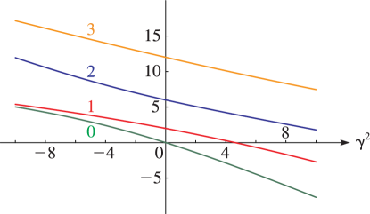
:::{note}
**Symbols:**

$\lambda^{\NVar{m}}_{\NVar{n}}\left(\NVar{\gamma^{2}}\right)$: eigenvalues of the spheroidal differential equation , $n\geq m$: integer degree and $\gamma^{2}$: real parameter

**Referenced by:**

§30.7(i)

**See also:**

Annotations for §30.7(i) , §30.7 and Ch.30
:::

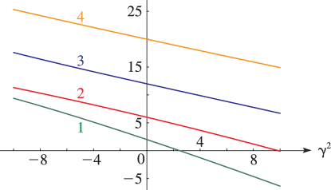
:::{note}
**Symbols:**

$\lambda^{\NVar{m}}_{\NVar{n}}\left(\NVar{\gamma^{2}}\right)$: eigenvalues of the spheroidal differential equation , $n\geq m$: integer degree and $\gamma^{2}$: real parameter

**See also:**

Annotations for §30.7(i) , §30.7 and Ch.30
:::

:::{note}
**Symbols:**

$\lambda^{\NVar{m}}_{\NVar{n}}\left(\NVar{\gamma^{2}}\right)$: eigenvalues of the spheroidal differential equation , $n\geq m$: integer degree and $\gamma^{2}$: real parameter

**See also:**

Annotations for §30.7(i) , §30.7 and Ch.30
:::

:::{note}
**Symbols:**

$\lambda^{\NVar{m}}_{\NVar{n}}\left(\NVar{\gamma^{2}}\right)$: eigenvalues of the spheroidal differential equation , $n\geq m$: integer degree and $\gamma^{2}$: real parameter

**Referenced by:**

§30.7(i)

**See also:**

Annotations for §30.7(i) , §30.7 and Ch.30
:::

## §30.7(ii) Functions of the First Kind

:::{note}
**Keywords:**

[graphics](http://dlmf.nist.gov/search/search?q=graphics) , [spheroidal wave functions](http://dlmf.nist.gov/search/search?q=spheroidal%20wave%20functions)

**Notes:**

Figures 30.7.5 – 30.7.10 were produced at NIST with the aid of Maple procedures provided by the author.

**See also:**

Annotations for §30.7 and Ch.30
:::

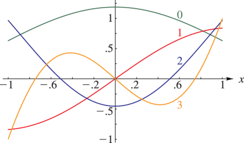
:::{note}
**Symbols:**

$\mathsf{Ps}^{\NVar{m}}_{\NVar{n}}\left(\NVar{x},\NVar{\gamma^{2}}\right)$: spheroidal wave function of the first kind , $x$: real variable and $n\geq m$: integer degree

**Referenced by:**

§30.7(ii)

**See also:**

Annotations for §30.7(ii) , §30.7 and Ch.30
:::

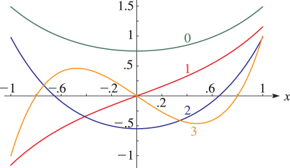
:::{note}
**Symbols:**

$\mathsf{Ps}^{\NVar{m}}_{\NVar{n}}\left(\NVar{x},\NVar{\gamma^{2}}\right)$: spheroidal wave function of the first kind , $x$: real variable and $n\geq m$: integer degree

**See also:**

Annotations for §30.7(ii) , §30.7 and Ch.30
:::

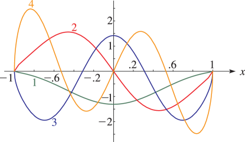
:::{note}
**Symbols:**

$\mathsf{Ps}^{\NVar{m}}_{\NVar{n}}\left(\NVar{x},\NVar{\gamma^{2}}\right)$: spheroidal wave function of the first kind , $x$: real variable and $n\geq m$: integer degree

**See also:**

Annotations for §30.7(ii) , §30.7 and Ch.30
:::

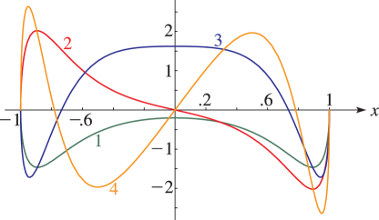
:::{note}
**Symbols:**

$\mathsf{Ps}^{\NVar{m}}_{\NVar{n}}\left(\NVar{x},\NVar{\gamma^{2}}\right)$: spheroidal wave function of the first kind , $x$: real variable and $n\geq m$: integer degree

**See also:**

Annotations for §30.7(ii) , §30.7 and Ch.30
:::

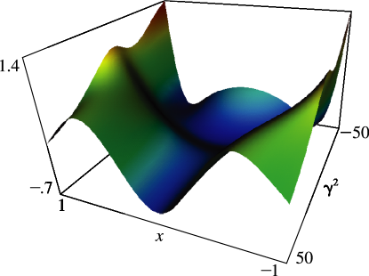
:::{note}
**Symbols:**

$\mathsf{Ps}^{\NVar{m}}_{\NVar{n}}\left(\NVar{x},\NVar{\gamma^{2}}\right)$: spheroidal wave function of the first kind , $x$: real variable and $\gamma^{2}$: real parameter

**See also:**

Annotations for §30.7(ii) , §30.7 and Ch.30
:::

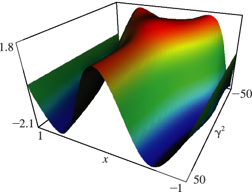
:::{note}
**Symbols:**

$\mathsf{Ps}^{\NVar{m}}_{\NVar{n}}\left(\NVar{x},\NVar{\gamma^{2}}\right)$: spheroidal wave function of the first kind , $x$: real variable and $\gamma^{2}$: real parameter

**Referenced by:**

§30.7(ii)

**See also:**

Annotations for §30.7(ii) , §30.7 and Ch.30
:::

## §30.7(iii) Functions of the Second Kind

:::{note}
**Notes:**

Figures 30.7.11 – 30.7.15 were produced at NIST with the aid of Maple procedures provided by the author.

**See also:**

Annotations for §30.7 and Ch.30
:::

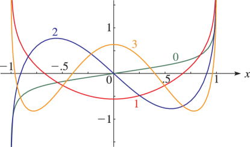
:::{note}
**Symbols:**

[$\mathsf{Qs}^{\NVar{m}}_{\NVar{n}}\left(\NVar{x},\NVar{\gamma^{2}}\right)$: spheroidal wave function of the second kind](./30.5.md "§30.5 Functions of the Second Kind ‣ Properties ‣ Chapter 30 Spheroidal Wave Functions") , $x$: real variable and $n\geq m$: integer degree

**Referenced by:**

§30.7(iii)

**See also:**

Annotations for §30.7(iii) , §30.7 and Ch.30
:::

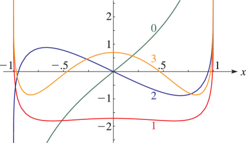
:::{note}
**Symbols:**

[$\mathsf{Qs}^{\NVar{m}}_{\NVar{n}}\left(\NVar{x},\NVar{\gamma^{2}}\right)$: spheroidal wave function of the second kind](./30.5.md "§30.5 Functions of the Second Kind ‣ Properties ‣ Chapter 30 Spheroidal Wave Functions") , $x$: real variable and $n\geq m$: integer degree

**See also:**

Annotations for §30.7(iii) , §30.7 and Ch.30
:::

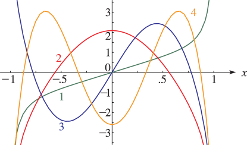
:::{note}
**Symbols:**

[$\mathsf{Qs}^{\NVar{m}}_{\NVar{n}}\left(\NVar{x},\NVar{\gamma^{2}}\right)$: spheroidal wave function of the second kind](./30.5.md "§30.5 Functions of the Second Kind ‣ Properties ‣ Chapter 30 Spheroidal Wave Functions") , $x$: real variable and $n\geq m$: integer degree

**See also:**

Annotations for §30.7(iii) , §30.7 and Ch.30
:::

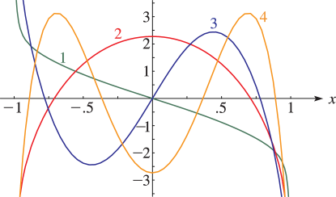
:::{note}
**Symbols:**

[$\mathsf{Qs}^{\NVar{m}}_{\NVar{n}}\left(\NVar{x},\NVar{\gamma^{2}}\right)$: spheroidal wave function of the second kind](./30.5.md "§30.5 Functions of the Second Kind ‣ Properties ‣ Chapter 30 Spheroidal Wave Functions") , $x$: real variable and $n\geq m$: integer degree

**See also:**

Annotations for §30.7(iii) , §30.7 and Ch.30
:::

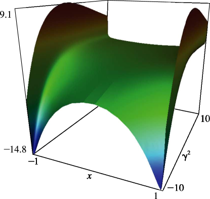
:::{note}
**Symbols:**

[$\mathsf{Qs}^{\NVar{m}}_{\NVar{n}}\left(\NVar{x},\NVar{\gamma^{2}}\right)$: spheroidal wave function of the second kind](./30.5.md "§30.5 Functions of the Second Kind ‣ Properties ‣ Chapter 30 Spheroidal Wave Functions") , $x$: real variable and $\gamma^{2}$: real parameter

**Referenced by:**

§30.7(iii)

**See also:**

Annotations for §30.7(iii) , §30.7 and Ch.30
:::

## §30.7(iv) Functions of Complex Argument

:::{note}
**Keywords:**

[graphics](http://dlmf.nist.gov/search/search?q=graphics) , [spheroidal wave functions](http://dlmf.nist.gov/search/search?q=spheroidal%20wave%20functions)

**Notes:**

Figures 30.7.16 – 30.7.21 were produced at NIST with the aid of Maple procedures provided by the author.

**Referenced by:**

§30.1

**See also:**

Annotations for §30.7 and Ch.30
:::

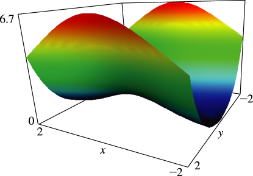
:::{note}
**Symbols:**

$\mathrm{i}$: imaginary unit , $\mathit{Ps}^{\NVar{m}}_{\NVar{n}}\left(\NVar{z},\NVar{\gamma^{2}}\right)$: spheroidal wave function of complex argument , $x$: real variable and $y$: real variable

**Referenced by:**

§30.7(iv)

**See also:**

Annotations for §30.7(iv) , §30.7 and Ch.30
:::

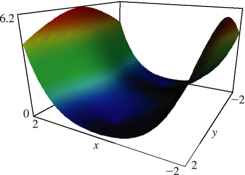
:::{note}
**Symbols:**

$\mathrm{i}$: imaginary unit , $\mathit{Ps}^{\NVar{m}}_{\NVar{n}}\left(\NVar{z},\NVar{\gamma^{2}}\right)$: spheroidal wave function of complex argument , $x$: real variable and $y$: real variable

**See also:**

Annotations for §30.7(iv) , §30.7 and Ch.30
:::

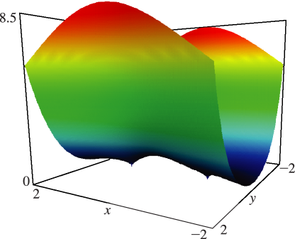
:::{note}
**Symbols:**

$\mathrm{i}$: imaginary unit , $\mathit{Ps}^{\NVar{m}}_{\NVar{n}}\left(\NVar{z},\NVar{\gamma^{2}}\right)$: spheroidal wave function of complex argument , $x$: real variable and $y$: real variable

**See also:**

Annotations for §30.7(iv) , §30.7 and Ch.30
:::

:::{note}
**Symbols:**

$\mathrm{i}$: imaginary unit , $\mathit{Ps}^{\NVar{m}}_{\NVar{n}}\left(\NVar{z},\NVar{\gamma^{2}}\right)$: spheroidal wave function of complex argument , $x$: real variable and $y$: real variable

**See also:**

Annotations for §30.7(iv) , §30.7 and Ch.30
:::

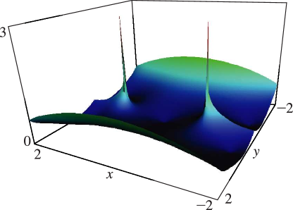
:::{note}
**Symbols:**

$\mathrm{i}$: imaginary unit , $\mathit{Qs}^{\NVar{m}}_{\NVar{n}}\left(\NVar{z},\NVar{\gamma^{2}}\right)$: spheroidal wave function of complex argument , $x$: real variable and $y$: real variable

**See also:**

Annotations for §30.7(iv) , §30.7 and Ch.30
:::

:::{note}
**Symbols:**

$\mathrm{i}$: imaginary unit , $\mathit{Qs}^{\NVar{m}}_{\NVar{n}}\left(\NVar{z},\NVar{\gamma^{2}}\right)$: spheroidal wave function of complex argument , $x$: real variable and $y$: real variable

**Referenced by:**

§30.7(iv)

**See also:**

Annotations for §30.7(iv) , §30.7 and Ch.30
:::
