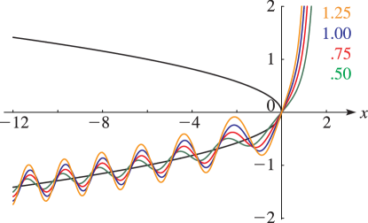
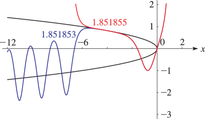
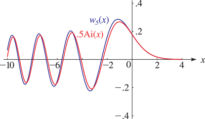

# §32.3 Graphics

:::{note}
**Keywords:**

[Painlevé equations](http://dlmf.nist.gov/search/search?q=Painlev%C3%A9%20equations) , [Painlevé transcendents](http://dlmf.nist.gov/search/search?q=Painlev%C3%A9%20transcendents) , [graphs](http://dlmf.nist.gov/search/search?q=graphs) , [graphs of solutions](http://dlmf.nist.gov/search/search?q=graphs%20of%20solutions)

**See also:**

Annotations for Ch.32
:::

## §32.3(i) First Painlevé Equation

:::{note}
**Notes:**

Figures 32.3.1 – 32.3.4 were produced at NIST.

**See also:**

Annotations for §32.3 and Ch.32
:::

Plots of solutions $w_{k}(x)$ of $\mbox{P}_{\mbox{\scriptsize I}}$ with $w_{k}(0)=0$ and $w_{k}^{\prime}(0)=k$ for various values of $k$ , and the parabola $6w^{2}+x=0$ . For analytical explanation see § 32.11(i) .

:::{note}
**Symbols:**

$x$: real and $k$: real

**Referenced by:**

§32.11(i) , §32.3(i)

**See also:**

Annotations for §32.3(i) , §32.3 and Ch.32
:::

:::{note}
**Symbols:**

$x$: real and $k$: real

**See also:**

Annotations for §32.3(i) , §32.3 and Ch.32
:::

## §32.3(ii) Second Painlevé Equation with α=0

:::{note}
**Notes:**

Figures 32.3.5 and 32.3.6 were produced at NIST. See also Miles ([1978](./bib/M.html#bib1612 "On the second Painlevé transcendent"), [1980](./bib/M.html#bib1613 "The Second Painlevé Transcendent: A Nonlinear Airy Function")) and Rosales ([1978](./bib/R.html#bib1968 "The similarity solution for the Korteweg-de Vries equation and the related Painlevé transcendent")).

**See also:**

Annotations for §32.3 and Ch.32
:::

Here $w_{k}(x)$ is the solution of $\mbox{P}_{\mbox{\scriptsize II}}$ with $\alpha=0$ and such that

$$
w_{k}(x)\sim k\operatorname{Ai}\left(x\right), \tag{32.3.1}
$$

compare § 32.11(ii) .

:::{note}
**Symbols:**

$\operatorname{Ai}\left(\NVar{z}\right)$: Airy function , $x$: real and $k$: real

**Referenced by:**

§32.11(ii) , §32.3(ii)

**See also:**

Annotations for §32.3(ii) , §32.3 and Ch.32
:::

## §32.3(iii) Fourth Painlevé Equation with β=0

:::{note}
**Keywords:**

[Painlevé equations](http://dlmf.nist.gov/search/search?q=Painlev%C3%A9%20equations) , [Painlevé transcendents](http://dlmf.nist.gov/search/search?q=Painlev%C3%A9%20transcendents) , [graphs](http://dlmf.nist.gov/search/search?q=graphs) , [graphs of solutions](http://dlmf.nist.gov/search/search?q=graphs%20of%20solutions)

**Notes:**

Figures 32.3.7 – 32.3.10 were produced at NIST. See also Bassom et al. ([1993](./bib/B.html#bib210 "Numerical studies of the fourth Painlevé equation")).

**See also:**

Annotations for §32.3 and Ch.32
:::

Here $u=u_{k}(x;\nu)$ is the solution of

$$
\frac{{\mathrm{d}}^{2}u}{{\mathrm{d}x}^{2}}=3u^{5}+2xu^{3}+\left(\tfrac{1}{4}x^{2}-\nu-\tfrac{1}{2}\right)u, \tag{32.3.2}
$$

such that

$$
u\sim kU\left(-\nu-\tfrac{1}{2},x\right), \tag{32.3.3}
$$

The corresponding solution of $\mbox{P}_{\mbox{\scriptsize IV}}$ is given by

$$
w(x)=2\sqrt{2}u_{k}^{2}(\sqrt{2}x,\nu), \tag{32.3.4}
$$

with $\beta=0$ , $\alpha=2\nu+1$ , and

$$
w(x)\sim 2\sqrt{2}k^{2}{U}^{2}\left(-\nu-\tfrac{1}{2},\sqrt{2}x\right), \tag{32.3.5}
$$

compare ( 32.2.11 ) and § 32.11(v) . If we set $\ifrac{{\mathrm{d}}^{2}u}{{\mathrm{d}x}^{2}}=0$ in ( 32.3.2 ) and solve for $u$ , then

$$
u^{2}=-\tfrac{1}{3}x\pm\tfrac{1}{6}\sqrt{x^{2}+12\nu+6}. \tag{32.3.6}
$$

:::{note}
**Symbols:**

$x$: real , $k$: real and $u_{k}(x;\nu)$: solution

**Referenced by:**

§32.11(v) , §32.3(iii)

**See also:**

Annotations for §32.3(iii) , §32.3 and Ch.32
:::

:::{note}
**Symbols:**

$x$: real , $k$: real and $u_{k}(x;\nu)$: solution

**See also:**

Annotations for §32.3(iii) , §32.3 and Ch.32
:::
