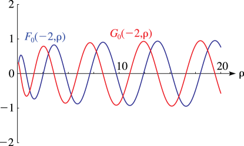
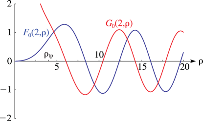

# §33.3 Graphics

:::{note}
**Keywords:**

[Coulomb functions: variables $\rho,\eta$](http://dlmf.nist.gov/search/search?q=Coulomb%20functions%3A%20variables%20%CF%81%2C%CE%B7) , [graphics](http://dlmf.nist.gov/search/search?q=graphics)

**See also:**

Annotations for Ch.33
:::

## §33.3(i) Line Graphs of the Coulomb Radial Functions Fℓ⁡(η,ρ) and Gℓ⁡(η,ρ)

:::{note}
**Notes:**

These graphs were produced at NIST.

**See also:**

Annotations for §33.3 and Ch.33
:::

:::{note}
**Symbols:**

$G_{\NVar{\ell}}\left(\NVar{\eta},\NVar{\rho}\right)$: irregular Coulomb radial function , $F_{\NVar{\ell}}\left(\NVar{\eta},\NVar{\rho}\right)$: regular Coulomb radial function , $\ell$: nonnegative integer , $\rho$: nonnegative real variable and $\eta$: real parameter

**See also:**

Annotations for §33.3(i) , §33.3 and Ch.33
:::

:::{note}
**Symbols:**

$\rho_{\operatorname{tp}}\left(\NVar{\eta},\NVar{\ell}\right)$: outer turning point for Coulomb radial functions , $G_{\NVar{\ell}}\left(\NVar{\eta},\NVar{\rho}\right)$: irregular Coulomb radial function , $F_{\NVar{\ell}}\left(\NVar{\eta},\NVar{\rho}\right)$: regular Coulomb radial function , $\ell$: nonnegative integer , $\rho$: nonnegative real variable and $\eta$: real parameter

**See also:**

Annotations for §33.3(i) , §33.3 and Ch.33
:::

In Figures 33.3.5 and 33.3.6

$$
M_{\ell}\left(\eta,\rho\right)=({F_{\ell}}^{2}\left(\eta,\rho\right)+{G_{\ell}}^{2}\left(\eta,\rho\right))^{1/2}=\left|{H^{\pm}_{\ell}}\left(\eta,\rho\right)\right|. \tag{33.3.1}
$$

:::{note}
**Symbols:**

$\rho_{\operatorname{tp}}\left(\NVar{\eta},\NVar{\ell}\right)$: outer turning point for Coulomb radial functions , $M_{\NVar{\ell}}\left(\NVar{\eta},\NVar{\rho}\right)$: envelope of Coulomb functions , $G_{\NVar{\ell}}\left(\NVar{\eta},\NVar{\rho}\right)$: irregular Coulomb radial function , $F_{\NVar{\ell}}\left(\NVar{\eta},\NVar{\rho}\right)$: regular Coulomb radial function , $\ell$: nonnegative integer , $\rho$: nonnegative real variable and $\eta$: real parameter

**Referenced by:**

Figure 33.3.6 , [Figure 33.3.6](./33.3.F6.mag.md "In §33.3 Graphics ‣ Variables 𝜌,𝜂 ‣ Chapter 33 Coulomb Functions") , §33.3(i)

**See also:**

Annotations for §33.3(i) , §33.3 and Ch.33
:::

## §33.3(ii) Surfaces of the Coulomb Radial Functions F0⁡(η,ρ) and G0⁡(η,ρ)

:::{note}
**Keywords:**

[Coulomb functions: variables $\rho,\eta$](http://dlmf.nist.gov/search/search?q=Coulomb%20functions%3A%20variables%20%CF%81%2C%CE%B7) , [graphics](http://dlmf.nist.gov/search/search?q=graphics)

**Notes:**

These surfaces were produced at NIST.

**See also:**

Annotations for §33.3 and Ch.33
:::

:::{note}
**Symbols:**

$F_{\NVar{\ell}}\left(\NVar{\eta},\NVar{\rho}\right)$: regular Coulomb radial function , $\rho$: nonnegative real variable and $\eta$: real parameter

**See also:**

Annotations for §33.3(ii) , §33.3 and Ch.33
:::
