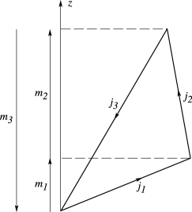

# §34.2 Definition: 3⁢j Symbol

:::{note}
**Keywords:**

[$\mathit{3j}$ symbols](http://dlmf.nist.gov/search/search?q=3j%20symbols) , [angular momenta](http://dlmf.nist.gov/search/search?q=angular%20momenta) , [definition](http://dlmf.nist.gov/search/search?q=definition) , [finite sum of algebraic quantities](http://dlmf.nist.gov/search/search?q=finite%20sum%20of%20algebraic%20quantities) , [generalized hypergeometric functions](http://dlmf.nist.gov/search/search?q=generalized%20hypergeometric%20functions) , [projective quantum numbers](http://dlmf.nist.gov/search/search?q=projective%20quantum%20numbers) , [representation as](http://dlmf.nist.gov/search/search?q=representation%20as) , [$\mathit{3j}$ symbols](http://dlmf.nist.gov/search/search?q=threej%20symbols) , [triangle conditions](http://dlmf.nist.gov/search/search?q=triangle%20conditions)

**Notes:**

See Edmonds ([1974](./bib/E.html#bib727 "Angular Momentum in Quantum Mechanics"), pp. 44–45).

**See also:**

Annotations for Ch.34
:::

The quantities $j_{1},j_{2},j_{3}$ in the $\mathit{3j}$ symbol are called *angular momenta* . Either all of them are nonnegative integers, or one is a nonnegative integer and the other two are half-odd positive integers. They must form the sides of a triangle (possibly degenerate). They therefore satisfy the *triangle conditions*

$$
|j_{r}-j_{s}|\leq j_{t}\leq j_{r}+j_{s}, \tag{34.2.1}
$$

where $r,s,t$ is any permutation of $1,2,3$ . The corresponding *projective quantum numbers* $m_{1},m_{2},m_{3}$ are given by

$$
m_{r}=-j_{r},-j_{r}+1,\dots,j_{r}-1,j_{r}, \tag{34.2.2}
$$

and satisfy

$$
m_{1}+m_{2}+m_{3}=0. \tag{34.2.3}
$$

See Figure 34.2.1 for a schematic representation.

:::{note}
**Symbols:**

$j,j_{r}$: non-negative integers or non-negative integers plus one half. and $r\in 1,2,3$

**Referenced by:**

§34.2

**See also:**

Annotations for §34.2 and Ch.34
:::

If either of the conditions ( 34.2.1 ) or ( 34.2.3 ) is not satisfied, then the $\mathit{3j}$ symbol is zero. When both conditions are satisfied the $\mathit{3j}$ symbol can be expressed as the finite sum

$$
\begin{pmatrix}j_{1}&j_{2}&j_{3}\\
m_{1}&m_{2}&m_{3}\end{pmatrix}={(-1)^{j_{1}-j_{2}-m_{3}}}\Delta(j_{1}j_{2}j_{3})\left((j_{1}+m_{1})!(j_{1}-m_{1})!(j_{2}+m_{2})!(j_{2}-m_{2})!(j_{3}+m_{3})!(j_{3}-m_{3})!\right)^{\frac{1}{2}}\*\sum_{s}\frac{(-1)^{s}}{s!(j_{1}+j_{2}-j_{3}-s)!(j_{1}-m_{1}-s)!(j_{2}+m_{2}-s)!(j_{3}-j_{2}+m_{1}+s)!(j_{3}-j_{1}-m_{2}+s)!}, \tag{34.2.4}
$$

where

$$
\Delta(j_{1}j_{2}j_{3})=\left(\frac{(j_{1}+j_{2}-j_{3})!(j_{1}-j_{2}+j_{3})!(-j_{1}+j_{2}+j_{3})!}{(j_{1}+j_{2}+j_{3}+1)!}\right)^{\frac{1}{2}}, \tag{34.2.5}
$$

and the summation is over all nonnegative integers $s$ such that the arguments in the factorials are nonnegative.

Equivalently,

$$
\begin{pmatrix}j_{1}&j_{2}&j_{3}\\
m_{1}&m_{2}&m_{3}\end{pmatrix}={(-1)^{j_{2}-m_{1}+m_{3}}}\frac{(j_{1}+j_{2}+m_{3})!(j_{2}+j_{3}-m_{1})!}{\Delta(j_{1}j_{2}j_{3})(j_{1}+j_{2}+j_{3}+1)!}\left(\frac{(j_{1}+m_{1})!(j_{3}-m_{3})!}{(j_{1}-m_{1})!(j_{2}+m_{2})!(j_{2}-m_{2})!(j_{3}+m_{3})!}\right)^{\frac{1}{2}}\*{{{}_{3}F_{2}}\left(-j_{1}-j_{2}-j_{3}-1,-j_{1}+m_{1},-j_{3}-m_{3};-j_{1}-j_{2}-m_{3},-j_{2}-j_{3}+m_{1};1\right)}, \tag{34.2.6}
$$

where ${{}_{3}F_{2}}$ is defined as in § [16.2](./16.2.md "§16.2 Definition and Analytic Properties ‣ Generalized Hypergeometric Functions ‣ Chapter 16 Generalized Hypergeometric Functions and Meijer 𝐺-Function") .

For alternative expressions for the $\mathit{3j}$ symbol, written either as a finite sum or as other terminating generalized hypergeometric series ${{}_{3}F_{2}}$ of unit argument, see Varshalovich et al. ([1988](./bib/V.html#bib2323 "Quantum Theory of Angular Momentum"), §§8.21, 8.24–8.26).
