# §36.3 Visualizations of Canonical Integrals

:::{note}
**Referenced by:**

Erratum (V1.0.14) for Section 36.3

**See also:**

Annotations for Ch.36
:::

## §36.3(i) Canonical Integrals: Modulus

:::{note}
**Keywords:**

[canonical integrals](http://dlmf.nist.gov/search/search?q=canonical%20integrals) , [visualizations of modulus](http://dlmf.nist.gov/search/search?q=visualizations%20of%20modulus)

**Notes:**

These figures were generated by the authors.

**See also:**

Annotations for §36.3 and Ch.36
:::

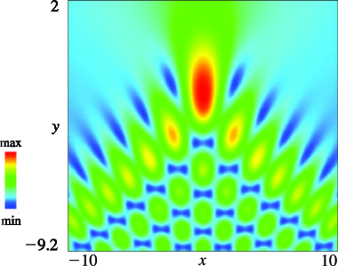
:::{note}
**Symbols:**

$\Psi_{\NVar{K}}\left(\NVar{\mathbf{x}}\right)$: canonical integral function , $y$: real parameter and $x$: real parameter

**Keywords:**

[Pearcey integral](http://dlmf.nist.gov/search/search?q=Pearcey%20integral) , [pictures of modulus](http://dlmf.nist.gov/search/search?q=pictures%20of%20modulus)

**Referenced by:**

Erratum (V1.0.14) for Section 36.3

**See also:**

Annotations for §36.3(i) , §36.3 and Ch.36
:::

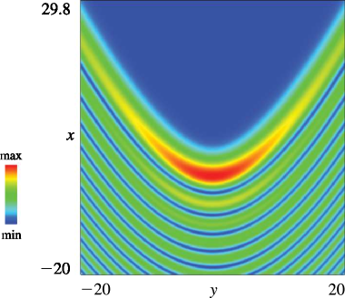
:::{note}
**Symbols:**

$\Psi_{\NVar{K}}\left(\NVar{\mathbf{x}}\right)$: canonical integral function , $y$: real parameter and $x$: real parameter

**Keywords:**

[pictures of modulus](http://dlmf.nist.gov/search/search?q=pictures%20of%20modulus) , [swallowtail canonical integral](http://dlmf.nist.gov/search/search?q=swallowtail%20canonical%20integral)

**Referenced by:**

Erratum (V1.0.14) for Section 36.3

**See also:**

Annotations for §36.3(i) , §36.3 and Ch.36
:::

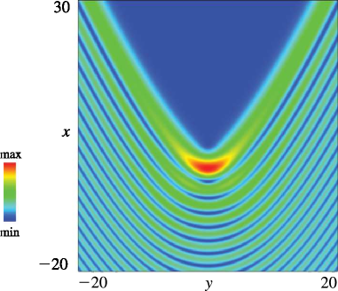
:::{note}
**Symbols:**

$\Psi_{\NVar{K}}\left(\NVar{\mathbf{x}}\right)$: canonical integral function , $y$: real parameter and $x$: real parameter

**Keywords:**

[pictures of modulus](http://dlmf.nist.gov/search/search?q=pictures%20of%20modulus) , [swallowtail canonical integral](http://dlmf.nist.gov/search/search?q=swallowtail%20canonical%20integral)

**Referenced by:**

Erratum (V1.0.14) for Section 36.3

**See also:**

Annotations for §36.3(i) , §36.3 and Ch.36
:::

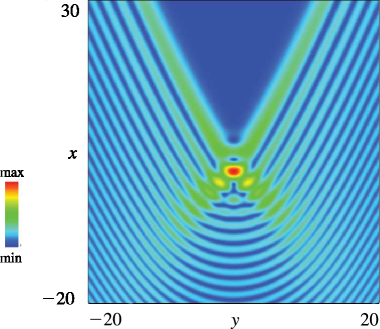
:::{note}
**Symbols:**

$\Psi_{\NVar{K}}\left(\NVar{\mathbf{x}}\right)$: canonical integral function , $y$: real parameter and $x$: real parameter

**Keywords:**

[pictures of modulus](http://dlmf.nist.gov/search/search?q=pictures%20of%20modulus) , [swallowtail canonical integral](http://dlmf.nist.gov/search/search?q=swallowtail%20canonical%20integral)

**Referenced by:**

Erratum (V1.0.14) for Section 36.3

**See also:**

Annotations for §36.3(i) , §36.3 and Ch.36
:::

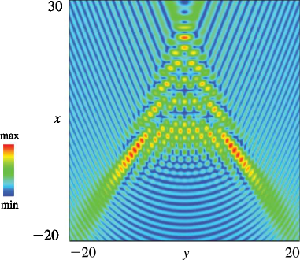
:::{note}
**Symbols:**

$\Psi_{\NVar{K}}\left(\NVar{\mathbf{x}}\right)$: canonical integral function , $y$: real parameter and $x$: real parameter

**Keywords:**

[pictures of modulus](http://dlmf.nist.gov/search/search?q=pictures%20of%20modulus) , [swallowtail canonical integral](http://dlmf.nist.gov/search/search?q=swallowtail%20canonical%20integral)

**Referenced by:**

Erratum (V1.0.14) for Section 36.3

**See also:**

Annotations for §36.3(i) , §36.3 and Ch.36
:::

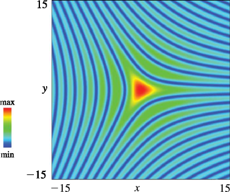
:::{note}
**Symbols:**

$\Psi^{(\mathrm{E})}\left(\NVar{\mathbf{x}}\right)$: elliptic umbilic canonical integral function , $y$: real parameter and $x$: real parameter

**Keywords:**

[elliptic umbilic canonical integral](http://dlmf.nist.gov/search/search?q=elliptic%20umbilic%20canonical%20integral) , [pictures of modulus](http://dlmf.nist.gov/search/search?q=pictures%20of%20modulus)

**Referenced by:**

Erratum (V1.0.14) for Section 36.3

**See also:**

Annotations for §36.3(i) , §36.3 and Ch.36
:::

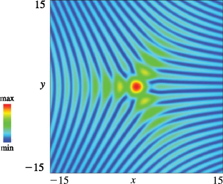
:::{note}
**Symbols:**

$\Psi^{(\mathrm{E})}\left(\NVar{\mathbf{x}}\right)$: elliptic umbilic canonical integral function , $y$: real parameter and $x$: real parameter

**Keywords:**

[elliptic umbilic canonical integral](http://dlmf.nist.gov/search/search?q=elliptic%20umbilic%20canonical%20integral) , [pictures of modulus](http://dlmf.nist.gov/search/search?q=pictures%20of%20modulus)

**Referenced by:**

Erratum (V1.0.14) for Section 36.3

**See also:**

Annotations for §36.3(i) , §36.3 and Ch.36
:::

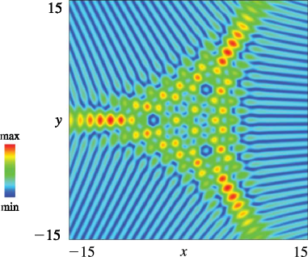
:::{note}
**Symbols:**

$\Psi^{(\mathrm{E})}\left(\NVar{\mathbf{x}}\right)$: elliptic umbilic canonical integral function , $y$: real parameter and $x$: real parameter

**Keywords:**

[elliptic umbilic canonical integral](http://dlmf.nist.gov/search/search?q=elliptic%20umbilic%20canonical%20integral) , [pictures of modulus](http://dlmf.nist.gov/search/search?q=pictures%20of%20modulus)

**Referenced by:**

Erratum (V1.0.14) for Section 36.3

**See also:**

Annotations for §36.3(i) , §36.3 and Ch.36
:::

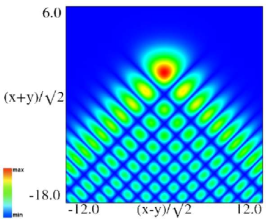
:::{note}
**Symbols:**

$\Psi^{(\mathrm{H})}\left(\NVar{\mathbf{x}}\right)$: hyperbolic umbilic canonical integral function , $y$: real parameter and $x$: real parameter

**Keywords:**

[hyperbolic umbilic canonical integral](http://dlmf.nist.gov/search/search?q=hyperbolic%20umbilic%20canonical%20integral) , [pictures of modulus](http://dlmf.nist.gov/search/search?q=pictures%20of%20modulus)

**Referenced by:**

Erratum (V1.0.14) for Figures 36.3.9, 36.3.10, 36.3.11, 36.3.12

**Errata (effective with 1.0.14):**

Scales were corrected. The interval $-8.4\leq\frac{x-y}{\sqrt{2}}\leq 8.4$ was replaced by $-12.0\leq\frac{x-y}{\sqrt{2}}\leq 12.0$ and $-12.7\leq\frac{x+y}{\sqrt{2}}\leq 4.2$ replaced by $-18.0\leq\frac{x+y}{\sqrt{2}}\leq 6.0.$ *Reported 2016-09-12 by Dan Piponi*

**See also:**

Annotations for §36.3(i) , §36.3 and Ch.36
:::

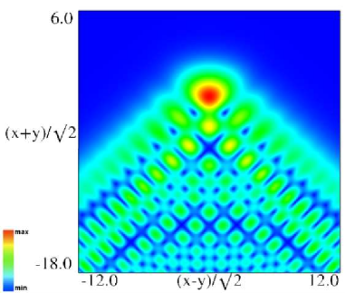
:::{note}
**Symbols:**

$\Psi^{(\mathrm{H})}\left(\NVar{\mathbf{x}}\right)$: hyperbolic umbilic canonical integral function , $y$: real parameter and $x$: real parameter

**Keywords:**

[hyperbolic umbilic canonical integral](http://dlmf.nist.gov/search/search?q=hyperbolic%20umbilic%20canonical%20integral) , [pictures of modulus](http://dlmf.nist.gov/search/search?q=pictures%20of%20modulus)

**Referenced by:**

Erratum (V1.0.14) for Figures 36.3.9, 36.3.10, 36.3.11, 36.3.12

**Errata (effective with 1.0.14):**

Scales were corrected. The interval $-8.4\leq\frac{x-y}{\sqrt{2}}\leq 8.4$ was replaced by $-12.0\leq\frac{x-y}{\sqrt{2}}\leq 12.0$ and $-12.7\leq\frac{x+y}{\sqrt{2}}\leq 4.2$ replaced by $-18.0\leq\frac{x+y}{\sqrt{2}}\leq 6.0.$ *Reported 2016-09-12 by Dan Piponi*

**See also:**

Annotations for §36.3(i) , §36.3 and Ch.36
:::

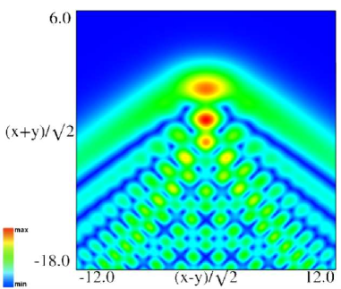
:::{note}
**Symbols:**

$\Psi^{(\mathrm{H})}\left(\NVar{\mathbf{x}}\right)$: hyperbolic umbilic canonical integral function , $y$: real parameter and $x$: real parameter

**Keywords:**

[hyperbolic umbilic canonical integral](http://dlmf.nist.gov/search/search?q=hyperbolic%20umbilic%20canonical%20integral) , [pictures of modulus](http://dlmf.nist.gov/search/search?q=pictures%20of%20modulus)

**Referenced by:**

Erratum (V1.0.14) for Figures 36.3.9, 36.3.10, 36.3.11, 36.3.12

**Errata (effective with 1.0.14):**

Scales were corrected. The interval $-8.4\leq\frac{x-y}{\sqrt{2}}\leq 8.4$ was replaced by $-12.0\leq\frac{x-y}{\sqrt{2}}\leq 12.0$ and $-12.7\leq\frac{x+y}{\sqrt{2}}\leq 4.2$ replaced by $-18.0\leq\frac{x+y}{\sqrt{2}}\leq 6.0.$ *Reported 2016-09-12 by Dan Piponi*

**See also:**

Annotations for §36.3(i) , §36.3 and Ch.36
:::

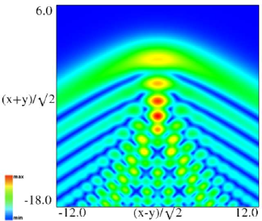
:::{note}
**Symbols:**

$\Psi^{(\mathrm{H})}\left(\NVar{\mathbf{x}}\right)$: hyperbolic umbilic canonical integral function , $y$: real parameter and $x$: real parameter

**Keywords:**

[hyperbolic umbilic canonical integral](http://dlmf.nist.gov/search/search?q=hyperbolic%20umbilic%20canonical%20integral) , [pictures of modulus](http://dlmf.nist.gov/search/search?q=pictures%20of%20modulus)

**Referenced by:**

Erratum (V1.0.14) for Figures 36.3.9, 36.3.10, 36.3.11, 36.3.12

**Errata (effective with 1.0.14):**

Scales were corrected. The interval $-8.4\leq\frac{x-y}{\sqrt{2}}\leq 8.4$ was replaced by $-12.0\leq\frac{x-y}{\sqrt{2}}\leq 12.0$ and $-12.7\leq\frac{x+y}{\sqrt{2}}\leq 4.2$ replaced by $-18.0\leq\frac{x+y}{\sqrt{2}}\leq 6.0.$ *Reported 2016-09-12 by Dan Piponi*

**See also:**

Annotations for §36.3(i) , §36.3 and Ch.36
:::

## §36.3(ii) Canonical Integrals: Phase

:::{note}
**Keywords:**

[canonical integrals](http://dlmf.nist.gov/search/search?q=canonical%20integrals) , [visualizations of phase](http://dlmf.nist.gov/search/search?q=visualizations%20of%20phase)

**Notes:**

These figures were generated by the authors.

**See also:**

Annotations for §36.3 and Ch.36
:::

In Figure 36.3.13 (a) points of confluence of phase contours are zeros of $\Psi_{2}\left(x,y\right)$ ; similarly for other contour plots in this subsection. In Figure 36.3.13 (b) points of confluence of all colors are zeros of $\Psi_{2}\left(x,y\right)$ ; similarly for other density plots in this subsection.

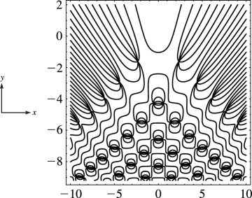
:::{note}
**Symbols:**

$\Psi_{\NVar{K}}\left(\NVar{\mathbf{x}}\right)$: canonical integral function , $\pi$: the ratio of the circumference of a circle to its diameter , $\operatorname{ph}$: phase , $y$: real parameter and $x$: real parameter

**Keywords:**

[Pearcey integral](http://dlmf.nist.gov/search/search?q=Pearcey%20integral) , [pictures of phase](http://dlmf.nist.gov/search/search?q=pictures%20of%20phase)

**Referenced by:**

§36.3(ii) , Erratum (V1.0.14) for Section 36.3

**See also:**

Annotations for §36.3(ii) , §36.3 and Ch.36
:::

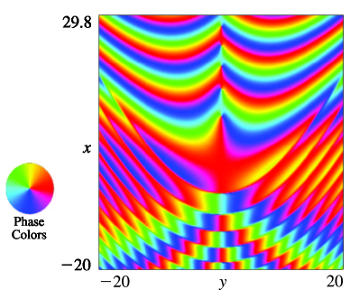
:::{note}
**Symbols:**

$\Psi_{\NVar{K}}\left(\NVar{\mathbf{x}}\right)$: canonical integral function , $\operatorname{ph}$: phase , $y$: real parameter and $x$: real parameter

**Keywords:**

[pictures of phase](http://dlmf.nist.gov/search/search?q=pictures%20of%20phase) , [swallowtail canonical integral](http://dlmf.nist.gov/search/search?q=swallowtail%20canonical%20integral)

**Referenced by:**

Erratum (V1.0.14) for Section 36.3

**See also:**

Annotations for §36.3(ii) , §36.3 and Ch.36
:::

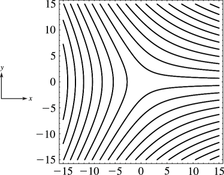
:::{note}
**Symbols:**

$\Psi^{(\mathrm{E})}\left(\NVar{\mathbf{x}}\right)$: elliptic umbilic canonical integral function , $\operatorname{ph}$: phase , $y$: real parameter and $x$: real parameter

**Keywords:**

[elliptic umbilic canonical integral](http://dlmf.nist.gov/search/search?q=elliptic%20umbilic%20canonical%20integral) , [pictures of phase](http://dlmf.nist.gov/search/search?q=pictures%20of%20phase)

**Referenced by:**

Erratum (V1.0.14) for Section 36.3

**See also:**

Annotations for §36.3(ii) , §36.3 and Ch.36
:::

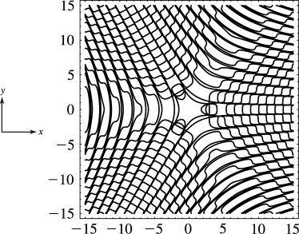
:::{note}
**Symbols:**

$\Psi^{(\mathrm{E})}\left(\NVar{\mathbf{x}}\right)$: elliptic umbilic canonical integral function , $\operatorname{ph}$: phase , $y$: real parameter and $x$: real parameter

**Keywords:**

[elliptic umbilic canonical integral](http://dlmf.nist.gov/search/search?q=elliptic%20umbilic%20canonical%20integral) , [pictures of phase](http://dlmf.nist.gov/search/search?q=pictures%20of%20phase)

**Referenced by:**

Erratum (V1.0.14) for Section 36.3

**See also:**

Annotations for §36.3(ii) , §36.3 and Ch.36
:::

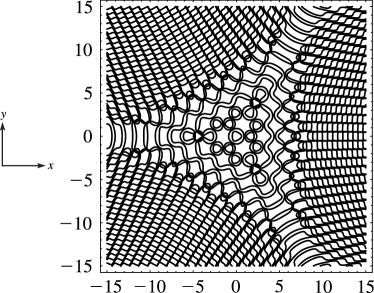
:::{note}
**Symbols:**

$\Psi^{(\mathrm{E})}\left(\NVar{\mathbf{x}}\right)$: elliptic umbilic canonical integral function , $\operatorname{ph}$: phase , $y$: real parameter and $x$: real parameter

**Keywords:**

[elliptic umbilic canonical integral](http://dlmf.nist.gov/search/search?q=elliptic%20umbilic%20canonical%20integral) , [pictures of phase](http://dlmf.nist.gov/search/search?q=pictures%20of%20phase)

**Referenced by:**

Erratum (V1.0.14) for Section 36.3

**See also:**

Annotations for §36.3(ii) , §36.3 and Ch.36
:::

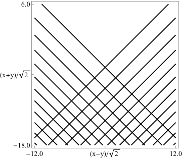
:::{note}
**Symbols:**

$\Psi^{(\mathrm{H})}\left(\NVar{\mathbf{x}}\right)$: hyperbolic umbilic canonical integral function , $\operatorname{ph}$: phase , $y$: real parameter and $x$: real parameter

**Keywords:**

[hyperbolic umbilic canonical integral](http://dlmf.nist.gov/search/search?q=hyperbolic%20umbilic%20canonical%20integral) , [pictures of phase](http://dlmf.nist.gov/search/search?q=pictures%20of%20phase)

**Referenced by:**

Erratum (V1.0.14) for Figures 36.3.18, 36.3.19, 36.3.20, 36.3.21

**Errata (effective with 1.0.14):**

Scales were corrected. The interval $-8.4\leq\frac{x-y}{\sqrt{2}}\leq 8.4$ was replaced by $-12.0\leq\frac{x-y}{\sqrt{2}}\leq 12.0$ and $-12.7\leq\frac{x+y}{\sqrt{2}}\leq 4.2$ replaced by $-18.0\leq\frac{x+y}{\sqrt{2}}\leq 6.0.$

**See also:**

Annotations for §36.3(ii) , §36.3 and Ch.36
:::

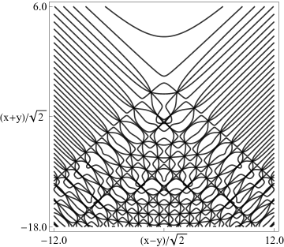
:::{note}
**Symbols:**

$\Psi^{(\mathrm{H})}\left(\NVar{\mathbf{x}}\right)$: hyperbolic umbilic canonical integral function , $\operatorname{ph}$: phase , $y$: real parameter and $x$: real parameter

**Keywords:**

[hyperbolic umbilic canonical integral](http://dlmf.nist.gov/search/search?q=hyperbolic%20umbilic%20canonical%20integral) , [pictures of phase](http://dlmf.nist.gov/search/search?q=pictures%20of%20phase)

**Referenced by:**

Erratum (V1.0.14) for Figures 36.3.18, 36.3.19, 36.3.20, 36.3.21

**Errata (effective with 1.0.14):**

Scales were corrected. The interval $-8.4\leq\frac{x-y}{\sqrt{2}}\leq 8.4$ was replaced by $-12.0\leq\frac{x-y}{\sqrt{2}}\leq 12.0$ and $-12.7\leq\frac{x+y}{\sqrt{2}}\leq 4.2$ replaced by $-18.0\leq\frac{x+y}{\sqrt{2}}\leq 6.0.$

**See also:**

Annotations for §36.3(ii) , §36.3 and Ch.36
:::

:::{note}
**Symbols:**

$\Psi^{(\mathrm{H})}\left(\NVar{\mathbf{x}}\right)$: hyperbolic umbilic canonical integral function , $\operatorname{ph}$: phase , $y$: real parameter and $x$: real parameter

**Keywords:**

[hyperbolic umbilic canonical integral](http://dlmf.nist.gov/search/search?q=hyperbolic%20umbilic%20canonical%20integral) , [pictures of phase](http://dlmf.nist.gov/search/search?q=pictures%20of%20phase)

**Referenced by:**

Erratum (V1.0.14) for Figures 36.3.18, 36.3.19, 36.3.20, 36.3.21

**Errata (effective with 1.0.14):**

Scales were corrected. The interval $-8.4\leq\frac{x-y}{\sqrt{2}}\leq 8.4$ was replaced by $-12.0\leq\frac{x-y}{\sqrt{2}}\leq 12.0$ and $-12.7\leq\frac{x+y}{\sqrt{2}}\leq 4.2$ replaced by $-18.0\leq\frac{x+y}{\sqrt{2}}\leq 6.0.$

**See also:**

Annotations for §36.3(ii) , §36.3 and Ch.36
:::

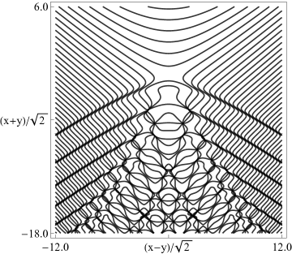
:::{note}
**Symbols:**

$\Psi^{(\mathrm{H})}\left(\NVar{\mathbf{x}}\right)$: hyperbolic umbilic canonical integral function , $\operatorname{ph}$: phase , $y$: real parameter and $x$: real parameter

**Keywords:**

[hyperbolic umbilic canonical integral](http://dlmf.nist.gov/search/search?q=hyperbolic%20umbilic%20canonical%20integral) , [pictures of phase](http://dlmf.nist.gov/search/search?q=pictures%20of%20phase)

**Referenced by:**

Erratum (V1.0.14) for Figures 36.3.18, 36.3.19, 36.3.20, 36.3.21

**Errata (effective with 1.0.14):**

Scales were corrected. The interval $-8.4\leq\frac{x-y}{\sqrt{2}}\leq 8.4$ was replaced by $-12.0\leq\frac{x-y}{\sqrt{2}}\leq 12.0$ and $-12.7\leq\frac{x+y}{\sqrt{2}}\leq 4.2$ replaced by $-18.0\leq\frac{x+y}{\sqrt{2}}\leq 6.0.$

**See also:**

Annotations for §36.3(ii) , §36.3 and Ch.36
:::
