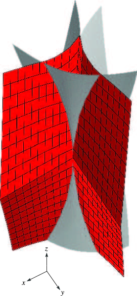

# §36.5 Stokes Sets

:::{note}
**See also:**

Annotations for Ch.36
:::

## §36.5(i) Definitions

:::{note}
**Keywords:**

[Stokes sets](http://dlmf.nist.gov/search/search?q=Stokes%20sets) , [definitions](http://dlmf.nist.gov/search/search?q=definitions)

**Referenced by:**

§36.5(iv)

**See also:**

Annotations for §36.5 and Ch.36
:::

Stokes sets are surfaces (codimension one) in $\mathbf{x}$ space, across which $\Psi_{K}(\mathbf{x};k)$ or $\Psi^{(\mathrm{U})}(\mathbf{x};k)$ acquires an exponentially-small asymptotic contribution (in $k$ ), associated with a complex critical point of $\Phi_{K}$ or $\Phi^{(\mathrm{U})}$ . The Stokes sets are defined by the exponential dominance condition:

$$
\displaystyle\Re\left(\Phi_{K}\left(t_{j}(\mathbf{x});\mathbf{x}\right)-\Phi_{K}\left(t_{\mu}(\mathbf{x});\mathbf{x}\right)\right) \displaystyle=0, \tag{36.5.1}
$$

$$
\displaystyle\Re\left(\Phi^{(\mathrm{U})}\left(s_{j}(\mathbf{x}),t_{j}(\mathbf{x});\mathbf{x}\right)-\Phi^{(\mathrm{U})}\left(s_{\mu}(\mathbf{x}),t_{\mu}(\mathbf{x});\mathbf{x}\right)\right) \displaystyle=0,
$$

:::{note}
**Symbols:**

$\Phi_{\NVar{K}}\left(\NVar{t};\NVar{\mathbf{x}}\right)$: cuspoid catastrophe of codimension $K$ , $\Re$: real part , $\Phi^{(\mathrm{U})}\left(\NVar{s},\NVar{t};\NVar{\mathbf{x}}\right)$: elliptic umbilic catastrophe for $\mathrm{U}=\mathrm{E}\mbox{ or }\mathrm{K}$ , $s$: variable , $K$: codimension , $t_{j}(\mathbf{x})$: solutions and $j$: real critical point

**Referenced by:**

§36.5(ii)

**See also:**

Annotations for §36.5(i) , §36.5 and Ch.36
:::

where $j$ denotes a real critical point ( 36.4.1 ) or ( 36.4.2 ), and $\mu$ denotes a critical point with complex $t$ or $s,t$ , connected with $j$ by a steepest-descent path (that is, a path where $\Re\Phi=\mathrm{constant}$ ) in complex $t$ or $(s,t)$ space.

In the following subsections, only Stokes sets involving at least one real saddle are included unless stated otherwise.

## §36.5(ii) Cuspoids

:::{note}
**Keywords:**

[Pearcey integral](http://dlmf.nist.gov/search/search?q=Pearcey%20integral) , [Stokes sets](http://dlmf.nist.gov/search/search?q=Stokes%20sets) , [cuspoids](http://dlmf.nist.gov/search/search?q=cuspoids) , [formula for Stokes set](http://dlmf.nist.gov/search/search?q=formula%20for%20Stokes%20set) , [formulas for Stokes set](http://dlmf.nist.gov/search/search?q=formulas%20for%20Stokes%20set) , [swallowtail canonical integral](http://dlmf.nist.gov/search/search?q=swallowtail%20canonical%20integral)

**Notes:**

See Wright ([1980](./bib/W.html#bib2460 "The Stokes set of the cusp diffraction catastrophe")), Berry and Howls ([1990](./bib/B.html#bib257 "Stokes surfaces of diffraction catastrophes with codimension three")). The common strategy employed in deriving the formulas in this subsection involves using the critical-point condition ( 36.4.1 ) to reduce the order of the catastrophe polynomials in ( 36.2.1 ), then solving ( 36.5.1 ) for the imaginary part of the complex critical point in terms of the value of the real critical point, which is itself determined by ( 36.4.1 ) and then used to generate the Stokes sets parametrically.

**Referenced by:**

§36.5(iii)

**See also:**

Annotations for §36.5 and Ch.36
:::

### K=1. Airy Function

:::{note}
**See also:**

Annotations for §36.5(ii) , §36.5 and Ch.36
:::

The Stokes set consists of the rays $\operatorname{ph}x=\pm 2\pi/3$ in the complex $x$ -plane.

### K=2. Cusp

:::{note}
**See also:**

Annotations for §36.5(ii) , §36.5 and Ch.36
:::

The Stokes set is itself a cusped curve, connected to the cusp of the bifurcation set:

$$
y^{3}=\tfrac{27}{4}\left(\sqrt{27}-5\right)x^{2}=1.32403x^{2}. \tag{36.5.2}
$$

### K=3. Swallowtail

:::{note}
**See also:**

Annotations for §36.5(ii) , §36.5 and Ch.36
:::

The Stokes set takes different forms for $z=0$ , $z<0$ , and $z>0$ .

For $z=0$ , the set consists of the two curves

$$
\displaystyle x \displaystyle=B_{\pm}|y|^{4/3}, \tag{36.5.3}
$$

$$
\displaystyle B_{\pm} \displaystyle=10^{-1/3}\left(2x_{\pm}^{4/3}-\tfrac{1}{2}x_{\pm}^{-2/3}\right),
$$

:::{note}
**Symbols:**

$y$: real parameter , $x_{i}$: real parameter and $x$: real parameter

**See also:**

Annotations for §36.5(ii) , §36.5(ii) , §36.5 and Ch.36
:::

where $x_{\pm}$ are the two smallest positive roots of the equation

$$
80x^{5}-40x^{4}-55x^{3}+5x^{2}+20x-1=0, \tag{36.5.4}
$$

and

$$
\displaystyle B_{-} \displaystyle=-1.69916, \tag{36.5.5}
$$

$$
\displaystyle B_{+} \displaystyle=0.33912.
$$

:::{note}
**See also:**

Annotations for §36.5(ii) , §36.5(ii) , §36.5 and Ch.36
:::

For $z\neq 0$ , the Stokes set is expressed in terms of scaled coordinates

$$
\displaystyle X \displaystyle=x/z^{2}, \tag{36.5.6}
$$

$$
\displaystyle Y \displaystyle=y/|z|^{3/2},
$$

:::{note}
**Defines:**

$X$ : scaled coordinate (locally) and $Y$ : scaled coordinate (locally)

**Symbols:**

$y$: real parameter , $z$: real parameter and $x$: real parameter

**Referenced by:**

§36.5(ii)

**See also:**

Annotations for §36.5(ii) , §36.5(ii) , §36.5 and Ch.36
:::

by

$$
X=\dfrac{9}{20}+20u^{4}-\frac{Y^{2}}{20u^{2}}+6u^{2}\operatorname{sign}\left(z\right), \tag{36.5.7}
$$

where $u$ satisfies the equation

$$
16u^{5}-\frac{Y^{2}}{10u}+4u^{3}\operatorname{sign}\left(z\right)-\frac{3}{10}|Y|\operatorname{sign}\left(z\right)+4t^{5}+2t^{3}\operatorname{sign}\left(z\right)+|Y|t^{2}=0, \tag{36.5.8}
$$

in which

$$
t=-u+\left(\dfrac{|Y|}{10u}-u^{2}-\dfrac{3}{10}\operatorname{sign}\left(z\right)\right)^{1/2}. \tag{36.5.9}
$$

For $z<0$ , there are two solutions $u$ , provided that $|Y|>(\frac{2}{5})^{1/2}$ . They generate a pair of cusp-edged sheets connected to the cusped sheets of the swallowtail bifurcation set (§ [36.4](./36.4.md "§36.4 Bifurcation Sets ‣ Properties ‣ Chapter 36 Integrals with Coalescing Saddles") ).

For $z>0$ the Stokes set has two sheets. The first sheet corresponds to $x<0$ and is generated as a solution of Equations ( 36.5.6 )–( 36.5.9 ). The second sheet corresponds to $x>0$ and it intersects the bifurcation set (§ [36.4](./36.4.md "§36.4 Bifurcation Sets ‣ Properties ‣ Chapter 36 Integrals with Coalescing Saddles") ) smoothly along the line generated by $X=X_{1}=6.95643$ , $\left|Y\right|=\left|Y_{1}\right|=6.81337$ . For $\left|Y\right|>Y_{1}$ the second sheet is generated by a second solution of ( 36.5.6 )–( 36.5.9 ), and for $\left|Y\right|<Y_{1}$ it is generated by the roots of the polynomial equation

$$
160u^{6}+40u^{4}=Y^{2}. \tag{36.5.10}
$$

## §36.5(iii) Umbilics

:::{note}
**Keywords:**

[Stokes sets](http://dlmf.nist.gov/search/search?q=Stokes%20sets) , [elliptic umbilic canonical integral](http://dlmf.nist.gov/search/search?q=elliptic%20umbilic%20canonical%20integral) , [formulas for Stokes set](http://dlmf.nist.gov/search/search?q=formulas%20for%20Stokes%20set) , [hyperbolic umbilic canonical integral](http://dlmf.nist.gov/search/search?q=hyperbolic%20umbilic%20canonical%20integral) , [umbilics](http://dlmf.nist.gov/search/search?q=umbilics)

**Notes:**

See Berry and Howls ([1990](./bib/B.html#bib257 "Stokes surfaces of diffraction catastrophes with codimension three")). The strategy used to derive the formulas in this subsection is the same as in § 36.5(ii) , but using the exponents in the representations ( 36.2.6 ) and ( 36.2.8 ).

**See also:**

Annotations for §36.5 and Ch.36
:::

### Elliptic Umbilic Stokes Set (Codimension three)

:::{note}
**See also:**

Annotations for §36.5(iii) , §36.5 and Ch.36
:::

This consists of three separate cusp-edged sheets connected to the cusp-edged sheets of the bifurcation set, and related by rotation about the $z$ -axis by $2\pi/3$ . One of the sheets is symmetrical under reflection in the plane $y=0$ , and is given by

$$
\frac{x}{z^{2}}=-1-12u^{2}+8u-\left|\frac{y}{z^{2}}\right|\dfrac{\frac{1}{3}-u}{\left(u\left(\frac{2}{3}-u\right)\right)^{1/2}}. \tag{36.5.11}
$$

Here $u$ is the root of the equation

$$
8u^{3}-4u^{2}-\left|\frac{y}{3z^{2}}\right|\left(\frac{u}{\tfrac{2}{3}-u}\right)^{1/2}=\frac{y^{2}}{6wz^{4}}-2w^{3}-2w^{2}, \tag{36.5.12}
$$

with

$$
w=u-\tfrac{2}{3}+\left(\left(\tfrac{2}{3}-u\right)^{2}+\left|\frac{y}{6z^{2}}\right|\left(\frac{\frac{2}{3}-u}{u}\right)^{1/2}\right)^{1/2}, \tag{36.5.13}
$$

and such that

$$
0<u<\tfrac{1}{6}. \tag{36.5.14}
$$

### Hyperbolic Umbilic Stokes Set (Codimension three)

:::{note}
**See also:**

Annotations for §36.5(iii) , §36.5 and Ch.36
:::

This consists of a cusp-edged sheet connected to the cusp-edged sheet of the bifurcation set and intersecting the smooth sheet of the bifurcation set. With coordinates

$$
\displaystyle X \displaystyle=(x-y)/z^{2}, \tag{36.5.15}
$$

$$
\displaystyle Y \displaystyle=\tfrac{1}{2}+\left((x+y)/z^{2}\right),
$$

:::{note}
**Defines:**

$X$ : scaled coordinate (locally)

**Symbols:**

$y$: real parameter , $z$: real parameter and $x$: real parameter

**See also:**

Annotations for §36.5(iii) , §36.5(iii) , §36.5 and Ch.36
:::

the intersection lines with the bifurcation set are generated by $|X|=X_{2}=0.45148$ , $Y=Y_{2}=0.59693$ . Define

$$
\displaystyle Y(u,X) \displaystyle=8u-24u^{2}+X\dfrac{u-\tfrac{1}{6}}{\left(u\left(u-\tfrac{1}{3}\right)\right)^{1/2}}, \tag{36.5.16}
$$

$$
\displaystyle f(u,X) \displaystyle=16u^{3}-4u^{2}-\tfrac{1}{6}|X|\left(\dfrac{u}{u-\tfrac{1}{3}}\right)^{1/2}.
$$

:::{note}
**Symbols:**

$X$: scaled coordinate

**See also:**

Annotations for §36.5(iii) , §36.5(iii) , §36.5 and Ch.36
:::

When $|X|>X_{2}$ the Stokes set $Y_{\mathrm{S}}(X)$ is given by

$$
Y_{\mathrm{S}}(X)=Y(u,|X|), \tag{36.5.17}
$$

where $u$ is the root of the equation

$$
f(u,X)=f(-u+\tfrac{1}{3},X), \tag{36.5.18}
$$

such that $u>\tfrac{1}{3}$ . This part of the Stokes set connects two complex saddles.

Alternatively, when $|X|<X_{2}$

$$
Y_{\mathrm{S}}(X)=Y(-u,-|X|), \tag{36.5.19}
$$

where $u$ is the positive root of the equation

$$
f(-u,X)=\dfrac{X^{2}}{12w}+4w^{3}-2w^{2}, \tag{36.5.20}
$$

in which

$$
w=(\tfrac{1}{3}+u)\left(1-\left(1-\dfrac{|X|}{12u^{1/2}(\tfrac{1}{3}+u)^{3/2}}\right)^{1/2}\right). \tag{36.5.21}
$$

## §36.5(iv) Visualizations

:::{note}
**Keywords:**

[Pearcey integral](http://dlmf.nist.gov/search/search?q=Pearcey%20integral) , [Stokes sets](http://dlmf.nist.gov/search/search?q=Stokes%20sets) , [hyperbolic umbilic catastrophe](http://dlmf.nist.gov/search/search?q=hyperbolic%20umbilic%20catastrophe) , [picture of Stokes set](http://dlmf.nist.gov/search/search?q=picture%20of%20Stokes%20set) , [swallowtail canonical integral](http://dlmf.nist.gov/search/search?q=swallowtail%20canonical%20integral) , [visualizations](http://dlmf.nist.gov/search/search?q=visualizations)

**Notes:**

The graphics were generated by the authors. For Figures 36.5.2 – 36.5.9 , Eqs. ( 36.5.11 )–( 36.5.21 ) were used in parametric form $x=x(y)$ , and checked against the numerical computations in Berry and Howls ([1990](./bib/B.html#bib257 "Stokes surfaces of diffraction catastrophes with codimension three")) (which were based directly on the definitions given in § 36.5(i) ).

**See also:**

Annotations for §36.5 and Ch.36
:::

In Figures 36.5.1 – 36.5.6 the plane is divided into regions by the dashed curves (Stokes sets) and the continuous curves (bifurcation sets). Red and blue numbers in each region correspond, respectively, to the numbers of real and complex critical points that contribute to the asymptotics of the canonical integral away from the bifurcation sets. In Figure 36.5.4 the part of the Stokes surface inside the bifurcation set connects two complex saddles. The distribution of real and complex critical points in Figures 36.5.5 and 36.5.6 follows from consistency with Figure 36.5.1 and the fact that there are four real saddles in the inner regions.

:::{note}
**Keywords:**

[cusp catastophe](http://dlmf.nist.gov/search/search?q=cusp%20catastophe)

**Referenced by:**

§36.5(iv)

**See also:**

Annotations for §36.5(iv) , §36.5 and Ch.36
:::

:::{note}
**Symbols:**

$z$: real parameter

**Keywords:**

[swallowtail catastrophe](http://dlmf.nist.gov/search/search?q=swallowtail%20catastrophe)

**See also:**

Annotations for §36.5(iv) , §36.5 and Ch.36
:::

:::{note}
**Symbols:**

$z$: real parameter

**Keywords:**

[elliptic umbilic catastrophe](http://dlmf.nist.gov/search/search?q=elliptic%20umbilic%20catastrophe)

**Referenced by:**

§36.5(iv)

**See also:**

Annotations for §36.5(iv) , §36.5 and Ch.36
:::

:::{note}
**Keywords:**

[swallowtail catastrophe](http://dlmf.nist.gov/search/search?q=swallowtail%20catastrophe)

**See also:**

Annotations for §36.5(iv) , §36.5 and Ch.36
:::

:::{note}
**Keywords:**

[elliptic umbilic canonical integral](http://dlmf.nist.gov/search/search?q=elliptic%20umbilic%20canonical%20integral) , [picture of Stokes set](http://dlmf.nist.gov/search/search?q=picture%20of%20Stokes%20set)

**See also:**

Annotations for §36.5(iv) , §36.5 and Ch.36
:::

:::{note}
**Keywords:**

[hyperbolic umbilic canonical integral](http://dlmf.nist.gov/search/search?q=hyperbolic%20umbilic%20canonical%20integral) , [picture of Stokes set](http://dlmf.nist.gov/search/search?q=picture%20of%20Stokes%20set)

**Referenced by:**

§36.5(iv)

**See also:**

Annotations for §36.5(iv) , §36.5 and Ch.36
:::
